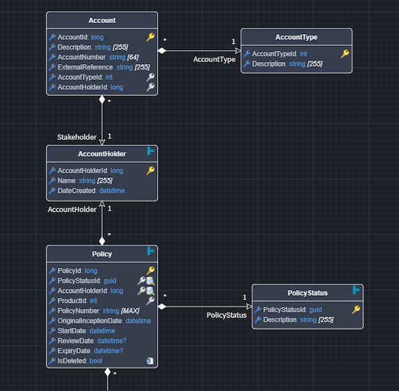
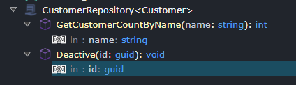

# What's new in Intent Architect (May 2025)

Welcome to the May 2025 edition of highlights of What's New in Intent Architect. Here's a roundup of the latest updates and improvements.

- Highlights
  - **[Model Event Integration using Azure Event Grid](#model-event-integration-using-azure-event-grid)** - This module enables you to use the Azure Event Grid as the medium to send and receive Integration Events for your application.
  - **[Model Integration Messages directly with Azure Service Bus](#model-integration-messages-directly-with-azure-service-bus)** - Direct implementation to use Azure Service Bus as the message broker of choice to send and receive Integration Events and Commands for your application.
  - **[Effortless Repository-to-Service Mapping](#repository-to-services-mapping)** - New suggestions to simplify exposing repository operations as services.
  - **[Code weaving capabilities for JSON and YAML files](#code-weaving-capabilities-for-json-and-yaml-files)** - Use code management instructions such as `IntentIgnore` in generated JSON and YAML files.
  - **[SQL Importer Enhancements](#sql-importer-enhancements)** - The [SQL Server Importer](https://docs.intentarchitect.com/articles/modules-dotnet/intent-sqlserverimporter/intent-sqlserverimporter.html) now includes a powerful new option to to automatically include `dependant tables` during import.

- More updates
  - **[SQL Database Project Support](#sql-database-project-support)** - Generate SQL scripts based on your Domain design to produce DACPAC files for deploying SQL Schema changes.
  - **[Primary Key Configuration Enhancements](#primary-key-configuration-enhancements)** - Improved primary key configuration with better control over identity generation and data source specification.
  - **[Streamlined Entity Repository Extension](#extend-entity-repositories)** - A new accelerator makes it faster and easier to extend entity repositories with custom operations.

## Update details

### Model Event Integration using Azure Event Grid

This module enables you to use the Azure Event Grid as the medium to send and receive Integration Events for your application.


To learn more, read the [module documentation](https://docs.intentarchitect.com/articles/modules-dotnet/intent-eventing-azureeventgrid/intent-eventing-azureeventgrid.html).

Available from:

- Intent.Eventing.AzureEventGrid 1.0.1

### Model Integration Messages directly with Azure Service Bus

Direct implementation to use Azure Service Bus as the message broker of choice to send and receive Integration Events and Commands for your application.


To learn more, read the [module documentation](https://docs.intentarchitect.com/articles/modules-dotnet/intent-eventing-azureservicebus/intent-eventing-azureservicebus.html).

Available from:

- Intent.Eventing.AzureServiceBus 1.0.2

### Repository to Services Mapping

In the `Services Designer`, when a `Repository` is added to the diagram, new `Suggestions` will now appear to help quickly expose repository operation as services:

Repository suggestions for service exposure:


Generated CQRS or Service with automatically generated mappings:


Available from:

- Intent.Modelers.Services.DomainInteractions 2.1.5

### Code weaving capabilities for JSON and YAML files

JSON and YAML templates configured in the module builder to use the `Data File Builder` *Templating Method* now automatically have code management capabilities enabled, allowing parts to be ignored or merged as per code management instructions.


An example of the instructions which can be applied in JSON:

```json
{
  // IntentMatchBy("customerNumber")
  "customers": [
    {
      "customerNumber": "00001",
      // IntentIgnore
      "name": "Modified name"
    },
    {
      "customerNumber": "00002",
      "name": "Generated Name 2"
    }
  ]
}
```

More details on the available instructions:

- [JSON](https://docs.intentarchitect.com/articles/application-development/code-management/code-management-json/code-management-json.html)
- [YAML](https://docs.intentarchitect.com/articles/application-development/code-management/code-management-yaml/code-management-yaml.html)

Available from:

- Intent.Code.Weaving.Json 1.0.1
- Intent.Code.Weaving.Yaml 1.0.1
- Intent.Common 3.7.7

### SQL Importer Enhancements

The [SQL Server Importer.](https://docs.intentarchitect.com/articles/modules-dotnet/intent-sqlserverimporter/intent-sqlserverimporter.html) now supports a ew option in the *filter file* called `include_dependant_tables`.

When this option is enabled, all qualifying tables specified in the filter — along with their dependent tables (e.g., those with foreign key relationships) — will be automatically imported.

An example filter file snippet with dependent table import enabled:

``` json
{
  "include_dependant_tables" : true,
  "include_tables": [
    {
      "name": "Order"
    }
  ]
}
```

In the example above, specifying only the `Order` table will also include its related `OrderItem` table due to the new `include_dependant_tables` setting:


Available from:

- Intent.SqlServerImporter 1.1.3

### SQL Database Project Support

Generate SQL scripts based on your Domain design to produce DACPAC files for deploying SQL Schema changes.

This module consumes your `Domain Model`, which you build in the `Domain Designer` (and can import using the [Intent.SqlServerImporter](https://docs.intentarchitect.com/articles/modules-dotnet/intent-sqlserverimporter/intent-sqlserverimporter.html)) and generates a SQL Database Project.



Once your domain model is properly configured, the module generates a complete SQL Database Project:


To learn more, read the [module documentation](https://docs.intentarchitect.com/articles/modules-dotnet/intent-sqldatabaseproject/intent-sqldatabaseproject.html).

Available from:

- Intent.SqlDatabaseProject 1.0.1

### Primary Key Configuration Enhancements

The `Primary Key` stereotype provides more flexibility and consistency across technology stacks. These changes make it easier to configure how primary keys are generated and managed in your applications:

- Removed the limiting `Identity` flag in favor of a more versatile approach using the `Data Source` setting.
- Enhanced cross-platform support by ensuring the `Data Source` setting is properly interpreted by both Java and .NET persistence modules:
  - When `Auto-generated` is selected, the system will automatically configure identity columns in your database.
  - When `User supplied` is selected, identity behavior is explicitly disabled, requiring manual ID assignment when persisting entities.


More information can be found [here](https://docs.intentarchitect.com/articles/modules-common/intent-metadata-rdbms/intent-metadata-rdbms.html#create-a-primary-key-constraint).

Available from:

- Intent.Java.Persistence.JPA 5.0.2
- Intent.EntityFrameworkCore 5.0.21

### Extend Entity Repositories

Within the `Domain Designer`, the menu for an `Entity` now include a new `Model Repository` option. Selection this option will automatically add a corresponding `Repository` to the tree view, enabling you to define custom operations that extend default repository functionality generated based on the installed modules.

Modeling a repository for an entity:


Extending the repository with custom operations:



Available from:

- Intent.Modelers.Domain.Repositories 3.5.1
