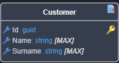

# What's new in Intent Architect (June 2025)

Welcome to the June 2025 edition of highlights of What's New in Intent Architect. Here's a roundup of the latest updates and improvements.

- Highlights
  - **[Revamped "Get Started"](#revamped-get-started)** - The "Get Started" process to create new applications has been completely re-imagined to simplify the creation of new solutions
  - **[Sample Applications](#sample-applications)** - Create new Intent Architect solutions from fully functional, ready-to-run sample applications.
  - **[Hosted Module Tasks](#hosted-module-tasks)** - The powerful new system enables background task execution and suggests file changes based on task outcomes.
  - **[Handler Auto-Implementation](#auto-implementation)** - Automatically generate Command and Query handler implementations using AI in conjunction with Intent Architect metadata.
  - **[Unit Testing Module](#unit-testing-module)** - Scaffolds the project structure, configurations, and NuGet packages required for unit testing - ready for test cases to be added.
  - **[Unit Test Implementation Generation](#unit-test-generation)** - Automatically generate relevant Command and Query unit test implementations using AI in conjunction with Intent Architect metadata.
  - **[Entity Framework OData Module](#entity-framework-odata-module)** - This module enables you to expose `Entity`'s as OData endpoints.
  - **[Diff Audit Module](#diff-audit-module)** - This module adds functionality to model differential auditing on an `Entity`.

- More updates
  - **[AutoMapper option for separating Profiles from DTOs](#automapper-option-for-separating-profiles-from-dtos)** - As AutoMapper `Profile`s and DTO have very different dependencies it is often better to have these as separate files.
  - **[PostgreSQL Stored Procedure Support](#postgresql-stored-procedure-support)** - Stored Procedure support has been added for PostgreSQL Entity Framework database provider type.
  - **[Improved VS Solution modeling options](#improved-vs-solution-modeling-options)** - Improvements in the VS Designer.
  - **[Replaced IdentityModel and IdentityModel.AspNetCore NuGet packages](#updated-identitymodel-and-identitymodelaspnetcore-packages)** - Upgraded dependencies on `IdentityModel` and `Identity.AspNetCore` NuGet packages, to newer alternatives.
  - **[EntityFramework.Application.LinqExtensions module](#entityframeworkapplicationlinqextensions-module)** - This modules adds `AsTracking` and `AsNoTracking` Linq Extensions methods for convenience with out the direct dependency on EF Core.
  - **[Infrastructure as Code with Terraform Module](#infrastructure-as-code-with-terraform-module)** - This module automatically generates Terraform configuration files for deploying applications to Azure.
  - **[Request payload logging improvements](#request-payload-logging-improvements)** - Added ability to control whether request payloads can be logged alongside the ability to prevent excessive logging.

## Update details

### Revamped Get Started

The **Get Started** process has been completely re-imagined to simplify the creation of new solutions, with the ability to now choose from one of the existing **Architecture Templates** or jump straight into one of the fully working and configured [Sample Applications](#sample-applications).


Available from:

- Intent Architect 4.4.5

### Sample Applications

The new **Sample System** makes it easy to create new Intent Architect solutions from fully functional, ready-to-run sample applications — complete with source code.


In addition to consuming existing samples, you can now package any solution you've built in Intent Architect as a sample.


Available from:

- Intent Architect 4.4.5

### Hosted Module Tasks

This `Hosted Module Task` system is leveraged by Intent Architect’s AI modules to interact with the selected LLM and present intelligent code modification suggestions seamlessly within Intent Architect, however it is fully extensible and can be utilized by Module Builders for a wide range of scenarios.

AI-powered functionality is currently available in the [Intent.AI.AutoImplementation](#auto-implementation) and [Intent.AI.UnitTests](#unit-test-generation) modules:


> 💡 This is an initial release of our AI-driven features. We plan to continue investing in and extending this functionality, and we welcome any feedback or suggestions on how to improve it.

Available from:

- Intent Architect 4.4.5

### Auto Implementation

The new AI-powered `Intent.AI.AutoImplementation` module automatically generates Command and Query handler implementations by leveraging Intent Architect’s rich metadata and generated code context. The generated output can further be refined, by providing additional guidance through an optional prompt, enabling more accurate and tailored code generation.

Suggested implementation of a Query handler, generated by AI:


Optional guidance can be provided:


Available from:

- Intent.AI.AutoImplementation 1.0.0-beta.1

### Unit Testing Module

The **Unit Testing** module scaffolds a C# unit test project with all required configurations and NuGet packages. It can generate test scaffolding for **all** or **selected** `Commands` and `Queries`, using the `Unit Test` stereotype.


The generated output includes fully scaffolded unit test classes, ready for implementation:


The module currently supports the `xUnit` test framework, along with mocking via `Moq` and `NSubstitute`.

Available from:

- Intent.UnitTesting 1.0.0-beta.8 *(Requires Intent Architect 4.5 or later)*

### Unit Test Generation

The AI-powered `Intent.AI.UnitTests` module can automatically generate Command and Query handler unit tests by leveraging Intent Architect’s rich metadata and generated code context, in conjunction with the test infrastructure generate by the [Intent.UnitTesting](#unit-testing-module) module.  
As with [other AI-powered modules](#auto-implementation), generated output can further be refined, by providing additional guidance through an optional prompt, enabling more accurate and tailored code generation.

Suggested implementation of a Command unit test, generated by AI:


Available from:

- Intent.AI.UnitTests 1.0.0-beta.1

### Entity Framework OData Module

This module enables you to expose `Entity`'s as OData endpoints.


To learn more, read the [module documentation](https://docs.intentarchitect.com/articles/modules-dotnet/intent-aspnetcore-odata-entityframework/intent-aspnetcore-odata-entityframework.html).

Available from:

- Intent.AspNetCore.OData.EntityFramework 1.0.1

### Diff Audit Module

This module adds functionality to allow you to audit an `Entity`.

All state changes with be audited on a property level. These audit entries will be stored in a audit table within your Entity Framework database provider.



To learn more, read the [module documentation](https://docs.intentarchitect.com/articles/modules-dotnet/intent-entityframeworkcore-diffaudit/intent-entityframeworkcore-diffaudit.html).

Available from:

- Intent.EntityFrameworkCore.DiffAudit 1.0.1

### AutoMapper option for separating Profiles from DTOs

There now a configuration application setting under `AutoMapper Settings` named **Profile Location**, the options are as follows:

- Profile in Dto, the existing pattern where `Profile`'s existing in the corresponding **Dto** file.
- Profile Separate from Dto, `Profile`s are no in their own files, in a `Mappings` folder by default. Profiles are still per Dto.

To learn more, read the [module documentation](https://docs.intentarchitect.com/articles/modules-dotnet/intent-application-automapper/intent-application-automapper.html#profile-location).

Available from:

- Intent.Application.AutoMapper 5.2.1

### PostgreSQL Stored Procedure Support

Added support for PostgreSQL Stored Procedures.

In the `Domain Designer` you are now able to model `Stored Procedures` that will be executed against a PostgreSQL database provider using Entity Framework Core.

To learn more, read the [module documentation](https://docs.intentarchitect.com/articles/modules-dotnet/intent-entityframeworkcore-repositories/intent-entityframeworkcore-repositories.html).

Available from:

- Intent.EntityFrameworkCore.Repositories 4.7.9
 
### Improved VS Solution modeling options

You can now explicitly configure the following:

- VS Solutions name, as opposed to defaulting to the package name.
- Specify a relative location for the VS Solution, easily move the solution file or shared a solution between applications.

You can also choose to have solution folder realized as actual folders in your VS Solution using the `Folder Options` stereotype and checking `Materialize Folder`.

To learn more, read the [module documentation](https://docs.intentarchitect.com/articles/modules-dotnet/intent-visualstudio-projects/intent-visualstudio-projects.html#the-visual-studio-solution-options-stereotype).

Available from:

- Intent.VisualStudio.Projects  3.8.12

### Updated IdentityModel and IdentityModel.AspNetCore Packages

These unlisted NuGet packages have been updated with the relevant Duende equivalents. This does introduce a breaking change. Please see the [release notes](https://github.com/IntentArchitect/Intent.Modules.NET/blob/development/Modules/Intent.Modules.Integration.HttpClients/release-notes.md) for migration steps.

Available from:

- Intent.Security.JWT 4.2.8
- Intent.Security.MSAL 4.2.8
- Intent.Integration.HttpClients 6.0.0
- Intent.AspNetCore.Identity.AccountController 4.1.4

### EntityFramework.Application.LinqExtensions module

Adds helper Linq Extension methods for EF which can be used as follows:

```csharp
var customers = await _customerRepository.FindAllAsync(o => o.AsNoTracking(), cancellationToken);
```

To learn more, read the [module documentation](https://docs.intentarchitect.com/articles/modules-dotnet/intent-entityframework-application-linqextensions/intent-entityframework-application-linqextensions.html).

Available from:

- Intent.EntityFramework.Application.LinqExtensions 1.0.0

### Infrastructure as Code with Terraform Module

This module automatically generates Infrastructure as Code (IaC) through Terraform `.tf` files for your Intent Architect applications.

The module scans all applications in your Intent Architect Solution to identify Azure Function applications and generates the necessary Terraform configuration to deploy them to Azure, including integration with Azure Event Grid and Service Bus when the respective modules are installed.

> [!NOTE]
> It is recommended to introduce Terraform as a new application in your solution through the `Terraform Infrastructure Provisioning` application template.

#### Example

```json
...

resource "azurerm_windows_function_app" "azure_service_bus_app1_function_app" {
  name                       = local.azure_service_bus_app1_app_name
  location                   = azurerm_resource_group.main-rg.location
  resource_group_name        = azurerm_resource_group.main-rg.name
  service_plan_id            = azurerm_service_plan.azure_service_bus_app1_function_plan.id
  storage_account_name       = azurerm_storage_account.azure_service_bus_app1_storage.name
  storage_account_access_key = azurerm_storage_account.azure_service_bus_app1_storage.primary_access_key

  site_config {
    application_stack {
      dotnet_version = "v8.0"
    }
    cors {
      allowed_origins = [ "https://portal.azure.com" ]
    }
  }

  app_settings = {
    "APPINSIGHTS_INSTRUMENTATIONKEY"              = azurerm_application_insights.app_insights.instrumentation_key
    "AzureWebJobsStorage"                         = "DefaultEndpointsProtocol=https;AccountName=${azurerm_storage_account.azure_service_bus_app1_storage.name};AccountKey=${azurerm_storage_account.azure_service_bus_app1_storage.primary_access_key};EndpointSuffix=core.windows.net"
    "AzureServiceBus:ClientCreated"               = azurerm_servicebus_topic.client_created_topic.id
    "AzureServiceBus:ClientProcessed"             = azurerm_servicebus_topic.client_processed_topic.id
    "AzureServiceBus:ClientProcessedSubscription" = azurerm_servicebus_subscription.client_processed_subscription.id
    "AzureServiceBus:ConnectionString"            = azurerm_servicebus_namespace.service_bus.default_primary_connection_string
    "FUNCTIONS_WORKER_RUNTIME"                    = "dotnet-isolated"
  }
}

...
```

To learn more, read the [module documentation](https://docs.intentarchitect.com/articles/modules-dotnet/intent-iac-terraform/intent-iac-terraform.html).

Available from:

- Intent.IaC.Terraform 1.0.0-beta.1 *(Requires Intent Architect 4.4.6 or later)*

### Request payload logging improvements

For MediatR pipeline behaviors you can control whether request payload logging occurs by configuring the `CqrsSettings:LogRequestPayload` setting.

Additionally there is a `BoundedLoggingDestructuringPolicy` class introduced for Serilog to log any object without causing any excessive logging to take place. It does this by:

1. Limiting collection sizes.
2. Truncating objects with too many properties.
3. Replacing problematic property types (like streams and byte arrays) with placeholders.
4. Handling exceptions during property access to prevent logging failures.

This policy helps maintain logging performance by controlling the size of log events and preventing runaway memory consumption from large object graphs.

Available from:

- Intent.Application.MediatR.Behaviours 4.3.3
- Intent.Modules.AspNetCore.Logging.Serilog 5.3.0
