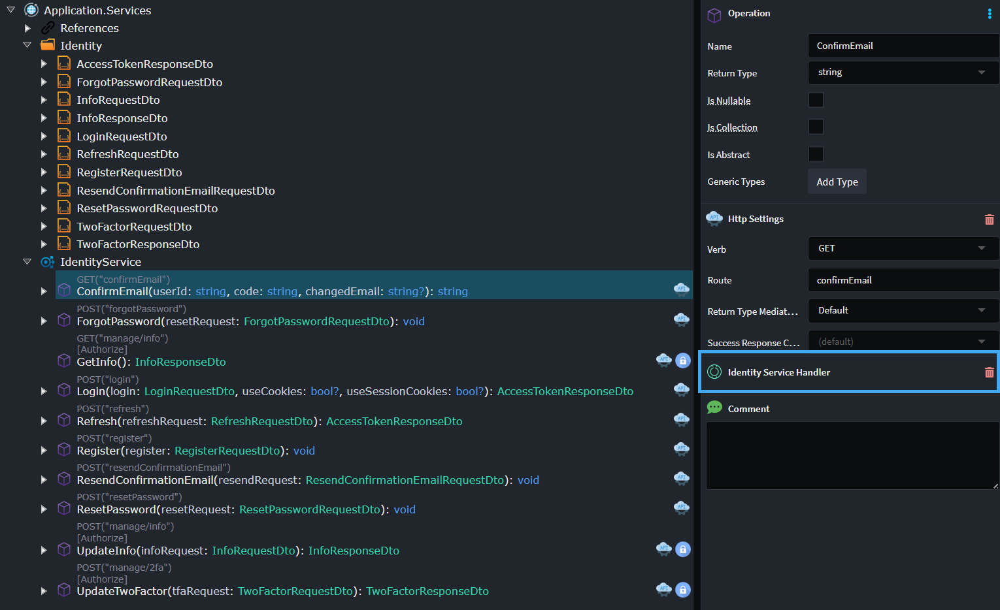
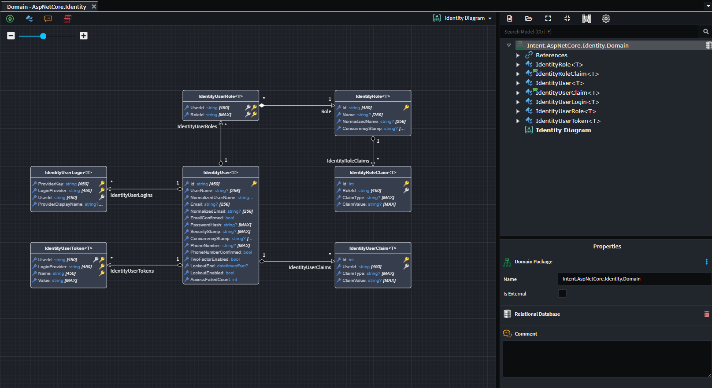
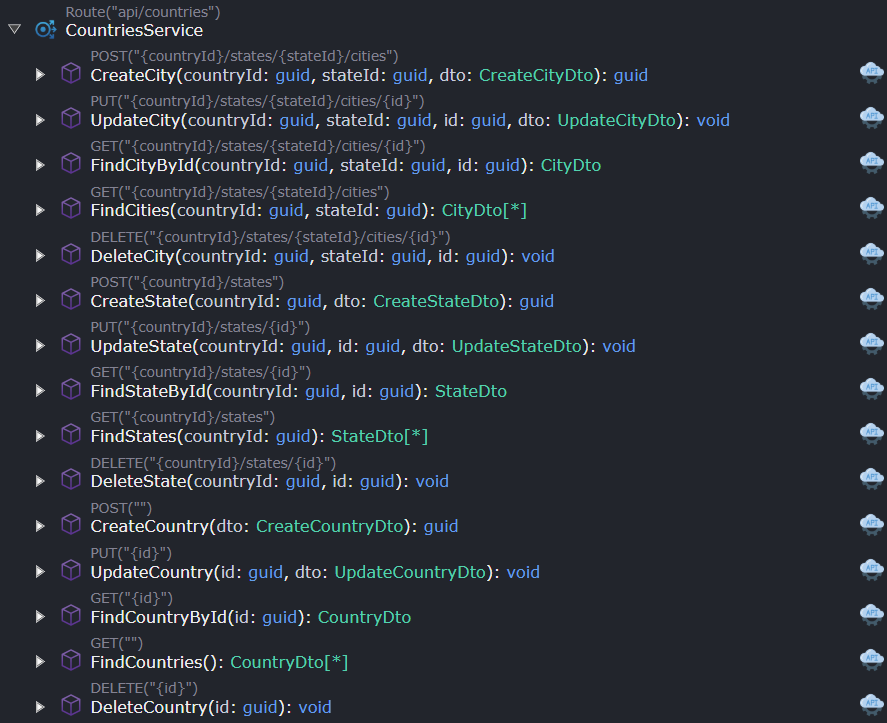
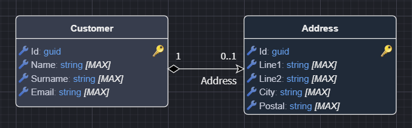
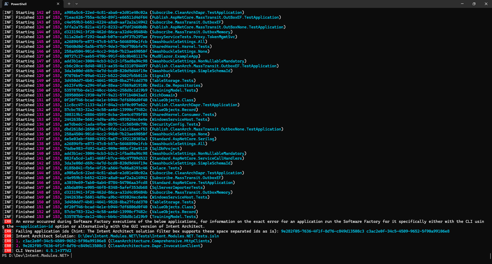
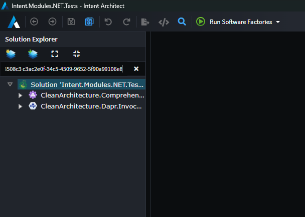

# What's new in Intent Architect (July 2025)

Welcome to the July 2025 edition of highlights of What's New in Intent Architect. Here's a roundup of the latest updates and improvements.

We are proud to announce 4.5 is officially live, for full details available in the [release notes](https://docs.intentarchitect.com/articles/release-notes/intent-architect-v4.5.html) .

- Highlights
  - **[Ignore specific lines of C# chained statements](#ignore-specific-lines-of-c-chained-statements)** - Use `// IntentIgnore` on specific lines of method chains in C# files.
  - **[ASP.NET Core Identity Service](#aspnet-core-identity-service)** – Exposes Identity-related functionality as HTTP endpoints using the latest ASP.NET Core Identity services.
  - **[ASP.NET Core Identity](#aspnet-core-identity)** – Enables full modelling and extension of ASP.NET Core Identity types within the Domain Designer.
  - **[CRUD Script enhancements](#crud-script-enhancements)** – Improved validations, user feedback, better parity between CQRS paradigm and Traditional style services.
  - **[Universal Azure Service Bus Integration](#universal-azure-service-bus-integration)** - Seamlessly integrate Azure Service Bus messaging with ASP.NET Core, Windows Host Services through intelligent host detection.

- More updates
  - **[AutoMapper and MediatR going commercial](#automapper-and-mediatr-going-commercial)** – Currently our modules are locked to use the free versions of these NuGet packages.
  - **[Visualize aggregates](#visualize-aggregates)** – **Domain Designer** now visually differentiates aggregates and entities.
  - **[Suppression of "Namespace does not match folder structure" warnings on eventing contracts](#automatic-suppression-of-namespace-does-not-match-folder-structure-ide0130-warnings-on-generated-eventing-messages)** - No more warnings from eventing contracts when `dotnet_style_namespace_match_folder` is enabled in your `.editorconfig` file.
  - **[`// IntentInitialGen` support for statements](#c-code-management-now-supports--intentinitialgen-on-statements)** - "Only once" statement generation option for template authors.
  - **[Software Factory CLI quality of life improvements for pre-commit checking](#software-factory-cli-quality-of-life-improvements-for-pre-commit-checking)** - Optionally have the Software Factory CLI show all failing applications.

## Update details

### Ignore specific lines of C# chained statements

It is now possible to ignore specific lines on chained methods in C# files by adding an `// IntentIgnore` on the line you wish to ignore, for example:

```csharp
void Method()
{
    Member
      .GeneratedChain1()
      // IntentIgnore
      .ManuallyAddedChain()
      .GeneratedChain2();
}
```

This is also documented in our [](xref:application-development.code-weaving-and-generation.about-code-management-csharp#method-chains) article.

Available from:

- Intent.OutputManager.RoslynWeaver 4.9.9

### ASP.NET Core Identity Service

The `Intent.AspNetCore.IdentityService` module exposes the latest ASP.NET Core Identity services as HTTP endpoints. This module provides additional configuration options within the Service Designer.



It also allows injection of the `IIdentityManagerService` interface, enabling you to use its functionality within other services.

To learn more about the Identity Service module, read the [documentation here](https://docs.intentarchitect.com/articles/modules-dotnet/intent-aspnetcore-identityservice/intent-aspnetcore-identityservice.html).

### ASP.NET Core Identity

From version `4.2.0`, the `Intent.AspNetCore.Identity` module exposes the ASP.NET Core Identity model within the Domain Designer. This gives you more control over how ASP.NET Core Identity is modelled, allowing you to extend any of the model classes.



`Intent.AspNetCore.AccountController V4.1.6` and `Intent.AspNetCore.IdentityService V1.2.0` have also been updated to support this module and now extend the default ASP.NET Core Identity `IdentityUser<T>` model.

To learn more about the Identity module, read the [documentation here](https://docs.intentarchitect.com/articles/modules-dotnet/intent-aspnetcore-identity/intent-aspnetcore-identity.html)

### CRUD Script enhancements

There have been many improvements to CRUD scripts:

- General validations and user feedback, on unsupported scenarios.
- Better parity between the CQRS and Traditional style services.
- Generate endpoint for nested aggregate collection, previously this only worked 1 level deep.

The CRUD scripts have better validation and user feedback, if you try to create service endpoint which are not possible the script will let you know and make suggestions on how to achieve this , rather than just skipping those options. e.g. Trying to CRUD entities without primary keys.

Traditional Style services now add diagrams and can CRUD compositional child collections, like it's CQRS counter part.



Available from:

- Intent.Modelers.Services.DomainInteractions 2.2.0

### Universal Azure Service Bus Integration

The Azure Service Bus module now automatically detects your hosting platform and configures appropriate message consumption patterns. Whether you're building ASP.NET Core web applications or Windows Host Services, message handling is automatically configured.

Your host configuration will have this background service running to process incoming messages from an Azure Service Bus queue or topic:

```csharp
builder.Services.AddHostedService<AzureServiceBusHostedService>();
```

To learn more about the Azure Service Bus module, read the [documentation here](https://docs.intentarchitect.com/articles/modules-dotnet/intent-eventing-azureservicebus/intent-eventing-azureservicebus.html).

Available from:

- Intent.Eventing.AzureServiceBus 1.1.0

### AutoMapper and MediatR going commercial

These two NuGet packages have recently introduced commercial versions. For now, we have locked our modules to the current free versions. We will soon be adding a setting that allows you to choose between using the free or the commercial version. Once the commercial versions start to diverge from the free ones, we’ll reassess how this impacts our modules.

Available from:

- Intent.Application.MediatR 4.4.1
- Intent.Application.AutoMapper 5.2.2

### Visualize Aggregates

The **Domain Designer** now visually differentiates aggregates from entities making it easier to understand and validate your domain models at a glance.



Available from:

- Intent.Modelers.Domain 3.12.3

### Automatic suppression of "Namespace does not match folder structure (IDE0130)" warnings on generated eventing messages

For de-serialization of eventing message contracts to work between different applications, their namespaces needs to be consistent between them and thus in most cases do not match the folder structure of your Visual Studio project. If `dotnet_style_namespace_match_folder` is enabled in your `.editorconfig` file this causes an [IDE0130](https://learn.microsoft.com/dotnet/fundamentals/code-analysis/style-rules/ide0130) warning to occur during compilation.

To suppress this warning, an assembly attribute like the following is now generated in an `AssemblyAttributes.cs` for each namespace which needs to be suppressed:

```csharp
[assembly: System.Diagnostics.CodeAnalysis.SuppressMessage("Formatting", "IDE0130:Namespace does not match folder structure.", Justification = "Message namespaces need to consistent between applications for deserialization to work", Scope = "namespaceanddescendants", Target = "<namespace>")]
```

Available from:

- Intent.Eventing.Contracts 5.2.1

### C# code management now supports `// IntentInitialGen` on statements

The `IntentInitialGen` can now be added above statements to essentially achieve "once off" generation of it. This is useful for scenarios where a statement like `throw new NotImplementedException()` needs to be generated in a method for it to be able to compile, but you don't want to put a method body fully ignore mode either which before would have been required to prevent the statement being generated when the user removed it.

Consider the below template content:

```csharp
[IntentFully, IntentMergeBody]
public int DoSomeCalculationFor(Guid id)
{
    // IntentInitialGen
    throw new NotImplementedException();
}
```

When the method is initially generated it inserts the the `throw new NotImplementedException();` statement but without the code management instruction:

```csharp
[IntentFully, IntentMergeBody]
public int DoSomeCalculationFor(Guid id)
{
    throw new NotImplementedException();
}
```

If the user deletes the statement while adding their own logic, Intent Architect will now not try to bring it back, for example:

```csharp
[IntentFully, IntentMergeBody]
public int DoSomeCalculationFor(Guid id)
{
    return _calculationService.Calculate(id);
}
```

This is also documented in [](xref:application-development.code-weaving-and-generation.about-code-management-csharp#the--intentinitialgen-instruction) article.

Available from:

- Intent.OutputManager.RoslynWeaver 4.9.10

### Software Factory CLI quality of life improvements for pre-commit checking

When using the [Software Factory CLI's `ensure-no-outstanding-changes` command](xref:tools.software-factory-cli#ensure-no-outstanding-changes-command) for a solution, when an error was encountered it would immediately stop processing all other applications as well.

This behaviour can be desirable on CI servers to avoid holding it up while other builds may be queued up, but when using the Software Factory CLI as a pre-commit check on a developer's local machine it can waste time as the developer has to fix applications one at a time, re-running the CLI after each fixed application to see if any other applications possibly have an error.

There is now a `--continue-on-error` [option](xref:tools.software-factory-cli#ensure-no-outstanding-changes-options) which will instruct the Software Factory to continue processing other applications and at the end it will show the list of failing applications:

For example, here is a screenshot of the Software Factory CLI failing on multiple applications:



Also take note of the following line in the output:

```text
Failing application ids (hint: The Intent Architect solution filter box supports these space separated ids as is): 9e282f05-7636-4f1f-8d76-c849d13508c3 c3ac2e0f-34c5-4509-9652-5f90a99106e8
```

These application ids can be copied to your clipboard and pasted in the Solution Explorer's filter box in Intent Architect to have it show just those particular applications:



Available from:

- Intent.SoftwareFactory.CLI 4.5.0
