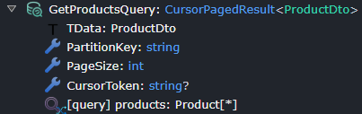
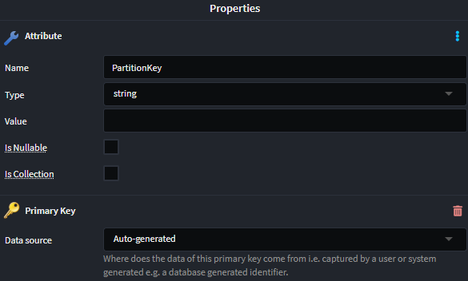
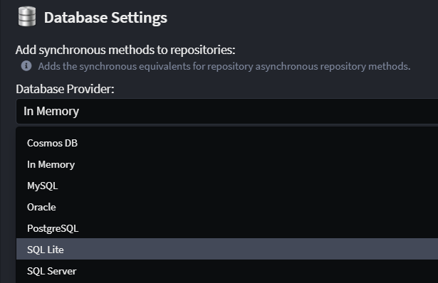
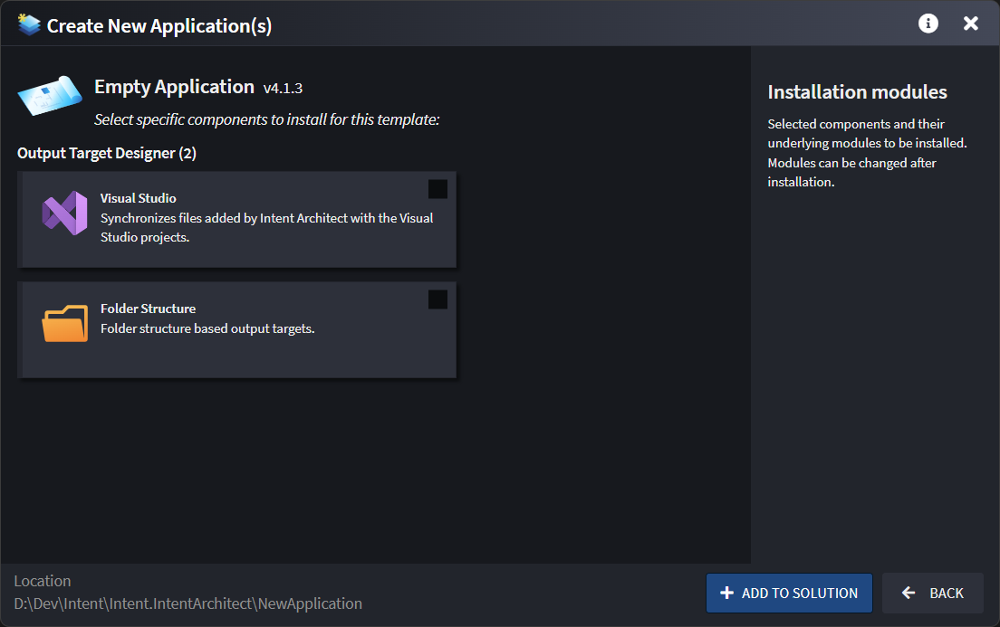

# What's new in Intent Architect (August 2025)

Welcome to the August 2025 edition of highlights of What's New in Intent Architect. Here's a roundup of the latest updates and improvements.

- Highlights
  - **[Model direct invocation of HTTP endpoints without service proxies](#model-direct-invocation-of-http-endpoints-without-service-proxies)** - Model invocations directly to a remote Command, Query or Service Operation without having to first model a Service Proxy.
  - **[Relational Database Importer upgrade](#relational-database-importer-upgrade)** – Complete transformation of the database importer with multi-database support, redesigned interface, and enhanced filtering capabilities.
  - **[Azure Table Storage Enhancements](#azure-table-storage-enhancements)** - Azure Table Storage updated to support **cursor-based pagination** as well as **auto-generated** primary keys.
  - **[SQL Lite Provider support for Entity Framework](#sql-lite-provider-support-for-entity-framework)** - SQL Lite Provider has been added to our **Entity Framework** Module.
  - **[Improvements to generated methods requiring manual implementations](#improvements-to-generated-methods-requiring-manual-implementations)** - Improved generation and default code management instructions for methods generated with `throw new NotImplementedException()`.

- More updates
  - **[Software Factory CLI Authentication Token Support](#software-factory-cli-authentication-token-support)** - Use an organization authentication token instead of user credentials for the Software Factory CLI.  
  - **[Event Domain modeling in Azure Event Grid](#event-domain-modeling-in-azure-event-grid)** – Model and manage Event Domains for better organization of Event Grid topics within Intent Architect.
  - **[Updated "Empty Application" Template](#updated-empty-application-template)** - Updated template allowing creation of Visual Studio based, Folder based or completely empty applications.

## Update details

### Model direct invocation of HTTP endpoints without service proxies

Model invocations directly to a remote Command, Query or Service Operation without having to first model a Service Proxy.

Previously, invoking the endpoint in another application required first modelling a service proxy for endpoint or service and then you could interact with the operation of the service proxy from your current application.

It is now possible in designers to model a direct invocation of a remote endpoint without first needing to explicitly model a service proxy first. In such cases our patterns will implicitly generate service proxy code as needed.

For example, in the following screenshot, `GetCustomerByIdCommand` is in the current Intent Architect application, `GetCustomerByIdQuery` is in a different Intent Application and an `Invoke Service` association has been created between them:


After configuring the mapping, the following code would be generated:

```csharp
public class GetCustomerByIdCommandHandler : IRequestHandler<GetCustomerByIdCommand>
{
    private readonly ICustomersService _customersService;

    [IntentManaged(Mode.Merge)]
    public GetCustomerByIdCommandHandler(ICustomersService customersService)
    {
        _customersService = customersService;
    }

    [IntentManaged(Mode.Fully, Body = Mode.Fully)]
    public async Task Handle(GetCustomerByIdCommand request, CancellationToken cancellationToken)
    {
        var result = await _customersService.GetCustomerByIdAsync(new GetCustomerByIdQuery
        {
            Id = request.Id
        }, cancellationToken);
    }
}
```

For a guide and further details refer to the [](xref:application-development.modelling.services-designer.invoking-http-endpoints) article.

Available from:

- Intent.Dapr.AspNetCore.ServiceInvocation 2.2.21
- Intent.Integration.HttpClients 6.0.3

### Relational Database Importer Upgrade

The database importer has undergone a complete transformation with the release of `Intent.Rdbms.Importer` (previously known as `Intent.SqlServerImporter`). This comprehensive revamp delivers a dramatically improved user experience and powerful new capabilities, enhanced by the Dynamic Form improvements introduced in `Intent Architect 4.5.4`, as well as the new ability to import from PostgreSQL.


#### Key Improvements

**Multi-Database Support**: The module now supports both **SQL Server** and **PostgreSQL** databases, enabling seamless reverse engineering of domain models from either database type. The new architecture makes it simple to add support for additional database types in the future.

**Better Connection Management**: Built-in connection testing ensures your connection string is valid before proceeding with the import process.

**Organized Interface**: The dialog is now organized into collapsible sections for better navigation:

- **Connection & Settings Section** - Connection string management with test connection functionality
- **Import Options Section** - Entity naming conventions and stereotype settings  
- **Filtering Section** - Advanced filtering capabilities with visual management tools

**Enhanced Filtering**: New visual "Manage Filters" dialog allows you to interactively select which database objects (tables, views, stored procedures) to include or exclude through an intuitive hierarchical tree view.


#### Future Database Support

The restructured module architecture enables simple addition of new database providers. If you need support for a specific database type not currently available, please reach out to us through our [GitHub Support repository](https://github.com/IntentArchitect/Support) to request it.

> [!NOTE]
>
> The revamped importer maintains full backward compatibility while providing a more intuitive and powerful experience for reverse engineering domain models from relational databases.

To learn more about this, read the [documentation](https://docs.intentarchitect.com/articles/modules-importers/intent-rdbms-importer/intent-rdbms-importer.html).

Available from:

- Intent.Rdbms.Importer 1.0.0

### Azure Table Storage Enhancements

#### Cursor-based Pagination

Queries and operations configured with pagination in **Azure Table Storage** will now automatically use **cursor-based pagination**. This change ensures improved performance and better alignment with how Azure Table Storage handles paging natively.

The implementation updates the endpoint to include the required input parameters and response type (`CursorPagedResult<T>`).



To learn more about this, you can read the [documentation](https://docs.intentarchitect.com/articles/application-development/modelling/services-designer/modeling-services/modeling-services.html#paginate-accelerator).

Available from:

- Intent.Azure.TableStorage 1.0.0-beta.29

#### Primary Key Data Source

The **Primary Key** generation strategy for Azure Table Storage entities can now be explicitly configured via the `Data Source` setting. This enhancement brings it in line with other persistence providers and allows for finer control.



Available from:

- Intent.Azure.TableStorage 1.0.0-beta.29

### SQL Lite Provider support for Entity Framework

"SQL Lite" is now an available option under "Database Provider" within "Database Settings" which your application's patterns accordingly.



Available from:

- Intent.EntityFrameworkCore 5.0.26

### Improvements to generated methods requiring manual implementations

Many templates have been updated to have their method bodies for unimplemented methods be in `Merge` mode to avoid requiring customizations to their code management instructions.

Previously, any methods generated by Intent Architect without an automatic implementation (e.g. for non-CRUD services, event handlers, etc.) would by default generate a body with `throw new NotImplementedException()` with code management of just their body generally set to `Mode.Ignored` (or even `Mode.Fully`).

All these templates have been updated to have their body mode set to `Mode.Merge` and the `throw new NotImplementedException()` statement has had an `// IntentInitialGen` (only visible in the template source code) put above it which [allows the statement to be deleted without the Software Factory always trying to put it back](xref:application-development.code-weaving-and-generation.about-code-management-csharp#the--intentinitialgen-instruction).

Available from:

- Intent.Application.DomainInteractions 1.0.1
- Intent.Application.FluentValidation.Dtos 3.12.2
- Intent.Application.MediatR 4.4.1
- Intent.Application.MediatR.CRUD 7.0.1
- Intent.Application.MediatR.FluentValidation 4.9.2
- Intent.Application.ServiceCallHandlers 4.3.5
- Intent.Application.ServiceImplementations 4.5.13
- Intent.AspNetCore.Identity.AccountController 4.1.7
- Intent.AzureFunctions 5.0.10
- Intent.Blazor.FluentValidation 1.1.3
- Intent.Dapr.AspNetCore.Pubsub 3.0.4
- Intent.DomainServices 1.1.12
- Intent.Entities 5.1.14
- Intent.Entities.Repositories.Api 5.1.7
- Intent.EntityFrameworkCore.Repositories 4.7.13
- Intent.Eventing.AzureEventGrid 1.2.0
- Intent.Eventing.AzureServiceBus 1.1.2
- Intent.Eventing.MassTransit 7.0.4
- Intent.Eventing.Solace 2.0.6
- Intent.Hangfire 1.0.4
- Intent.MediatR.DomainEvents 5.2.1
- Intent.MongoDb.Repositories 1.2.5
- Intent.QuartzScheduler 1.0.9

### Software Factory CLI Authentication Token Support

The Software Factory CLI can now use "Organization Access Tokens" as an alternative to using a regular Intent Architect user credentials. This is especially useful on CI servers where using a particular user's account is undesirable or forbidden by policy.

To use an Organization Access Token instead of user credentials, for the username argument specify `token` and then use the Organization Access Token for the password.

Should you want one or more Organization Access Tokens, please reach out to us through your preferred support channel for us to issue them to you. Organization Access Tokens can optionally have an expiry set on them, so let us know if you want this set too.

The above is also documented in the [](xref:tools.software-factory-cli) article.

Available from:

- Intent.SoftwareFactory.CLI 4.5.6

### Event Domain modeling in Azure Event Grid

Azure Event Grid - Event Domains provide a management tool for large numbers of Event Grid topics related to the same application. They allow you to group multiple topics under a single domain and manage them collectively, with messages routed to topics within the domain based on the event's type.

Event Domains can now be modeled in Intent Architect by adding an `Event Domain` stereotype to your Eventing Package. Configure the `Domain Name` property to specify which domain the events should be published to.


This enhancement provides better organization and management capabilities for complex event-driven architectures, allowing you to:

- Group related topics under a single domain
- Manage multiple topics collectively
- Simplify event routing and organization
- Reduce management overhead for large-scale event systems

When using Event Domains, the module automatically configures the appropriate publisher settings:

```csharp
services.Configure<AzureEventGridPublisherOptions>(options =>
{
    // Configure Event Domains
    options.AddDomain(
        configuration["EventGrid:Domains:MainDomain:Key"]!, 
        configuration["EventGrid:Domains:MainDomain:Endpoint"]!, 
        domain =>
        {
            domain.Add<OrderCreatedEvent>(configuration["EventGrid:Topics:OrderCreatedEvent:Source"]!);
        });
});
```

To learn more about this, you can read the [documentation](https://docs.intentarchitect.com/articles/modules-dotnet/intent-eventing-azureeventgrid/intent-eventing-azureeventgrid.html).

Available from:

- Intent.Eventing.AzureEventGrid 1.2.0

### Updated "Empty Application" template

The new "Empty Visual Studio" application template has been removed and replaced with a generic "Empty Application" template which allows one to optionally select either a `Folder` or `Visual Studio` based new application. If neither are selected a completely empty application is created.



Available from:

- Intent Architect 4.5.0
