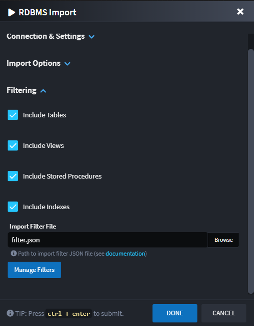

# What's new in Intent Architect (August 2025)

Welcome to the August 2025 edition of highlights of What's New in Intent Architect. Here's a roundup of the latest updates and improvements.

- Highlights
  - **[SQL Importer GUI and capabilities update](#sql-importer-gui-and-capabilities-update)** – Completely redesigned import dialog with enhanced filtering, better organization, and improved user experience.
  - **[Event Domain modeling in Azure Event Grid](#event-domain-modeling-in-azure-event-grid)** – Model and manage Event Domains for better organization of Event Grid topics within Intent Architect.

- More updates


## Update details

### SQL Importer GUI and capabilities update

The SQL Server Importer has received a comprehensive revamp with a completely redesigned import dialog that provides a significantly improved user experience and enhanced capabilities due to the Dynamic Form improvements made as part of `Intent Architect 4.5.4`.


#### Key Improvements

**Better Connection Management**: Built-in connection testing ensures your connection string is valid before proceeding with the import process.

**Organized Interface**: The dialog is now organized into collapsible sections for better navigation:
- **Connection & Settings Section** - Connection string management with test connection functionality
- **Import Options Section** - Entity naming conventions and stereotype settings
- **Filtering Section** - Advanced filtering capabilities with visual management tools

**Enhanced Filtering**: New visual "Manage Filters" dialog allows you to interactively select which database objects (tables, views, stored procedures) to include or exclude through an intuitive hierarchical tree view.




> [!NOTE]
> 
> The revamped importer maintains full backward compatibility while providing a more intuitive and powerful experience for reverse engineering domain models from SQL Server databases.

To learn more about this, read the [documentation](https://docs.intentarchitect.com/articles/modules-dotnet/intent-sqlserverimporter/intent-sqlserverimporter.html).

Available from:

- Intent.SqlServerImporter 1.2.0

### Event Domain modeling in Azure Event Grid

Azure Event Grid - Event Domains provide a management tool for large numbers of Event Grid topics related to the same application. They allow you to group multiple topics under a single domain and manage them collectively, with messages routed to topics within the domain based on the event's type.

Event Domains can now be modeled in Intent Architect by adding an `Event Domain` stereotype to your Eventing Package. Configure the `Domain Name` property to specify which domain the events should be published to.


This enhancement provides better organization and management capabilities for complex event-driven architectures, allowing you to:

- Group related topics under a single domain
- Manage multiple topics collectively
- Simplify event routing and organization
- Reduce management overhead for large-scale event systems

When using Event Domains, the module automatically configures the appropriate publisher settings:

```csharp
services.Configure<AzureEventGridPublisherOptions>(options =>
{
    // Configure Event Domains
    options.AddDomain(
        configuration["EventGrid:Domains:MainDomain:Key"]!, 
        configuration["EventGrid:Domains:MainDomain:Endpoint"]!, 
        domain =>
        {
            domain.Add<OrderCreatedEvent>(configuration["EventGrid:Topics:OrderCreatedEvent:Source"]!);
        });
});
```

To learn more about this, you can read the [documentation](https://docs.intentarchitect.com/articles/modules-dotnet/intent-eventing-azureeventgrid/intent-eventing-azureeventgrid.html).

Available from:

- Intent.Eventing.AzureEventGrid 1.2.0