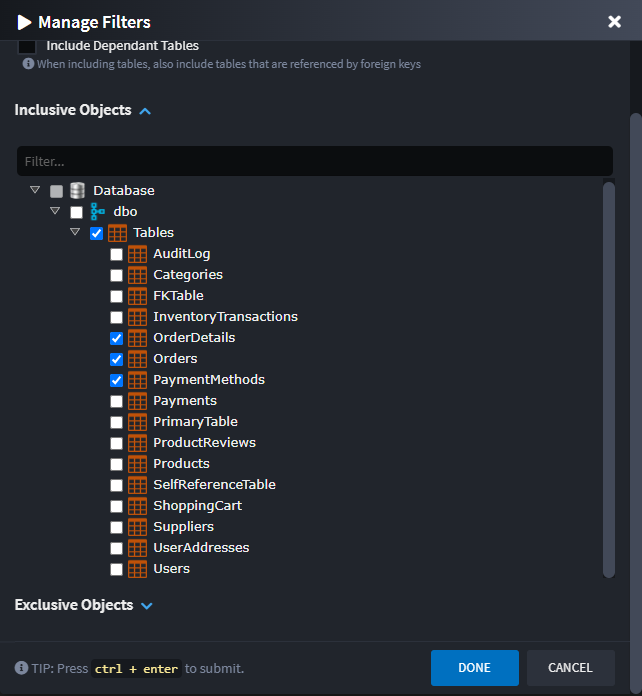

# What's new in Intent Architect (August 2025)

Welcome to the August 2025 edition of highlights of What's New in Intent Architect. Here's a roundup of the latest updates and improvements.

- Highlights
  - **[Relational Database Importer Upgrade](#relational-database-importer-upgrade)** – Complete transformation of the database importer with multi-database support, redesigned interface, and enhanced filtering capabilities.
  - **[Event Domain modeling in Azure Event Grid](#event-domain-modeling-in-azure-event-grid)** – Model and manage Event Domains for better organization of Event Grid topics within Intent Architect.

- More updates


## Update details

### Relational Database Importer Upgrade

The database importer has undergone a complete transformation with the release of `Intent.Rdbms.Importer` (previously known as `Intent.SqlServerImporter`). This comprehensive revamp delivers a dramatically improved user experience and powerful new capabilities, enhanced by the Dynamic Form improvements introduced in `Intent Architect 4.5.4`, as well as the new ability to import from PostgreSQL.


#### Key Improvements

**Multi-Database Support**: The module now supports both **SQL Server** and **PostgreSQL** databases, enabling seamless reverse engineering of domain models from either database type. The new architecture makes it simple to add support for additional database types in the future.

**Better Connection Management**: Built-in connection testing ensures your connection string is valid before proceeding with the import process.

**Organized Interface**: The dialog is now organized into collapsible sections for better navigation:
- **Connection & Settings Section** - Connection string management with test connection functionality
- **Import Options Section** - Entity naming conventions and stereotype settings  
- **Filtering Section** - Advanced filtering capabilities with visual management tools

**Enhanced Filtering**: New visual "Manage Filters" dialog allows you to interactively select which database objects (tables, views, stored procedures) to include or exclude through an intuitive hierarchical tree view.




#### Future Database Support

The restructured module architecture enables simple addition of new database providers. If you need support for a specific database type not currently available, please reach out to us through our [GitHub Support repository](https://github.com/IntentArchitect/Support) to request it.

> [!NOTE]
> 
> The revamped importer maintains full backward compatibility while providing a more intuitive and powerful experience for reverse engineering domain models from relational databases.

To learn more about this, read the [documentation](https://docs.intentarchitect.com/articles/modules-importers/intent-rdbms-importer/intent-rdbms-importer.html).

Available from:

- Intent.Rdbms.Importer 1.0.0

### Event Domain modeling in Azure Event Grid

Azure Event Grid - Event Domains provide a management tool for large numbers of Event Grid topics related to the same application. They allow you to group multiple topics under a single domain and manage them collectively, with messages routed to topics within the domain based on the event's type.

Event Domains can now be modeled in Intent Architect by adding an `Event Domain` stereotype to your Eventing Package. Configure the `Domain Name` property to specify which domain the events should be published to.


This enhancement provides better organization and management capabilities for complex event-driven architectures, allowing you to:

- Group related topics under a single domain
- Manage multiple topics collectively
- Simplify event routing and organization
- Reduce management overhead for large-scale event systems

When using Event Domains, the module automatically configures the appropriate publisher settings:

```csharp
services.Configure<AzureEventGridPublisherOptions>(options =>
{
    // Configure Event Domains
    options.AddDomain(
        configuration["EventGrid:Domains:MainDomain:Key"]!, 
        configuration["EventGrid:Domains:MainDomain:Endpoint"]!, 
        domain =>
        {
            domain.Add<OrderCreatedEvent>(configuration["EventGrid:Topics:OrderCreatedEvent:Source"]!);
        });
});
```

To learn more about this, you can read the [documentation](https://docs.intentarchitect.com/articles/modules-dotnet/intent-eventing-azureeventgrid/intent-eventing-azureeventgrid.html).

Available from:

- Intent.Eventing.AzureEventGrid 1.2.0