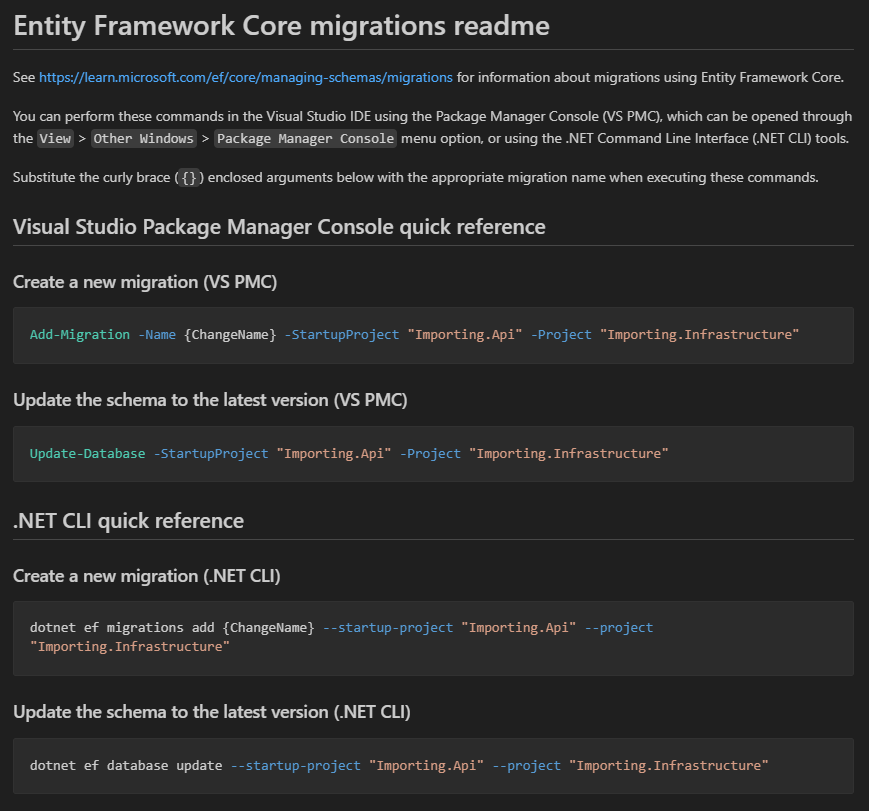
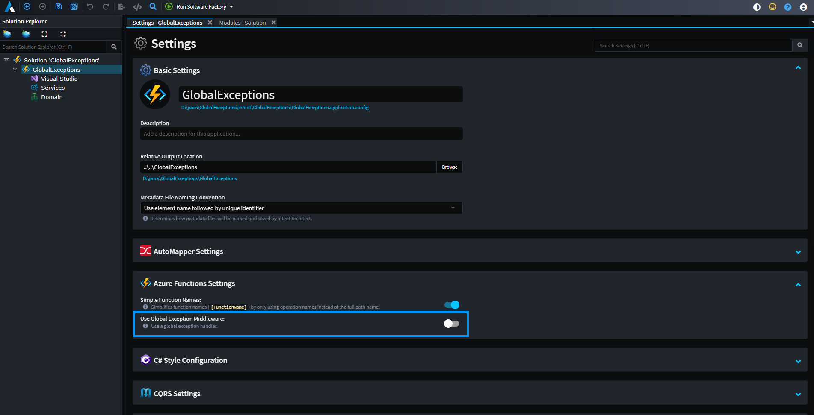
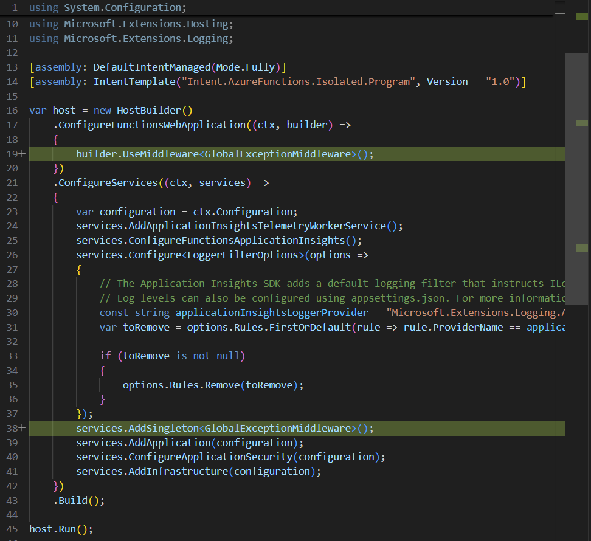

# What's new in Intent Architect (September 2025)

Welcome to the September edition of highlights of What's New in Intent Architect. Here's a roundup of the latest updates and improvements.

- Highlights
  - **[Blazor Authentication Module](#blazor-authentication-module)** - Quickly scaffold authentication into your Blazor applications. Works with Interactive -WebAssembly, -Server, and -Auto modes, plus supports Individual Accounts, JWT, and OIDC password flow.
  - **[Blazor AI Module](#blazor-ai-module)** - Build professional Blazor Front-ends faster than ever by simply modeling your ViewModel and letting IA drive the AI to create your views.
  - **[Blazor Server Architecture Template](#rdbms-importer-improvements)** - Kickstart your ASP.NET Core projects with a ready-to-use Blazor Server setup featuring in-process services and Clean Architecture best practices.
  - **[AutoMapper and MediatR commercial version settings](#automapper-and-mediatr-commercial-version-settings)** - Choose between free and commercial versions of AutoMapper and MediatR packages. 
  - **[RDBMS importer improvements](#rdbms-importer-improvements)** - The RDBMS importer has had various usability and performance improvements.
  - **[Global Exceptions in Azure Functions](#enabling-global-exception-handling-in-azure-functions-isolated-mode)** - Enable global exceptions for Azure Functions in isolated process mode.

- More updates
  - **[EF Core Migrations README update](#ef-migrations-readme-file-changed-from-a-txt-to-md-file)** - Migrations README file updated to leverage Markdown formatting.

## Update details

### Blazor Authentication Module

This new Blazor Authentication module makes it easier than ever to add secure, production-ready auth to your applications. Built on top of the familiar Blazor auth templates, it supports all three rendering modes (Interactive WebAssembly, Interactive Server, and Interactive Auto) so you can choose the right hosting model for your app without reworking your auth.

Here’s what’s included:

#### Individual Accounts
Get a fully functional login, registration, and profile management system using ASP.NET Core Identity. Ideal for apps that need user management, password resets, and role-based security out of the box.

#### JWT Authentication
Perfect for modern APIs and SPAs, this option allows your Blazor app to authenticate against any token-issuing service. It’s lightweight, scalable, and a great fit for microservice or API-first architectures.

#### OIDC Password Flow
Easily integrate with your existing identity provider (like IdentityServer, Auth0, or Azure AD B2C) using the Resource Owner Password flow. Great for scenarios where you need central user management and single sign-on across multiple apps.

Refer to the [Blazor Authentication Documentation](https://docs.intentarchitect.com/articles/modules-dotnet/intent-blazor-authentication/intent-blazor-authentication.html) for more information.

Available from:

- Intent.Blazor.Authentication 1.0.1

### Blazor AI Module

We’re excited to introduce the new Blazor AI Module, designed to work seamlessly with your existing Blazor modules. This innovation blends deterministic and non-deterministic code generation to help you build professional Blazor front ends — faster than ever.

With this module, you simply define the ViewModel aspects of your Blazor components (service interactions, navigations, models), and let AI fill in the rest. Thanks to our prompt-less interaction, Intent Architect handles all the context engineering behind the scenes, allowing you to collaborate with the AI through a simple, intuitive code-diff workflow.

The module also includes an extensible prompt templating system, giving you full control to customize the automated prompt engineering for your needs.

For more details read [Blazor UI Modeling with AI](https://docs.intentarchitect.com/articles/application-development/modelling/ui-designer/blazor-modeling/blazor-modeling.html) for more information.

Available from:

- Intent.AI.Blazor 1.0.0-beta.13

### Blazor Server Architecture Template

The new **Blazor Server** Architecture Template, the simplest way to model your way to a full-stack solution. This template sets up an ASP.NET Core application running Blazor in Server Interactive mode, following Clean Architecture best practices.

Key Features

- Simplest way to model your way to a full stack solution
- Single application deployment
- In-process service invocation
- Blazor Security patterns

Available from:

- Intent Architect 4.5.*

### RDBMS importer improvements

The RDBMS import experience has been reviewed end-to-end and greatly improved to make it more intuitive and performant to use.

In particular:

- The dialogue is now a wizard paradigm, you now press `NEXT` instead of the having to open a stacked dialogue to configure filtering options.
- The filtering options screen now shows only a single tree view of selectable database objects with a dropdown allowing to select whether the selected items are included or excluded.
- It now shows loading indicators at various points preventing accidentally proceeding before any required background asynchronous processes have completed.
- When the tree view has many objects (1000s or more) it is no longer very slow to check/un-check parent nodes and will a loading indicator is now shown when there are lots of nodes to initialize.
- When the actual import process has been kicked off, output is now shown in a module task dialogue which pops up.

Refer to the [RDBMS Importer Documentation](https://docs.intentarchitect.com/articles/modules-importers/intent-rdbms-importer/intent-rdbms-importer.html) for more information.

> [!NOTE]
>
> In order to see latest version of the importer you will need to ensure you are running the latest release version of Intent Architect, at least version 4.5.13.

Available from:

- Intent.Rdbms.Importer 1.0.3
- Intent Architect 4.5.13

### EF migrations README file changed from a `.txt` to `.md` file

The `MIGRATIONS_README.txt` file has been changed to a `README.md` file which will now by default generate in the the same `Migrations` folder in which EF generates the migrations themselves and the content has been significantly altered to make use of Markdown formatting:

Available from:

- Intent.EntityFrameworkCore 3.0.28

### Enabling Global Exception Handling in Azure Functions (Isolated Mode)

Global exception handling in Azure Functions isolated process mode allows you to centralize error handling logic, remove repetitive try/catch blocks, and ensure consistent logging and responses across all functions.

You can enable global exception handling via `Settings`.

The following middleware will be registered within your application.

Available from:

- Intent.Modules.AzureFunctions 5.0.13

### AutoMapper and MediatR commercial version settings

Following up on our [July 2025 announcement](../07/index.md#automapper-and-mediatr-going-commercial), both the `Intent.Application.AutoMapper` (version 5.3.0+) and `Intent.Application.MediatR` (version 4.5.0+) modules have been updated with new settings that give you full control over which versions of these popular NuGet packages to use in your applications.

You can now choose whether to lock the versions of AutoMapper and MediatR to those prior to their commercial editions, or proceed with the latest commercial versions while accepting their respective licenses. This flexibility ensures that your projects can adapt to your organization's licensing preferences and requirements. For more details about the commercial transition, read Jimmy Bogard's announcement [here](https://www.jimmybogard.com/automapper-and-mediatr-commercial-editions-launch-today/).

> [!WARNING]
>
> If you decide to use the commercial versions, you will need to obtain and configure the appropriate license keys. License keys can be requested as detailed in Jimmy Bogard's article above, and should be configured in your `appsettings.json` file under `AutoMapper:LicenseKey` for AutoMapper or `MediatR:LicenseKey` for MediatR. Alternatively, you can set them as environment variables using `AutoMapper__LicenseKey` or `MediatR__LicenseKey` respectively.

Available from:

- Intent.Application.AutoMapper 5.3.0
- Intent.Application.MediatR 4.5.0
