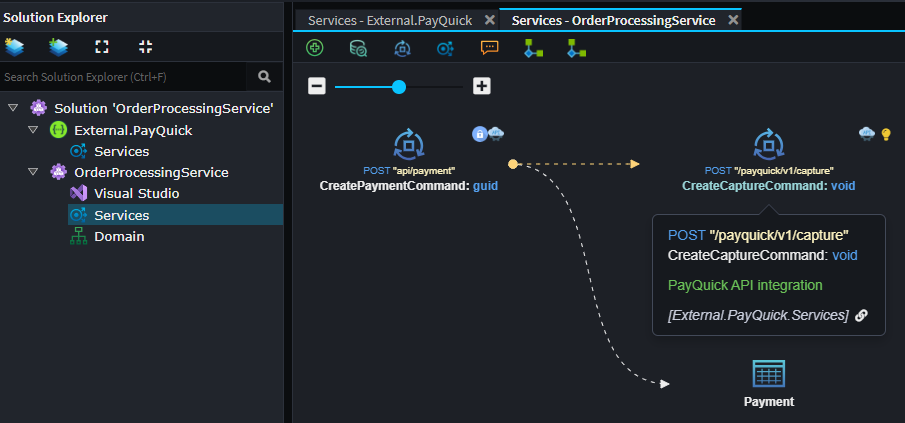

# What's new in Intent Architect (October 2025)

Welcome to the October edition of What’s New in Intent Architect. 

- Highlights
  - **[Software Factory performance enhancements](#software-factory-performance-enhancements)** – Software Factory processing time has been reduced by up to 80% after the first execution.
  - **[CSharp Importer Module](#csharp-importer-module)** – Reverse-engineer models directly from existing codebases.
  - **[External API Template](#external-api-template)** - A new app template is now available which makes importing an external service’s OpenAPI document quick and straightforward.
  - **[AWS Lambda Functions Architecture Template](#aws-lambda-functions-architecture-template)** – Model operations in the Services designer and generate idiomatic .NET AWS Lambda functions with out-of-the-box tooling for local run and deployment.
  - **[Scalar Module](#scalar-module)** – Scalar is a modern API documentation and testing tool for .NET that provides interactive, OpenAPI-based UI experiences (similar to Swagger UI) for REST APIs.
  - **[Mongo Driver Module](#mongo-driver-module)** – The MongoDB module now uses the official MongoDB Driver instead of MongoFramework for closer alignment with MongoDB’s native technology.
  - **[Service Proxy URLs auto-populated](#service-proxy-url-population)** - When creating a proxy service to an external API or another Intent Architect application, the client app now **auto-fills the base URL** from the source.
  - **[Configurable ambient persistence behaviours](#configurable-ambient-persistence-behaviours)** – More customization around Unit or Work and ambient transactions.
  - **[Designers visualize unsaved changes](#designers-visualize-unsaved-changes)** – Designers now indicate which elements have unsaved modifications (“dirty” states).

## Update details

### Software Factory performance enhancements

🔥 The Software Factory now supports hot restarting, reducing processing time by up to 80% after the first execution.

When the Software Factory hot restarts, it no longer tears down the process—this avoids reloading DLLs and allows the CLR’s runtime optimizations to persist between executions.

If you aren’t already doing so, simply minimize the Software Factory to keep it alive between runs. Subsequent executions will display the message “Hot Restarting Execution 🔥” at the start of the execution log.


You may also notice further performance gains as the .NET JIT compiler applies additional optimizations across runs.

Minimum required versions for the hot restart experience:

- `Intent.Common` version `3.9.1`
- `Intent.Common.CSharp` version `3.9.7-pre.0`

Available from:

- Intent Architect 4.5.18

### CSharp Importer Module

The new C# Importer Module makes it easier to integrate existing codebases by reverse-engineering model metadata directly from your C# source code.

This is part of our broader initiative to make Intent Architect more seamless when working with existing projects.

This module can be used in the `Services` and `Domain` designers, to import the follow model types:

- Service
- Command
- Query
- DTO
- Entity
- Domain Contracts
- Domain Events
- Enum


Available from:

- Intent.CSharp.Importer 1.0.0
- Intent Architect 4.5.18

### External API Template

Integrating with external REST APIs is now easier than ever. The new **External API Template** simplifies the process by importing swagger documents to create modeled services which you can simply drag  onto your designers and model their interactions directly.



The new **External API Template** streamlines bringing external APIs into your app. Provide an OpenAPI document and the template will model its endpoints so you can configure and call those APIs directly from your application.


When you create an application with this template, all modules required for OpenAPI import are installed and pre-configured — no manual setup needed.


Available from:

- Intent Architect 4.5.0

### AWS Lambda Functions Architecture Template


The new `Intent.Aws.Lambda.Functions` architecture template enables modeling-first development of serverless APIs on AWS Lambda.

Key features include:

- Uses `Amazon.Lambda.Annotations` to handle AWS configuration concerns directly in code.
- Standard .NET configuration via appsettings.json and environment variables.
- Out-of-the-box support for standard testing and deployment tools like the Mock Lambda Test Tool and SAM CLI.

```csharp
[LambdaFunction]
[HttpApi(LambdaHttpMethod.Post, "/api/orders")]
public async Task<IHttpResult> CreateOrderAsync([FromBody] CreateOrderCommand command)
{
    // AWSLambda0107: can parameter of type System.Threading.CancellationToken passing is not supported.
    var cancellationToken = CancellationToken.None;
    return await ExceptionHandlerHelper.ExecuteAsync(async () =>
    {
        var result = await _mediator.Send(command, cancellationToken);
        return HttpResults.Created($"/api/orders/{Uri.EscapeDataString(result.ToString())}", new JsonResponse<Guid>(result));
    });
}
```

For more information, see the [documentation](https://docs.intentarchitect.com/articles/modules-dotnet/intent-aws-lambda-functions/intent-aws-lambda-functions.html).

Available from:

- Intent Architect 4.5.*

### Scalar Module

Scalar is a modern API documentation and testing tool for .NET that provides interactive, OpenAPI-based UI experiences (similar to Swagger UI) for REST APIs.


Refer to the [Scalar module documentation](https://docs.intentarchitect.com/articles/modules-dotnet/intent-aspnetcore-scalar/intent-aspnetcore-scalar.html) for more information.

Available from:

- Intent.AspNetCore.Scalar 1.0.1 (projects must be .net9)

### Mongo Driver Module

The MongoDB module has been upgraded to use the official MongoDB.Driver instead of MongoFramework, providing closer alignment with MongoDB’s native technology and improved performance.

This upgrade is designed to be automatic for clients currently using MongoFramework, ensuring a seamless transition to the new driver with minimal configuration changes.

Available from:

- Intent.MongoDB 2.0.2

### Service Proxy URL Population

A client application now pre-populates the default service URL when you add a proxy service. This works in two scenarios:

#### External API

When importing an OpenAPI document with the [Intent.OpenApi.Importer](https://docs.intentarchitect.com/articles/modules-importers/intent-openapi-importer/intent-openapi-importer.html) module, any server URL found in the spec is saved on the **Service Package** as the *Service URL*. That value is then used automatically as the default URL when you create a proxy to that external service.

Available from:

- Intent.OpenApi.Importer 1.1.8


#### Intent Architect Application

The **Api** projects `Base URL` is now stored in the Visual Studio Designer. When you create a proxy service to that application, this Base URL is used as the default service URL in the client.


Available from:

- Intent.Blazor.HttpClients 4.0.17
- Intent.Integration.HttpClients 6.0.7
- Intent.VisualStudio.Projects 3.9.2

### Designers visualize unsaved changes

Designers will now indicate which elements are dirty (i.e. have changes that have not yet been saved) in the tree-view.


Available from:

- Intent Architect 4.5.18

### Configurable ambient persistence behaviours

Until now, our service dispatching patterns have automatically configured:

- Ambient transactions for write operations (e.g. within a Business Transaction Boundary)
- An implicit Unit of Work save at the end of service execution

While these defaults are ideal for most line-of-business applications, they may not suit every scenario.
You can now opt out of these behaviours through configuration, giving you finer control over persistence and transaction management.


Available from:

- Intent.Application.MediatR.Behaviours 4.5.3
- Intent.AspNetCore.Controllers.Dispatch.ServiceContract 5.2.18

