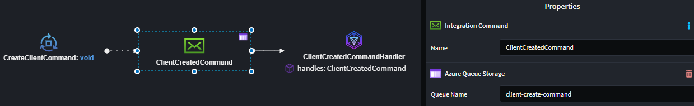
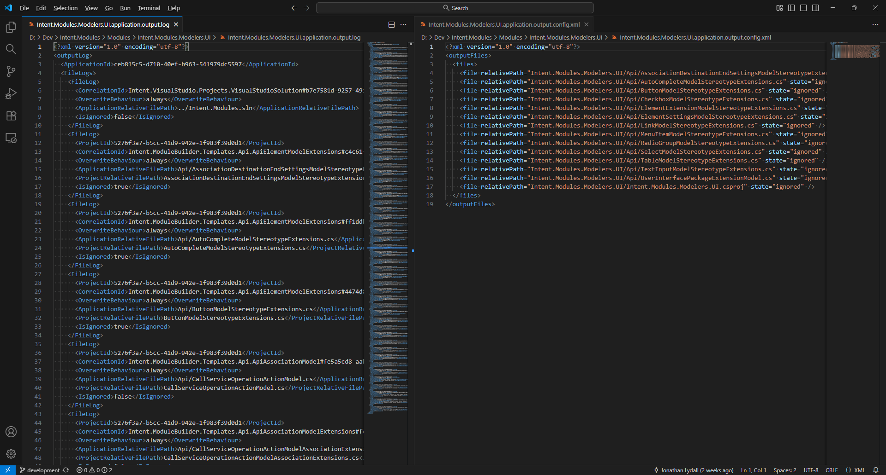
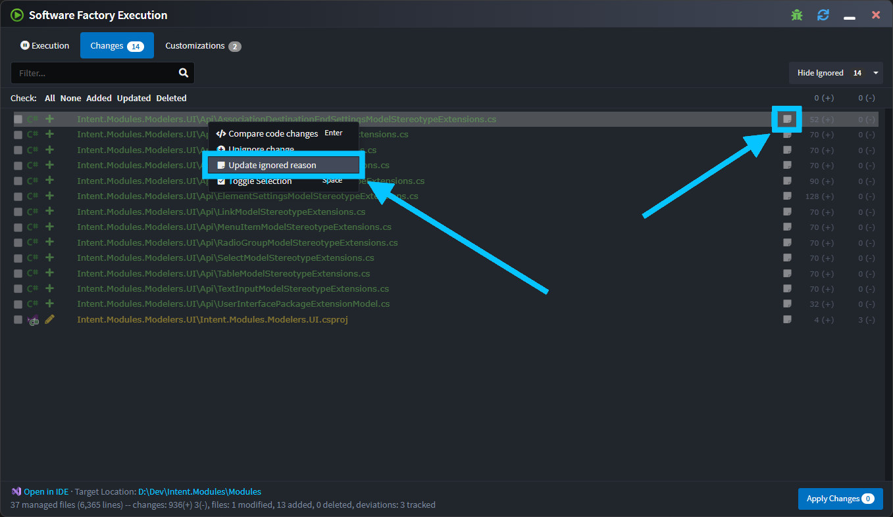

# What's new in Intent Architect (November 2025)

Welcome to the November edition of What’s New in Intent Architect.

- Highlights
  - **[Mapperly Module](#mapperly-module)** – Mapperly is a .NET source generator that automatically creates efficient object mappings between different data models at compile time.
  - **[AWS Secrets Management Module](#aws-secrets-management-module)** – Extend .NET Configuration to automatically resolve secrets from AWS Secrets Manager at runtime.
  - **[Azure Storage Queue Module](#azure-storage-queue-module)** –  Add streamlined Azure Queue Storage messaging to ASP.NET Core and Azure Functions, including dispatching, consumption, and envelope-based message handling.
  - **[Open in IDE enhancements](#open-in-ide-enhancements)** – Several enhancements tightening up the IDE integration and improved quality oif life.
  - **[AI modules multi-provider support](#ai-modules-multi-provider-support)** – Configure multiple AI providers, pick them per workflow, and dial in the thinking level that best fits each model.
  - **[JSON Importer enhancements](#json-importer-enhancements)** – A guided experience for turning JSON files into rich Domain, Services, or Eventing models in just a few clicks.
  - **[Model Integration Messages directly with AWS SQS](#model-integration-messages-directly-with-aws-sqs)** – Direct implementation to use AWS SQS as the message broker of choice to send and receive Integration Events and Commands for your application.
  - **[Git friendly alternative to `.application.output.log` files](#git-friendly-alternative-to-applicationoutputlog-files)** - A new Git friendly .xml file is now used to track which largely (if not completely) eliminates merge conflicts which would occur on `.application.output.log` files.
  - **[Add a reason for a file being ignored](#add-a-reason-for-a-file-being-ignored)** - A text box for documenting the reason for file being ignored in the Software Factory.

## Update details

### Mapperly Module

To Do

### AWS Secrets Management Module

The `Intent.Aws.SecretsManager` module extends the standard .NET Configuration system by integrating directly with **AWS Secrets Manager**. This enables your application to securely retrieve secrets (such as connection strings, API keys, and credentials) at runtime with minimal code changes.

Once configured, secrets are accessible through the familiar `IConfiguration` interface, just like any other configuration value in ASP.NET Core.

Available from:

- Intent.Aws.SecretsManager 1.0.0-beta.2

### Azure Storage Queue Module

The `Intent.Eventing.AzureQueueStorage` module provides all necessary files, configuration, and abstractions for working with Azure Queue Storage messaging. It supports both publishing and consuming messages in a structured, opinionated way.

Whether you're building an ASP.NET Core web application or an Azure Function, this module simplifies queue integration by setting up message dispatching, consumption patterns, and dependency injection automatically.



To learn more about the Azure Queue Storage module, read the [documentation here](https://docs.intentarchitect.com/articles/modules-dotnet/intent-eventing-azurequeuestorage/intent-eventing-azurequeuestorage.html).

Available from:

- Intent.Eventing.AzureQueueStorage 1.0.0-beta.1

### Open in IDE enhancements

To Do

### AI modules multi-provider support

Intent Architect’s AI tooling now understands that one size does not fit all. You can register several AI providers side-by-side and switch between them whenever you invoke Auto Implementation, Blazor page generation, or AI-powered unit tests.

#### Configure multiple providers once

- Head to **User Settings → AI Settings** and add as many provider/model combinations as you need (OpenAI, Azure OpenAI, Anthropic, OpenRouter, Google Gemini, OpenAI-compatible services, or Ollama).
- Each selection keeps its own API keys, endpoints, and token limits so you can swap without re-entering credentials.

#### Choose the right model per workflow

- When you run **Implement with AI**, **Generate Blazor UI with AI**, or **Generate Unit Tests with AI**, Intent now surfaces a provider dropdown so you can select the exact model for that run.
- The last-used choice is remembered per module, making it easy to rely on a fast local model for drafts and a premium model for production-ready outputs.

#### Tune the thinking effort

- Every provider-aware dialog exposes a **Thinking Level** control that maps to the underlying model’s reasoning or thinking configuration.
- You can nudge the control higher for deeper reasoning or lower to prioritize speed, and Intent automatically translates that preference into the right provider-specific settings.

Available from:

- Intent.AI.AutoImplementation 1.0.0-beta.15
- Intent.AI.Blazor 1.0.0-beta.17
- Intent.AI.UnitTests 1.0.0-beta.13
- Intent Architect 4.5.18

### Model Integration Messages directly with AWS SQS

Direct implementation to use AWS SQS as the message broker of choice to send and receive Integration Events and Commands for your application.


Model your Integration Events (orange Message envelope) and Commands (green Message envelope) in the Services designer, and they automatically configure to work with SQS queues. Customize queue names using the `AWS SQS` stereotype when needed.

To learn more, read the [module documentation](https://docs.intentarchitect.com/articles/modules-dotnet/intent-aws-sqs/intent-aws-sqs.html).

Available from:

- Intent.Aws.Sqs 1.0.0

### JSON Importer enhancements

The new JSON Importer Module makes it easier to integrate existing codebases by reverse-engineering model metadata directly from your JSON files representing payload structures.

#### Guided import wizard

- Set the `Source Folder` and optional `File Pattern` (defaults to `**/*.json`) so the importer scopes exactly the files you need.
- Review a tree of discovered files and include or exclude specific items with a single click, ensuring clean inputs before generating metadata.

#### Profiles that match your design surface

- **DomainDocumentDB**: Converts each JSON file into a Domain Entity, automatically splitting nested objects into their own entities and wiring up composite relationships.
- **EventingMessages**: Produces Eventing Messages and supporting DTOs ready for your Services designer.
- **ServicesDtos**: Builds DTOs (with `Dto` naming conventions) and references that align with service-facing contracts.

#### Smarter type inference

The importer recognizes sentinel values such as `"guid"` and `"datetime"`, infers decimals, booleans, and arrays, and defaults unknown values to objects—making the generated models immediately usable.

```json
{
  "id": "guid",
  "firstName": "John",
  "orders": [
    {
      "orderId": "guid",
      "total": 99.99
    }
  ]
}
```

To learn more you can visit the [documentation](https://docs.intentarchitect.com/articles/modules-importers/intent-json-importer/intent-json-importer.html).

Available from:

- Intent.Json.Importer 1.0.0

### Git friendly alternative to `.application.output.log` files

The now obsolete `.application.output.log` file (which is used by the Software Factory to track which files should not be generated on subsequent runs) is quite verbose and highly prone to merge conflicts, but also couldn't be ignored in Git by teams using the [](xref:tools.software-factory-cli) on a CI server.

To greatly improve this experience, Software Factory runs will now update a much more concise `.application.output.config.xml`, where a primary consideration in the formatting of the data stored in it is that (compared to the the obsolete `.application.output.log`), it is highly unlikely to cause merge conflicts and any that do occur should be trivial to resolve.

For compatibility with older versions of Intent Architect, if a `.application.output.log` is found it will still be updated, but it will not be created at all for new applications. If your entire team has updated to at least version 4.5.22 of Intent Architect, then `.application.output.log` files for applications created with older versions of Intent can be safely deleted.

A comparison of the older (obsolete) file format on the left, and the newer (Git friendly) format on the right:



The [](xref:application-development.applications-and-solutions.git-and-scm-guidance#files-and-folders-to-always-include) article has also been updated accordingly in regards to both of the above files.

Available from:

- Intent Architect 4.5.22

### Add a reason for a file being ignored

Ever found yourself wondering why a file was ignored in the Software Factory? This is why we've now made it possible to capture the reason for ignoring a file, either by using the option on the ignored file's context menu, or by clicking the note icon on the right:



Available from:

- Intent Architect 4.5.22
