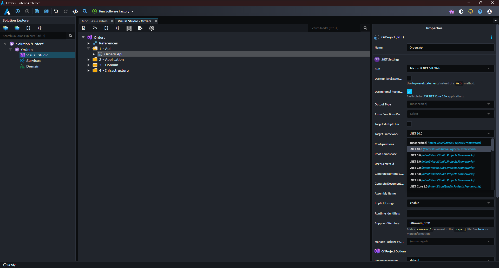
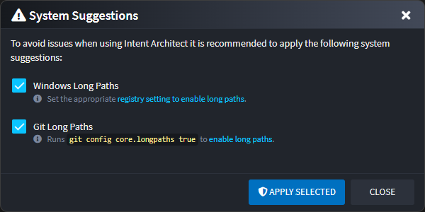
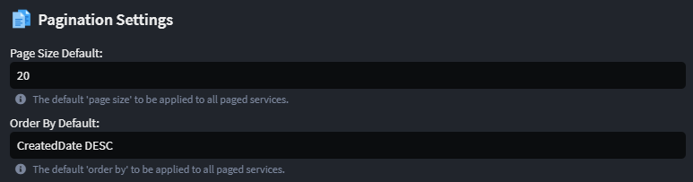
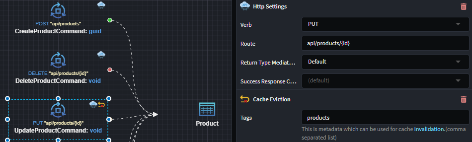

# What's new in Intent Architect (December 2025)

Welcome to the December edition of What’s New in Intent Architect.

- Highlights

- More updates
  - **[2 New Fundamentals training videos](#2-new-fundamentals-training-videos)** – More videos covering the core concepts of Intent Architect.
  - **[.NET 10 support](#net-10-support)** – Full support for targeting .NET 10.
  - **[System Suggestions](#net-10-support)** – Intent Architect will now show a dialog on startup if there are any strongly recommended System Suggestions to be applied.
  - **[Paged endpoint defaults](#paging-defaults)** - Support added for application-wide default paging values for all paged endpoints.
  - **[Cache eviction modelling](#cache-eviction)** - Endpoints can now be configured to explicitly evict cached data when they are invoked.

## Update details

### 2 New Fundamentals training videos

We have added 2 new videos for round off the **Fundamentals Training Series**, these new videos cover

- [#9 Managing and Updating Architectures](xref:tutorials.fundamentals-9-managing-and-updating-architectures) – Learn how to manage and update application architecture, modules, and releases effectively during active development.
- [#10 Essential Tips and Tricks](xref:tutorials.fundamentals-10-essential-tips-and-tricks) – Learn how to navigate Intent Architect effectively, using shortcuts for navigating between tabs, "Search Anywhere" functionality, and much more.

You can access all videos directly from the [Fundamentals Training Series Playlist](https://intentarchitect.com/#/redirect/?category=docs-embedded&subCategory=fundamentals-series-playlist) or via the [Fundamentals Tutorials landing page](https://docs.intentarchitect.com/articles/tutorials/fundamentals/fundamentals-landing-page.html).

### .NET 10 support

Full .NET 10 support has been applied in the relevant areas of Intent Architect.

The Visual Studio Designer allows selecting .NET 10.0 as a Target Framework on projects:

> [!TIP]
>
> To upgrade existing applications to .NET 10.0, simply select all projects in the Visual Studio Designer, change the Target Framework to .NET 10.0 and run the Software Factory to apply the changes.

All .NET Architecture Templates now have .NET 10.0 as an available option for Target Framework under Basic Setting:

Finally, all .NET modules have been updated to install .NET 10 NuGet packages when available.

Available from:

- All applicable modules and architecture templates as of 2 December 2025.

### System Suggestions

Intent Architect will now show a dialog on startup if there are any strongly recommended System Suggestions to be applied:

This feature comes as part of our ongoing effort to make Intent Architect more accessible for first time users and aims to address two common troubleshooting issues by suggesting the following:

1. **Enabling "Windows Long Paths"** – By default, Windows still uses an "antiquated" path-length limit that doesn’t align well with modern development practices. When this setting is off, long or nested project structures can trigger avoidable build or file-operation issues.

2. **Enabling "Git Long Paths"** – Due to the historic Windows path-length limitation, Git on Windows also enforces its own legacy path-length restriction, which can interfere with cloning or checking out repositories containing deeper folder structures. If disabled, it can surface confusing errors tied solely to file length.

If this dialog is dismissed it can be shown again by pressing the yellow warning triangle (⚠️) at the top right corner of the window.

Available from:

- Intent Architect 4.5.26

### Paging Defaults

An application-level setting is now available to configure **Paging Default Values** that are automatically applied to all paged endpoints in your application.

These defaults allow you to centrally control how paging behaves without changing individual endpoints. You can:

- Set the default page size returned by all paged endpoints
- Set the default data ordering to ensure consistent paging behavior across the application.

These values can still be overridden on specific endpoints where needed, but if nothing is specified, the global defaults are used.

> [!NOTE]  
> Default paging values are automatically configured only for new applications.  
> For existing applications that upgrade the module, these values are not set automatically and must be configured explicitly in the Application Settings screen.

Available from:

- Intent.Application.Dtos.Pagination 4.1.4-pre.0

### Cache Eviction

Endpoints can now be modelled to **evict cached data by tag** whenever they are invoked. This allows you to keep your cache in sync when (specifically) write operations, such as create, update or delete, are performed.

Available from:

- Intent.AspNetCore.OutputCaching.Redis 1.1.13-pre.1
