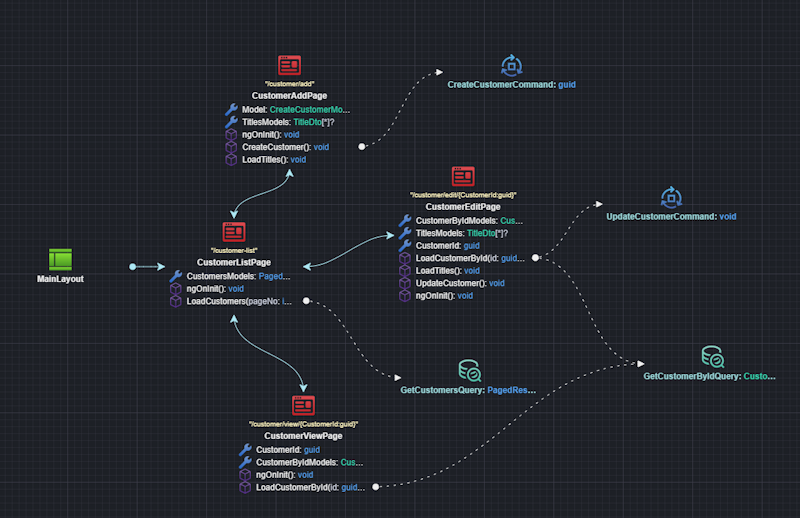
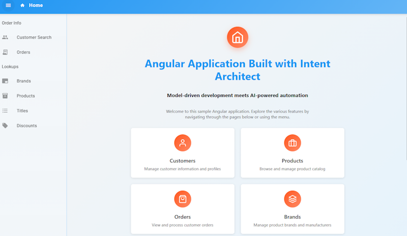

# What's new in Intent Architect (February 2026)

Welcome to the February edition of What’s New in Intent Architect.

In case you missed it, we recently shared that the team has been hard at work on our next front-end automation: Angular - a long-term milestone we’ve been looking forward to. The first release includes application setup, UI modeling, and AI-generated views.

- Highlights
  - **[Angular UI Automation](#angular-ui-automation)** – Model your UI and routing, then have Intent Architect’s deterministic code generation, combined with AI, to create the Angular app end to end.

- More updates

## Update details

### Angular UI Automation

A new **Angular Web Application** template is now available (currently in Beta) when starting a new application. It lets you use Intent Architect to quickly start up polished Angular UIs by pairing our deterministic, pattern-based TypeScript code generation with AI/LLM-assisted generation for views and styling.

  
*Modeling of sample customer CRUD pages*

  
*Generated Angular application*

An Angular sample application is also available from the **Create New Solution -> Explore Samples** screen in Intent Architect.

Documentation on [Angular UI Modeling with AI](xref:angular.ui-modeling) is available on the [docs website](https://docs.intentarchitect.com/).
