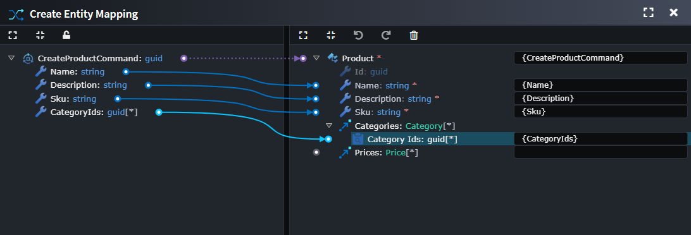

# What's new in Intent Architect (February 2026)

Welcome to the February edition of What’s New in Intent Architect.

Lot's of clients have been asking for it - in case you missed it, we recently shared that the team has been hard at work on our next front-end automation: Angular - a long-term milestone we’ve been looking forward to. The first release includes application setup, UI modeling, and AI-generated views.

- Highlights
  - **[Angular UI Automation](#angular-ui-automation)** – Model your pages, routing and service interaction, then have Intent Architect’s deterministic code generation, combined with AI, to create the Angular app end to end.

- More updates
  - **[Aggregate Association Mapping via IDs](#aggregate-association-mapping-via-ids)** – Easily link Entities to related Aggregate Root Entities in Create and Update actions using just their IDs.

## Update details

### Angular UI Automation

A new **Angular Web Application** template is now available (currently in Beta) when creating a new application. Define your components, along with their interactions, navigation, and models, and have Intent Architect generate deterministic typescript code. You can then leverage Intent Architect’s AI context engineering interactions to produce professional, out-of-the-box UI and styling in a repeatable (though non-deterministic) way, which you can refine to suit your needs.

These AI interactions build their prompts using customizable templates, so you can tweak or extend them as your requirements evolve.

  
*Modeling of sample customer CRUD pages*

  
*Generated Angular application*

An Angular sample application is also available from the **Create New Solution -> Explore Samples** screen in Intent Architect.

Documentation on [Angular UI Modeling with AI](xref:angular.ui-modeling) is available on the [docs website](https://docs.intentarchitect.com/).

### Aggregate Association Mapping via IDs

You can now define relationships to aggregate roots using their identifiers in **Create** and **Update** actions, rather than requiring full aggregate instances to be supplied by the caller.

Instead of mapping an entity’s aggregate associations directly, commands expose **Aggregate Association Ends** (for example, `CategoryIds`) that represent references to existing aggregate roots. During command handling, these identifiers are automatically resolved into aggregate instances through the appropriate repositories and assigned to the target entity before persistence.

Available from:

- Intent.Application.DomainInteractions 1.1.10