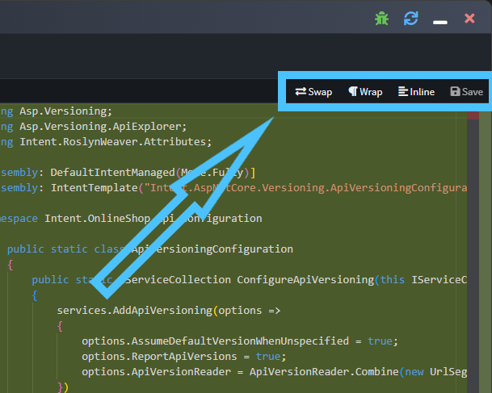
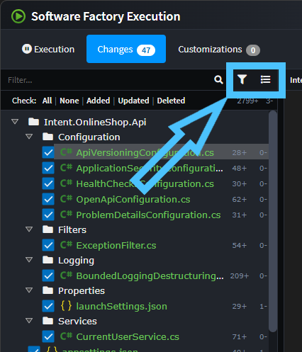
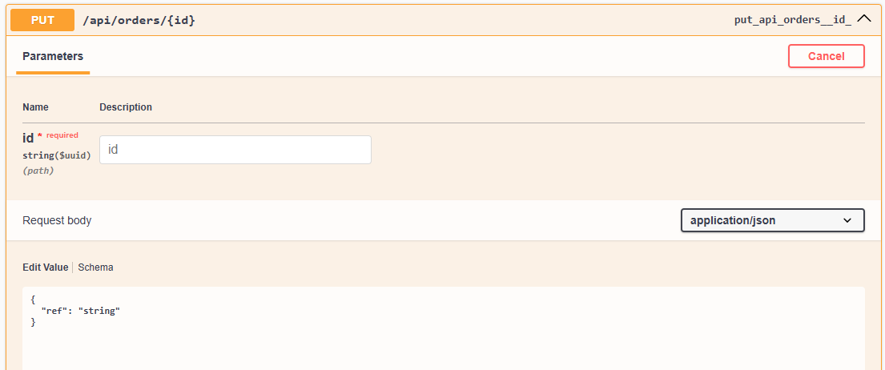
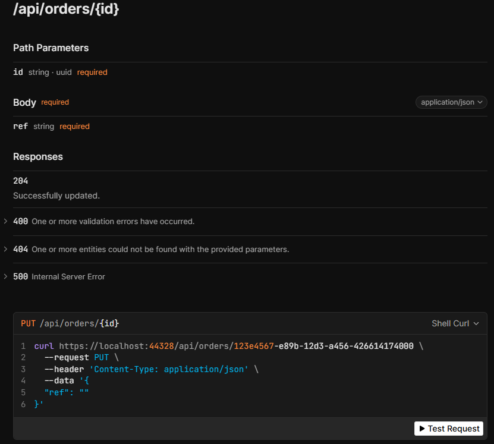
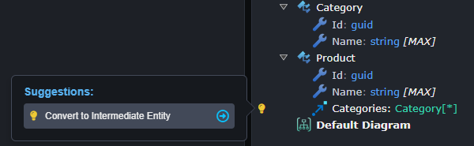
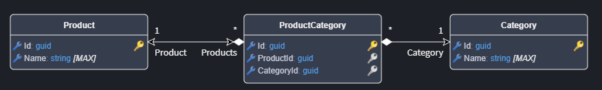
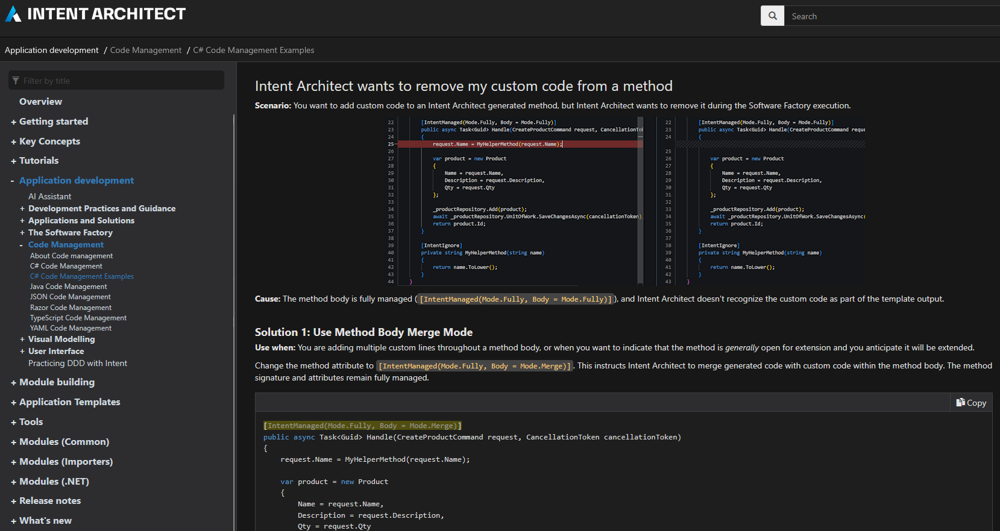

# What's new in Intent Architect (March 2026)

Welcome to the March edition of What’s New in Intent Architect.

- Highlights
  - **[Software Factory dialogue integrated diff tool and other improvements](#software-factory-dialogue-integrated-diff-tool-and-other-improvements)** - The Software Factory dialogue now has an integrated diff tool (no more needing to launch an external diff tool) as well as other layout improvements.
  - **[Mapperly-based DTO mapping generator](#mapperly-based-dto-mapping-generator)** - Type-safe, compile-time DTO mapping with zero reflection overhead.
  - **[Automatic route parameter filtering in API documentation](#automatic-route-parameter-filtering-in-api-documentation)** – Eliminates duplicate parameter documentation in API specs when properties are already defined as route parameters.
  - **[Convert many-to-many associations to intermediate entities](#convert-many-to-many-associations-to-intermediate-entities)** - Transform implicit join tables into explicitly modeled entities for advanced customization.
  - **[Improved Code Management Documentation](#improved-code-management-documentation)** – Practical real-world examples and guidance on choosing code management techniques.

## Update details

### Software Factory dialogue integrated diff tool and other improvements

The Software Factory Dialogue changes view has undergone extensive updates:


The most immediately noticeable change is the integrated diff view, simply selecting a file in the left pane will show the diff inside the Software Factory dialogue. Typical diff viewing options as well as the ability to save changes are available above the right side of the diff:



As part of the above changes, the list of files has been changed to be a tree view so as to require less screen real estate as well as making it more clear where files are being output to.

The toolbar buttons above the file list can be used to choose filtering options or toggle between "flat" and "tree" views of the change list:



### Mapperly-based DTO mapping generator


The new `Intent.Application.Dtos.Mapperly` module generates type-safe mapper classes and extension methods using [Mapperly](https://mapperly.riok.app), providing compile-time code generation instead of reflection-based mapping. Mappers automatically handle entity-to-DTO conversions with null-safety and nested DTO references, while remaining fully extensible via partial classes for custom mapping logic.

#### Example Generated Code

```csharp
[Mapper]
public partial class CustomerDtoMapper
{
    [UseMapper]
    private readonly AddressDtoMapper _addressDtoMapper;

    [MapProperty(nameof(Customer.Addresses), nameof(CustomerDto.Addresses))]
    public partial CustomerDto CustomerToCustomerDto(Customer customer);

    public partial List<CustomerDto> CustomerToCustomerDtoList(List<Customer> customers);
}

// Extension method usage
var customerDto = customer.MapToCustomerDto();
var customerDtos = customers.MapToCustomerDtoList();
```

Available from:

- Intent.Application.Dtos.Mapperly 1.0.3

### Automatic route parameter filtering in API documentation




When documenting REST endpoints, you often reference the same parameter as both a route parameter (`/api/users/{id}`) and in the request body schema, causing confusing duplication. Both `Intent.AspNetCore.Swashbuckle` and `Intent.AspNetCore.Scalar` now automatically remove properties from request body schemas when they match route parameter names, ensuring clean API documentation.

The implementation handles inline and referenced schemas, matches names case-insensitively, and removes properties from the `required` list automatically.

Available from:

- Intent.AspNetCore.Swashbuckle 5.2.3
- Intent.AspNetCore.Scalar 1.0.7

### Convert many-to-many associations to intermediate entities






When modeling many-to-many relationships, a new `Convert to Intermediate Entity` suggestion (available in the Domain Designer) allows you to convert implicit join tables into explicitly modeled entities. Hover over any many-to-many association and select the suggestion to create an intermediate entity with two many-to-one associations, giving you full control over the join table structure for adding properties, indexes, or constraints.

Available from:

- Intent.Metadata.RDBMS 3.7.12

### Improved Code Management Documentation

In our ongoing effort to improve our documentation, a new article has been added with **practical real-world** examples of code management, including guidance on when and how to use each technique.


*Updated Code Management documentation*

See the full article: [Practical Code Management Examples](xref:application-development.code-weaving-and-generation.practical-code-management-examples)
