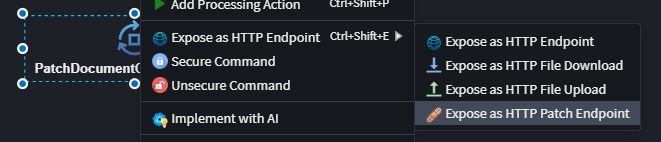
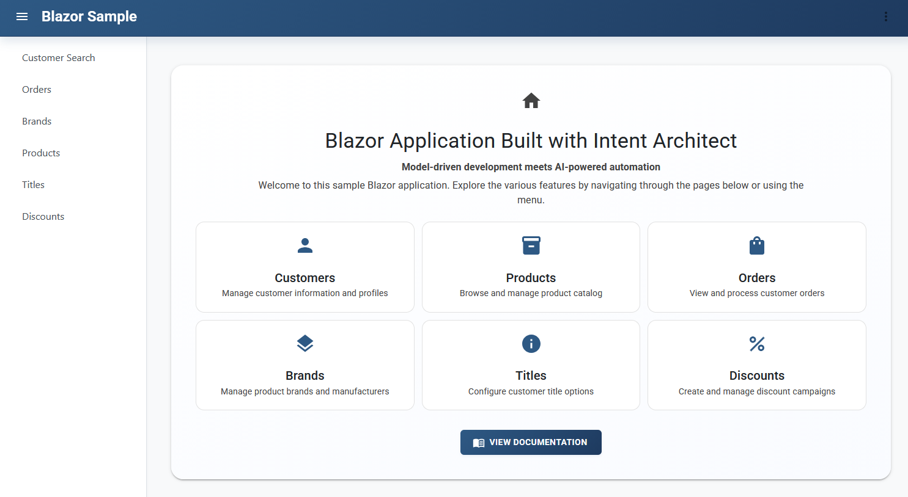
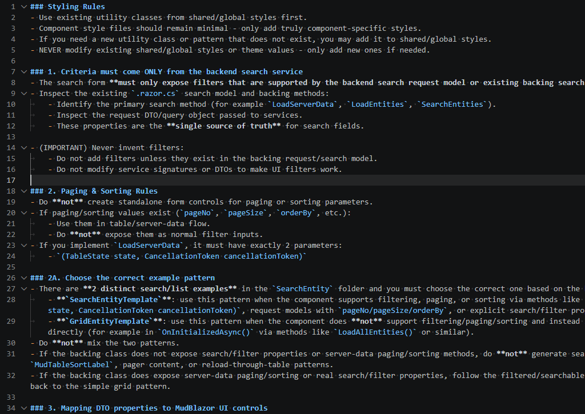
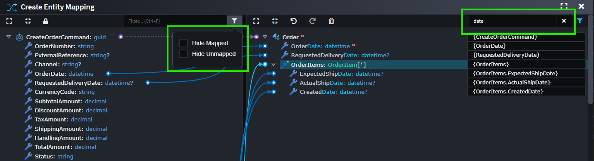
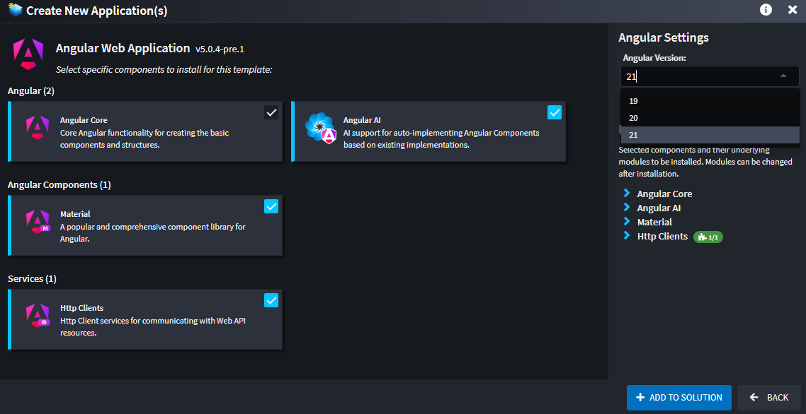
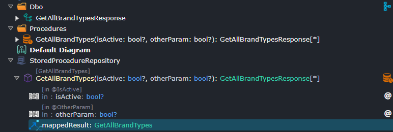
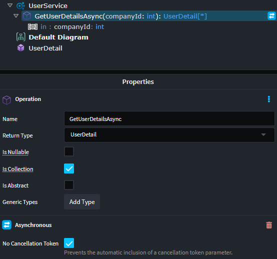

# What's new in Intent Architect (April 2026)

Welcome to the April edition of What's New in Intent Architect.

- Highlights
  - **[Centralized Domain-Driven Validation](#centralized-domain-driven-validation)** - Define validation rules once on your domain and have them automatically applied wherever they're needed.
  - **[JSON Patch Support for REST Services](#json-patch-support-for-rest-services)** - Build update endpoints that accept targeted changes to a record, while leaving everything else exactly as-is.
  - **[New Blazor AI Sample Application](#new-blazor-ai-sample-application)** - Get inspiration from a complete, ready-to-run Blazor application created almost entirely by Intent Architect's AI capabilities.
  - **[Smarter Blazor Page Generation](#smarter-blazor-page-generation)** - AI-generated Blazor pages are now more consistent and accurate, with improvements rolling out on a continuous basis.
  - **[Improved Advanced Mapping Experience](#improved-advanced-mapping-experience)** - Finding and managing mappings is now faster and more intuitive, with new filtering options and improved performance.
  - **[Angular Version Selection](#angular-version-selection)** - Kick off new Angular projects with the exact version you need - fully configured and ready to go.
  - **[More Accurate Importers](#more-accurate-importers)** - Get cleaner, more faithful models when importing from your database or existing code - with less rework.
  - **[Client Performance and Stability improvements](#client-performance-and-stability-improvements)** - A range of usability improvements make working in Intent Architect smoother and more dependable.

## Update details

### Centralized Domain-Driven Validation

The new Domain Constraints module lets you model validation rules directly on domain entity attributes, centralizing validation intent in your domain model. This allows you to specify these validations once, and have them applied in multiple places, for example, on all of your inbound DTOs.

Constraints such as `Required`, `Text Limits`, `Numeric Limits`, `Collection Limits`, `Regular Expression`, `Email`, `Url`, and `Base64` can be applied from the `Add Domain Constraint` menu and consumed by downstream modules.

When used with compatible FluentValidation modules, these constraints can be translated into generated validation rules, reducing duplicated validation setup and manual rework.

Visit the [documentation](https://docs.intentarchitect.com/articles/modules-common/intent-metadata-domain-constraints/intent-metadata-domain-constraints.html) to learn more.

Available from:

- Intent.Metadata.Domain.Constraints 1.0.1

Needs one of the following to be installed/updated:

- Intent.Application.FluentValidation.Dtos 3.12.7
- Intent.Application.MediatR.FluentValidation 4.10.0

### JSON Patch Support for REST Services

Partial updates shouldn't require sending an entire object - and your API should always know the difference between a field that was cleared and one that wasn't touched. The new JSON Patch module lets you build exactly that, with no extra plumbing required.

The module integrates seamlessly with generated Controllers, Commands, DTOs, and handlers while maintaining clean architecture boundaries. Properties can be patched individually without leaking HTTP transport concerns into your domain logic.

You can expose any existing Command or Service Operation as a PATCH endpoint directly from the designer using the **Expose as HTTP Patch Endpoint** action. If already exposed as an HTTP endpoint, use **Convert to PATCH** to switch it to patch semantics.

Visit the [documentation](https://docs.intentarchitect.com/articles/modules-dotnet/intent-aspnetcore-controllers-jsonpatch/intent-aspnetcore-controllers-jsonpatch.html) to learn more.

Available from:

- Intent.AspNetCore.Controllers.JsonPatch 1.0.0

### New Blazor AI Sample Application

Our new Blazor Server sample application, built almost entirely using Intent Architect's AI capabilities, gives you a ready to use, hands-on look at the quality and consistency you can expect from AI-assisted Blazor development today.

Available from:

- Intent.Blazor.Server.Sample 1.0.1

### Smarter Blazor Page Generation

AI-generated Blazor pages are now more accurate and consistent, thanks to a new Markdown-based rule system that makes the underlying instructions easier to read, maintain, and customize. All rules and templates are fully customizable to suit your requirements and styling preferences.

We are continuously updating and expanding the AI capabilities in this module, ensuring it keeps pace with evolving best practices and delivers increasingly consistent, high-quality results over time.

**Key enhancements:**

- **Readable Markdown-based rules** - Template and general rules are now defined in clear, maintainable Markdown format, reducing complexity and enabling easier customization.
- **Improved AI consistency** - The new rule structure ensures more accurate and consistent AI results when generating Blazor pages.

An example of the Markdown rules:

Available from:

- Intent.AI.Blazor 1.0.0-pre.0

### Improved Advanced Mapping Experience

The `Advanced Mapping Screen` has been enhanced to streamline managing mappings, especially with large domain models, reducing navigation time and improving overall usability:

- **Filter by mapped/unmapped status** - Independently filter source and/or target side attributes by whether they are mapped or unmapped, helping you quickly focus on the mapped/unmapped items.
- **Filter by text** - Search and filter source and/or target attributes by text to rapidly locate specific attributes and their mappings.
- **Performance improvements** - Optimized rendering for large numbers of attributes and mappings, ensuring smooth operation with large models.

Available from:

- Intent Architect Client 4.6.2

### Angular Version Selection

When creating a new Angular application, you can now choose which Angular version to use and have the correct packages and configuration applied automatically.

Available from:

- Intent Angular Web Application Template 5.0.4-pre.1

### More Accurate Importers

The RDBMS and C# Importers have been enhanced to streamline the import process and maintain code fidelity, reducing manual rework and ensuring your imported models accurately reflect your source systems and services.

**RDBMS Importer:**

- **Stored Procedure Operation mapping** - Now you can import stored procedures with explicit operation and stored procedure element creation, along with automatic mapping between the two.
- **Intelligent association detection** - Enhanced duplicate prevention logic that better identifies existing associations between entities, reducing manual cleanup and ensuring cleaner imports.
- **Stability improvements** - Various bug fixes and optimizations to enhance overall importer reliability.

**C# Importer:**

- **Preserve async/sync method definitions** - When importing services, you can now maintain the exact async/sync contract of your original methods, including cancellation token handling. This ensures your Intent models faithfully represent your source code's behavioral contracts.
- **Stability improvements** - Various bug fixes and optimizations to enhance overall importer reliability.

Available from:

- Intent RDBMS Importer 1.0.13
- Intent C# Importer 1.0.7

### Client Performance and Stability improvements

In addition to the [Advanced Mapping Screen improvements](#improved-advanced-mapping-experience), several general enhancements have been made to the Intent Architect Client to improve responsiveness and stability:

**Key improvements:**

- **Context-menu performance for large selections** - Improved responsiveness when selecting multiple elements in large models.
- **Smoother diagram panning** - Improved panning performance, especially in diagrams with many elements.
- **More consistent Linux UI rendering** - Improved rendering stability when running the client on Linux.
- **Save All reliability** - Fixed an occasional issue where `Save All` during package processing could cause instability in generated code.
- **Software Factory Diff accuracy** - Fixed an intermittent issue where the right-hand side file did not display.
- **Advanced Mapping Screen lock pane layout** - Fixed an issue where using the lock feature could cut off the left-hand pane.

Available from:

- Intent Architect Client 4.6.2
