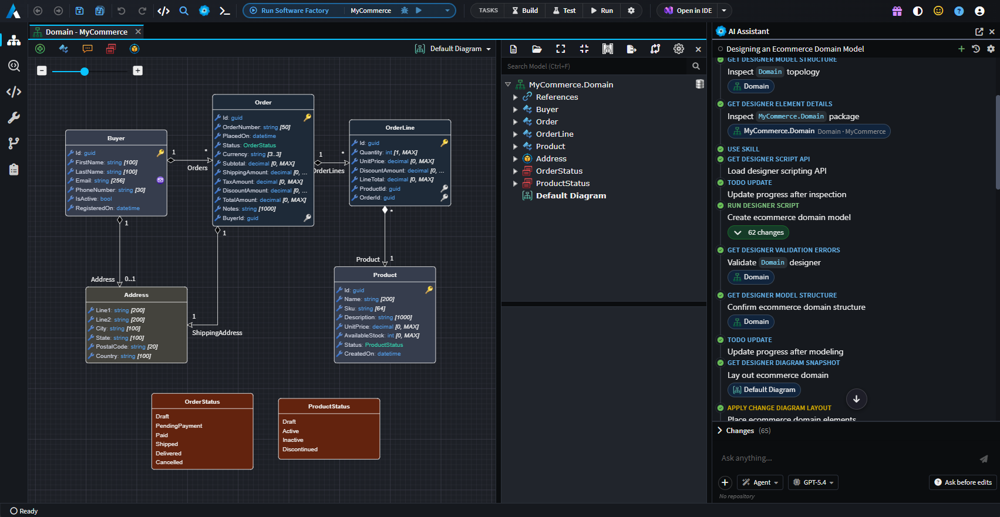
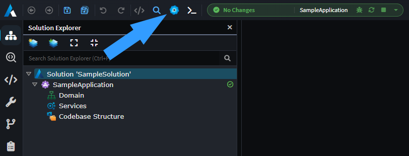
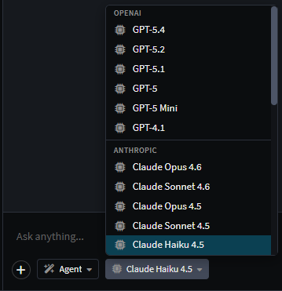
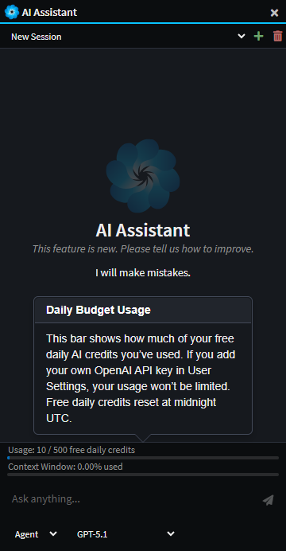

# AI Assistant

Intent Architect's integrated AI Assistant can be used to answer questions about the current workspace, explain how existing elements fit together, and propose design changes to meet new requirements. The assistant can also inspect models and diagrams to summarize structure, highlight dependencies, and identify gaps or inconsistencies.

_Example use of the AI assistant to create a simple e-commerce domain. The agent was able to design the domain from a simple natural language prompt._

## Overview Video

Our Version 5.2 release video has an example of using the AI Assistant, the below embedded video is set to start at the exact point where the AI Assistant is used to model a use case end to end.

> [!Video https://www.youtube.com/embed/bGofnbPQV8k?si=98znkTEDcWzad2n&amp;start=165]

## Opening the AI Assistant

If you've previously hidden the AI Assistant pane on the right, you can use the icon in the toolbar or the F8 shortcut key to bring it back:

## Modes

The Integrated IA Assistant has 3 different modes:

- **Ask** - For analyzing and answering questions with read-only access to the designers.
- **Agent** - For instructing the LLM to read and make simple modifications to the designers.
- **Plan** - For larger tasks, Plan mode offers the user a way to design a step-by-step implementation plan with the LLM and then to convert this into a structured execution plan.

## Multiple Provider Integration

The Integrated AI Assistant can be connected to the most popular AI providers (e.g. OpenAI, Azure OpenAI, Anthropic, Gemini, OpenRouter, Ollama, and more). This is configured in the **AI Configuration** dialog - open the AI chat window and click the settings icon to access the **AI Providers** tab.

For detailed setup instructions for each provider, see [AI Configuration → AI Providers](xref:ai.configuration#1-ai-providers).

_Example showing both OpenAI and Anthropic models available when both are configured._

## Daily Budget

By default, new users have access to 500 completely free daily credits through Intent Architect's built-in Intent Architect provider. This free limit resets daily at midnight UTC.

No API key is required to use these free credits. However, you can connect your own LLM provider (OpenAI, Anthropic, Azure OpenAI, etc.) in the **AI Configuration** dialog to remove the daily limit and use your own quota. For setup instructions, see [AI Configuration → AI Providers](xref:ai.configuration#1-ai-providers).

If you'd like to disable the free daily credits option, you can email this request to <support@intentarchitect.com>.

