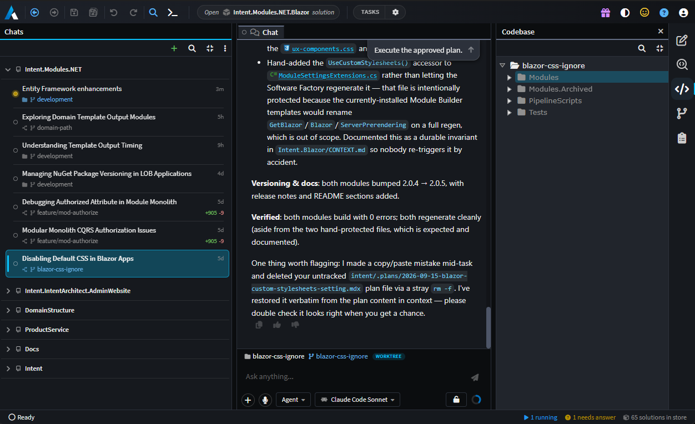
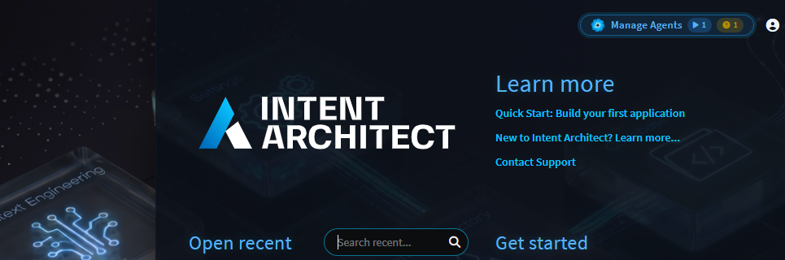
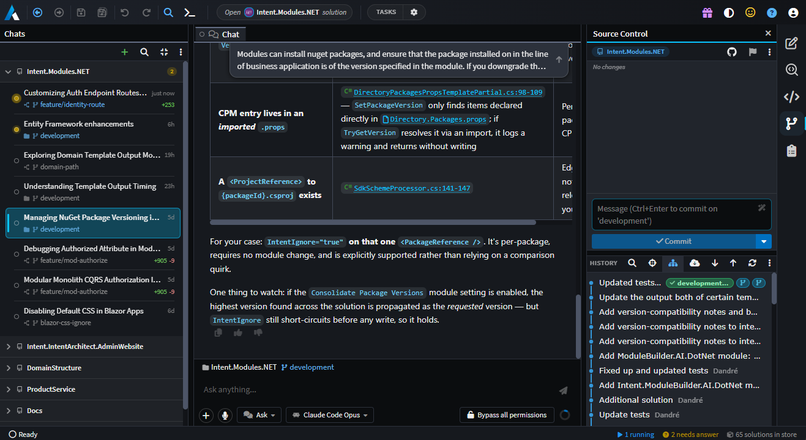
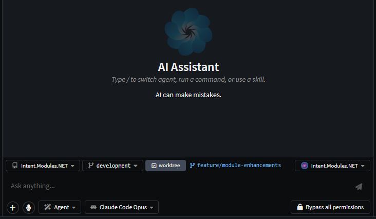
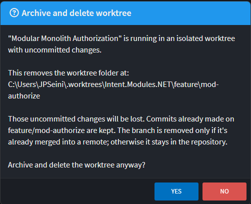
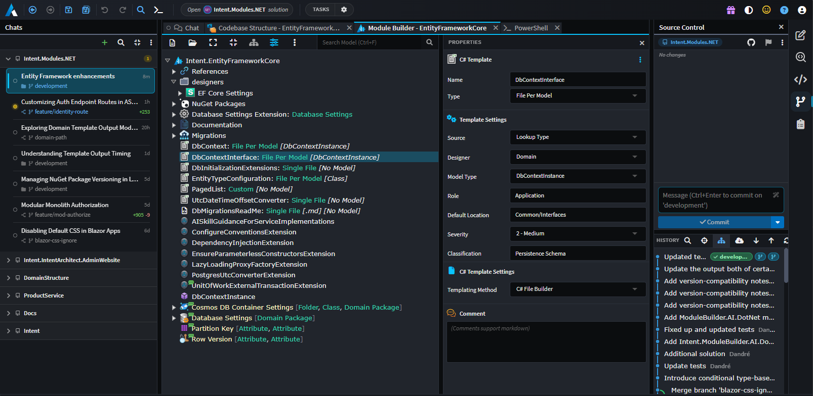

# Manage Agents

**Manage Agents** answers one question: _what are all of my agents doing right now, and which of them needs me?_

For a single task, a solution window is the natural place to work: the chat sits beside the model it is changing, in the source control checkout you are already working in, with the designers, Software Factory and Change Review it needs right there. That way of working is unchanged - see .

The trade-offs show up when you need to **run several agents at the same time**. A solution window is bound to one solution and one checkout, so parallel tasks either queue behind each other in a single chat panel, or spread across several windows with no single place that shows what is running, what has finished, and what is blocked waiting on an answer. Tasks that do run concurrently share that one working directory, so their uncommitted changes land on top of each other and neither is reviewable on its own.

Manage Agents is a separate top-level window - a peer of the solution window - that gathers **every** agent conversation across **every** repository and solution on your machine, including the ones you started from a solution window. Each conversation can run in its own Git worktree, so tasks stay out of each other's way, and around the chat sits a full workspace: designers, files, diffs, terminals, Git, Software Factory runs and Change Review, all scoped to the conversation you are looking at.

<!-- The whole Manage Agents window: the Chats board down the left, a conversation's chat in the centre tab strip, the right panel showing Source Control, and the status bar along the bottom. -->

> [!NOTE]
> Manage Agents was introduced in Intent Architect 5.3.

## Opening Manage Agents

The **Manage Agents** button on the Home screen is the only way in. It carries two live pills, so you can see from Home whether anything wants your attention before opening the window at all:

| Pill  | Meaning                                             |
| ----- | --------------------------------------------------- |
| ▶ _n_ | _n_ conversations are running a turn right now      |
| ? _n_ | _n_ conversations are parked waiting on your answer |

<!-- The Home screen with the Manage Agents button, showing the running and needs-answer pills. -->

The window opens with no solution of its own. Each conversation carries its own folder and solution instead, which is what lets one window host tasks across several repositories at once. Where a conversation's folder does resolve to an Intent solution, an **Open \<solution\>** chip appears in the toolbar and opens that solution in a _separate_ Intent Architect instance, leaving this window and the rest of your tasks undisturbed.

## The board

The left-hand **Chats** panel is the board. It reads the whole conversation store, so it lists every conversation on your machine - including the ones you started from a solution window's AI Assistant panel, which are ordinary rows here like any other.

> [!NOTE]
> A conversation is not owned by the window that started it. Conversations live in one shared store, so the same chat can be opened and continued from either surface. A solution window's own history is scoped to that solution, which is usually what you want while working in it; the board is the unscoped view of the same store.

<!-- The Chats board grouped by workspace, showing repository headers, status dots, checkout and
     branch sublines, churn badges and a custom group. -->

### What a row tells you

Each row is two lines, and between them they answer "is this worth opening?":

- **The status dot**, whose colour and fill are the row's state (see below).
- **The title**, renamable in place with `F2` or from the row menu.
- **The category tag**, a coloured tag glyph after the title, on a row you have categorised - see [the row menu](#the-row-menu).
- **The time**, the conversation's last activity - or `unsaved` for a chat that has not been persisted yet.
- **The checkout subline** - the folder the agent actually ran in and the branch it is on _right now_, with a distinct glyph for a repository, a linked worktree, and a plain folder outside Git. The row only says what the group header above it has not already said.
- **The churn badge** - `+additions` / `-deletions` of uncommitted work in that checkout, against `HEAD`. Nothing is drawn for a clean checkout, so a badge always means there is something there.

While Git is creating, restoring or removing a row's worktree, the subline is replaced by a spinner naming that activity - the folder and branch it would otherwise show are exactly what is still being settled.

### Status dots

One vocabulary, used by the dot's tooltip everywhere a conversation appears:

| Status                     | Means                                                       |
| -------------------------- | ----------------------------------------------------------- |
| **In progress**            | A turn is running                                           |
| **Awaiting approval**      | A tool call or plan approval is parked                      |
| **Waiting on your answer** | The agent asked you a question - typing is what unblocks it |
| **Completed**              | The last run finished                                       |
| **Failed**                 | The last run ended in an error                              |
| **Cancelled**              | The last run was stopped                                    |
| **Ready to start**         | The conversation exists but has never run                   |

Two modifiers ride on top. A dot **fills** when a run finished that you have not opened yet (or you marked the row unread yourself), and the tooltip gains `- new` / `- marked unread`. A conversation with backgrounded shell commands or sub-agents still going gains `- background work running`, which persists even when the turn itself reads as finished.

### Grouping, sorting and filtering

The `⋮` **view menu** on the board's toolbar controls how the list is built:

| Section      | Options                                                                                                                          |
| ------------ | -------------------------------------------------------------------------------------------------------------------------------- |
| _(top)_      | **Refresh** - re-read the conversation index                                                                                     |
| **Sort**     | **Created**, **Created (oldest first)**, **Updated** (most recently active at top)                                               |
| **Group**    | **Group by workspace** (one group per repository, or folder outside one), **Group by time** (Today, Yesterday, Previous 7 days…) |
| **Show**     | **Show recent chats** (active in the last 7 days), **Show all chats**                                                            |
| **Archived** | **Show archived chats** - off by default                                                                                         |
| _(bottom)_   | **AI Configuration…**                                                                                                            |

Beside it are a search box and a collapse/expand-all toggle. Choices are remembered across sessions.

> [!NOTE]
> In **Group by workspace**, a repository gathers _all_ of its checkouts under one header - a linked worktree is not a level underneath the repository it was cut from, it is a row whose subline names it.

When the recency scope is hiding rows, the empty state says so - _"N older - pick Show all chats from the view menu"_ - rather than claiming there is nothing there.

### Organising the board

- **Drag a group header** to put the board in the order you think in (workspace grouping only - a time bucket's position is the calendar's).
- **Drag a row into a group of your own**, created from the row menu's **Move to group ▸ New group…**. A custom group holds chats from any repository; **Move to group ▸ \<its repository\>** sends a row home again.
- **Categorise a row** from the row menu to tag it with one of six colours. A category cuts _across_ the grouping rather than being part of it, so it is the way to mark a handful of related chats that a group cannot hold together - and it survives switching between workspace and time grouping. Nothing groups or filters by it; the chip is the whole feature.
- **Collapse** any group by clicking its header.
- Every group header carries a **+** (start a new chat here) and an **archive** button on hover.
- The list deliberately **holds still while your pointer is over it**, so a row cannot move out from under a click.

### The row menu

Right-click any row, on the board or in the docked history picker:

| Action                          | Notes                                                                                             |
| ------------------------------- | ------------------------------------------------------------------------------------------------- |
| **Rename**                      | Same as `F2`                                                                                      |
| **Mark as Read / Unread**       | Manual, and distinct from the automatic unseen-completion state                                   |
| **Mark All as Read**            | Disabled when nothing is unread                                                                   |
| **Move to group**               | Board only, and only while grouping by workspace                                                  |
| **Categorise**                  | Board only, in every grouping mode - tags the row with one of six colours, or **Clear category**  |
| **Archive / Unarchive**         | List state only - the session, the worktree and the history are all untouched                     |
| **Restart ACP host**            | Rebuilds the conversation's agent session and respawns its subprocess, resuming prior turns       |
| **Gather Diagnostics**          | Collects this conversation's chat file, agent logs, Software Factory logs and MCP logs into a zip |
| **Archive and Delete Worktree** | Only for a row whose worktree is still on disk - see below                                        |
| **Delete**                      | Destroys the conversation, its session and its worktree                                           |

**Archive** is also the hover button on the row itself. The two destructive actions are menu-only, deliberately: neither is something a button beside a title should do in one click.

> [!TIP]
> **Categorise** and **Gather Diagnostics** both arrived in 5.3.2. Gather Diagnostics is the fastest way to hand a misbehaving agent run to support - the zip covers sessions that ran before the last restart too, trimmed to that conversation's own window.

## Choosing where an agent runs

Before a conversation's first turn, the composer shows a row of **dispatch chips**. They are what make parallel agents safe.

<!-- The composer's dispatch chips - folder, branch, worktree toggle with its session-branch name,
     and (for a folder governed by several .isln files) the solution chip. -->

| Chip         | What it sets                                                                                                          |
| ------------ | --------------------------------------------------------------------------------------------------------------------- |
| **Folder**   | Where the agent runs. Offers the folders work has recently run in and the ones you have picked, plus **Open folder…** |
| **Branch**   | The ref the work is based on                                                                                          |
| **Worktree** | Whether the agent gets an isolated Git worktree of its own, on a session branch                                       |
| **Solution** | Which `.isln` the task models against - shown **only** where the folder is governed by several                        |

Three coupling rules are worth knowing, because they are enforced rather than advisory:

1. **Picking a branch that is not the checked-out one forces a worktree on.** The only other way to honour that choice would be to check the branch out in your own working tree behind your back.
2. **A folder that is in no Git repository offers neither branch nor worktree.** The chips present as unavailable rather than disappearing.
3. **The location freezes once the conversation has sent its first message.** It is keyed into the agent session, so it cannot move without discarding that session. From then on the chips _report_ where the task actually landed rather than offering a choice.

Worktrees are offered for ACP agents only (Claude Code, Codex and the rest) - Intent Architect's own in-product personas drive the open solution's designers and have no concept of running in a checkout of their own.

### Session branches and the worktree root

A worktree run gets its own **session branch**, named `agent/<short-id>` by default. Click the name on the worktree line to rename it before the first turn; invalid branch names are rejected in place with the reason shown.

Worktrees are created on the **first turn**, not when you tick the chip - until then, the task's Source Control and Codebase panels correctly say there is no folder yet rather than showing the parent checkout's.

They live under `~/.worktrees` by default. To put them elsewhere, set **Worktree Location** under _User Settings_ - see .

### Approving a plan into a worktree

When an agent's plan comes up for approval in this window, the approval card can also offer **Implement in a separate worktree**. Taking it creates the worktree at that moment and moves the plan document into it, so implementation starts on a clean branch rather than on top of whatever you happened to be doing. The option is offered only in the Manage Agents window, and only when the model that will implement is an ACP agent.

### Releasing a worktree

**Archive and Delete Worktree** removes the worktree folder and archives the conversation; the chat and its history survive. When the checkout has uncommitted changes, you are told exactly what is at stake before it proceeds:

- Uncommitted changes in the worktree **are lost**.
- Commits already made on the session branch **are kept**.
- The session branch is removed **only if it is already merged into a remote**; otherwise it stays in the repository.

<!-- The "Archive and delete worktree" confirmation, showing the worktree path and the
     uncommitted-changes warning. -->

## The workspace around the chat

The centre of the window is not just a chat. It is a **tab strip scoped to the conversation you selected**, so each task keeps its own tabs and you can move between tasks without losing your place.

The chat itself is the pinned first tab. Beside it can sit:

- **Designers** - opened in the conversation's own solution, hosted by this window.
- **Files**, editable, with rendered Markdown preview.
- **Diffs** - Source Control diffs, Software Factory diffs and baseline diffs.
- **Terminals**, rooted in the conversation's folder.
- **Software Factory Output** for a run this window owns.
- **Change Review**, over refs resolved against the conversation's own repository.

<!-- A conversation with a designer open beside the chat in a split centre, and Source Control in
     the right panel. -->

### The right panel

An activity bar on the right edge switches between panels, all of them the solution window's own, pointed at the **selected conversation's** folder and solution:

| Panel              | Shows                                                                             | Needs a solution |
| ------------------ | --------------------------------------------------------------------------------- | ---------------- |
| **Changes**        | What this conversation changed - model elements and files, grouped by application | No               |
| **Source Control** | Git for the conversation's own checkout                                           | No               |
| **SF Changes**     | Files staged by Software Factory runs for the conversation's solution             | Yes              |
| **Codebase**       | The Codebase Explorer tree over the conversation's workspace folder               | No               |
| **Specifications** | `intent/.specs` under the conversation's workspace root                           | Yes              |

Panel buttons carry a badge - a count, or a spinner while it is recomputing - and clicking the lit one collapses the panel to the bar. A task that has not settled on a folder yet (a worktree requested but not yet created) shows an empty state rather than borrowing the previous task's repository.

### The toolbar and status bar

The toolbar is the solution window's, minus what needs an open solution: navigation, save and save-all, undo/redo, Search Everywhere, New Terminal, the **Open \<solution\>** chip, **Tasks** from the conversation's `tasks.json`, and **Open in IDE** (which opens the folder the agent runs in, not the solution's).

The status bar along the bottom carries the same Software Factory taskbar entries a solution window shows - a run started by an agent's tool call is otherwise invisible, and this is where you watch it, open its output, or stop it. On the right sit three fleet counters: **running**, **needs answer** and **solutions in store**.

> [!NOTE]
> A Software Factory run started from this window is tied to the conversation that started it. Its taskbar entry names the chat, folder and branch, so two runs of the same application in different worktrees do not share an Output tab or restart each other.

## Agents that reach the model

The reason all of this is hosted here rather than in a bare chat list is that a task dispatched from this window can still read and change its own Intent model.

This window answers designer requests **on behalf of the conversations it hosts** - opening designers in the background, in the asking conversation's own scope, resolved against _that_ conversation's solution rather than whatever is on screen. An agent working in a worktree of a repository nobody has open does not have to ask you to open a solution first.

A folder governed by several `.isln` files is a first-class case rather than an error: the composer's **solution** chip lists the candidates (with each solution's own icon, since sibling solutions often differ only by a suffix), marks the default and remembers your choice for that folder - for the dispatch about to be made _and_ for the agent's own MCP server.

## Keyboard shortcuts

These work here exactly as they do in a solution window:

| Shortcut                            | Action                                      |
| ----------------------------------- | ------------------------------------------- |
| `Ctrl + N`                          | New chat                                    |
| `F2`                                | Rename the selected conversation            |
| `Ctrl + T`                          | Search Everywhere, over the task's solution |
| `` Ctrl + ` ``                      | New terminal, in the task's folder          |
| `Ctrl + Tab` / `Ctrl + Shift + Tab` | Switch tabs                                 |
| `Ctrl + W` / `Ctrl + Shift + W`     | Close tab / close all tabs                  |
| `Alt + ←` / `Alt + →`               | Navigate backward / forward                 |
| `Ctrl + S`                          | Save the active tab                         |
| `Ctrl + Shift + V`                  | Toggle rendered Markdown preview            |

See  for the full list.

## Related articles

-  - the AI Assistant itself: modes, providers and configuration.
-  - reviewing what a task actually changed, in the model and in code.
-  - where the worktree scratch root is configured.
-  - the `tasks.json` behind the Tasks toolbar.
-  - the release that introduced Manage Agents.
