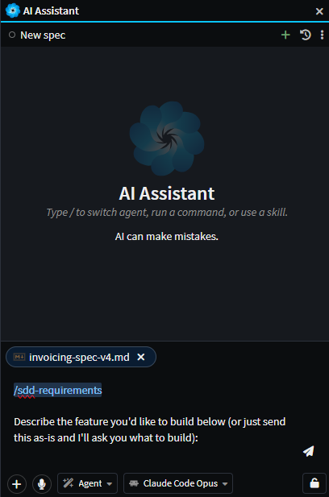
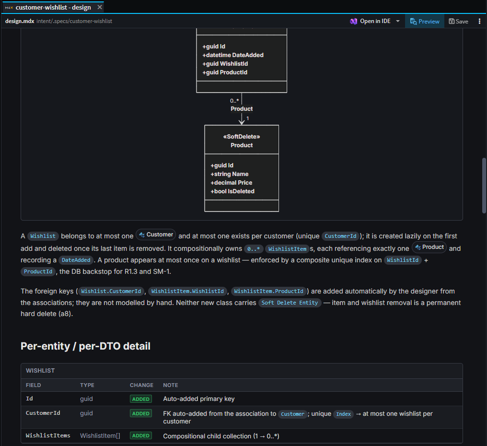
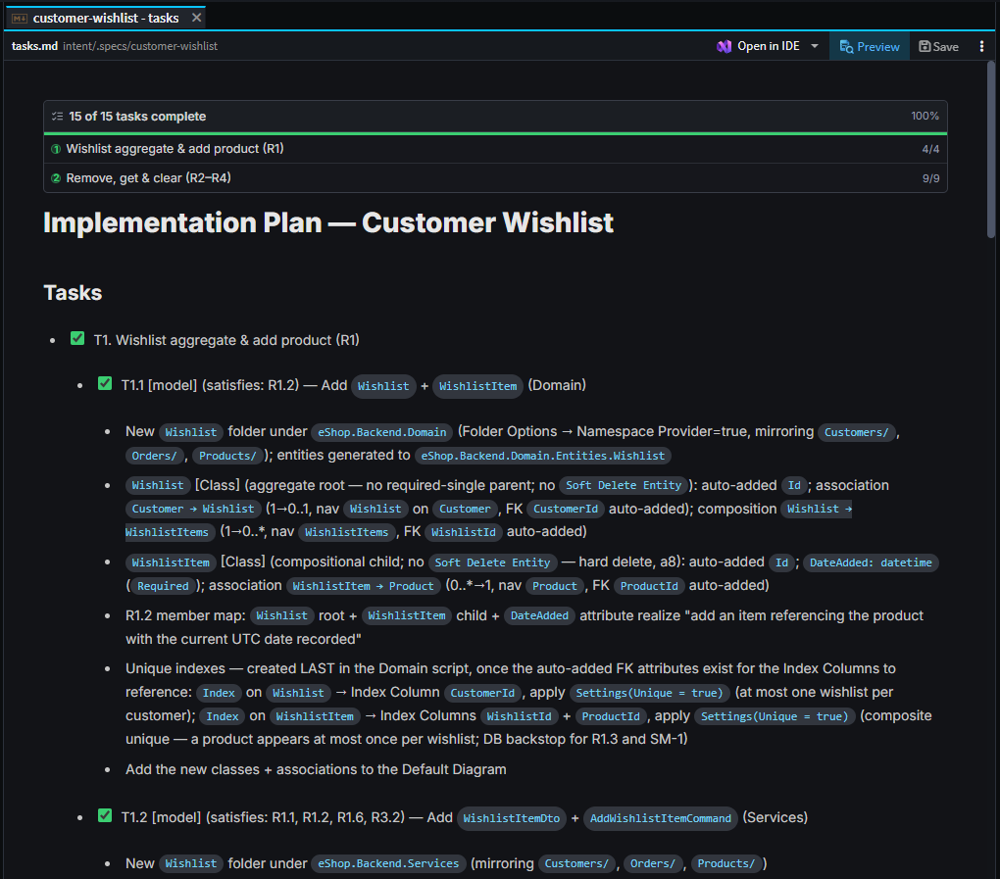
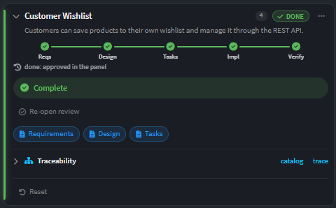
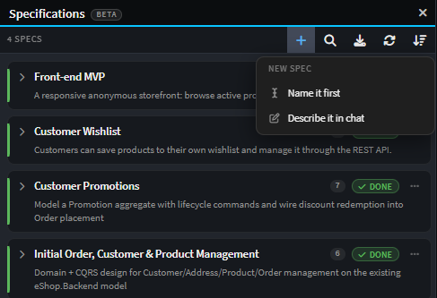
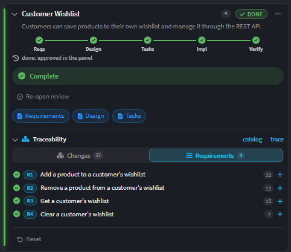

# Spec-Driven Development

Spec-Driven Development (SDD) is a way of building a feature where you agree **what** you are building before anyone builds it, and can prove afterwards that you got it.

An AI agent will happily write a lot of code from a one-line request. The code is rarely the hard part. The hard part is that nobody wrote down what the feature was supposed to do, so there is nothing to check the result against - and by the time the misunderstanding shows up, it is buried in a few thousand lines.

SDD slows down the first ten minutes to speed up everything after them. You and the agent work the feature out together and write it down, you approve it, and only then does anything get built. Along the way Intent Architect records which requirement each model element and each file belongs to, so "is this actually done?" has an answer other than someone's word for it.

What makes this version of it different from a generic one is that **the design describes changes to your model, not code**. Intent Architect already generates the classes, handlers, DTOs and wiring from your model, so a plan that lists them is planning work nobody has to do. The design plans the model; the Software Factory turns that into code; the agent writes only the business logic on top.

<!-- The Specs panel with a spec expanded: the phase rail, the artifact buttons and the
     traceability tree. NOTE: this screenshot is from 5.2 and should be re-captured for 5.3 -
     the panel now has a Verification step on the rail, no BETA badge, and a single
     "linked requirements" chip in place of the per-element chip row. -->

> [!NOTE]
> Spec-Driven Development was introduced in Intent Architect 5.2. The **Verification** phase and Git-verified traceability arrived in 5.3.

## The phases

A spec moves through six phases, and each one has to be approved before the next begins.

| Phase              | What happens                                                                          | What it leaves behind |
| ------------------ | --------------------------------------------------------------------------------------- | --------------------- |
| **Requirements**   | You and the agent work out what the feature is for, who uses it, and exactly how it should behave. | `requirements.md`     |
| **Design**         | The agent works out what has to change **in your model** to make that true.             | `design.md`           |
| **Tasks**          | The design becomes a checklist, grouped into batches that can be built in order.        | `tasks.md`            |
| **Implementation** | The agent works through the checklist, batch by batch - modelling, generating, then writing the logic. | Model changes and code |
| **Verification**   | A separate review pass judges each requirement against what was actually built.         | A pass/gap verdict    |
| **Done**           | Everything passed and you took the last gate.                                           | -                     |

You do not have to remember any of this. The Specs panel offers the one action that makes sense next, and the flow stops and waits at every gate.

### Requirements

The point of this phase is to get the vague bits out before they turn into code.

**You do not have to start from a blank page.** Most features already have something written down - a PRD, a one-page brief, a ticket, a page of notes from a meeting - and that is the normal starting point rather than the exception. There are three ways to bring it in:

| If you have                           | Do this                                                                                 |
| ------------------------------------- | ----------------------------------------------------------------------------------------- |
| **A PRD, brief, ticket or notes**     | **Draft requirements** and attach the files. The agent reads them and works from them.   |
| **A document that already *is* the requirements** | The caret beside **Draft requirements** offers **Link requirements from file…**. |
| **Specs written in another framework**| **Import** - see [Specs you already have](#specs-you-already-have).                      |

Attaching is the common case, and the panel is built around it. **Draft requirements** doesn't start the conversation - it fills in the command for you and waits. Attach your files, add anything the document leaves out, and send it when you are ready.

<!-- The handed-over chat composer, before anything has been sent: prefilled with the
     /sdd-requirements command for the spec, the "Describe your requirements below and/or attach
     input files:" line beneath it, a PRD attached as a file chip, and the caret in the box.
     Crop to the composer plus enough of the chat above it to place it. -->

Bringing in a PRD does not skip the phase - it changes what the phase is for. Rather than eliciting the feature from scratch, the agent reads what you gave it and goes looking for what it leaves out, which is usually the specifics: exact field types and bounds, what happens on invalid input, the empty state, who is allowed to do what. A good PRD answers *why* and *what*with acceptance criteria that are precise enough to test.

**Link requirements from file…** is the other case - your document is not source material to work from, it *is* the requirements. Intent Architect links it where it sits; nothing is copied or moved, so the file stays where your team already edits it. The option appears on whichever phase you are drafting, as long as that phase has no document yet, so a design or task list you already have can be linked the same way.

Whichever way you start, the agent inspects your existing model first, so the feature is described in the vocabulary already in it rather than inventing synonyms for things you have. Then it asks you questions - mostly as clickable options rather than "please write me an essay" - until nothing material is left open: what a record actually stores, who is allowed to do what, what happens on bad input, what the empty state looks like, and, most usefully, what this feature should deliberately **not** do.

What comes out is a document with the feature's purpose and its users at the top, the journeys a user actually walks through, a glossary, the non-goals, and then the acceptance criteria themselves - numbered `R1`, `R2` and so on, written so they can only be read one way. Those numbers matter: everything downstream refers back to them.

> [!TIP]
> The most valuable answer you give in this phase is usually to "what should this **not** do?". A boundary stated once here saves an argument later.

### Design

The design says what changes in the model: which entities, commands, queries, DTOs and associations to add or change, and which stereotypes carry the constraints your requirements specified - a max length, a required field, an HTTP verb, a security role.

It also decides two things up front that are expensive to discover later:

- **Whether a module already does this.** Soft delete, auditing, concurrency and similar concerns are usually better realized by installing a module than by hand-modelling an `IsDeleted` flag. Any module that has to be installed first is recorded as a prerequisite.
- **Where the boundary between the model and hand-written code sits.** Everything the Software Factory generates is out of scope for a task - it happens by itself. What is in scope is the business logic that has to be written by hand, and where it goes.

Finally it lists, per requirement, how that requirement gets realized, and which requirements depend on which others being built first.

<!-- A design document open as a tab, scrolled to show what makes it worth reading as a document
     rather than prose: a DataModel block for an entity with its fields and stereotypes, and
     either the aggregate class diagram or the realization-plan table. Full-width content area. -->

Design decisions with a real trade-off in them come to you as questions before the document is written, and appear in it as their own callouts with the reasoning attached - so a design that made five judgement calls says so, rather than reading as though there was nothing to decide.

### Tasks

The design becomes a checklist. Each item is tagged with the kind of work it is, carries the requirement ids it satisfies, and has enough detail under it to be actioned without re-reading the design.

Tasks are then grouped into **waves**. A wave is a vertical slice - typically one or two aggregates, modelled and coded together - sized so a single agent can finish it properly. Two rules shape them: nothing in a wave may depend on something a *later* wave creates, and a wave's hand-written work is kept small enough to stay reviewable.

Notably absent from the list: anything the Software Factory generates, and any "now run the build" step. Generation happens automatically once a wave's modelling is done, and the build and tests run automatically once its code is written. Neither earns a checkbox, because neither is a decision.

<!-- The rendered task list as a live document: the wave progress banner at the top, then a
     milestone with its tasks - some ticked, some not - showing the [model] / [code] tags and the
     (satisfies: Rn) chips. Pick a spec partway through implementation so the ticks are mixed. -->

### Implementation

Intent Architect works through the waves in order, one at a time, handing each to its own agent and carrying forward what the previous waves learned. Within a wave that means: install any module the wave needs, make the model changes, run the Software Factory, write the business logic and its tests, and get the build green.

Tasks tick themselves off as they are genuinely finished, and you can watch the checkboxes move in the panel or in the rendered task list.

You can let it run every wave back-to-back, or ask it to **pause after each wave** so you can look before it carries on. That choice sits on the run button's caret and is remembered on the spec.

If an agent gets stuck on something that needs a human - a requirement that can't be built as designed, say - it asks you rather than guessing. If you tell it to stop or to revise the design, implementation stops there rather than pressing on into work that depends on the answer.

### Verification

Verification is a **review, not a repair**. It is deliberately a separate pass, because an agent marking its own homework at the end of a long implementation is not a review.

It judges each requirement one at a time and records a **pass** or a **gap**. To do that it checks the model validates, that the elements the design called for exist, that the traceability links resolve, and that the behaviour each acceptance criterion describes is actually there in the code. It also walks each user journey end to end - a feature can satisfy every individual criterion and still have no working path through the journey they were supposed to add up to.

Two details worth knowing:

- **It argues with itself before recording a gap.** Every candidate gap is handed to a second agent briefed to prove the requirement *is* satisfied. A false gap is expensive - it sends the repair step off to change working code - so a gap only survives if that challenge fails.
- **It looks for the opposite problem too.** Requirements with no changes behind them are the obvious failure; the less obvious one is a change nobody claimed. Verification pulls the same Git-computed change summary that  shows a human, and every untraced element or hand-written file has to be accounted for: either it realizes a requirement and the link was never recorded, or it belongs to other work and is named as such.

If everything passes, the final gate is offered. If anything is a gap, the panel offers **Heal**.

### Healing gaps

Heal fixes exactly what verification judged deficient, one gap at a time, and nothing else. Each gap comes with a brief - what the criterion required, what is actually there, and where to fix it - which is why verification is asked to write those precisely.

Heal never ticks tasks and never advances the phase. The repair is proved by verification running again afterwards, not by the healer saying it is done.

## The Specs panel

Specs live in the **Specifications** panel, one card each. A card shows the spec's title, a one-line description of what the feature does, and a rail marking how far through the flow it is.

Everything else on the card follows from where it is:

| On the card             | What it is                                                                                                |
| ----------------------- | ----------------------------------------------------------------------------------------------------------- |
| **The phase rail**      | Requirements → Design → Tasks → Implementation → Verification. It reads complete once verification passes.  |
| **Artifact buttons**    | **Requirements**, **Design** and **Tasks** open those documents as tabs.                                    |
| **The main action**     | Whatever comes next - draft the requirements, approve, start or resume implementation, run the review, heal the gaps, mark it done. |
| **Traceability**        | An expandable tree of what has been built for this spec, by model element and by requirement.               |
| **Status**              | A short line saying what is going on: a wave in progress, a review running, gaps remaining, or that it needs you. |

<!-- A single spec card, cropped out of the panel and annotated in Azure Blue (#06C4FF) to label the five rows in the table above: the phase rail, the artifact buttons, the main action, the traceability section and the status line. This is the reference shot for the whole article - worth annotating properly. -->

A spec that is waiting on you says **Needs you** and links straight to the conversation where the question is; a spec that is busy says so and opens its live conversation when you click it. If a run is interrupted - the connection drops, or you close Intent Architect - the card offers **Resume** rather than losing the work.

The panel's toolbar carries **New spec**, **Import**, search, **Refresh** and a sort control. Sorting by **Activity** puts the specs that need you at the top, which is usually the one you want.

### Starting a spec

**New spec** offers two ways in:

- **Describe it in chat** - start talking, and the requirements get drafted from the conversation.
- **Name it first** - create the spec with a name now, and draft the requirements when you are ready.

Either way, the requirements are drafted from whatever you give the composer, including **attached files** - see [Requirements](#requirements) for starting from a PRD or a brief.

If you have another spec framework installed in the solution, it also appears here and runs that framework's own command instead. See [Specs you already have](#specs-you-already-have).

<!-- The toolbar's New spec (+) menu open, showing "Name it first" and "Describe it in chat".
     Capture it in a solution with a framework installed so the extra framework row is visible
     too - that row is hard to describe and easy to show. -->

### Spec options

Each card's **⋯** menu holds the spec-wide options - renaming, refreshing its state from disk, archiving, deleting, and two worth calling out:

- **Auto-approve phase gates** - the phases still run in order, but each gate resolves immediately instead of waiting for you. Useful for a small, well-understood change; not what you want on anything you would review.
- **Reset to…** - rewinds the spec to an earlier phase and deletes the artifacts after it. It confirms first, and it tells you exactly what it is about to delete.

## Approving each phase

When a phase finishes, the flow stops and waits for you. An approval card appears in the chat, and the spec stays where it is until you answer it.

There are two answers. **Approve** moves it on to the next phase. **Ask the AI to revise** hands your feedback back to the phase that just ran, so the document gets another pass rather than the work being thrown away.

Three things about gates:

- **They move one phase at a time.** A spec cannot skip from requirements straight to implementation - each phase works from the approved output of the one before it.
- **They survive a restart.** An approval you never answered comes back as an answerable card rather than being quietly dropped.
- **The artifact is never pasted into the chat.** Every surface reads it off disk, so the agent tells you what it wrote and you open the document to read it.

> [!WARNING]
> **Mark done** is available before verification has run, and before its gaps are healed - but it confirms first and says which it is. A spec marked done with gaps outstanding is a decision, not an accident.

## Traceability

As each wave is implemented, Intent Architect records which requirement each model element and each hand-written file belongs to. That record is what lets you ask "is `R4` actually built?" and get a real answer.

It shows up in three places: the traceability tree on the spec card, live coverage chips on each requirement heading in the rendered requirements document, and the **Requirements** section of , which pivots the same links to show a spec, its requirements, and the changes realizing each one.

Each requirement reads as one of:

| State         | Meaning                                                                    |
| ------------- | ---------------------------------------------------------------------------- |
| **Covered**   | Linked to at least one model element or file, and every link resolves.       |
| **Uncovered** | Nothing is linked to it.                                                     |
| **Stale**     | The requirement's own text changed after it was linked - re-confirm the link.|
| **Broken**    | Something it links to no longer exists.                                      |

<!-- SCREENSHOT NEEDED: images/traceability-tree.png
     The traceability section of a card expanded on its Requirements view, showing several
     requirements with their coverage state and one expanded to reveal the model elements and
     files linked to it. Ideally include one uncovered or stale requirement so the states read. -->
<!-- SCREENSHOT NEEDED: images/requirement-coverage-chip.png
     A requirement heading in the rendered requirements document with its live coverage chip, and
     the popover open listing the linked elements and files. Shows that the requirements document
     doubles as the dashboard. -->

From 5.3 these links are **checked against Git rather than taken on trust**. Recording a link that doesn't resolve fails outright instead of being stored as a broken one, and a task cannot be ticked while any of its links is unresolved. Traceability that might be wrong is worse than none, because you would rely on it.

## Running it from anywhere

The same flow runs wherever the conversation lives - the Specs panel, the , the  window, or an external agent connected over Intent Architect's MCP server. There is no separate spec mode and no surface that owns it.

Each phase has a command, and the panel's buttons simply run them:

| Command             | Phase                                            |
| ------------------- | -------------------------------------------------- |
| `/sdd-requirements` | Requirements                                     |
| `/sdd-design`       | Design                                           |
| `/sdd-tasks`        | Tasks                                            |
| `/sdd-implement`    | Implementation                                   |
| `/sdd-verify`       | Verification                                     |
| `/sdd-heal`         | Repairing the gaps a verification found          |

You can type these yourself, which is the easiest way to pick a flow back up in a fresh conversation. See  for connecting an external agent, and  for the tools these commands use.

## Specs you already have

Adopting SDD does not mean abandoning specs written elsewhere. Intent Architect detects, imports and stays in sync with specs authored in **BMAD** (including multi-file PRDs), **Spec Kit**, **Kiro** and **OpenSpec**.

The **Import** button offers:

- **Discover in this solution** - scan the solution for spec folders belonging to any of those frameworks.
- **Choose a folder…** - point at a folder anywhere on disk, either a spec folder itself or one containing several.

Import is for a spec **folder** that a framework owns. A single document you want to use as one spec's requirements is the other route - **Link requirements from file…**, described under [Requirements](#requirements).

An imported spec's own documents stay **owned by the framework that wrote them**. Intent Architect reads them, derives its requirement catalog from them, and runs its phases and traceability against them, but never rewrites them. If the requirements need changing, you change them in the owning tool and **Re-import** - which re-reads the source and refreshes the catalog while keeping the links you already have. The card tells you when the source has changed underneath it.

**Un-adopt** hands ownership back: it drops what Intent Architect derived and the adoption itself, and leaves the framework's documents exactly where they are.

Where a framework declares **governance documents** - Spec Kit's constitution, for instance - the panel lists them for the solution and every agent run is told to treat their rules as binding.

## Where things are stored

Everything a spec knows lives in one folder per spec under `intent/.specs/`, and all of it is meant to be committed - a spec is part of the repository's history, not a local scratchpad.

| File                | What it holds                                                       |
| ------------------- | --------------------------------------------------------------------- |
| `requirements.md`   | The requirements document (`.mdx` when it carries rich blocks)       |
| `design.md`         | The design document                                                  |
| `tasks.md`          | The task checklist - always plain markdown, because the checkboxes are live |
| `traceability.json` | Requirement → model element / file links                             |
| `verdict.json`      | The last verification's per-requirement result                       |
| `spec.yaml`         | The spec's own settings - phase, gate and pause preferences, import source |

Ticking a checkbox in the rendered task document writes back to `tasks.md`, and reopening the solution re-reads these files from disk - so editing them outside Intent Architect works, and shows up.

## Related articles

-  - the review screen that shows a spec's requirements against the changes realizing them.
-  - the assistant that runs every phase.
-  - running several agent conversations at once, each in its own checkout.
-  - the generation step implementation runs after each wave's modelling.
-  - connecting an external AI agent to Intent Architect.
-  - the tools an agent uses to read specs, record traceability and advance phases.
