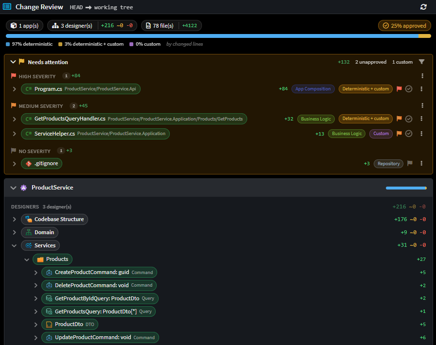
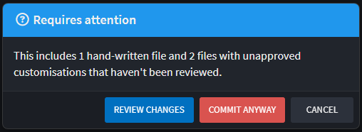
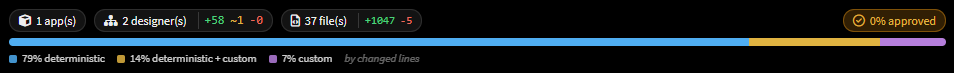
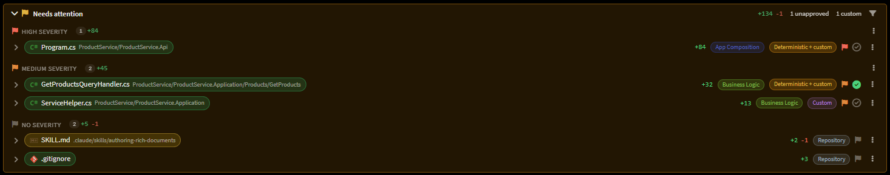
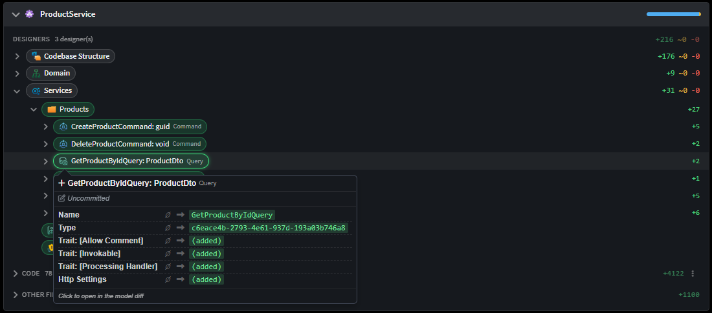
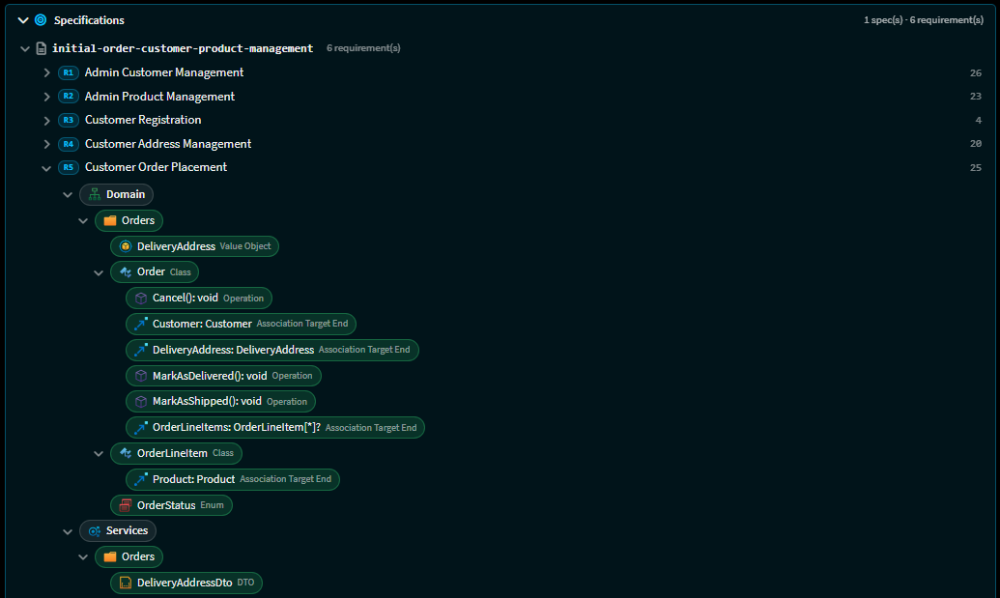
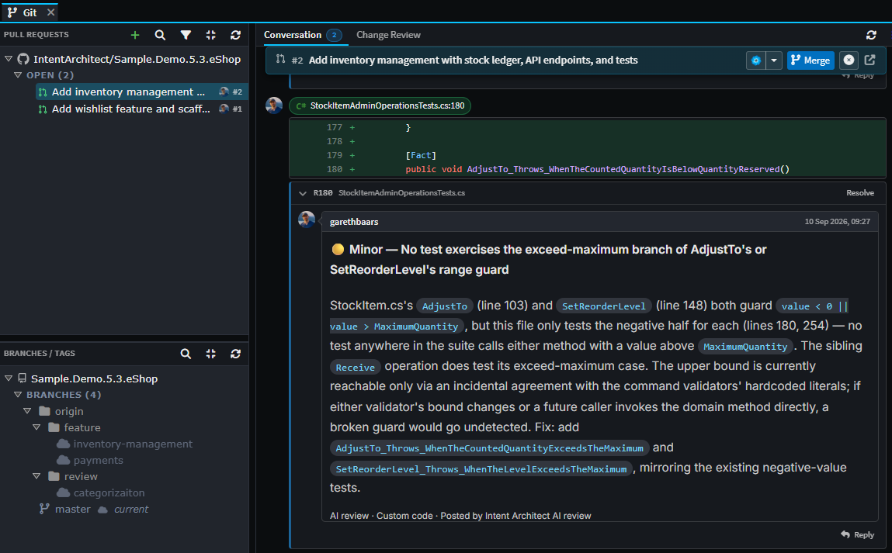

# Change Review

The **Change Review** screen is a single view of everything that changed between two points in time, presented as one reviewable tree covering model elements, generated code, hand-written code and customizations.

While a `git diff` lists changed files, it does not indicate which of them the Software Factory generated, which were written by hand, or which model change caused them. Change Review adds that context, and highlights the files that warrant closer scrutiny when they change: hand-written code, customizations inside generated files, and files a module has marked as important or critical.

Specifically:

- Changes are grouped by application, and by designer within each application.
- Model changes are shown as element-level differences, with created, updated and deleted counts per designer.
- Every changed code file is classified as deterministic (generated), deterministic with customizations, or custom (hand-written).
- Files with no deterministic baseline are collected into a **Needs attention** list for review and approval.
- Where Spec-Driven Development recorded them, changes are linked to the requirements they realize.

Taken together, this context narrows a review down to the changes that genuinely need a human. Instead of working through a flat list of files, a reviewer can start from the model change that caused them, treat the deterministic output as already accounted for, and spend their attention on the hand-written code, customizations and critical files that Change Review has flagged. The larger the change set, the more that focus is worth.

<!-- The full Change Review tab on a working-tree review, showing the headline chips, the
     composition bar, the Needs attention block and an expanded application below it. -->

> [!NOTE]
> Change Review was introduced in Intent Architect 5.2 as the "Changes Review" tab, and renamed to **Change Review** in 5.3, which also added pull request reviews, file classifications and severity.

## Opening a review

Change Review always compares two points. Where you open it from decides which two:

| Opened from                                       | In plain terms                                                            | Compares                                             |
| ------------------------------------------------- | ------------------------------------------------------------------------- | ---------------------------------------------------- |
| The flag button in the **Source Control** panel   | Everything you have changed but not yet committed                         | `HEAD` → your working tree                           |
| A branch pill's **Review changes vs this branch** | Everything your branch adds to the base branch, as a pull request would   | The merge-base with the base branch → the branch tip |
| A commit's **Review changes since this commit**   | Everything that has happened since that commit, uncommitted work included | That commit → your working tree                      |
| A commit's **Review changes in this commit**      | What that one commit changed, on its own                                  | The commit's parent → the commit                     |
| Two selected commits' **Review changes between**  | Everything that changed between the two commits you picked                | The older commit → the newer one                     |
| A pull request in the **Git** tab                 | Everything the pull request would merge in                                | The pull request's merge-base → its head             |

The **merge-base** referred to above is the point at which your branch last had the same content as the base branch, in other words where the two diverged. Comparing against it means you see only the work your branch added, and not changes other people have since made to the base branch.

You do not have to pick the base branch yourself. If your branch is set to track one on the server, Intent Architect compares against that. If it is not, it uses the first of `origin/main`, `main`, `origin/master`, `master` or `develop` that exists in your repository. Where a branch exists both on your machine and on the server, the server's version is used, because that is the one a pull request would merge into.

The range being reviewed is always shown in the toolbar as `refA → refB`.

### The commit gate

Committing while there are unreviewed hand-written files or unapproved customizations in the commit raises a **Requires attention** prompt. Its default button is **Review Changes**, which opens Change Review and abandons the commit - you can commit once you have looked. **Commit anyway** proceeds.

The prompt considers only the files actually going into the commit, so an unstaged file that needs review does not block a commit that does not contain it. You can turn the prompt off with **Warn about unreviewed changes** in the Source Control panel's `⋮` menu.

<!-- The "Requires attention" three-way prompt raised from the commit button. -->

## Reading the screen

### The toolbar

Alongside the range and a refresh button, the `⋮` **View options** menu controls:

- **File list** - `Flat list` or `Folder tree`.
- **Diff** - `Inline` (one column), `Side-by-side` (two columns), and `Wrap long lines`.
- **Show** - `Traceability` (the requirement chips, the requirements pill and the Specifications section) and `Build artifacts` (output logs and previous-output files, hidden by default).

### The headline

Three informational chips - applications touched, designers touched with `+ ~ -` element counts, and code files touched with changed-line counts - sit on the left. On the right are the actionable pills: the number of requirements realized by the change set, and the **% approved** pill, which jumps to the Needs attention block.

### The composition bar

A full-width band showing the split of **changed lines** three ways:

| Segment                    | Meaning                                                             |
| -------------------------- | ------------------------------------------------------------------- |
| **Deterministic**          | Generated, and identical to what the Software Factory would produce |
| **Deterministic + custom** | Generated, but the diff touched hand-written regions inside it      |
| **Custom**                 | Hand-written - nothing in the solution generated it                 |

This is the one-glance answer to "how much of this is machine output?". A change that is 95% deterministic is a very different review from one that is 60% custom.

<!-- The headline chips, the % approved pill and the composition bar with its legend. -->

## How a file is classified as deterministic or custom

Every changed code file gets one of the three classifications above, and the mechanism is worth understanding because it decides what the whole screen emphasizes.

Intent Architect keeps a **managed-files inventory** - committed to your repository - recording which files each application generated and, for each one, a hash of its recorded customization regions. Change Review reads that inventory *as it stood at each of the two refs*:

- Listed at the ref → the file is **generated**.
- Not listed → the file is **custom**. Nothing generated it, so there is no deterministic baseline to judge it against.
- Listed, and its customization hash **differs between the two refs** → this change touched hand-written code, so the file reads as **Deterministic + custom**.

Two consequences follow from the last rule, and both are deliberate:

- A commit that merely regenerates a file carrying long-standing customizations reads as **Deterministic**. The customizations did not change, so the review does not ask you to look at them again.
- Because the inventory is committed, the split resolves identically on a fresh clone, on a CI agent and on a teammate's machine - you do not need to have run the Software Factory locally.

> [!IMPORTANT]
> This classification comes from `Intent.OutputManager.RoslynWeaver`'s code-management directives. If any application in the solution is on a version older than 5.0.0, Change Review shows a persistent banner saying so, because the deterministic/custom split cannot be trusted until the module is updated.

## Needs attention

The **Needs attention** block is the triage list. It holds exactly the files that no deterministic baseline vouches for:

- **Custom files** - hand-written code, at any git status. An edit or a deletion of hand-written code is as reviewable as its creation.
- **Files whose diff touched customizations** - the `Deterministic + custom` rows.
- **Repository files** - files that no application owns (docs, CI config, the `.isln`). Nothing in the solution generated them, which is the same reason a custom file qualifies. These are **opted in** rather than shown by default, since lockfiles and CI config would otherwise bury the code beside them.

Approved rows stay in the list, shown as approved - the block is a scope, not a queue, so its contents do not shift under you as you work through it.

Rows are grouped by **severity**, highest band first, and each band has an **Approve all** action that acts on the rows currently on screen, so the counts on its labels are what it will actually touch.

<!-- The Needs attention block expanded, showing severity bands, file rows with their
     classification pills, badges and approval ticks. -->

### Filtering

The filter button beside the block narrows the list by **severity** and by **file classification**. The two filters evaluate independently - unticking a severity never hides a file merely for lacking a classification - and the selection is remembered per solution.

It records *exclusions* rather than inclusions, so a classification introduced by a module you install next week defaults to visible rather than being silently filtered out by a choice made before it existed. See  for how the classification vocabulary is defined.

## Approving

Change Review is where you reconcile "what Intent Architect generated" against "what you changed". There are three distinct kinds of sign-off, and the tick in a row means whichever one applies to it.

| Kind                       | Applies to                           | Recorded in                                  | Lifetime                                        |
| -------------------------- | ------------------------------------ | -------------------------------------------- | ----------------------------------------------- |
| **Customization approval** | A generated file with custom regions | The application's deviations log (committed) | Until explicitly revoked, or the regions change |
| **Custom file approval**   | A fully hand-written file            | The application's deviations log (committed) | Until explicitly revoked                        |
| **Mark as reviewed**       | Any file, in pull request mode only  | Machine-local, keyed to the file's git blob  | Until the file changes on the branch            |

Approving a file folds its diff away - you are done reading it. Revoking deliberately does not re-open it.

A few behaviours worth knowing:

- Approvals are always read from your **current workspace**, so a file you sign off updates on screen straight away, even when you are reviewing an older range of commits.
- In pull request mode, a tick turns **amber** when the file has changed since you approved it, meaning your approval is now out of date. Click it to approve the file again.
- A **repository file** (such as a skill file, or `.gitignore`) carries no tick outside a pull request. No application owns it, so there is no deviations log to record the sign-off in.

Customization approvals are the same records the  manages, so an approval made here shows up there with who approved it and when, and can carry free-form notes.

> [!TIP]
> The 's `ensure-no-outstanding-changes` command has a `--check-for-unapproved-customizations` option, so the same approvals can be enforced on CI.

## Model changes

The **Designers** section under each application is what makes this a *design* review rather than a diff review.

Each designer row carries `+ created`, `~ updated`, `- deleted` element counts, computed per package between the two refs. Expanding it gives a change tree: changed elements, indented under unaffected ancestors that provide context, with single-child folder chains fused into one row. A synthetic **+N more** row appears where the tree is too large to inline.

On an element pill you can:

- **Hover** it for a field-level popover - every changed field as `before → after`, with `∅` for a created or deleted side - plus git attribution naming the author, commit and date that changed it (or marking it uncommitted).
- **Click** it to open the designer's read-only **model diff** at that element.
- **Drag** it into the AI chat to attach it, along with the detail of what changed on it, so you can ask the AI Assistant about it. Elements that were deleted can be attached in the same way.

<!-- A designer's change tree expanded, with the field-level before → after popover open
     on an element pill and its git attribution line visible. -->

## Files

Under each application, code files and other files are listed separately, and files that belong to no application appear in a **Repository** section of their own.

A file row shows its git status, changed-line counts, any [file classification](xref:application-development.file-classifications) pills, a severity flag, and its deterministic/custom badge. Clicking the row expands its **diff inline**; the row's `⋮` menu offers **Open full diff in editor** and **Go to classification setting**.

`Other files` covers designer packages, application and solution metadata, and Software Factory build noise. Build artifacts are hidden until you tick **Build artifacts** in the view options.

## Traceability and the Specifications section

When a change was implemented through Spec-Driven Development, Intent Architect records links from each requirement to the model elements and files that realize it. Change Review consumes those links in two directions:

- **Inline** - a requirement chip on any changed element or file, with a popover listing the linked requirements. The chip is marked **stale** when a linked requirement's text has changed since the link was recorded.
- **Pivoted** - the **Specifications** section reverses the view: spec → requirement → the changes realizing it. This is how you answer "is this requirement actually built?" rather than "what is this file for?".

Both are behind the **Traceability** toggle in the view options.

<!-- The Specifications section expanded, showing a spec, its requirements and the model
     elements and files realizing one of them. -->

## Reviewing a pull request

Open a pull request from the **Pull Requests** list in the **Git** tab and you get the same review screen, covering everything that pull request would merge in. It opens with two sub-tabs: **Conversation**, for the pull request's description and comments, and **Change Review**, for the changes themselves.

A pull request review adds the following:

- **Comment threads**, which you can attach to a line in a file or to a **model element**, with replies and resolving. A comment on a model element is an ordinary pull request comment, so it appears on the host alongside the rest.
- **Mark as reviewed** ticks on each file, alongside the customization and custom-file approvals described above.
- **AI review**, which runs over the pull request's changes and collects what it finds into a draft review. You read, edit or drop each finding and submit the review yourself. Running it again skips anything it has already raised, including comments that have since been resolved.
- **Conflict resolution** in a temporary copy of the repository that is discarded afterwards, so your own working folder is left alone. Files appear in the review as they are resolved.
- **Merge, update branch, close and reopen**, without leaving Intent Architect.

Supported hosts are GitHub, Azure DevOps, GitLab and Bitbucket Cloud.

<!-- A pull request open in Change Review, showing the Conversation / Change Review sub-tabs,
     the PR head card and a staged AI review finding. -->

## Banners

Change Review surfaces three advisory strips above the content, each with a one-click fix where one exists:

| Banner                                                            | Meaning                                                                                                 |
| ----------------------------------------------------------------- | ------------------------------------------------------------------------------------------------------- |
| `Intent.OutputManager.RoslynWeaver 5.0.0 or later required`       | The deterministic/custom split cannot be trusted until the module is updated.                           |
| `Intent.Modelers.CodebaseStructure 1.1.0-pre.2 or later required` | File classification pills and severity flags are silently absent.                                       |
| `Missing file classifications`                                    | Template Outputs whose module supplies a classification never got it stamped - offers to re-stamp them. |

The two module banners stay for as long as the module is out of date, and each offers an **Update module** button that takes you straight to the solution's Modules manager.

They only appear when the code on screen is the code you currently have checked out, which means a review of your working tree, or a pull request for the branch you are on. This is because the check reads the version of the module installed right now, which tells you nothing useful about a commit or branch you do not have checked out.

## Change Review for AI agents

The same review is available to AI agents deterministically, through the `get_change_review` tool. It returns a compact text report rather than a diff, in one of five sections:

| Section        | Contents                                                           |
| -------------- | ------------------------------------------------------------------ |
| `overview`     | Counts only (the default)                                          |
| `files`        | Changed code files with their classification and requirement links |
| `elements`     | Changed designer elements, per designer                            |
| `traceability` | Spec → requirement → realizing changes, plus the untraced lists    |
| `other`        | Metadata, build-artifact and repository-level files                |

It defaults to the same merge-base baseline the tab opens on, and to `WORKING` as the comparand so committed work and the worktree are both in range.

This is what `/sdd-verify` runs against. Requirement-side coverage can only see requirements with no link; it is structurally blind to a changed element or hand-written file that no requirement points at. `get_change_review` answers the change-side question, and answers it by computation rather than by an agent reading a diff and reporting on its own work.

## Related articles

-  - the classification and severity labels that drive the Needs attention filter.
-  - the Software Factory screen that manages the same customization approvals, with notes.
-  - how Intent Architect decides which regions of a file are yours and which are its own.
-  - enforcing unapproved-customization checks on CI.
