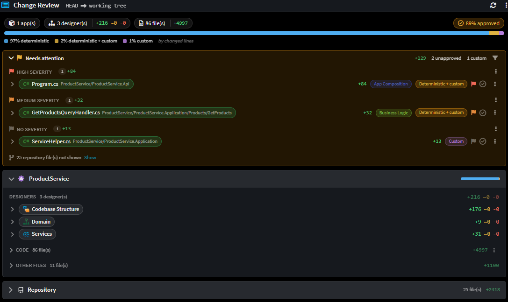
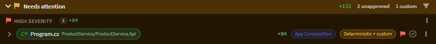
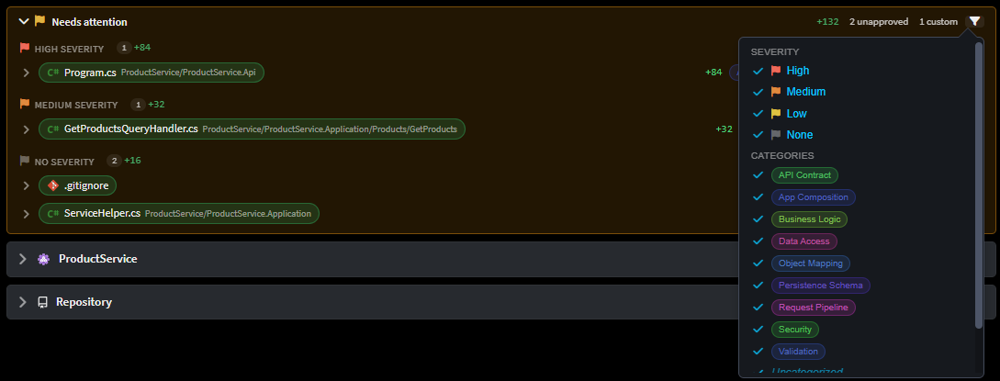
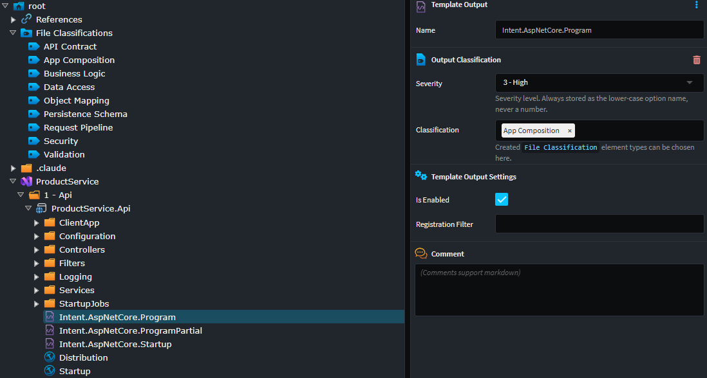
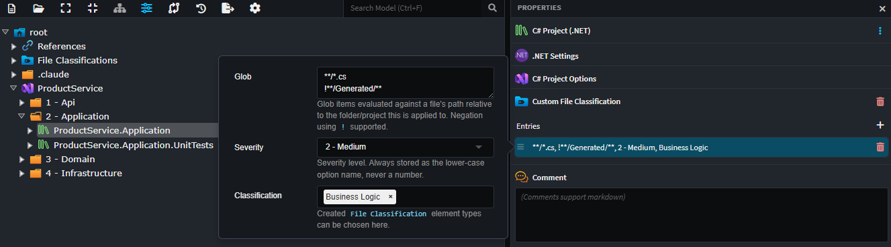
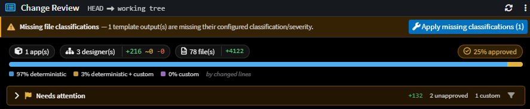

# File Classifications

A **File Classification** is a named, color-coded label - `Security`, `API Contract`, `Business Logic` - that you attach to files through your model rather than to files on disk. Together with a **severity** (`low`, `medium` or `high`), it is what lets a reviewer answer the question that matters: out of these 80 changed files, which ones are especially important for review?

The reason classifications live in the model is that the model already knows what every file is. A file generated by the `Intent.Application.MediatR.CommandModels` template is an API contract no matter what it is called or which folder it ends up in, and it is that on every branch, on every machine, forever. Classifying the **template** therefore classifies every file it will ever produce - including the ones that do not exist yet.

This matters most when an AI agent produced the change. A 2,000-line diff where 1,900 lines are routine generated output and 100 lines touch authorization is not a 2,000-line review - but only if something tells you which 100 lines those are.

> [!NOTE]
> File Classifications require Intent Architect 5.3 or later, and the `Intent.Modelers.CodebaseStructure` module at version `1.1.0` or later (the **Entries** list described below arrived in `1.1.1`). Where that module is older, Intent Architect skips classification entirely rather than tagging files it has no definitions for.



## How a file gets classified

Where a file's classification comes from depends on one thing: whether Intent Architect generated the file.

| If the file is              | It inherits its classification from |
| --------------------------- | ----------------------------------- |
| **Generated** by a template | The template that produced it       |
| **Hand-written**            | The folder or project it lives in   |

**Generated files usually classify themselves.** Modules classify their own templates, so installing a module brings its classifications with it and most of your generated code is labeled before you do anything. You can override what a module shipped, or classify a template its author left alone - see [Overriding a generated file's classification](#overriding-a-generated-files-classification).

**Hand-written files are yours to classify.** Nothing generated them, so there is no template to inherit from. You tag a folder or project in the Codebase Structure Designer instead, and the files beneath it pick up the label - see [Classifying hand-written files](#classifying-hand-written-files).

Not every file ends up classified, and that is normal. An unclassified file simply shows no pill, and Change Review's filter treats "unclassified" as a category of its own, so you can still include or exclude those files deliberately.

Either way, the answer comes from your model and from information Intent Architect commits alongside your code - so a file classifies the same way for everyone on the team, whether that is a fresh clone, a CI agent or a teammate's machine.

> [!TIP]
> Do not confuse a File Classification with the **Deterministic / Deterministic + custom / Custom** badge on the same row. That badge says who wrote the file; a File Classification says what the file is for. They are independent, and a reviewer usually wants both.

## Classifications in Change Review

On the [](xref:application-development.change-review) screen, a classified file row carries:

- One **pill per classification** on the file, tinted with that classification's color.
- A **severity flag** - amber for `low`, orange for `medium`, red for `high`.

The two answer different questions, so they do not always appear together:

- **The pills always show.** They describe what the file is for, which is true of the file no matter what this particular change did to it.
- **The flag only shows where the change actually touched hand-written code** - rows badged **Custom** or **Deterministic + custom**.

So a file that regenerated cleanly, badged **Deterministic**, carries no severity flag even when its template is severity-tagged, and even when the file contains customizations that this change left alone. The flag is there to point at risk the change itself carried, not to remind you that the file is a sensitive one - the pills already do that.



### Filtering by classification and severity

The **Needs attention** block can be filtered by severity, by classification, or by both. You untick what you want out of the way, so anything you have not touched stays visible - including a classification a module introduces later.

- The classification list covers **every** classification in the solution, not just the ones in front of you.
- Files with **no** classification get their own row, so you can keep or drop them deliberately.
- The two filters are independent: unticking a severity never hides a file just for lacking a classification.
- Your selection is remembered per solution and carries across reviews.



### Jumping to where a classification is set

A file row's context menu has **Go to classification setting**, which opens the designer at the element that assigns the file's classification - the `Template Output` element for a generated file, the folder or project element for a hand-written one.

This resolves for an **unclassified** file too, which is usually the point: the most common reason to go looking is to classify something that is not yet classified. In that case Intent Architect opens the element where a classification would be added and tells you so, rather than dropping you on an empty-looking element with no explanation.

## Defining your own classifications

Classifications are modeled elements, so you create them in the [Codebase Structure Designer](xref:application-development.modelling.codebase-structure-designer):

1. Right-click the `Root Folder` element (shown as `root` at the top of the designer) and add a **File Classifications** container, if one does not already exist.
2. Right-click that container and choose **New File Classification** (or press `Ctrl+Shift+A`).
3. Name it. The name is what appears on the pill, and is what modules match against - see [Classifying a template's output as a module author](#classifying-a-templates-output-as-a-module-author).

Names are matched case-insensitively and trimmed, so `Security` and `security` are the same classification.



### Setting a classification's color

Every `File Classification` element carries a **File Classification Settings** stereotype with two properties:

| Property            | Purpose                                    |
| ------------------- | ------------------------------------------ |
| `Color`             | The pill color, e.g. `#C0392B`             |
| `Color (Dark Mode)` | The pill color when a dark theme is active |

Either may be left blank: whichever one you set stands in for the other, and if you set neither, a color is derived deterministically from the classification's name. A classification never renders uncolored, so setting these is purely about making the categories you care about stand out.

> [!NOTE]
> When a module install needs a classification that does not exist yet, it creates one for you - including creating the `File Classifications` container if there isn't one. Auto-created classifications have no color set, and picking colors for the ones that matter to your team is a worthwhile five minutes.

## Classifying hand-written files

Hand-written files are classified by applying the **Custom File Classification** stereotype to a folder or project element in the Codebase Structure Designer. The stereotype holds a list of **Entries**, each of which is one rule:

| Property         | Meaning                                                                              |
| ---------------- | ------------------------------------------------------------------------------------ |
| `Glob`           | Which files under this element the rule applies to. Blank means everything (`**/*`). |
| `Classification` | One or more `File Classification` elements to apply.                                 |
| `Severity`       | `0 - None`, `1 - Low`, `2 - Medium` or `3 - High`.                                   |

Globs are evaluated against each file's path **relative to the element the stereotype is applied to**, and follow `.gitignore`-style rules:

- One pattern per line.
- **Multiple patterns are OR'd** - a file qualifies if it matches *any* of them.
- A line beginning with `#` is a comment.
- A line beginning with `!` negates.
- The last matching line wins.

So a rule on your API project of:

```text
**/*.cs
**/*.sql
```

classifies every hand-written C# file **and** every hand-written SQL file in that project - each line widens the set of qualifying files, so there is no need to fold them into a single expression.

Order only starts to matter once you negate. Because the last matching line wins, a `!` line carves an exception out of the patterns above it:

```text
**/*.cs
!**/Generated/**
```

classifies every hand-written C# file in that project except those under a `Generated` folder.

When more than one thing could classify a file, the resolution is: **the deepest element containing the file wins**, and within that one element, **the last matching entry wins**. This lets you set a broad default high up your tree and override it precisely further down.

> [!IMPORTANT]
> `Custom File Classification` is only ever consulted for files that no template generated. Applying it to a folder full of generated code will not change how those files classify - change the template's `Output Classification` instead.




### Enabling the stereotype on your own element types

`Custom File Classification` can be applied to any element whose settings - or an extension of them - carry the **Allows Custom File Classification** trait. `Root Folder` carries it out of the box, as do the project element types contributed by modules such as `Intent.VisualStudio.Projects`. If you are building a designer of your own and want its folder-like elements to participate, apply that trait to their `Element Settings`, `Element Extension`, `Package Settings` or `Package Extension` in the Module Builder.

## Overriding a generated file's classification

The `Output Classification` stereotype on a `Template Output` element is an ordinary stereotype - you can open it and change the `Classification` and `Severity` the module shipped.

> [!NOTE]
> A classification you set yourself is preserved. Installing, updating or reinstalling the module does not overwrite it, so an override you make here stands until you change it again.

If you author the module yourself, it is usually better to ship the classification you want rather than override it in each application that installs it - see [Classifying a template's output as a module author](#classifying-a-templates-output-as-a-module-author).

## Applying missing classifications

If a module supplies a classification and severity for a template but the `Template Output` element in your model never received the stereotype - typically because the model predates the module version that introduced it - Change Review shows a **Missing file classifications** bar with a one-click fix.

The fix-up is a presence check only: it stamps the stereotype onto elements that have none. An element whose stereotype is present but carries stale values is left alone, so the fix can never quietly discard an override you made on purpose.

<!-- INTENDED SCREENSHOT: The "Missing file classifications" bar at the top of the Change Review
     tab, with its fix-up button. -->


## Classifying a template's output as a module author

If you build modules, classifying your templates is what gives every downstream consumer this behavior for free.

In the Module Builder, select a template element and open its **Template Settings** stereotype:

| Property         | Value                                                                                     |
| ---------------- | ----------------------------------------------------------------------------------------- |
| `Classification` | One or more classification names, separated by `;` (or `,`), e.g. `API Contract;Security` |
| `Severity`       | `0 - None`, `1 - Low`, `2 - Medium` or `3 - High`                                         |

Run the Software Factory and the values are written into your module's [manifest](xref:module-building.module-manifest) as part of that template's entry. `Severity` is normalized to a plain lower-case token, while `Classification` is written through exactly as you typed it - Intent Architect accepts either separator when reading it back:

```xml
<template id="Intent.Application.MediatR.CommandModels" enabled="true" externalReference="6fe47b20-09e5-4a25-8675-746c403d0158">
  <role>Application.Command</role>
  <location />
  <classifications>API Contract;Security</classifications>
  <severity>high</severity>
  <config />
</template>
```

When a user installs or updates the module, Intent Architect resolves each name against the `File Classification` elements already in that application - **creating any that do not exist** - and stamps the resulting `Output Classification` stereotype onto the template's `Template Output` element. Withdraw both `<classifications>` and `<severity>` in a later version and the stereotype is removed again on update.

A few things to keep in mind when choosing values:

- **Name classifications for what a reviewer should think about**, not for your module's internals. `Security` and `API Contract` travel well across modules and merge cleanly with other modules' vocabularies; `MediatRCommandModel` does not.
- **Severity is about review attention, not code quality.** Reserve `high` for output where a mistake is expensive and hard to spot - authorization, contracts published to other teams, anything with a compliance boundary.
- **Leave a template unclassified rather than guessing.** Unclassified output reads as routine; a wrong but confident label is worse than none at all.

## Related articles

- [](xref:application-development.change-review) - the screen these classifications drive, and how it reads a change set.
- [](xref:application-development.modelling.codebase-structure-designer) - the designer that hosts `Template Output`s, folders and `File Classification` elements.
- [](xref:application-development.code-weaving-and-generation.about-template-output-targeting) - how a template's output is routed to a `Template Output` element in the first place.
- [](xref:module-building.module-manifest) - the module manifest (`.imodspec`) that carries `<classifications>` and `<severity>`.
- [](xref:module-building.stereotypes.about-stereotype-definitions) - background on stereotypes generally.
