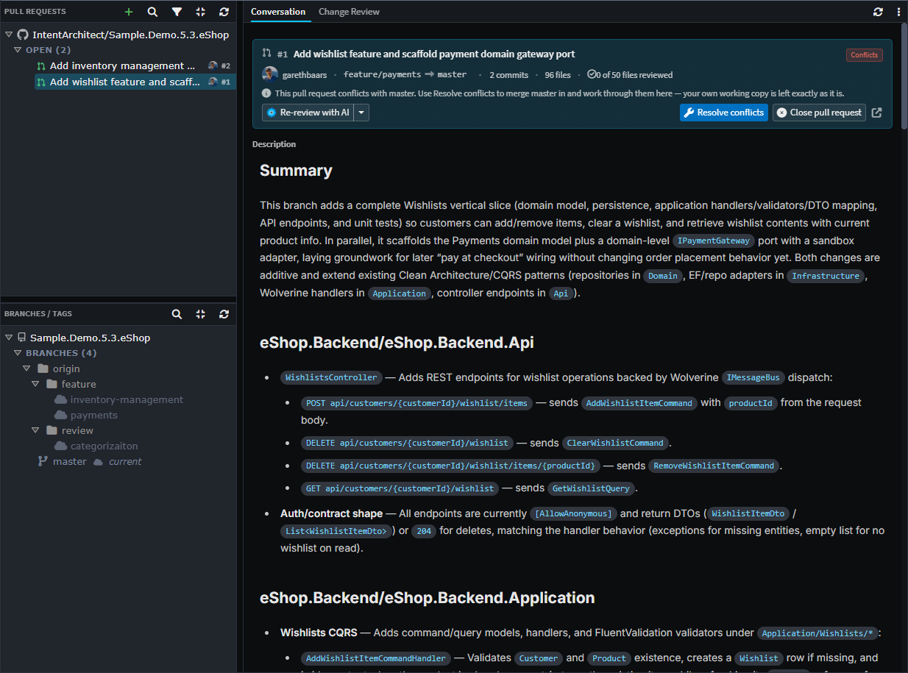
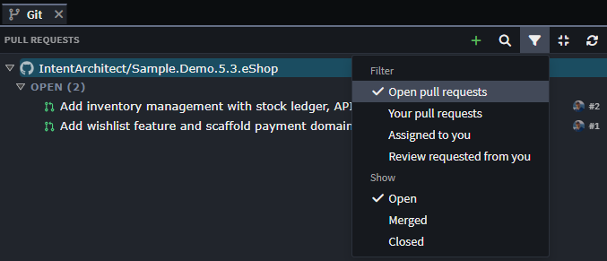
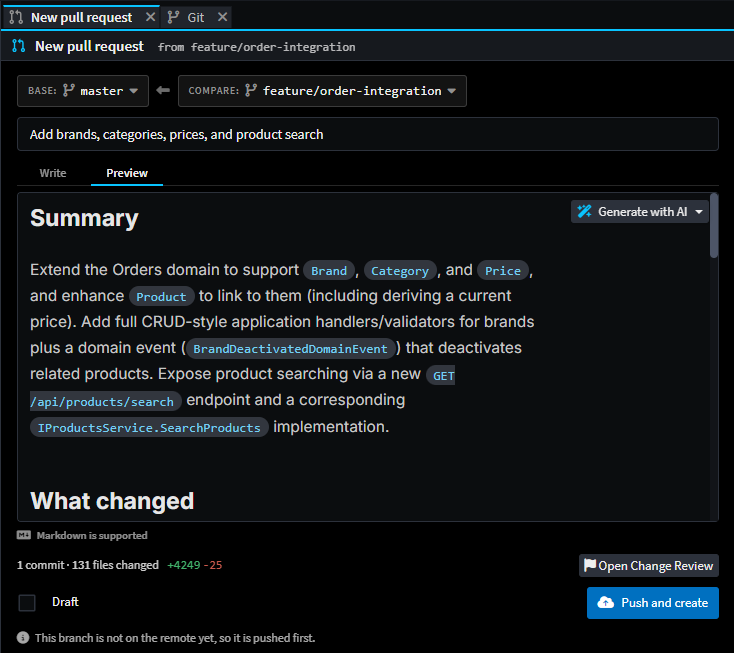
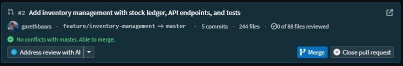
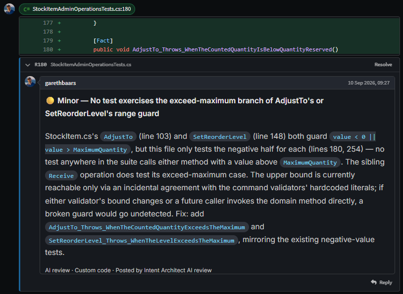
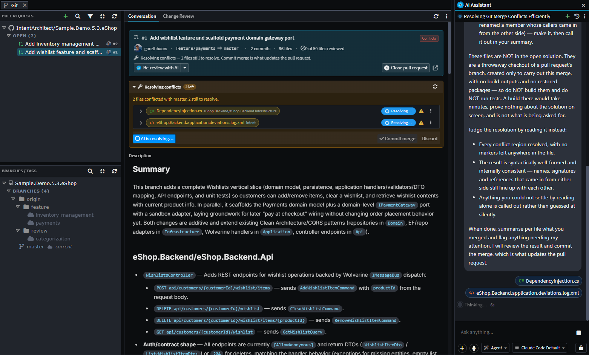

# Pull Requests

Intent Architect can list, create, review, discuss and merge pull requests without leaving the application, on **GitHub**, **Azure DevOps**, **GitLab** and **Bitbucket Cloud**.

The reason it does is . A pull request raised from an Intent Architect solution carries three different kinds of change in one change set: designer metadata, the code the Software Factory generated from it, and code written by hand. **Intent Architect knows which is which** - it generated that code, and it holds the model change that caused it. **The Git host does not.** All it has is the files, so its web diff renders all three the same way: as text.

That distinction is what makes such a change reviewable. It separates the generated output you can take as read from the handful of files that genuinely need a human - and until 5.3 it was lost the moment the review moved to a browser.

Reviewing a pull request here is therefore the *same* Change Review screen, pointed at the pull request's changes instead of your working tree. Everything that screen does - element-level model diffs, the deterministic/custom split, [file classifications](xref:application-development.file-classifications) and severity, requirement traceability - applies unchanged. What this article covers is the pull request layer on top of it: finding pull requests, creating them, the conversation, and the actions that land them.

<!-- The Git tab with the Pull Requests list on the left and a pull request open on its Conversation
     tab: the head card, its badges and status line, the action row, and the description below. -->

_The Pull Requests list in the Git tab, with a pull request open on its **Conversation** tab._

> [!NOTE]
> Pull request support was introduced in Intent Architect 5.3.

## Connecting to a Git host

Intent Architect works out which host a repository is on from its remote URL, preferring `origin` where there is more than one - so a repository whose `origin` is on Azure DevOps is treated as an Azure DevOps repository even if it also has a GitHub remote.

This happens per repository. A solution can span several, and each one has its own host, credential and pull requests - nothing here is solution-wide.

### Credentials

Intent Architect stores no credential of its own. It asks Git for the one your usual credential helper already holds - Git Credential Manager, the macOS Keychain, libsecret - and never prompts for it. **If you already `git push` to the host over HTTPS, you are signed in here with no setup.**

Where nothing is stored, the list is replaced by a **Connect** panel asking for a personal access token. The token goes into your operating system's credential manager, so `git push` picks it up too. The panel links to the right token page for the host, and for GitHub and GitLab an ⓘ button lists the exact permissions the token needs - a token created without them will list pull requests and then fail on the first thing you click.

> [!WARNING]
> **Sign out** on a repository's row erases the credential from that shared store, so `git push` will ask for it again as well. This is why it is a two-step confirm rather than a single click.

A read-only token still lists pull requests and shows their diffs. Submitting a review and merging need write access, and are withheld without it.

### Differences between hosts

The screens are the same whichever host you are on. A handful of capabilities are not:

| Capability                        | Notes                                                                                                  |
| --------------------------------- | ------------------------------------------------------------------------------------------------------ |
| **Assignees**                     | Azure DevOps and Bitbucket Cloud have none, so **Assigned to you** shows pull requests awaiting your review instead - the list says so when it does. |
| **Reopening a closed pull request** | Not supported on Bitbucket Cloud, so the action is absent there rather than offered and failing.       |
| **Checks**                        | Shown where the host reports them. On GitHub a fine-grained token needs `Commit statuses: Read-only` for them to appear. |

## The Pull Requests list

The list lives in the **Pull Requests** section of the **Git** tab, above Branches / Tags. Each repository in the solution gets its own row, showing which host it is on, the account you are signed in as, and its own sign-in and sign-out actions.

Under each repository, pull requests are bucketed:

| Bucket             | Contents                                                                      |
| ------------------ | ------------------------------------------------------------------------------ |
| **On this branch** | The open pull request raised _from_ the branch you currently have checked out  |
| **Open**           | Everything else that is open                                                   |
| **Merged**         | Merged pull requests, when the filter asks for them                            |
| **Closed**         | Closed-without-merging pull requests, when the filter asks for them            |

**A bucket only appears when it has something in it.** In particular, **On this branch** is absent unless the branch you are standing on has an open pull request raised from it - which is the usual reason not to see it. It is a shortcut to that one pull request rather than a state of its own, so a pull request listed there is not repeated under **Open**.

Each row shows the pull request's state as a coloured icon - open, draft, merged or closed - along with its title, number, author, and when the host last saw activity on it.

A repository with nothing to list keeps its row and says why - not on a supported host, not signed in, an error, or genuinely no pull requests. While its list is still loading the row stays blank, rather than claiming there is nothing there.

### Filtering

The filter button offers two things at once. The **Filter** rows are presets:

- Open pull requests (the default)
- Your pull requests
- Assigned to you
- Review requested from you

The **Show** checkboxes below then widen the states on screen - open, merged, closed - independently.

Presets are applied by the host as it builds the list, rather than by Intent Architect afterwards. Hosts return only their most recently updated pull requests, so filtering after the fact would quietly miss older ones.

<!-- The Pull Requests section header with the filter menu open, showing the Filter
     presets above the Show state checkboxes. -->

## Creating a pull request

**New pull request** (the `+` in the section header) opens a page of its own for the solution repository's checked-out branch. A branch row's context menu is the way in from any other branch, or from another repository.

The page opens fully populated - the branch, a suggested title, a suggested base, and whether the branch still needs pushing - so the button can say **Push and create** up front, rather than an unpushed branch turning into a rejection after you have written a description.

| Part of the form           | What it does                                                                                                                                     |
| -------------------------- | ------------------------------------------------------------------------------------------------------------------------------------------------ |
| **base ← compare**         | Two ref pickers, each with a **Branches** and a **Tags** tab. The repository's default branch carries a `default` badge. Changing either re-counts the range. |
| **Counts strip**           | `N commits · M files changed`, with additions and deletions. **Open Change Review** follows the same range through to what actually changed.      |
| **Title**                  | Pre-filled with the branch's suggested title.                                                                                                     |
| **Description**            | Markdown, with **Write** and **Preview** tabs. Preview renders through Intent Architect's document viewer, so a Mermaid diagram is a diagram here rather than a code fence. |
| **Draft**                  | Creates the pull request as a draft.                                                                                                              |
| **Push and create**        | Reads **Create pull request** when the branch is already up on the remote. Pushing is never silent, and never done when it isn't needed.           |

<!-- The New pull request page - the base ← compare pickers, title and description
     with its Write / Preview tabs and the AI summary menu, the counts strip, and the
     Draft / Push and create actions. -->

Two things the form deliberately does not treat as errors:

- **A pull request is already open from this branch.** The form tells you, and offers to open that one instead. It does not stop you - raising a second pull request from the same branch is still allowed if that is what you want.
- **The counts could not be read.** A message appears where the counts would have been, and creating carries on as normal - the counts are informational only.

Tags are offered in both pickers because comparing a branch against a release tag is worth doing, and the counts and **Open Change Review** both handle one. You cannot *create* a pull request from or onto a tag - hosts only accept branches - so the form says so beside the picker.

### Drafting the description with AI

The ✨ control beside the description box offers two summaries of the range:

| Option            | What you get                                                                          |
| ----------------- | -------------------------------------------------------------------------------------- |
| **Quick summary** | The gist in markdown, at most three short sections. Returns quickly.                   |
| **Rich write-up** | A full sectioned write-up with Mermaid diagrams. Thinks first, so it takes longer.     |

It replaces the description, and the title as well - unless you have edited the title yourself, in which case yours is kept. The button reads **Cancel** for as long as a request is in flight, and cancelling aborts the model call rather than merely discarding its answer.

## Reviewing a pull request

Selecting a pull request opens it in the Git tab's right-hand pane; it can also be opened as a standalone Change Review tab. Either way the screen has two sub-tabs:

- **Conversation** - the pull request itself: its description, its comments, and every action that manages it.
- **Change Review** - the changes, as  renders them.

### What gets reviewed

The review covers the pull request's own changes, measured from the point where its branch left the base branch. Anything else that has landed on the base branch since it was raised is left out.

You do not need the branch locally, so pull requests **from forks** work, and so do **merged** ones - including where the source branch has since been deleted. Occasionally a merged pull request's changes can no longer be separated from the base branch's, usually after a squash or a fast-forward merge; you then get a short notice saying so, rather than an empty review.

### The head card

Pinned to the top of the **Conversation** tab, and the one thing that stays on screen while you read:

| Row              | Contents                                                                                                                                                  |
| ---------------- | ----------------------------------------------------------------------------------------------------------------------------------------------------------- |
| **Title row**    | Number and title, then badges: checks, draft, the review decision, the pull request's state, and whether it can be merged. A link out to the host sits at the far end. |
| **Meta row**     | Author, `head → base`, commit and file counts, and `n of m files reviewed` - how much of it *you* have ticked off, on this machine.                         |
| **Status line**  | One line showing the most important thing right now: failed checks, a re-check in progress, why merging is blocked, or confirmation that it merges cleanly. |
| **Action row**   | The AI control, **Update branch** / **Resolve conflicts**, **Merge**, and **Close** or **Reopen**.                                                          |

<!-- A close-up of the head card alone, with its badges, meta row, status line and
     action row - cropped from the Conversation tab. -->

Below it the description renders through the document viewer, then the timeline, then the composer.

### The timeline

Every review that said something, interleaved with every comment thread, oldest first - the order a conversation is read. A file-anchored thread appears here *and* in its diff row on the **Change Review** tab, so a reply or a resolve on either surface is immediately true on both.

Comments you have staged but not yet submitted appear in the same sequence, marked **Pending**. A review being written should read in the same order as one that has been submitted.

## Comment threads

A thread can be anchored to a **line in a file**, or to a **model element**.

Commenting on a model element posts an ordinary pull request comment - anchored to that element's entry in the designer metadata - so it appears on the host alongside every other comment, and anyone reading the pull request in a browser sees it. Inside Intent Architect it is shown against the element itself, named as the element rather than as a line of a metadata file.

The reverse works too: a comment left on a generated line of code carries a chip naming the model element that produced it, and clicking the chip opens that element in its designer.

<!-- A comment thread anchored to a model element on the Change Review tab, showing
     the element row, the thread beneath it, and the reply / resolve actions. -->

Other behaviour worth knowing:

- Unresolved threads arrive expanded and resolved ones collapsed. Anything you toggle away from that keeps your choice across a reload.
- Posted comments and their resolved state always come from the host, and are re-read after every change - so what you see here is what everyone else sees.
- A thread the diff cannot place on a line - because it has none, or the file has changed too much - is collected into a panel below the diff rather than quietly disappearing.

## The pending review

Comments can be **posted immediately**, or **staged into a pending review** and sent together with a verdict. Staging is what the composer's **Start a review** does, and every comment after that stages by default.

The composer sits at the bottom of the Conversation tab and is always open on an open pull request. Its verdict is one of:

| Verdict             | Notes                                                                                      |
| ------------------- | -------------------------------------------------------------------------------------------- |
| **Comment**         | The default. May be submitted with no body when there are staged comments - those are the review. |
| **Approve**         | May be submitted with nothing written.                                                      |
| **Request changes** | Always needs its reason in words.                                                           |

Approve and Request changes are withheld on your own pull request, because every host refuses them there.

Submitting sends every staged comment, the verdict and the body **as one review**, so the pull request's followers get one notification instead of one per comment. Afterwards you are told what became of each staged comment: one the host could not attach to its line is added to the review body instead, and one it rejected stays staged so you can deal with it.

<!-- The Conversation tab with an AI review's findings staged as Pending threads in the diff, and
     the pending-review bar above the composer showing the count and the Discard action. -->

_Findings staged into a pending review - read, edited or dropped before anything reaches the host._

A few properties of the draft:

- **It outlives the tab.** The verdict body is autosaved, so closing the tab (or the application) does not lose what you typed.
- **It follows the repository, not the folder.** Every clone and worktree of the same repository shares one draft, so a review staged in one is the same review you submit from another.
- **It stays on your machine.** Drafts are never committed, and nothing reaches the host until you submit.
- **You are told when the pull request moves on.** If new commits have arrived since the comments were staged, the bar says so - the lines they name may no longer be the lines they were written about.

**Discard** throws the whole pending review away, behind a confirm. It is the one action here that destroys work nobody else can see.

### Marking files as reviewed

In pull request mode each file row also carries a **Mark as reviewed** tick. This is a private, per-file sign-off: it stays on your machine, is tied to the exact version of the file you ticked, and is never sent to the host - so submitting or discarding a review leaves the ticks standing. If the file changes on the branch afterwards, the tick turns **amber** to say your sign-off is out of date. The `n of m files reviewed` figure in the meta row counts these.

These sit alongside the customization and custom-file approvals Change Review already manages, which are a different thing entirely: those are committed to the repository and outlive the pull request. See [Approving](xref:application-development.change-review#approving) for the three kinds side by side.

## Using AI on a pull request

There are two AI actions: one reviews the pull request, and one works through the review comments it (or anyone else) left. Both are usually available at once, so rather than two buttons competing for attention, the head card carries one control whose main half is whichever action is the sensible next step - the caret keeps the other a click away.

### Review with AI

Runs the same review Change Review uses, over exactly the changes the pull request contains, as an AI Assistant conversation in that pull request's repository.

Findings land as **staged comments in your pending review** - not posted one at a time. You read each one on the diff, edit or drop what you disagree with, and submit the whole review yourself with your own verdict. Its summary becomes the review body.

Two properties matter more than they look:

- **It never says the same thing twice.** Running it again skips anything it has already raised, including findings on threads that have since been resolved. Repeated reviews turning into a pile of duplicate comments is the reason this kind of feature usually gets switched off.
- **It remembers what it has already reviewed.** Asking for a review of a commit it has already read prompts you to confirm first, rather than quietly reviewing it twice.

It is offered on your own pull request too. Hosts accept comments from the author, and reviewing your own work before asking someone else to is the most useful moment for it.

### Address review with AI

Works through the pull request's unresolved comment threads, makes its changes in a **separate working copy** rather than yours, commits them, and drafts a reply on each thread. It never pushes.

Pushing is the row below, which you click. That row appears whenever the run has commits the pull request's branch does not, and offers:

- **Review changes** - a Change Review of what the run did, so you read it before it goes anywhere.
- **Push** - puts the commits onto the pull request's branch.
- **Fetch & rebase** - when the branch has moved on underneath it. A rebase that hits conflicts pauses rather than failing, and is finished from that conversation's own Source Control panel.

The link between a pull request and its fix conversation is remembered, so the row survives closing the tab or restarting Intent Architect.

> [!TIP]
> AI agents reach the same conversation through the `get_pull_request_review_threads` and `stage_pull_request_review` tools, which let a run read outstanding threads and answer them without a separate `gh` / `glab` / `az` install. See  for how tools are made available to an agent.

## Updating the branch and resolving conflicts

One button covers both reasons a pull request's branch needs the base branch merged into it, and names the reason you are actually looking at:

| Label                            | When                                                                                                   |
| -------------------------------- | -------------------------------------------------------------------------------------------------------- |
| **Resolve conflicts**            | The host reports the pull request as conflicting. Resolving is the primary action - **Merge** is not even on offer until it is done. |
| **Update branch from `<base>`**  | It merges cleanly but is behind the base, and a branch-protection rule wants it current first.          |

Both do the merge in a **temporary copy of the repository**, not in your own working folder - which is never switched, never dirtied, and does not have to be clean first. The copy is discarded afterwards.

<!-- The Resolving conflicts panel pinned under the head card, with two conflicted files being
     resolved by an AI run, and Commit merge / Discard below them. -->

_Conflicts resolved away from your own working folder, with the AI Assistant working through them file by file._

The resolution panel opens under the head card and lists each conflicted file. Files appear in the review as they are resolved, so what you are about to commit is readable as you go. Resolution is per file - by hand, or handed to AI - and **Commit merge** is the only thing that reaches the remote. **Discard** throws the whole session away.

A resolution in progress survives closing the tab, and closing Intent Architect - reopening the pull request picks it back up.

Two cases where the action is withheld:

- **A fork.** Updating pushes the pull request's branch, which lives in the contributor's repository rather than yours. Rather than offer a button that would fail, the card explains whose side the fix is on.
- **While a resolution is already in progress.** It is the same action, already running.

> [!NOTE]
> Pushing a merge is not what makes a host decide a pull request is mergeable - hosts work that out a few seconds later, in their own time. Intent Architect keeps checking for about a minute afterwards, so **Merge** appears on its own rather than needing the tab reloaded by hand.

## Merging, closing and reopening

**Merge** opens a form rather than a yes/no confirm, because the commit it produces is what the base branch's history keeps:

- The **merge methods** offered are the ones the repository allows - create a merge commit, squash and merge, rebase and merge. Whichever you pick becomes your default for next time.
- **Commit title** and **extended description** are prefilled with the host's own defaults for the chosen method, and switching method to compare the two never overwrites text you have typed. Rebase has no message to set, so those fields are hidden for it.

**Close pull request** takes an optional comment. The comment is posted *first*, and the pull request is only closed if it landed - a rejection whose stated reason silently vanished is worse than one that never happened, and the second is something you can simply retry.

**Reopen** takes its place on a closed pull request, and is the one action here that happens on the press rather than opening a confirm. Nothing needs guarding: Close is the next button along and puts it straight back. No host will reopen a *merged* pull request, so it is never offered on one.

All three update the Pull Requests list straight away, so a pull request you just merged or closed stops being listed as open.

## Where things are stored

| Thing                                          | Where                                                            | Committed? |
| ---------------------------------------------- | ------------------------------------------------------------------ | ---------- |
| Host credential                                | Your operating system's credential manager                        | No         |
| Pending review (staged comments, verdict body) | `%AppData%/Intent Architect/pr-reviews`, per repository and pull request | No   |
| Per-file **Mark as reviewed** ticks            | Beside the pending review, same folder                            | No         |
| Posted comments, reviews, resolved state       | The Git host                                                      | n/a        |
| Customization and custom-file approvals        | The application's deviations log                                  | **Yes**    |

## Related articles

-  - the review screen a pull request opens into, and everything it does with model changes, classifications and traceability.
-  - the classification and severity labels the review filters on.
-  - resolving conflicts in designer metadata.
-  - which Intent Architect files belong in source control in the first place.
-  - the AI Assistant that runs the review and fix conversations.
