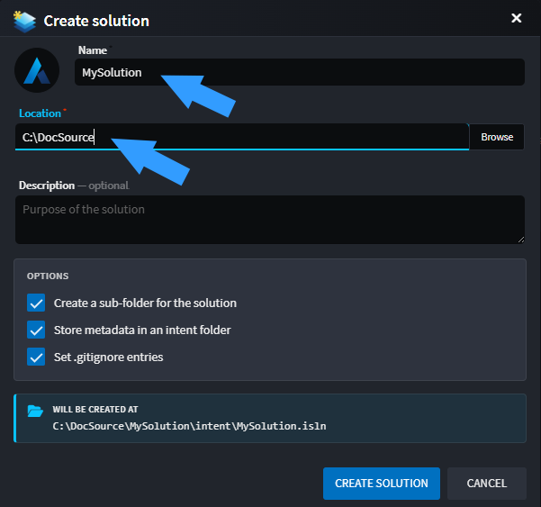
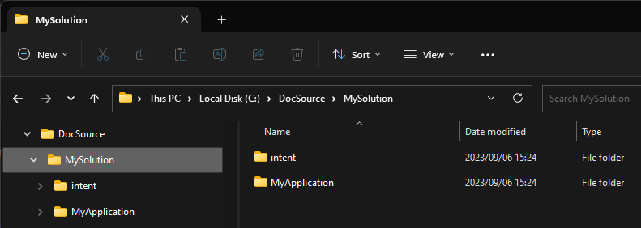
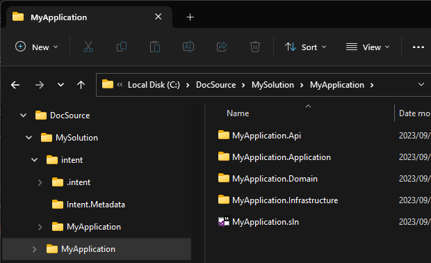
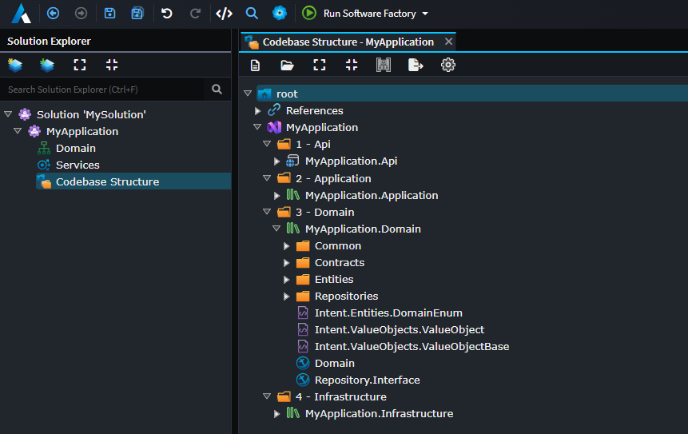
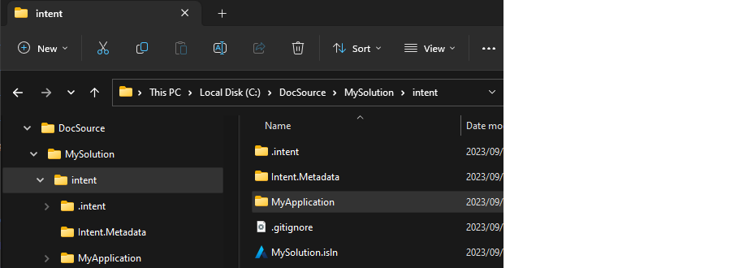
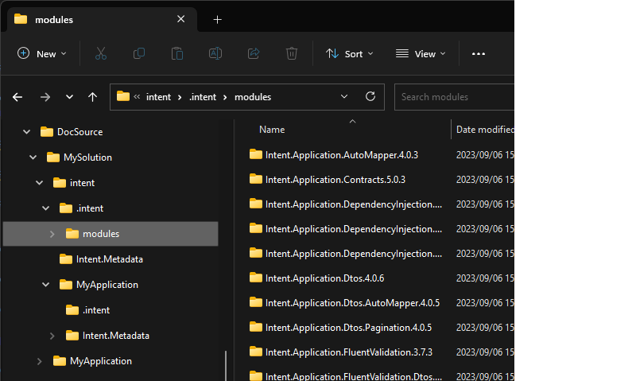
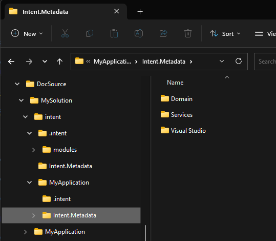

# How Intent Architect Solutions are structured on the File System

This article covers how Intent Architect solutions are structured on your local file system.

## Overview

Intent Architect solutions are created in two separate steps:

1. **Solution Creation** - Creates the solution structure with the `intent` folder and all solution-level configuration
2. **Application Creation** - Applications are then added to the solution as separate steps

---

## Creating a Solution

The solution creation wizard allows you to specify the following settings:



The main settings you'll provide are:

* **Location** - where the solution folder will be created
* **Solution Name** - the name of the solution

When you proceed through the wizard, Intent Architect creates a folder structure: `{Location}\{Solution Name}`. This folder will contain:

* The `intent` folder - containing all solution-level configuration and Intent Architect data
* The `.isln` file - the solution file that you double-click to open the solution in Intent Architect

### The Intent Architect solution file (`.isln`)

The Intent Architect solution file (`.isln` file extension) is the entry point for your solution, very analogous to a Visual Studio solution file. When you create a solution, Intent Architect creates an `.isln` file at the following location:

```text
{Location}\{Solution Name}\intent\{Solution Name}.isln
```

Double-clicking this file will open the solution in Intent Architect.

---

## Creating and Adding Applications

After you have created a solution, you can add applications to it. When you add an application to your solution, Intent Architect will:

1. Create a new application folder (`{Application Name}`) at the solution root
2. Create application-specific metadata and configuration in the `intent` folder
3. Generate the initial project structure based on your selected application template

Each application is independent and can have its own technology stack, architecture, and design specifications. You can add multiple applications to a single solution, and each will have its own folder at the solution root.

---

## Solution Folder Structure

Once you've created your solution and added applications to it, the overall folder structure looks like this:



The structure follows your selected options: `{Location}\{Solution Name}`. Within this folder, you'll find:

* `intent` - this folder contains all the Intent Architect data for this solution (including the `.isln` file)
* `{Application Name}` folders - one for each application you've added, containing the source code for that application

### Folder structure basics

When you create a solution, Intent Architect creates a folder `{Location}\{Solution Name}` which contains all solution-related content. Initially:

* The `intent` folder contains all solution-level configuration and Intent Architect data

When you add applications to the solution:

* Each `{Application Name}` folder contains the full source code for that application

The `intent` folder contains:

* Solution / Application settings and Intent Architect configuration information
* Designer Metadata - all designer related data (domain models, service models, etc.)
* Module manifests - details on what specific modules and their versions are being used

Each `{Application Name}` folder contains the full source code for the application. In a .NET application, this includes:

* Visual Studio solution file (`{ApplicationName}.sln`)
* Various `CSProj` files and their related artifacts

> [!NOTE]
> Every additional Application you add to your Intent Architect solution will add an additional folder to the solution root, with that application's source code in it.

### Application source code

Once you have added an application to your solution, looking inside the `{Application Name}` folder will show all the source code for that application. (Assuming you have run the Software Factory and applied the changes)
If you have worked with C# solutions before, this should look familiar to you. Here we can see a C# solution file (e.g. MyApplication.sln) which contains C# projects. This C# solution is the source code realization of the Intent Architect application and its designs.



> [!NOTE]
> If you are wondering why the C# solutions / projects are generated the way they are, this has been configured in the [`Codebase Structure Designer`](xref:application-development.modelling.codebase-structure-designer) or `Folder Designer` with in Intent Architect.
> 

### Intent Architect Solution data

Investigating the `intent` folder, you will find the following:



This folder contains the following items:

* `.intent\modules` folder - this folder is the `Module Cache` and contains copies of downloaded and installed modules the solution is running.
* `Intent.Metadata` folder - this folder contains Intent Architect solution-level related data.
* Application-specific folders (e.g., `MyApplication`, `AnotherApplication`, etc.) - each contains Intent Architect application-specific metadata for that application.
* `.gitignore` file - this file is configured so that the module cache folder, mentioned above, does not get committed into version control.
* `{Solution Name}.isln` file - the Intent Architect solution file, for this solution. Double clicking this file will open the solution in Intent Architect. (This is very analogous to a .sln file for your C# IDE)

### Module cache

This folder is very analogous to a NuGet package folder, it is a directory on your solution where Intent Architect modules it has downloaded are cached for use by the Intent Architect Applications. If you take a look at what's in this folder, you will see folders, corresponding to the Modules you have installed across your various Applications.



> [!NOTE]
> Similar to NuGet, this folder is a cache and does not need to be version controlled and can be cleared if required. The Applications keep track of what modules they need and at what specific version (modules.config). There is a `.gitignore` configured to ensure the actual module binaries don't get committed into version control.

### Intent Architect Application data

Within the `intent` folder, each application you add to the solution will have its own folder (e.g., `MyApplication`, `MyService`, etc.). Each application folder contains application-specific data:

* `{Application Name}.application.config` - this file contains all the application-specific configuration information.
* `Intent.Metadata` folder - this folder contains all the Metadata described in the installed `Designer`s for this application.
* `modules.config` file - this file contains which modules, and at what specific version, are being referenced by the application.

### Application Metadata folder

This Folder contains all the Metadata described in the installed `Designer`s, for example let's say you have the following 3 designers installed:

* Domain Designer
* Services Designer
* Codebase Structure Designer

Then this folder would contain 3 sub-folders, one for each designer where each of these children would contain all the Metadata for their designer.


