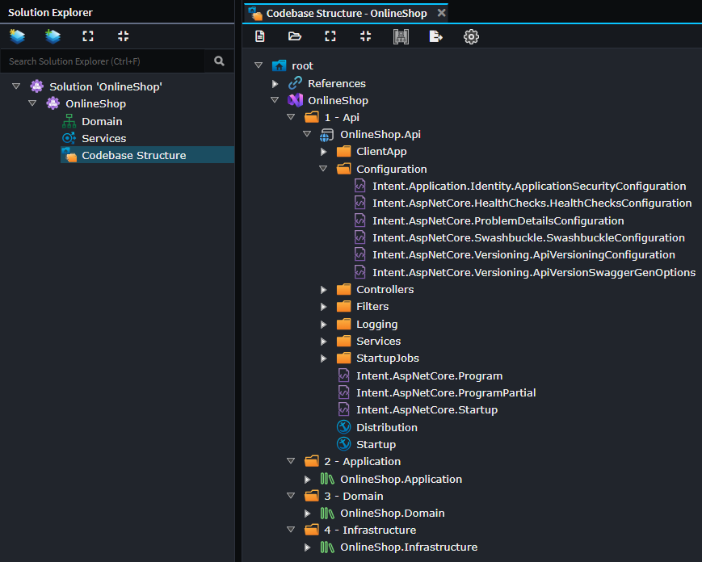
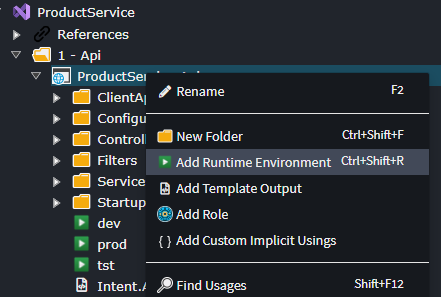
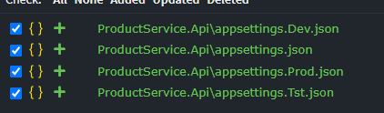

# Codebase Structure Designer

The **Codebase Structure Designer** is used for configuring the file system and folder structure into which files for an application are to be generated into or laid out. This designer will allow you to create new Folders, new [Output Anchors](#output-anchors) and to change the location of [Template Outputs](#template-outputs).



## Template Outputs

`Template Output`s are used by the Software Factory to determine for each template where it should be generated to on your file system. They are automatically created/removed/renamed by Intent Architect when Modules are installed, updated or uninstalled and cannot be manually created or renamed.

By reorganizing them into different folders within the `Codebase Structure` Designer, you are able to control the layout and structure of your codebase. Depending on the template, their output may go into file system sub-folders from their `Template Output`, for example DTOs placed in folders in the Services Designer will be generated into corresponding sub-folders on your file system.

As long as Module authors ensure that their templates use the default of suggested APIs to dynamically work out relative locations of related templates, an application's codebase structure can be completely customized.

Initial placement of `Template Output`s are controlled by [Output Anchors](#output-anchors). Once an `Output Template` is placed, its location within your codebase structure is not changed when a module is updated or reinstalled, this is to allow users to customize their codebase structure without a module update undoing it. To force a `Template Output` to be re-placed at its default location you will need to completely uninstall and then install the module again.

## Runtime Environments

When you are using the Visual Studio concepts in Codebase Structure, you can add `Runtime Environment` elements under a project to tell Intent Architect which environment-specific configuration files should be generated.

To add one:

1. Right-click the relevant project in the Codebase Structure designer.
2. Select **Add Runtime Environment**.
3. Give the environment a name such as `Dev`, `Prod` or `Tst`.



Each `Runtime Environment` you model allows Intent Architect to generate a matching environment-specific `appsettings` file alongside the base `appsettings.json` file.



This is also what template authors rely on when they call APIs such as `ApplyAppSetting(..., runtimeEnvironment: "Prod")`. The `runtimeEnvironment` value must match a modeled `Runtime Environment` element on the target project, otherwise the request will not be applied to an environment-specific file.

> [!NOTE]
> If you are configuring environment-specific `appsettings` output from a template or factory extension, see [](xref:module-building.templates-csharp.how-to-update-appsettings-json-files) for the code-side usage.

## Output Anchors

`Output Anchor`s are arbitrary tags used to control the initial placement of a [Template Outputs](#template-outputs) at the time Modules are being installed or updated.

They allow high level configuration of `Template Output` locations without each individual `Template Output`'s location needing to be individually considered when creating a new application or later installing additional modules into it.

For example, if you have a domain-oriented module, when it's installed the `Template Output`s for its various templates will be automatically placed relative to the location of the `Output Anchor` named `Domain`.

In this way Module authors are able to target generalized logical locations for their templates as opposed to specific ones.

## Registration filtering

Template Outputs in the Codebase Structure designer can control where templates generate their files. The **Registration Filter** allows you to conditionally include or exclude a particular template instance from generating to a particular Template Output based on properties of the model element the template instance is running against.

### Configuring the Registration Filter

The Registration Filter is set via the **Template Output Settings** stereotype on a Template Output element. Select the Template Output in the designer and look for the **Registration Filter** property in the Properties panel.

If the Registration Filter field is left empty, the Template Output matches all model instances (i.e., the template runs for every element of the relevant type).

### Duplicating Template Outputs for conditional routing

When you want different registration behaviour for different subsets of a model type, you must **duplicate the Template Output** - one copy per branch. For example, to route to different folders based on a package name, you would have two Template Outputs with the same template name but different filters:

```text
Controllers/
  Intent.AspNetCore.Controllers.Controller   [filter: np(Operations.FirstOrDefault().InternalElement.Package.Name) == "MyApp.Services.Command"]
  Intent.AspNetCore.Controllers.Controller   [filter: np(Operations.FirstOrDefault().InternalElement.Package.Name) == "MyApp.Services.Query"]
```

### Ensuring filters are mutually exclusive

Each model instance must match **at most one** Template Output's filter. If a template's model is matched by more than one Template Output filter, the template will attempt to be registered multiple times causing an error in the Software Factory. Design filters so they are collectively exhaustive over the cases you care about and mutually exclusive with each other.

### Expression syntax

Registration Filters use [System.Linq.Dynamic.Core](https://dynamic-linq.net/) (Dynamic LINQ) expression syntax. The expression must evaluate to a `bool`.

#### Useful operators and functions

| Feature | Syntax | Description |
| --- | --- | --- |
| Null propagation | `np(expr)` | Returns `null` instead of throwing if any part of `expr` is `null`. Essential when navigating optional relationships. |
| Equality | `==`, `!=` | Standard equality comparison. |
| Logical | `&&`, `\|\|`,`!` | Boolean logic. |
| String methods | `.StartsWith()`, `.Contains()`, `.EndsWith()` | Standard string instance methods. |
| LINQ methods | `.Any()`, `.All()`, `.FirstOrDefault()`, `.Where()` | Standard LINQ extension methods on collections. |

Full documentation for the expression language is available at: <https://dynamic-linq.net/expression-language>

#### Example filters

```text
// Match only when a package has a specific name
np(Operations.FirstOrDefault().InternalElement.Package.Name) == "MyApp.Services.Command"

// Match when the element itself has a specific name prefix
Name.StartsWith("Create")

// Match when there is at least one operation with a specific tag
np(Operations.Any(o => o.Name == "Execute"))
```

### Model instance type

The expression runs against a **model instance** of the type that corresponds to the template's registered model. The type varies by Template Output name, which maps to the template's registered ID (i.e., the value of the Template Output's `Name` property matches the template's registered ID).

To find the exact model type and its available properties for a given template:

1. Identify the Template Output's name - this is the template ID (e.g., `Intent.AspNetCore.Controllers.Controller`).
2. Search for that template in the source repositories, e.g.:
   - [Intent.Modules](https://github.com/IntentArchitect/Intent.Modules)
   - [Intent.Modules.NET](https://github.com/IntentArchitect/Intent.Modules.NET)
3. Locate the template class and inspect its generic type parameter (e.g., `IntentTemplateBase<ControllerModel>`) - that is the model type passed to the filter expression.
4. Inspect the model class to discover the properties and navigation paths available in the filter expression.

> [!NOTE]
> Model properties generally align with what is visible in the Intent Architect designers, but the source repositories are the authoritative reference for exact property names and navigation chains.

## See also

- **[Visual Studio Module](https://docs.intentarchitect.com/modules-dotnet/intent-visualstudio-projects/intent-visualstudio-projects.html)** - Extends the Codebase Structure Designer with Visual Studio concepts such as solutions and projects.
