## Blazor UI Modeling with AI

This article will show you how you can use Intent Architect to rapidly build professional-looking UIs, using a combination of both deterministic (pattern reuse) and non-deterministic (LLMs driven by Intent Architect) code generation techniques.

How this works at a high level is as follows:

- Design and generate your **View Model**s. This includes aspects like which Services to interact with and where UI navigations are going. This _can_ be done manually, but the recommended approach is to ask the `Intent Architect AI Assistant` to model for you.
  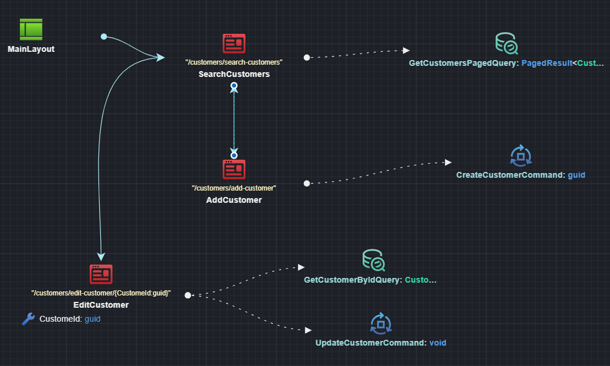

- Ask the AI to implement your pages. If you asked the AI to model your **View Model**s in the step above, the implementation will happen automatically. Alternatively, if you modeled your **View Model**s manually, you can ask the AI to generate the **View** implementation. Intent Architect handles the context engineering and manages the LLM interactions on your behalf.
  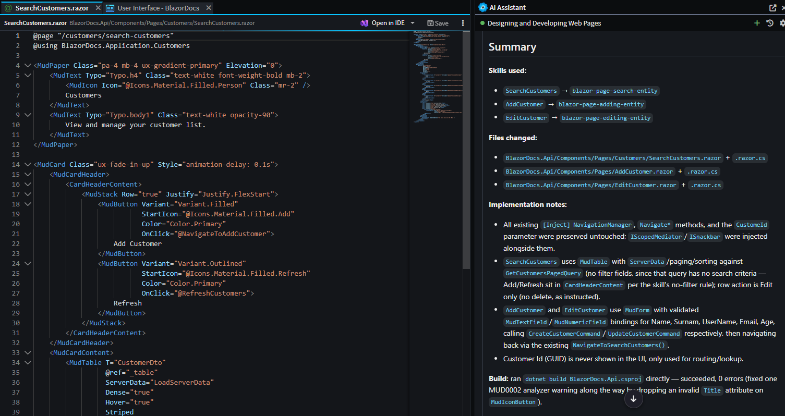

- Review and validate the code. As always when dealing with LLMs, you will want to review and validate the code. By their nature LLMs are non-deterministic, but with a little bit of luck you should end up with a screen similar to this:  
  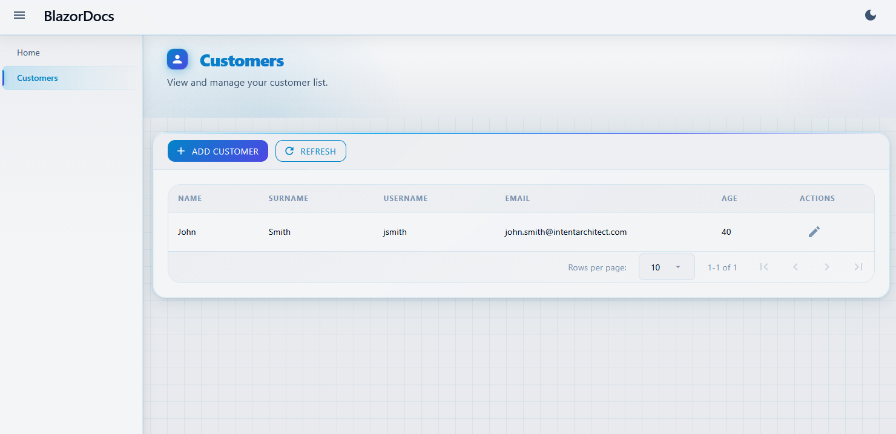

> [!NOTE]  
> While the samples here use MudBlazor, there is nothing inherently MudBlazor-specific about the implementation, and you can adjust the configuration for other component libraries.

---

## Design and Generate Your View Model

To start, create a Blazor Application in Intent Architect.

> [!NOTE]  
> Intent Architect has two Architecture Templates for quickly setting up a Blazor application:  
> - **Blazor Server** (Fullstack ASP.NET core Server)  
> - **Blazor Web Application (Standalone)** (Standalone UI which composes one or more Service Applications)

### How to Model Pages

There are two approaches to model pages: using the AI Assistant (recommended) or manually in the UI Designer.

#### Using the AI Assistant (Recommended)

Ask the `Intent Architect AI Assistant` to add/model your pages. Describe what pages you need and their purpose, and the AI will create them for you with the appropriate structure, navigations and service interactions.

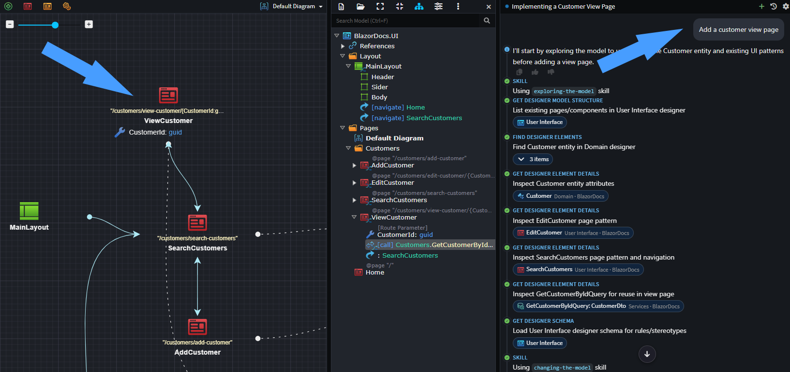

#### Manual Approach

1. Add a `Page` to a diagram in the **UI Designer**.  
2. Name the `Page`, typically describing its function (e.g., `CustomerSearch` or `CustomerAdd`).  
3. _Optional_: Adjust the route in the property pane.  

### Adding Route parameters to your page

If your page requires **Route Parameters** (e.g., `customers/edit/{customerId}`), you have two options:

#### Using the AI Assistant - Page Route

If you ask the `Intent Architect AI Assistant` to model pages that need route parameters, it will automatically add them for you. Based on the implied context (the services the page interacts with) the route parameters can usually be inferred, however you can also describe the page and its parameters in your request, and the AI will model them accordingly or ask clarifying questions.

#### Manual Approach - Page Route

1. Right-click on the `Page` → **Add Property**.  
2. Name the property (e.g., `CustomerId`) and set its type (e.g., `Guid`).  
3. Apply the `Route Parameter` stereotype to the property using **F3**.  

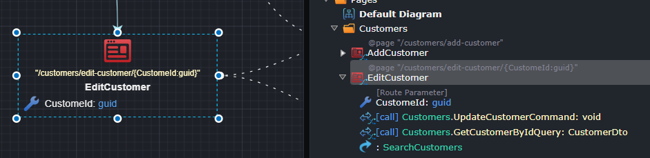

The page route will automatically update based on the route parameters.

---

### How to Model a Dialog

There are two approaches to model dialogs: using the AI Assistant (recommended) or manually in the UI Designer.

#### Using the AI Assistant (Recommended) - Dialog

Ask the `Intent Architect AI Assistant` to add and model your dialogs. Describe what dialogs you need and their purpose, and the AI will create them for you with the appropriate structure and service interactions. If your dialog requires parameterization, the AI will automatically handle adding and configuring the necessary route parameters for you.

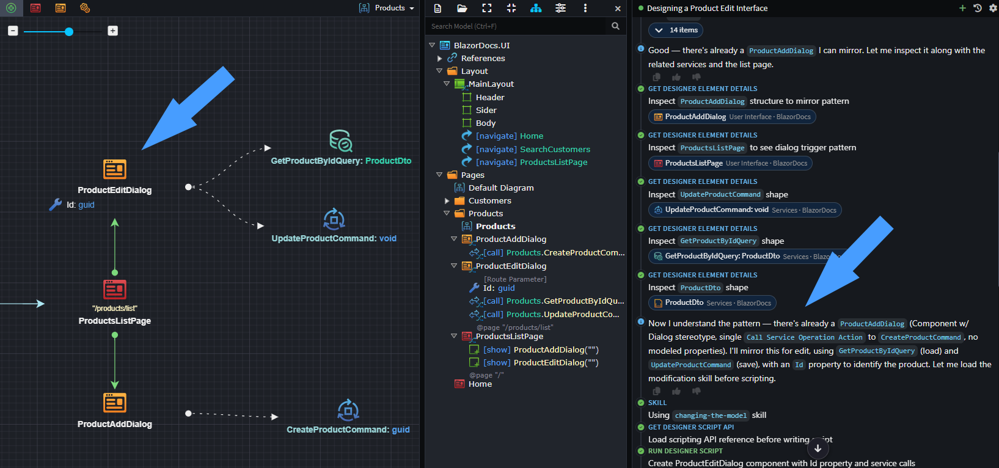

#### Manual Approach - Dialog

1. Add a `Dialog` to a diagram in the **UI Designer**, using the `New Dialog` context menu option.

If your dialog requires parameterization, you can model that as follows:

1. Right-click on the **Dialog** → **Add Property**.  
2. Name the property (e.g., `CustomerId`) and set its type (e.g., `Guid`).  
3. Apply the `Route Parameter` stereotype using **F3**.  

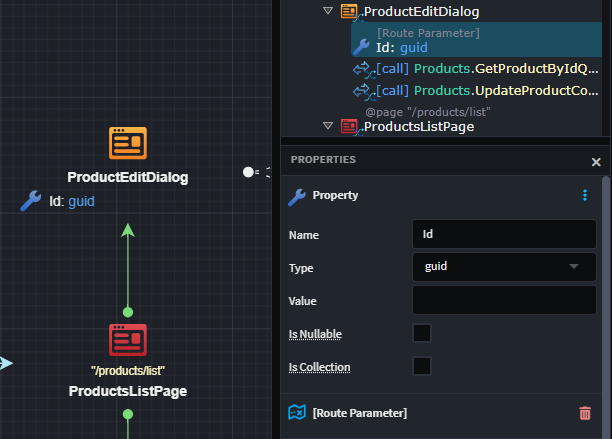

---

### How to Model a Reusable Component

There are two approaches to model reusable components: using the AI Assistant (recommended) or manually in the UI Designer.

#### Using the AI Assistant (Recommended) - Component

Ask the `Intent Architect AI Assistant` to add and model your reusable components. Describe what components you need and their purpose, and the AI will create them for you with the appropriate structure and service interactions.

#### Manual Approach - Component

1. Add a `Component` to a diagram in the **UI Designer**.  
2. Name the `Component`, typically describing its function (e.g., `AddressComponent` or `HeaderComponent`).  

If your component requires parameters or properties, you can model those by:

1. Right-click on the **Component** → **Add Property**.  
2. Name the property and set its type.  
3. Apply any relevant stereotypes using **F3** if needed.  

---

### How to Model UI Navigations

UI navigations define how users move between pages in your application. Intent Architect supports two types of navigations: direct page navigations and dialog interactions.

#### Page Navigations

1. Right-click on the `Page` → **Add Navigation**.  
2. Select the destination `Page` from the dropdown or create the connection visually in the diagram using the arrow tool.

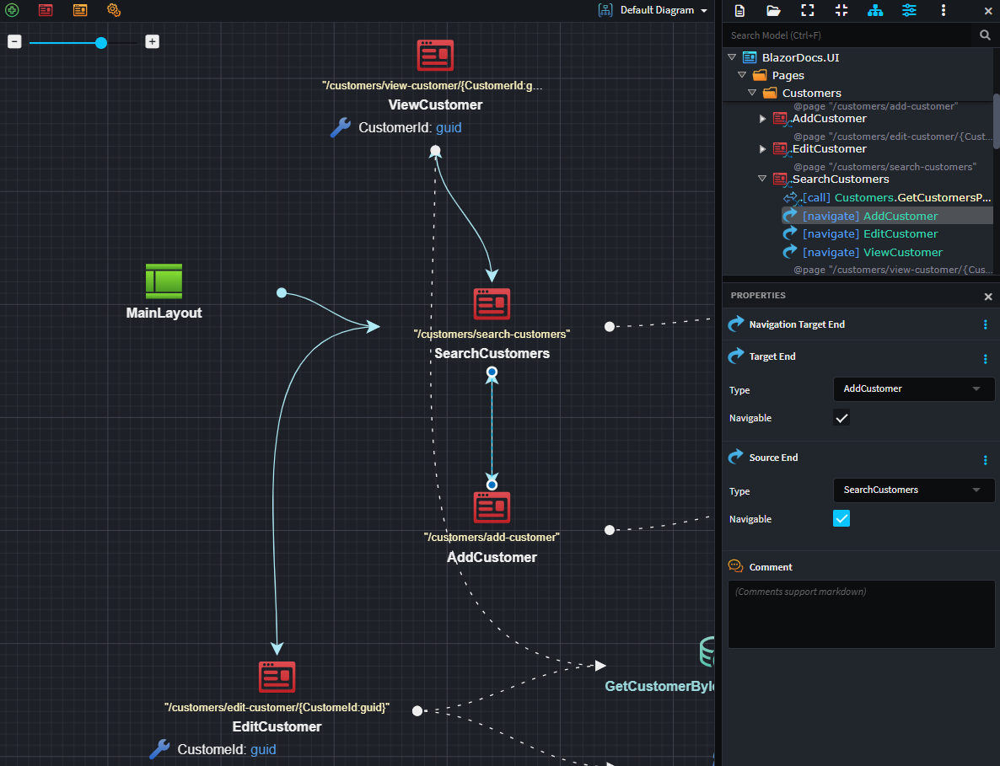

Route parameter mappings are handled automatically by the LLM during implementation, so you don't need to configure explicit mappings when your destination `Page` has `Route Parameters`.

#### Show Dialogs

1. Right-click on the `Page` or `Dialog` → **Show Dialog**.  
2. Select the `Dialog` you want to display from the dropdown or create the connection visually in the diagram using the arrow tool.

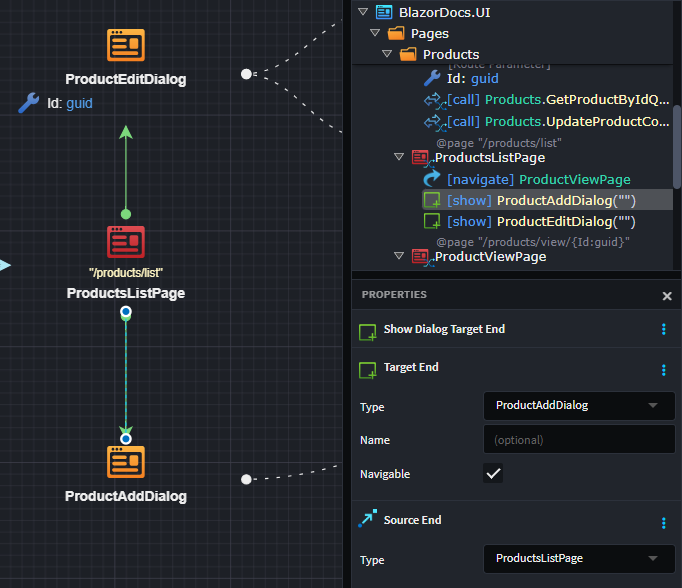

Similar to page navigations, parameter mappings for dialogs are automatically configured by the LLM during implementation, even when your `Dialog` has `Route` or `Binding Parameters`.

---

### How to Model Component Composition

Component composition allows you to reuse UI components within pages, dialogs, or other components. This promotes consistency and reduces duplication across your UI.

1. Right-click on the `Page`, `Dialog`, or `Component` → **Add Component**.  
2. Select the reusable `Component` you want to compose from the dropdown or use the arrow tool to create the composition visually in the diagram.
3. *(Optional)* Add guidance in the `Comment` section of the composition to instruct the LLM on how the component should be placed or configured.

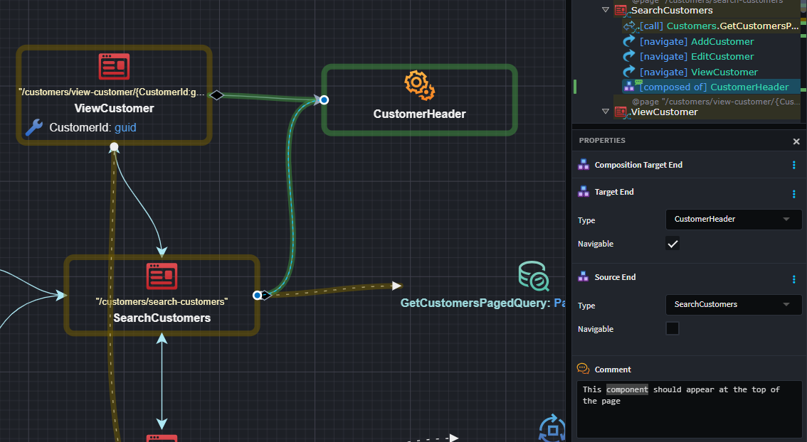

---

### Modeling Layout/Menus

Layouts define the overall structure and navigation menus of your application. Pages can be exposed in menus (sidebar, header, footer) by creating navigations from the layout to those pages.

#### Using the AI Assistant (Recommended) - Menu

When you ask the AI Assistant to model your application, it will automatically:

- Identify which pages should appear in menus based on their names and purposes
- Create navigations from the Main Layout to appropriate pages
- Prompt you to confirm if certain pages should be navigable from the main layout

If you want to control where a menu item appears (in which menu section), you can add guidance in the `Comment` section of the navigation (e.g., "show in sidebar").

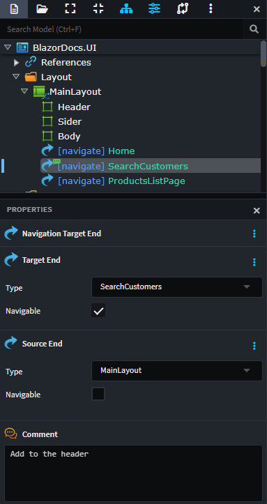

#### Manual Approach - Menu

To add a page to the application menus:

1. Right-click on the **Main Layout** → **Add Navigation**.
2. Select the `Page` you want to expose in the menu.
3. *(Optional)* Add guidance in the `Comment` section of the navigation to specify which menu section it should appear in (e.g., "sider", "header", "footer").

The LLM will use this context to correctly place the menu item during view implementation.

---

### Modeling Service Interactions

UI `Component`s interact with backend services to retrieve data and perform operations. Intent Architect simplifies this by automatically linking components to appropriate services based on context.

#### Using the AI Assistant (Recommended) - Services

When you ask the AI Assistant to model your pages, dialogs, or components, it will automatically identify and link to the relevant backend services based on the page name and description. The AI handles all mapping, property creation, and model definition configuration for you.

#### Manual Approach - Services

If you're modeling service interactions manually:

1. Right-click on the `Component` → **Call Backend Service**.
2. Select the service endpoint you want to call from the **Add to Diagram** dialog.

All the complex setup—such as creating the appropriate `Model Definition`s, configuring property mappings, and handling the data flow between queries and commands—is handled automatically by the LLM when you ask it to implement your views. You simply need to express your intent by linking the component to the services it should use.

> [!NOTE]  
> If you are not seeing the Services you want to call, [add a package reference to the `Service Package` which contains those Services in the UI Designer](#connecting-your-ui-components-to-services-in-other-applications).  

---

### Connecting Your UI Components to Services in Other Applications

When modeling service invocations, you may want to connect to Services defined in applications beyond your UI application.

The `Connect to Service` functionality is available on the UI Package, which provides a quick way to reference available services.

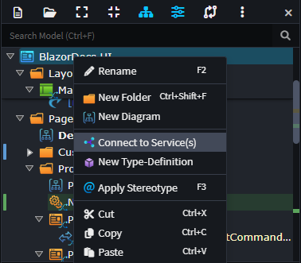

You can also manually configure a package reference:

1. In the **UI Designer**, under the **UI Package**, right-click **References** → **Add a Package Reference**.  
2. In the `Package Reference Manager` dialog, select the package containing the Services (e.g., `OtherApplication.Services`).  

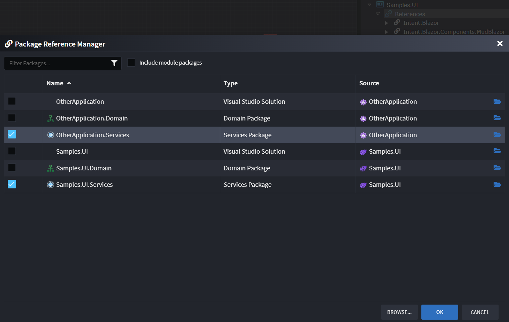

You can now use these external services in the diagrams of the UI application.

> [!NOTE]  
> You will also need the appropriate integration module installed to make the remote communication work (e.g., `Intent.Blazor.HttpClients` for a WASM UI talking to an external REST Web API, or `Intent.Integration.HttpClients` for a server-side Blazor application talking to an external REST Web API).

---

## Implement Your View with AI

Once you have modeled your **View Model** (pages, dialogs, components, navigations, and service interactions), you can ask the AI Assistant to implement your views.

### Automatic Implementation

When you ask the AI Assistant to model and implement your UI, it will automatically generate the view implementation based on:

- Your modeled information (service invocations, navigations, properties)
- Any guidance in the `Comment` sections of your components
- Your prompt instructions

The AI processes all this context to generate the appropriate Blazor code.

### Explicit Implementation

If a page wasn't automatically implemented, or if you want to regenerate a view, you can ask the AI Assistant to implement it:

1. Ask the AI Assistant to implement your page, dialog, or component (e.g., "Implement the CustomerSearch page").
2. *(Optional)* Provide any additional context you feel might be relevant.

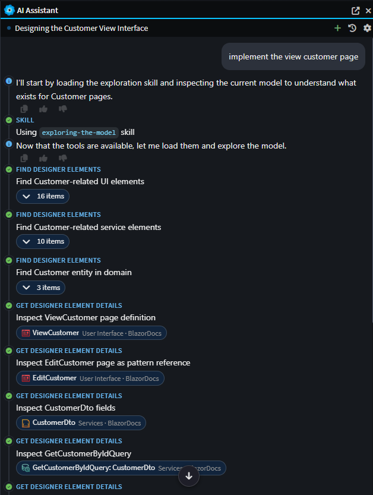

> [!TIP]  
> AI by its nature is non-deterministic — results will vary based on the context and randomness in the LLM. Review the generated code, test it, and make adjustments as needed. If you're not satisfied with the results, try regenerating with adjusted prompts or by providing additional guidance in component comments.

---

## Implement Your Menu with AI

Once you have modeled your **Main Layout** (either using the AI Assistant or manually), you can ask the AI Assistant to implement the updated menu and layout.

The AI will automatically generate the menu/layout implementation based on:

- Your modeled information (service invocations, navigations, properties)
- Any guidance in the `Comment` sections of your components
- Your prompt instructions

When the AI Assistant models a page and confirms it is navigable from the menu, it will typically auto-regenerate and reconcile the menu based on your model. If you want to manually trigger a menu implementation update, you can ask the AI Assistant to do so:

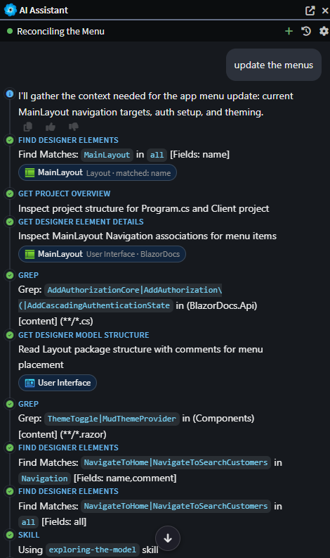

---

## Compilation Issues

When modeling is done through the AI Assistant, it will run the **Software Factory** to apply changes and build your application as part of the process to ensure there are no compilation issues. If any issues are detected, the AI Assistant will automatically investigate and make the required code updates to resolve them.

If the AI Assistant doesn't automatically resolve an issue, you can paste the error details, stack trace, or a screenshot of the error into the AI Assistant and ask it to resolve the problem.

---

## Improving the Results of AI

The AI Assistant can generate high-quality code out of the box, but following these practices will help you get even better results and reduce the need for manual revisions.

### Use Descriptive Page and Component Names

The AI uses naming conventions to understand what you're building. Instead of generic names like `Page1` or `Component1`, use descriptive names that clearly indicate the purpose:

**Good Examples:**
- `CustomerSearch` — AI recognizes this as a search/list page
- `CustomerAdd` — AI recognizes this as a form for adding a customer
- `CustomerEdit` — AI recognizes this as an edit page with fetch and update logic
- `AddressInput` — AI recognizes this as a reusable component for address input

**Why it matters:** The AI uses these naming conventions to automatically select the appropriate skill/template and create the correct structure (queries, commands, navigation, etc.) without needing additional guidance. This alone can eliminate many manual fixes.

### Add Helpful Comments to Components

Comments on your components are included in the AI prompt and help guide code generation. Use them to provide context and specific requirements:

**Examples:**
- On a search page: *"Display customers in a data grid with sorting and filtering. Allow users to click a row to edit or delete the customer."*
- On an edit dialog: *"Load the customer details and allow updates to name, email, and phone number. Disable the ID field."*
- On a component: *"Reusable component for selecting a date range. Should have a start date and end date picker. Include validation to ensure start date is before end date."*
- On a navigation: *"Show this menu item in the sidebar under 'Admin'."*

**Why it matters:** Comments guide the AI on:
- Features to include
- Validation rules
- UI placement and behavior
- Business logic requirements

This reduces iterations and helps the AI generate code closer to your requirements on the first try.

### Using Skills and Samples

Intent Architect provides out-of-the-box skills with associated sample files for implementing common UI patterns. These pre-configured skills are found in the `.agents` folder and help guide the AI Assistant:

| Skill                   | Used for                             |
|-------------------------|--------------------------------------|
| Page - Search Entity    | search, find, list, lookup           |
| Page - Add Entity       | add, create, new, insert, register   |
| Page - Edit Entity      | edit, update, modify, change         |
| Page - View Entity      | view, details, detail, show          |
| Dialog - Add Entity     | dialog, add, create, new, insert     |
| Dialog - Edit Entity    | dialog, edit, update, modify, change |

The AI automatically selects the best skill based on your naming conventions. You can also [customize or create your own skills](#customizing-or-creating-your-own-skills) for your specific needs.

### Provide Additional Prompt Context

You typically don't need to provide additional context, but if the AI is making the same mistakes or you need more specific guidance, you can provide extra instructions when prompting. Examples:

- *"Ensure buttons/actions exist for the new navigations I added."*
- *"Refresh the grid if the add customer dialog closes successfully."*
- *"Ensure you have controls for adding and removing addresses."*

### Reference Existing Examples

If you already have a similar screen you want the new one to be based on, you can tell the AI Assistant to use it as a reference. You can even attach the razor/cs file as an attachment to the prompt for concrete guidance about style and structure.

---

## Updating Styling from a New `design.md`

As part of the default Blazor templates, a `design.md` file is generated alongside your application. It documents the out-of-the-box style sheet - colors, typography, spacing and component conventions - and is automatically included as context whenever the AI generates a **View**. This is what keeps styling consistent across all your AI-generated pages.

If your design changes (e.g., a new brand palette, updated component variants, or a refreshed style guide), you don't need to touch each `Component` individually. Instead:

1. Replace the existing `design.md` with your updated version or include it as an attachment to the prompt.
2. Give the AI Assistant a prompt such as:  
   *"A new `design.md` is available - update the stylesheets with the new design values."*  
   A dedicated skill picks up on this, extracts what's required from `design.md`, and updates the relevant CSS files accordingly.

Because styling is centralized in the CSS files rather than duplicated per `Component`, this single AI Task updates styling application-wide - there is no need to run it against each Page or Dialog separately.

> [!NOTE]  
> Because `design.md` is included automatically as AI prompt context, any *new* Views you generate after replacing it will already reflect the updated design. The AI Task above is only needed to retrofit the CSS for styling that was already generated before the change.

---

## Customizing or Creating your own skills

Intent Architect comes with pre-configured templates and samples for common UI patterns (search pages, add dialogs, etc.). You can either customize these existing skills or create your own entirely new skills to tailor the AI-driven code generation to your specific needs.

### Customizing Existing Skills

If you want to modify an existing skill or sample implementation:

1. Locate the skill in the `.agents` folder within your Intent Architect application.
2. Update the skill files (markdown guidance and code samples).
3. Once you've customized a skill, Intent Architect will recognize it as a custom version and will no longer attempt to overwrite it with default updates.

This allows you to maintain your customizations across Intent Architect updates while still benefiting from other new features.

### Creating Your Own Skills

You can create completely custom skills from scratch by:

1. Using the existing skill structure as a template in the `.agents` folder.
2. Creating a new folder for your skill with your skill definition file and sample implementations.
3. Following the same structure as the pre-configured templates.
4. Once created, your custom skills will automatically be available to the AI Assistant when generating views.

This approach allows you to:

- Enforce your organization's UI patterns and conventions
- Provide specific guidance for complex components
- Maintain consistency across all AI-generated code
- Reuse solutions for common UI scenarios in your application

> [!TIP]  
> Start by copying an existing skill template and modifying it to fit your needs. This ensures you follow the correct structure and format that the AI will understand.
