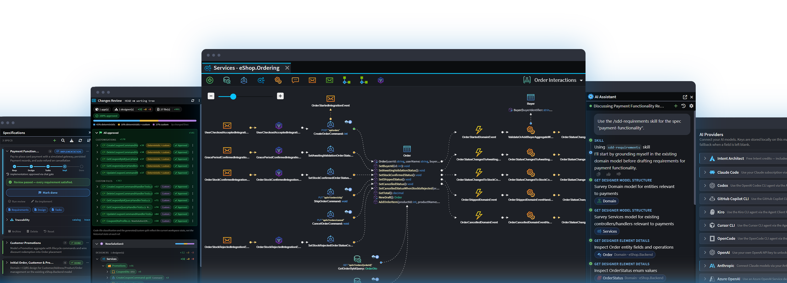

# Introduction to Intent Architect

Intent Architect is the first control plane for agentic .NET software development.

It's the platform .NET teams use to turn AI into a well-governed, repeatable, and enterprise-scale delivery system, using their preferred service providers and coding harnesses.

It brings reliable architectural guardrails, authoritative design blueprints, and advanced governance tools to agentic development – giving teams the control they need to scale AI-driven velocity, without compromising on quality and accountability.

---

## Getting started

<ul class="cards-grid cards-3">
  <li>
    

      
<svg class="landing-svg" viewBox="0 0 24 24">
  <defs><linearGradient id="grad-get" x1="0" y1="0" x2="0" y2="1"><stop offset="0%" stop-color="#09C4FF"/><stop offset="100%" stop-color="#0070C0"/></linearGradient></defs>
  <path stroke="url(#grad-get)" fill="none" stroke-width="1.5" stroke-linecap="round" stroke-linejoin="round" d="M12 3v12"/>
  <path stroke="url(#grad-get)" fill="none" stroke-width="1.5" stroke-linecap="round" stroke-linejoin="round" d="M8 11l4 4 4-4"/>
  <path stroke="url(#grad-get)" fill="none" stroke-width="1.5" stroke-linecap="round" stroke-linejoin="round" d="M4 17v1a2 2 0 0 0 2 2h12a2 2 0 0 0 2-2v-1"/>
</svg>
      
      

        <strong class="card-title">Get Intent Architect</strong>
        
Download and install the latest Intent Architect for your environment.

      

      
    

  </li>
  <li>
    

      
<svg class="landing-svg" viewBox="0 0 24 24">
  <defs><linearGradient id="grad-qs" x1="0" y1="0" x2="0" y2="1"><stop offset="0%" stop-color="#09C4FF"/><stop offset="100%" stop-color="#0070C0"/></linearGradient></defs>
  <path stroke="url(#grad-qs)" fill="none" stroke-width="1.5" stroke-linecap="round" stroke-linejoin="round" d="M13 3L4 14h7l-1 7 9-11h-7l1-7z"/>
</svg>
      
      

        <strong class="card-title">Quick Start</strong>
        
Generate a working .NET solution in minutes and learn the core workflow.

      

      
    

  </li>
  <li>
    

      
<svg class="landing-svg" viewBox="0 0 24 24">
  <defs><linearGradient id="grad-tut" x1="0" y1="0" x2="0" y2="1"><stop offset="0%" stop-color="#09C4FF"/><stop offset="100%" stop-color="#0070C0"/></linearGradient></defs>
  <path stroke="url(#grad-tut)" fill="none" stroke-width="1.5" stroke-linecap="round" stroke-linejoin="round" d="M3 19a9 9 0 0 1 9 0 9 9 0 0 1 9 0M3 6a9 9 0 0 1 9 0 9 9 0 0 1 9 0M3 6v13M12 6v13M21 6v13"/>
</svg>
      
      

        <strong class="card-title">Tutorials</strong>
        
Hands-on guides to learn the fundamentals and more.

      

      
    

  </li>
</ul>

---

## Key Concepts

<ul class="cards-grid cards-2x2">
  <li>
    

      
<svg class="landing-svg" viewBox="0 0 24 24">
  <defs><linearGradient id="grad-mod" x1="0" y1="0" x2="0" y2="1"><stop offset="0%" stop-color="#09C4FF"/><stop offset="100%" stop-color="#0070C0"/></linearGradient></defs>
  <rect x="8.4" y="2.4" width="7.2" height="7.2" rx="1.3" stroke="url(#grad-mod)" fill="none" stroke-width="1.5"/>
  <rect x="2.4" y="12.6" width="7.2" height="7.2" rx="1.3" stroke="url(#grad-mod)" fill="none" stroke-width="1.5"/>
  <rect x="14.4" y="12.6" width="7.2" height="7.2" rx="1.3" stroke="url(#grad-mod)" fill="none" stroke-width="1.5"/>
</svg>
      
      

        <strong class="card-title">Reliable Architectural Guardrails</strong>
        
Safeguard codebase quality and maintainability. Intent Architect's advanced guardrail system combines both deterministic and probabilistic enforcement to ensure architectural adherence without adding to the validation burden, and scales across teams without developers having to internalize their standards and context files to validate agentic adherence.

      

      
    

  </li>
  <li>
    

      
<svg class="landing-svg" viewBox="0 0 24 24">
  <defs><linearGradient id="grad-vdt" x1="0" y1="0" x2="0" y2="1"><stop offset="0%" stop-color="#09C4FF"/><stop offset="100%" stop-color="#0070C0"/></linearGradient></defs>
  <rect x="2" y="3" width="8" height="5" rx="1" stroke="url(#grad-vdt)" fill="none" stroke-width="1.5"/>
  <rect x="14" y="3" width="8" height="5" rx="1" stroke="url(#grad-vdt)" fill="none" stroke-width="1.5"/>
  <rect x="8" y="16" width="8" height="5" rx="1" stroke="url(#grad-vdt)" fill="none" stroke-width="1.5"/>
  <path stroke="url(#grad-vdt)" fill="none" stroke-width="1.5" stroke-linecap="round" d="M6 8v4h12V8M12 12v4"/>
</svg>
      
<!--      🧩-->
      

        <strong class="card-title">Authoritative Design Blueprints</strong>
        
Stay on top of your system's design and minimize technical and cognitive debt. Living blueprints give you an always-accurate visualisation of your design, making architectural decisions explicit and visible to the whole team. And provide an intuitive way to consistently confirm whether agents are meeting your specifications and making good design decisions.

      

      
    

  </li>
  <li>
    

      
<svg class="landing-svg" viewBox="0 0 24 24">
  <defs><linearGradient id="grad-rev" x1="0" y1="0" x2="0" y2="1"><stop offset="0%" stop-color="#09C4FF"/><stop offset="100%" stop-color="#0070C0"/></linearGradient></defs>
  <path stroke="url(#grad-rev)" fill="none" stroke-width="1.5" stroke-linecap="round" stroke-linejoin="round" d="M20.5 12a8.5 8.5 0 0 1-14.2 6.3M3.5 12a8.5 8.5 0 0 1 14.2-6.3"/>
  <path stroke="url(#grad-rev)" fill="none" stroke-width="1.5" stroke-linecap="round" stroke-linejoin="round" d="M17.7 2.5v3.2h-3.2M6.3 21.5v-3.2h3.2"/>
  <path stroke="url(#grad-rev)" fill="none" stroke-width="1.5" stroke-linecap="round" stroke-linejoin="round" d="M8.8 12.2l2.2 2.2 4.2-4.6"/>
</svg>
      
      

        <strong class="card-title">Advanced Validation Tools</strong>
        
Streamline validation and alleviate delivery bottlenecks. Denoise the review process and focus on the things that matter most, e.g., design shifts, architectural shifts and high-risk changes. Teams aren't overwhelmed by large PRs, don't just rubberstamp code, and never push significant risk downstream.

      

      
    

  </li>
  <li>
    

      
<svg class="landing-svg" viewBox="0 0 24 24">
  <defs><linearGradient id="grad-sdd" x1="0" y1="0" x2="0" y2="1"><stop offset="0%" stop-color="#09C4FF"/><stop offset="100%" stop-color="#0070C0"/></linearGradient></defs>
  <path stroke="url(#grad-sdd)" fill="none" stroke-width="1.5" stroke-linecap="round" stroke-linejoin="round" d="M12 2l9 4.5-9 4.5-9-4.5 9-4.5z"/>
  <path stroke="url(#grad-sdd)" fill="none" stroke-width="1.5" stroke-linecap="round" stroke-linejoin="round" d="M3 11l9 4.5 9-4.5"/>
  <path stroke="url(#grad-sdd)" fill="none" stroke-width="1.5" stroke-linecap="round" stroke-linejoin="round" d="M3 16l9 4.5 9-4.5"/>
</svg>
      
      

        <strong class="card-title">SDD with Traceability</strong>
        
Go from requirements to production-ready code, step by step, with full traceability. Drive agentic development with high-quality specifications that are easier to comprehend and traceability features that answer the why – exactly which requirements drove which code, and vice versa. So you stay in control from requirements through to code.

      

      
    

  </li>
</ul>

---

## Watch a demo of the latest features

  <iframe style="width: 100%; height: 100%; border: 0" src="https://www.youtube.com/embed/bGofnbPQV8k?si=EAVqpiut4fVwkf_L" title="YouTube video player" frameborder="0" allow="accelerometer; autoplay; clipboard-write; encrypted-media; gyroscope; picture-in-picture; web-share" referrerpolicy="strict-origin-when-cross-origin" allowfullscreen></iframe>

Watch the Intent Architect version 5.2 new-features demo.

Gareth Baars, founder and CEO of Intent Architect, shares some of the recent enhancements around validating, trusting, and managing changes in an agentic development workflow, and expands on how Intent Architect gives teams enhanced control in this evolving landscape.

What's covered in this demo:
- New traceability features for reviewing commits, giving teams visibility and clarity even as codebases become increasingly "black-boxed".
- Enhanced change-review features to better support agentic development, making it easy to prioritize and optimize code-review processes.
- Specification change tracking, surfacing exactly how your authoritative design specifications evolve over time.
- A simplified, unified UI that brings your model, your code, and your repository together in a single, streamlined workspace.
- A new Git Source Control panel and Changes Review tab, so you can see and review everything flowing through your solution without tabbing out.
- The new Specifications panel and Spec-Driven Development (SDD) system (Beta), turning design specifications into a control plane for fully agentic software development.

---

## Next Steps

- Continue to **[Get Intent Architect](xref:getting-started.get-the-application)**
- Jump to **[Quick start](xref:introducing.quickstart)**
- Explore **[Tutorials](xref:tutorials.fundamentals-landing-page)**

