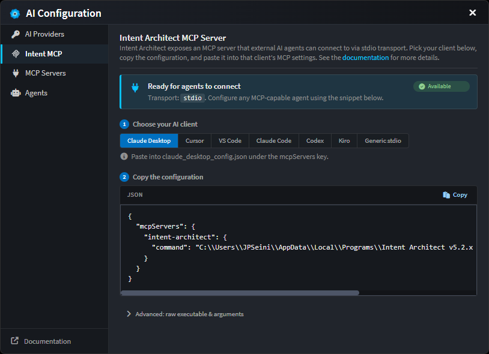
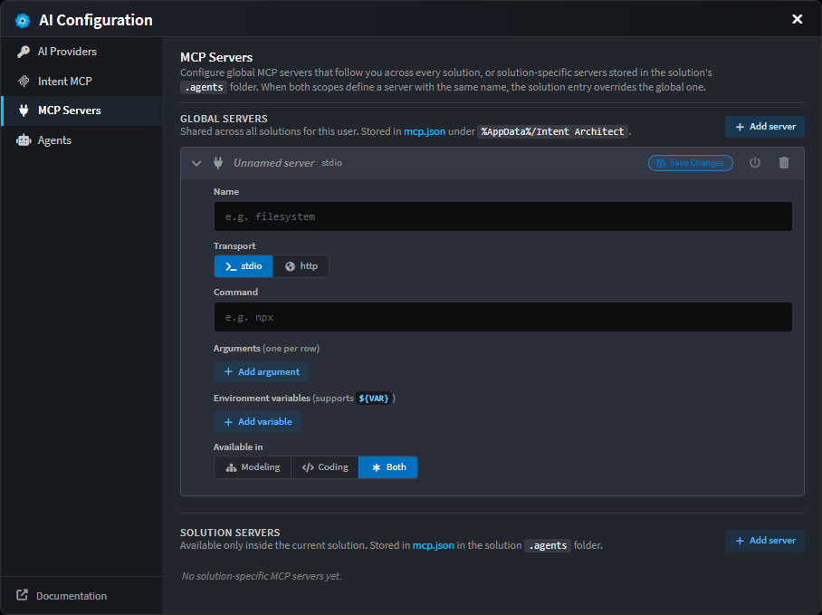
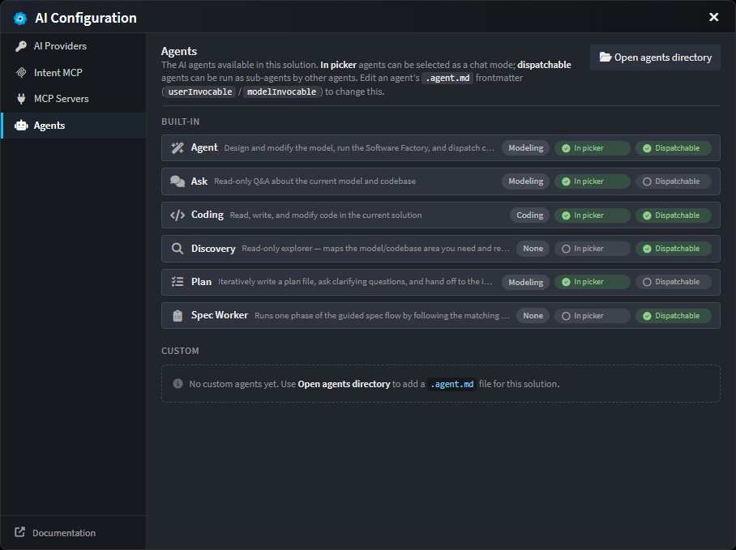

# AI Configuration

Open via the **AI Configuration** dialog in the AI chat window. There are three tabs.

---

## 1. AI Providers

Connect Intent's agents to one or more LLM services. API keys are stored **locally**. If a key field is left blank, Intent falls back to the matching environment variable (e.g. `OPENAI_API_KEY`). Without any key, usage is capped by the free daily budget.

| Provider                  | What you need                                                                                                              |
| ------------------------- | -------------------------------------------------------------------------------------------------------------------------- |
| **Intent Architect**       | No setup required; includes free Intent credits                                                                             |
| **OpenAI**                | API key (`sk-...`)                                                                                                         |
| **Anthropic**             | API key (`sk-ant-...`); optional **Max Output Tokens** (blank = model default)                                              |
| **Azure OpenAI**          | API key, **Endpoint URL** (`https://<your-resource>.openai.azure.com/`), and **Deployment Name** of your Azure OpenAI model |
| **Google Gemini**         | API key                                                                                                                    |
| **OpenRouter**            | API key                                                                                                                    |
| **OpenAI-Compatible**     | API key, **Base URL** of the API, and **Model** name (use this for providers like Groq, Together, Fireworks, etc.)         |
| **Ollama**                | **Host URL** (e.g. `http://localhost:11434`) and **Model** name; API key only if your host is behind an auth proxy          |
| **GitHub Copilot**        | GitHub Copilot subscription                                                                                                |
| **Claude Code**           | Claude Code CLI (Agent Client Protocol)                                                                                   |
| **Codex**                 | OpenAI Codex CLI agent (Agent Client Protocol)                                                                             |
| **GitHub Copilot CLI**    | GitHub Copilot CLI agent (Agent Client Protocol)                                                                           |
| **Kiro**                  | Kiro CLI agent (Agent Client Protocol)                                                                                    |

Each provider shows a status pill: **Not configured** → **Save Changes** (after edits) → **Configured**.

---

## 2. Intent MCP

Intent Architect exposes its own MCP server, so external AI agents (Claude Desktop, Cursor, VS Code Copilot, etc.) can drive Intent. Transport is **stdio**.

To set up:

1. Pick your AI client from the segmented selector.
2. Copy the generated snippet and paste it into that client's MCP configuration.

The **Advanced** toggle reveals the raw executable path and arguments if you need to assemble a config by hand.

For more details on what the Intent MCP server does and how external agents use it, see .

---

## 3. MCP Servers

Connect **external** MCP servers to add extra tools for your AI. You can define servers globally (shared across all solutions) or per-solution (available only in that solution).

### Global vs. Solution-specific servers

| Scope            | Storage Location                                        | Availability                    |
| ---------------- | ------------------------------------------------------- | ------------------------------- |
| **Global**       | `mcp.json` under `%AppData%/Intent Architect`          | Shared across all your solutions |
| **Solution**     | `mcp.json` in the solution's `.agents` folder          | Available only in this solution  |

When both scopes define a server with the same name, the solution-level entry overrides the global one.

### Configuring a server

For each server you can configure:

| Field          | Notes                                                                                  |
| -------------- | -------------------------------------------------------------------------------------- |
| **Name**       | Free-form label (e.g. `filesystem`)                                                    |
| **Transport**  | `stdio` (launch a local command) or `http` (call a remote endpoint)                    |
| **Command**    | *(stdio)* Executable to launch - e.g. `npx`                                             |
| **Arguments**  | *(stdio)* One per row                                                                  |
| **Env vars**   | *(stdio)* Key/value pairs; supports `${VAR}` substitution from your environment         |
| **URL**        | *(http)* Endpoint URL                                                                  |
| **Headers**    | *(http)* Key/value pairs; supports `${VAR}` substitution                                |
| **Available in** | Choose whether the server's tools are available to **Modeling**, **Coding**, or **Both** |

Each server has a status pill (**Not tested**, **Testing…**, **Connected**, **Error**, **Disabled**) and a power toggle to enable/disable it without deleting the entry. Disabled servers stay in the file but aren't loaded.

Edits are local until you click **Save Changes** on the entry.

---

## 4. Agents

View all agents available in this solution, including built-in agents and any custom agents you've added. Each agent can be configured to appear in the chat mode picker and/or be runnable as a sub-agent by other agents.

### Agent capabilities

Each agent has two availability modes, controlled via its `.agent.md` frontmatter (`userInvocable` / `modelInvocable`):

| Mode            | Meaning                                                      |
| --------------- | ------------------------------------------------------------ |
| **In picker**   | Agent appears as a selectable chat mode in the UI            |
| **Dispatchable**| Agent can be invoked as a sub-agent by other agents          |

### Built-in agents

Intent Architect ships with six built-in agents:

| Agent       | Context  | Purpose                                                                       |
| ----------- | -------- | ----------------------------------------------------------------------------- |
| **Agent**   | Modeling | Design and modify the model, run the Software Factory, and dispatch tasks    |
| **Ask**     | Modeling | Read-only Q&A about the current model and codebase                           |
| **Coding**  | Coding   | Read, write, and modify code in the current solution                         |
| **Discovery**| None    | Read-only explorer—maps the model/codebase area you need and reports findings |
| **Plan**    | Modeling | Iteratively write a plan file, ask clarifying questions, and hand off to agents |
| **Spec Worker** | None | Runs one phase of the guided spec flow by following the matching rules       |

### Custom agents

To add a custom agent for this solution, click **Open agents directory** and create a new `.agent.md` file. For details on agent structure and how to write custom agents, see .
