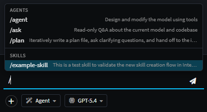

# Agent Context Loading

How Intent's AI agents discover the files that shape their behavior - agent definitions, instruction files, and skills - and where each type is loaded from at runtime.

## The two contexts: `coding` vs `modeling`

Intent's AI surfaces are split across two contexts:

- **`coding`** - the **AI Coding Assistant** inside the [Software Factory](xref:application-development.software-factory.about-software-factory-execution), which works against an application's generated source code.
- **`modeling`** - the **AI Modeling Assistant**, which works against the Intent designers (e.g. Domain, Services, User Interface, etc.).

Each context has its own root folder for instruction files, skills, and per-context conventions: modeling-time files live alongside the solution, code-time files live alongside the generated code. An agent only loads the context files for its declared context - a modeling agent will never see files in the application's output folder, and vice versa.

> See [Custom Agents](xref:ai.custom-agents) for how an agent declares which context(s) it appears in.

---

## Folder Structure

The fastest way to understand context loading is to see the folder layouts for each context. Everything below is automatic - drop the right files in the right places and they're picked up.

### Modeling layout

A modeling agent running in the context of a solution at `~/MySolution/` will read context files in the following structure:

```text
~/MySolution/intent/
└── .agents/
│   ├── AGENTS.md                       ← always loaded into the system prompt
│   ├── INTENT.md                       ← always loaded into the system prompt
│   ├── agents/
│   │   └── reviewer.agent.md           ← appears in the agent dropdown
│   ├── instructions/
│   │   ├── style-guide.md              ← always loaded (no frontmatter)
│   │   └── api-rules.md                ← only loaded when an attachment matches its `applyTo`
│   └── skills/
│       └── data-modeling/
│           └── SKILL.md                ← listed for on-demand loading
└── MySolution.isln                     ← the `.isln` file for the solution
```

### Coding layout

A coding agent for the same solution, with the application's output at `~/MySolution/MyApp/`, will read as follows:

```text
~/MySolution/MyApp/
├── CLAUDE.md                           ← always loaded
├── AGENTS.md                           ← always loaded
├── .cursorrules                        ← always loaded
├── .github/
│   ├── copilot-instructions.md         ← always loaded
│   └── instructions/
│       └── *.instructions.md           ← always loaded (or scoped by `applyTo`)
├── .claude/
│   ├── rules/*.md                      ← always loaded (or scoped)
│   └── skills/<skill>/SKILL.md         ← listed for on-demand loading
├── .cursor/
│   └── rules/*.md, *.mdc               ← always loaded (or scoped)
└── .agents/
    ├── instructions/*.md               ← always loaded (or scoped)
    └── skills/<skill>/SKILL.md         ← listed for on-demand loading
```

These coding-side conventions match the dotfile layouts used by Claude Code, GitHub Copilot, Cursor, and Intent - so existing repo-level guidance keeps working out of the box.

---

## 1. Agent definitions (`*.agent.md`)

Agents can be customized by creating `.agent.md` files (YAML frontmatter + a system-prompt body) under `{solutionFolder}/.agents/agents/`. The agent's id is the filename minus `.agent.md`; drop a file with the same id as a built-in to override it for this solution only, or use a fresh id to add a new entry to the chat dropdown.

For the full file format, frontmatter reference, tool-selection guidance, and worked examples, see **[Custom Agents](xref:ai.custom-agents)**.

---

## 2. Instruction files

Plain markdown files (with optional YAML frontmatter) that get injected into every turn of the agent's system prompt under an `<instructions>` block.

### Modeling context - under `<solutionFolder>.agents/`

| Path                  | Glob              |
| --------------------- | ----------------- |
| `instructions/`       | `*.md`            |
| `AGENTS.md`           | *(single file)*   |
| `INTENT.md`           | *(single file)*   |

### Coding context - under the application's output folder

| Path                                  | Glob                  |
| ------------------------------------- | --------------------- |
| `.github/instructions/`               | `*.instructions.md`   |
| `.claude/rules/`                      | `*.md`                |
| `.agents/instructions/`               | `*.md`                |
| `.cursor/rules/`                      | `*.md` and `*.mdc`    |
| `CLAUDE.md`                           | *(single file)*       |
| `.github/copilot-instructions.md`     | *(single file)*       |
| `.cursorrules`                        | *(single file)*       |
| `AGENTS.md`                           | *(single file)*       |

### Optional frontmatter

```yaml
---
description: One-line summary
alwaysApply: false
applyTo:
  - "**/*.cs"
  - "src/api/**"
---
```

| Field                                          | Meaning                                                                |
| ---------------------------------------------- | ---------------------------------------------------------------------- |
| `description`                                  | Human-readable summary                                                 |
| `alwaysApply`                                  | If `true`, included regardless of patterns or attachments              |
| `applyTo` / `appliesTo` / `globs` / `paths`    | Glob list - only included when a chat attachment matches one of these  |

**Glob behavior:**

- `**` - any characters, including `/`
- `*` - any characters except `/`
- `?` - single character except `/`

**Applicability rules**, in order:

1. `alwaysApply: true` → included.
2. No patterns set → included (frontmatter is optional).
3. Patterns set → included only if at least one of the chat's attachments matches.

> **Files without frontmatter are always included.** That's why `AGENTS.md`, `INTENT.md`, `CLAUDE.md`, and similar are reliably picked up on every turn.

---

## 3. Skills

Skills are bundles of focused, reusable instructions invoked on demand - for example, "use the `database-migration` skill to plan this change." Each skill lives in its own folder containing a `SKILL.md`:

```text
.agents/skills/
└── database-migration/
    ├── SKILL.md          ← required, with frontmatter
    └── …support files
```

**`SKILL.md` frontmatter:**

```yaml
---
name: database-migration
description: Plan and execute a safe DB migration with rollback
---
```

The markdown body is the instruction content that gets loaded when the skill is activated.

### Where skills are searched

| Context    | Folders searched (first hit per skill `name` wins)                                          |
| ---------- | ------------------------------------------------------------------------------------------- |
| `modeling` | `{solutionFolder}/.agents/skills/`                                                          |
| `coding`   | `{appOutputFolder}/.claude/skills/`, `.github/skills/`, `.agents/skills/`                   |

If the same skill name exists in multiple folders, the first one wins - so a skill in `.claude/skills/foo/` shadows one in `.agents/skills/foo/` for coding agents.

### How a skill ends up in the prompt

There are three ways a skill becomes active for a turn:

1. **Manifest only** - every discovered skill is listed (name + description) in the system prompt, telling the agent it *could* request the skill.
2. **`use_skill` tool call** - the agent calls the always-available `use_skill` tool with the skill's name. The skill body (i.e. the `SKILL.md` file excluding its frontmatter) is loaded and included in the next turn.
3. **Slash command** - if the user's chat message contains `/skill-name` (matching a discovered skill), that skill is auto-loaded for the turn - no tool call needed.

    

---

## Summary

- **Modeling files** live under `{solutionFolder}/.agents/` - agent definitions, instructions, skills, and the always-loaded `AGENTS.md`/`INTENT.md`.
- **Coding files** live under each application's output folder, using the dotfile conventions of Claude Code, GitHub Copilot, Cursor, and Intent.
- **Instructions without frontmatter are always loaded.** Use `applyTo` patterns when you want to scope an instruction file to particular file attachments.
- **Skills are opt-in.** They're advertised in the prompt but only loaded when the agent explicitly requests them or the user invokes them with `/skill-name`.
