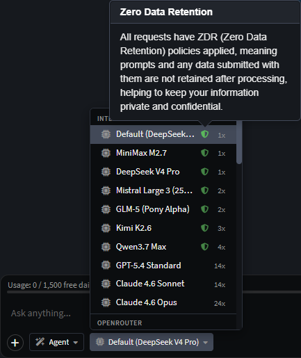

# AI Data Privacy

## What Intent Architect sends and retains

When you interact with an AI agent in Intent Architect, your prompts, conversation history, and any attached context are sent directly to whichever AI provider you have configured. **Intent Architect itself does not store, log, or retain any of this data.** The application acts as a pass-through - requests go from your machine to the provider's API and responses come straight back; nothing is persisted on Intent Architect's servers.

What is sent to the provider depends on the agent and context, but can include:

- Your chat messages and conversation history
- Loaded context files (e.g. `AGENTS.md`, instruction files, `.agent.md` definitions)
- Snapshots of designers, diagrams, or model elements
- File contents read from your codebase during a coding agent turn

Your own AI provider keys, entered in [AI Configuration](xref:ai.configuration#1-ai-providers), are stored **locally on your machine only**.

## Bring-your-own provider

When you configure a provider yourself (OpenAI, Anthropic, Azure OpenAI, Gemini, Ollama, etc.) your data is governed exclusively by that provider's own data handling and retention policies. Intent Architect has no influence over - or visibility into - what those providers do with your requests.

## "Intent Architect" free AI credits

When using the Intent Architect free AI credits option, depending on the provider we've selected, it may route requests through [OpenRouter](https://openrouter.ai) where we have applied **Zero Data Retention (ZDR)** to all supported models.

ZDR is an OpenRouter feature that instructs the underlying model provider not to store your request or response data. When ZDR is active:

- Request and response content is **never written to disk** by the provider
- The data is used only to fulfil the single request and is discarded immediately afterwards
- No training, logging, or storage occurs on the provider side

OpenRouter documents how this is enforced at <https://openrouter.ai/docs/guides/features/zdr>.

### Frontier model exception

ZDR cannot currently be applied to frontier models (e.g. the latest GPT-4o or Claude 3.5 Sonnet variants) because those providers do not offer a zero-retention tier for their newest releases. When you select a frontier model via the Intent Architect built-in provider, requests are handled under that provider's standard data policy rather than ZDR.

> [!NOTE]
> The distinction is visible in the UI: models that have ZDR applied display a **green shield icon** next to their name in the model selection list. If no shield is shown, the model does not have ZDR active and the provider's standard data handling policy applies.
>
> 

### Choosing a model

If data retention is a concern, select any model marked with the green shield icon to ensure ZDR is in effect. For the strictest possible data handling, avoid frontier models or use a bring-your-own provider (such as Azure OpenAI or Anthropic) where you control the retention settings directly via your own agreement with the provider.
