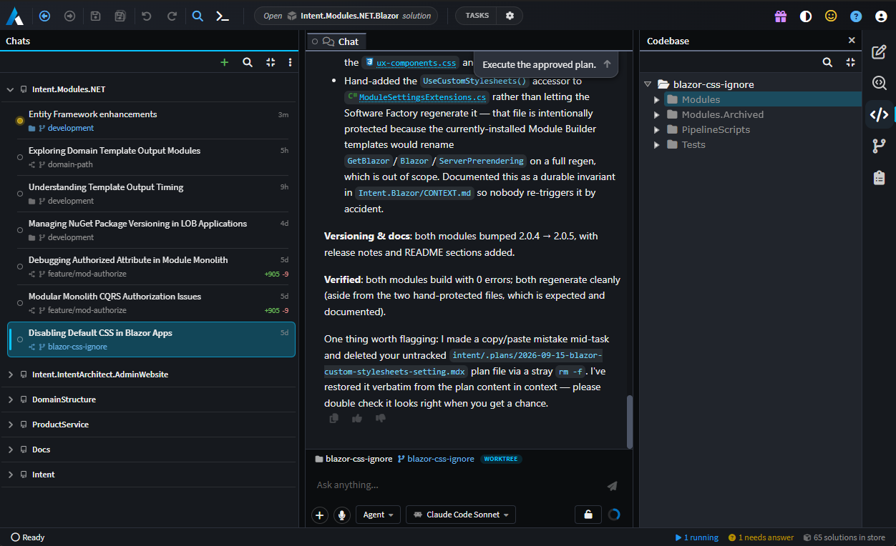
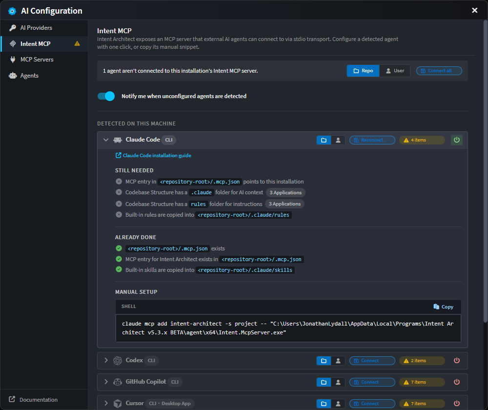

# AI in Intent Architect

Intent Architect is a control plane for agentic software development. It works with a team's preferred AI service provider and coding harness, and gives teams a control framework made up of four components:

- **[Reliable Architectural Guardrails](xref:key-concepts.deterministic-codegen)** – deterministic and probabilistic enforcement that ensure agents consistently adhere to the team's architecture and standards.
- **[Authoritative Design Blueprints](xref:key-concepts.visual-modeling)** – living visual models of the system's design that stay true to the codebase and help teams minimize technical and cognitive debt.
- **[Advanced Validation Tools](xref:key-concepts.codebase-integration)** – tools to denoise Pull Requests (PRs) and optimize validation processes for agentic development.
- **[Spec-Driven Development with Traceability](xref:key-concepts.non-deterministic-codegen)** – a system for building high-quality requirements and specifications, and driving them through to code, with full traceability.

This section covers how AI agents operate within that control framework, and the options available for driving it.

---

## Three ways to drive it

The control framework applies identically across all three paths – the same guardrails, blueprints and traceability, regardless of which agent does the work or where it runs. Teams can adopt whichever path fits their existing workflow, and Change Review and the Specs panel remain available in Intent Architect throughout.

| Path                                                                          | Where it runs                                                                  |
| ----------------------------------------------------------------------------- | ------------------------------------------------------------------------------ |
| **[Intent Architect's own agents](#intent-architects-own-agents)**             | In Intent Architect, using its built-in agents                                 |
| **[Your CLI as a provider](#your-cli-as-a-provider)**                         | In Intent Architect, using an existing CLI agent as the provider                |
| **[An external harness via Intent MCP](#an-external-harness-via-intent-mcp)**  | In an IDE or terminal – VS Code, Rider, Visual Studio – driving Intent Architect remotely |

### Intent Architect's own agents

Intent Architect comes with a set of built-in agents that operate directly against the designers, run the Software Factory, and delegate implementation work to a coding agent automatically. See [Built-in Agents](xref:ai.built-in-agents).

For running several tasks concurrently, **Manage Agents** is a top-level window that owns every agent conversation across every repository and solution on the machine. Each conversation can be allocated its own Git worktree, so parallel tasks remain isolated from one another, and each row reports the checkout it ran in and the volume of uncommitted work it has produced. A full workspace surrounds the chat – designers, files, diffs, terminals, Git and Change Review – scoped to the selected conversation. See [Manage Agents](xref:application-development.manage-agents).

### Your CLI as a provider

An existing CLI coding agent can be configured as Intent Architect's AI provider in place of a raw model API. Claude Code, Codex, GitHub Copilot CLI and Kiro all connect over the Agent Client Protocol.

The agent and its subscription perform the work; Intent Architect supplies the interface, the model tooling and the control framework around it. Configured in [AI Configuration → AI Providers](xref:ai.configuration#1-ai-providers).

### An external agent via Intent MCP

Intent Architect exposes an MCP server for teams whose workflow remains in their own IDE or terminal. The agent stays where it is and drives Intent Architect's designers directly – modelling what must be modelled, writing bespoke code for everything else, and coordinating between the two itself.

The Intent MCP tab lists each supported agent – Claude Code, Codex, GitHub Copilot CLI, Cursor, Kiro, OpenCode – with a live connection status and a one-click **Connect**. Connecting also copies Intent Architect's built-in skills and rules into that agent's native folders (`.claude/skills`, `.cursor/rules`, `.kiro/steering` and so on), so the agent starts out equipped to work with the model.

See [Intent MCP Server](xref:ai.intent-mcp-server) for how it works, and [AI Configuration → Intent MCP](xref:ai.configuration#2-intent-mcp) to set it up.

---

## Documentation

### Setting up

- **[AI Configuration](xref:ai.configuration)** – connect an AI provider (OpenAI, Anthropic, Azure OpenAI, Gemini, OpenRouter, Ollama, any OpenAI-compatible endpoint, or a CLI agent over ACP), expose Intent Architect as an MCP server, and add external MCP servers per solution.
- **[AI Data Privacy](xref:ai.data-privacy)** – what is sent to the configured provider, what Intent Architect retains, and where Zero Data Retention applies.

### Working with Intent Architect's agents

- **[Built-in Agents](xref:ai.built-in-agents)** – the agents that come with Intent Architect, what each is for, and when to use them.
- **[Agent Tools](xref:ai.tooling)** – every tool an agent can be wired up with: file ops, designer and model edits, build and test, planning, and conversation tools.

### Customising agents and context

- **[Agent Context Loading](xref:ai.context-management)** – where Intent Architect looks for agent definitions, instruction files and skills. The `.agents/` folder under the solution, and the dotfile conventions inside an application's output (`AGENTS.md`, `CLAUDE.md`, `.cursor/rules/`, `.github/instructions/`, etc.).
- **[Custom Agents](xref:ai.custom-agents)** – authoring `.agent.md` files: selecting a context, choosing tools, and writing the system prompt that defines an agent's behaviour.

### Driving Intent Architect from an external agent

- **[Intent MCP Server](xref:ai.intent-mcp-server)** – how external agents (Claude Code, Copilot, Cursor, etc.) drive Intent Architect's designers directly, with a worked example.
- **[Spec-Driven Development](xref:application-development.spec-driven-development)** – the guided flow from requirements through design and tasks to implementation, with traceability back to the code.
- **[External MCP Servers](xref:ai.configuration#3-mcp-servers)** – extending a solution's coding agents with additional tools (filesystem, GitHub, internal tools). Configuration is stored per-solution in `.agents/mcp.json` and supports both `stdio` and `http` transports, with `${VAR}` substitution for secrets pulled from the environment.

> [!NOTE]
> External MCP server tools are surfaced to **coding-context** agents only.

---

## At a glance

| You want to…                                             | Go to                                                                                               |
| --------------------------------------------------------- | ----------------------------------------------------------------------------------------------------- |
| Connect an OpenAI / Anthropic / Azure key                | [AI Configuration → AI Providers](xref:ai.configuration#1-ai-providers)                             |
| Use an existing CLI agent as the provider                 | [AI Configuration → AI Providers](xref:ai.configuration#1-ai-providers)                             |
| Drive Intent Architect from Claude Code / Copilot / Cursor| [AI Configuration → Intent MCP](xref:ai.configuration#2-intent-mcp)                                 |
| Add an external MCP server (filesystem, GitHub, etc.)    | [AI Configuration → MCP Servers](xref:ai.configuration#3-mcp-servers)                               |
| Get started with the built-in agents                   | [Built-in Agents](xref:ai.built-in-agents)                                                          |
| Add a project-wide instruction file                     | [Agent Context Loading → Instruction files](xref:ai.context-management#2-instruction-files)         |
| Customize agent behaviour for a solution                 | [Agent Context Loading → Agent definitions](xref:ai.context-management#1-agent-definitions-agentmd) |
| Review the tools available to agents                     | [Agent Tools](xref:ai.tooling)                                                                      |
| Understand what is sent to the AI provider               | [AI Data Privacy](xref:ai.data-privacy)                                                             |
