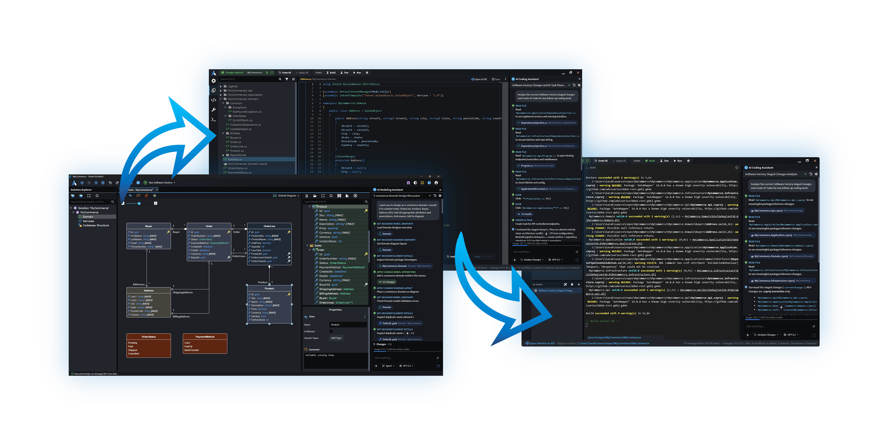
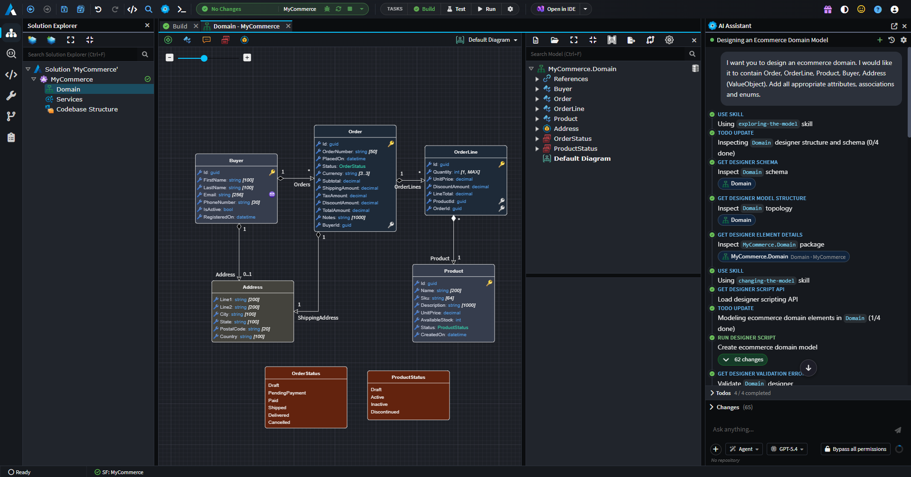
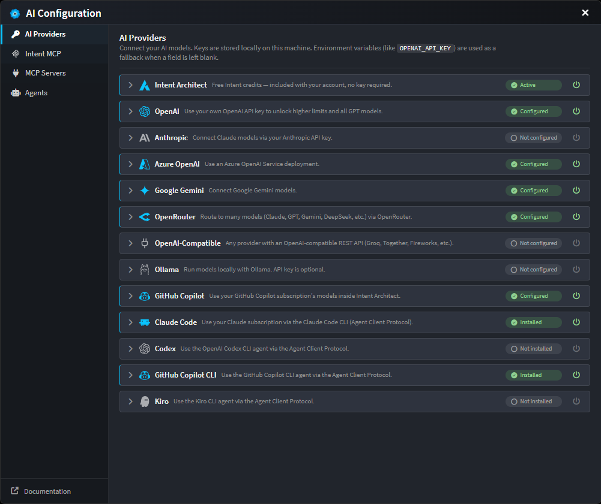

# AI Agents / Tools

Leverage your existing context engineering setup and preferred AI-coding harness and service provider via the Intent MCP, or drive agents directly in the platform – and add the control you need to scale agentic development safely and reliably. Intent Architect allows teams to go from requirements to visual designs to working, production-ready code, with full traceability. Developers focus on engineering decisions and AI agents handle implementation.

Intent Architect's own skills are bridged into each agent's native skill discovery – so your existing setup is respected rather than replaced. And the platform pre-engineers relevant context automatically, ensuring agents execute within the guardrails and in full conformance with your design and architecture, without overly complex context engineering or excessive validation.

Spec-Driven Development features drive requirements through design to implemented code, with traceability maintained end to end. Reviewers can always establish what a change is for and where it came from.

Teams ultimately choose how much they hand over – fully agentic, developer-augmented, or even manually driven.

---

## Key benefits

- **🎯 Agents that conform to your design and architecture by default**

  Agents stay within the lines drawn by your system and architectural designs, executing accurately and in full conformance. Design models supply context on every turn rather than agents having to infer it from the codebase. This reduces the need for excessive context engineering, prompting and validating to keep agents aligned.

- **📝 Specifications delivered as verified, traceable code**

  Leverage Spec-Driven Development (SDD) features and agentically drive business requirements through design specifications to production-ready code, with full traceability. Requirements are captured as precise, testable user stories, realized through an approved design expressed as changes to your model, and verified against their acceptance criteria once implemented. Traceability links flow through to Changes Review, so reviewers see the requirement behind every change.

- **🧰 Any model or coding harness, without re-engineering your setup**

  Teams can leverage their existing harness, models and context engineering and add the governance tools needed to scale agentic coding safely and reliably. The Intent MCP Server exposes Intent Architect's tools to external agents, so a team can continue working in their existing harnesses. Alternatively, agents are driven directly in the platform, where Claude Code, Codex, Copilot and Kiro are first-class participants via the Agent Client Protocol, alongside OpenAI, Anthropic, Azure OpenAI, Gemini and any OpenAI-compatible endpoint. The context files in your existing repository (e.g. `AGENTS.md`, `CLAUDE.md`, `.cursor/rules`, Copilot instruction files, etc.) are loaded automatically, and Intent Architect's own skills are bridged into each agent's native skill discovery. The result is more control with the tooling the team already runs.

---

## The Agentic Development Workflow

Intent Architect enables an end-to-end agentic development workflow, where developers can focus almost entirely on engineering and design decisions, and agents take care of the rest.

For developers that choose to drive their agentic workflow from within Intent Architect, the platform presents a single AI chat interface (integrated with your preferred harness and LLM) where design and implementation are handled in one workflow. The agent helps you translate requirements into comprehensive system designs directly in the visual designers, faster and more accurately than working manually (all model changes are made in memory and never saved without your explicit approval). When implementation work is needed, it is dispatched to a coding sub-agent that handles the custom coding, while the Software Factory rolls out the architecture, infrastructure, and boilerplate deterministically to guarantee consistency at scale.

In practice, the workflow looks like this: confirm your system's design visually in a single chat interface, run the Software Factory and AI coding tasks, and out the other side comes working, production-ready software. Well architected, consistent, and built to your standards, at any scale.

 

---

## Context Engineering

The accuracy of Intent Architect's AI agents comes down to context and guardrails. Intent Architect derives this context directly from your structured visual models, giving agents precise knowledge of your design intent – automatically.

Behind every coding agent is a customizable and sophisticated context engineering system that determines exactly which code files, architecture descriptions, use case intentions, and Skills are relevant for each task. Agents also have full support for standard context files your team is already using – CLAUDE.md, AGENTS.md, copilot-instructions.md and others, as well as Instruction Files – so your existing conventions, standards and workflows are respected automatically.

The result is AI that executes accurately and in full conformance with your design and architecture – without excessive manual context setup or prompting.

 

---

## Custom Agents

For teams that want to go further, Intent Architect supports fully custom agents. Authored as .agent.md markdown files, custom agents can be tailored to your domain, technology stack, or proprietary coding standards – and configured to appear in either the modeling or coding context.

---

## The Intent MCP Server

The Intent MCP Server gives teams complete flexibility in how they configure their AI tooling. Use Intent Architect's integrated agents, your own external AI coding tools, or any combination of both – all while keeping your design and architecture managed centrally and visually in Intent Architect.

This means teams can use whichever tools suit them best, without conflicts between external agents and Intent Architect-managed code.

Details on how to configure the Intent MCP can be found in the AI Configuration dialog (xref:ai.configuration).

---

## Connect Your Preferred Provider

Intent Architect is designed to work with the AI providers and models your team already uses. Connect to OpenAI, Azure OpenAI, Anthropic, or other compatible providers directly from the AI Configuration dialog – which also walks you through setting up the Intent MCP Server and any additional MCP servers your agents can use.

AI agents are pre-configured to work well for most use cases, with the flexibility to customize context engineering and agent behavior for specialized domains or proprietary coding styles.

 

---

## Learn More

- **[Authoritative Design Blueprints](xref:key-concepts.visual-modeling)**
- **[Architectural Guardrails](xref:key-concepts.deterministic-codegen)**
- **[Codebase Governance](xref:key-concepts.codebase-integration)**
