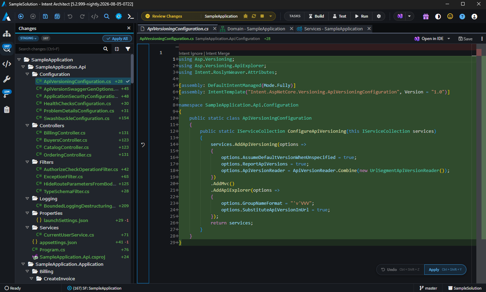
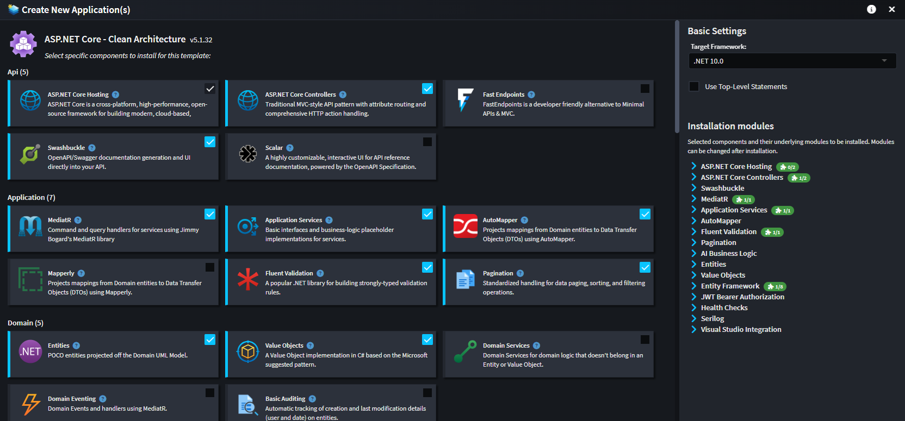

# Reliable Architectural Guardrails

To safeguard codebase quality and maintainability in an agentic development workflow, teams need reliable architectural guardrails. Intent Architect offers a best-in-class guardrail system driven by Modules. Modules ensure your architectural patterns are enforced both deterministically – making implementation accurate, consistent and easy to scale – and probabilistically, through context files, skills, hooks and instruction files. It is the optimal combination of "hard" and "soft" guardrails, configured and customised with AI, so adherence is ensured without adding to the validation burden and scales across teams without every developer having to internalize the standards first.

---

## Key Benefits

- **✅ Guaranteed adherence that scales reliably without the validation burden**

  Guardrails maintained purely through context files have to be internalized by every developer on every system and project before adherence can be efficiently validated, which makes them hard to scale and adds to the validation burden. Intent Architect's guardrails are encoded in Modules and enforced by the Software Factory on every run: a given architectural design produces the same code every time, with no drift and no room for interpretation. Customizations and deviations are tracked and flagged automatically, so adherence is managed by exception rather than by review.

- **🔄 System-wide architectural changes in one action**

  Agents can generate a framework upgrade or a convention change across a system, but the cost of doing so scales with the system: every affected service produces its own diff, every diff has to be individually validated, and consistency across all of them is never guaranteed due to AI's probabilistic nature. A single service that drifts becomes permanent inconsistency that every subsequent change has to accommodate. Because the pattern is encoded once in a Module, updating or swapping that Module propagates the change across every application of the pattern in a single pass. So, regardless of the number of services, the work and the review are the same, and the result is achieved significantly faster and guaranteed to be consistent.

- **🛠️ AI-assisted module building and customization**

  Module development is AI-assisted, so architectural patterns can be altered and evolved with minimal investment. Aligning a Module with your team's standards, accommodating an existing convention, or adapting a pattern as your architecture evolves is an efficient and streamlined process. Guardrails therefore remain accurate to the architecture they enforce, and evolve at the pace the team does.

---

## Modules

Modules are the core building blocks of Intent Architect's guardrail system. Each Module encodes one or more architectural patterns, translating your visual design intent into precise, consistent code. When a Module is applied, it produces the same output every time, without deviation. When a Module is updated, every instance of that pattern across your system is updated automatically.

When you run the Software Factory, it analyzes your visual design and applies your installed Modules to generate and update code across your solution, producing precisely the changes needed to bring your codebase into alignment with your design. The process is transparent, controlled, and fully deterministic.

The deterministic parts of the guardrail system are particularly well-suited to managing:

- **Bootstrapping:** Microservices, Monolithic Applications, Application Modules, Identity, etc.
- **Persistence Infrastructure:** ORM Mappings, Repositories, etc.
- **Service Infrastructure:** RESTful Web Services, Data Transfer Objects, Dispatch Patterns (e.g. Mediator, Interface Dispatch), etc.
- **Eventing Infrastructure:** Events, Message Broker Configuration, Message Dispatch Infrastructure, etc.
- **Front-End Infrastructure:** Components, Service Proxies, Models, etc.
- **Workflow Design:** Workflow Infrastructure, Flow Control Systems, etc.

 

 

Intent Architect offers a library of over 100 pre-built Modules covering the most popular .NET architectural patterns and technologies, giving teams immediate access to community-tested, best-practice implementations. For teams with custom standards or specialized domains, the platform offers a powerful Module-building ecosystem, where architectural patterns can quickly and easily be authored by leveraging AI, giving you complete control over your architecture and how it is implemented – and how it evolves.

 

---

## Non-Prescriptive by Design

Intent Architect does not impose an architecture, a framework, or a coding style. The code it manages is determined entirely by the Modules your team installs. Teams are free to design their guardrails however suits them and maintain full control over what is managed  deterministically and what is handled probabalistically.

---

## No Lock-in

Intent Architect is not a framework, a runtime, or a set of libraries. It introduces no dependencies into your codebase. What it does is implement the code that realizes each architectural pattern, in exactly the way your developers or AI agents would write it, in your stack, following your conventions. This is pattern reuse, not code reuse. The knowledge of how to implement a pattern is encoded in the Module, but the output is plain, independent code that belongs entirely to your project. Teams can continue without Intent Architect at any point and the codebase is completely unaffected.

---

## Learn More

- **[Authoritative Design Blueprints](xref:key-concepts.visual-modeling)**
- **[Advanced Validation Tools](xref:key-concepts.codebase-integration)**
- **[Spec-Driven Development with Traceability](xref:key-concepts.non-deterministic-codegen)**
