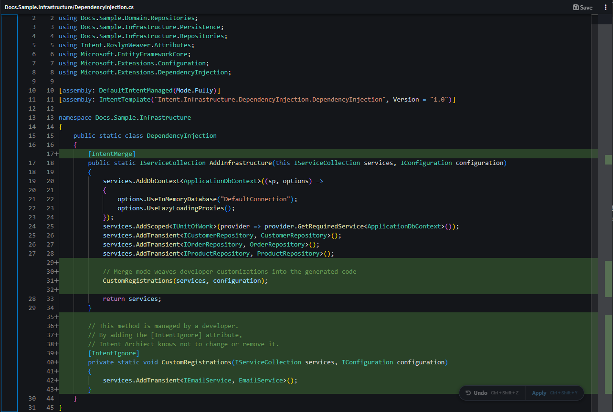
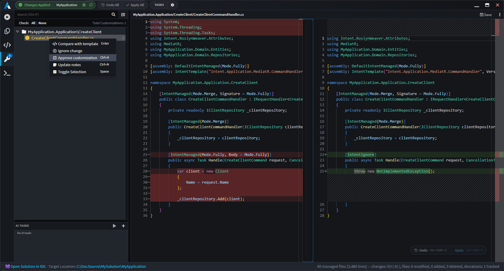

# Codebase Control

Intent Architect integrates directly with your existing development workflow and IDE, augmenting your current development experience with better visibility, improved control, and automation.

Intent Architect is built on a simple principle: developers are always in control. No matter how much is automated, developers can always write, edit, or override any part of the codebase – directly inside Intent Architect or in their existing IDE – and the system will never get in their way.

This is made possible by two complementary systems: the Software Factory, which ensures every proposed change is reviewed and approved by developers before it reaches the codebase, and the Code Management system, which gives developers fine-grained control over exactly what is automated and what they manage themselves, from entire files down to individual methods, reconfigurable at any time.

---

## Key Benefits

- **🔍 Full Visibility and Developer Control**

  Every change proposed by the architecture enforcement system or an AI coding agent is surfaced as a diff before anything is applied to the codebase. Developers review, adjust, or reject every modification, and can view or edit any part of the managed codebase at any time. Automation never acts without explicit developer approval.

- **🎚️ Fine-Grained Code Management**

  Developers decide what is automated and what they manage themselves, from entire files down to individual methods, and that decision can be changed at any time. The system respects those boundaries completely, so automation and manual development coexist without conflict, at whatever ratio suits the task.

- **📋 Architectural Adherence and Customizations**

  When developers deviate from a generated pattern, those changes are tracked, attributed, and visible across the system, giving teams a clear picture of where and why the codebase diverges from the standard, as the system grows.

---

## The Software Factory

Every change Intent Architect proposes, whether from the architecture enforcement system or an AI coding agent, passes through the Software Factory before touching your codebase. Changes are surfaced as clear diffs, giving developers the opportunity to review, adjust, or reject any modification before it is applied.

This is what keeps developers fully in control. No automation, deterministic or AI-driven, applies anything to the codebase without explicit developer approval.

 

---

## Code Management

Intent Architect's Code Management system uses abstract syntax tree parsing and intelligent merge algorithms to combine developer-written code with automatically generated code, without conflict. Developers can configure any file so that they own the implementation of specific methods while the system manages the rest, or take full control of a file entirely, or hand it back to automation. Configuration is always in the developer's hands and can be changed at any time.

This is what makes continuous code generation practical at scale: automation never touches code the developer has claimed, and developers are never forced into a level of automation they did not choose.

 

For more information, read .

---

## Customization Tracking

When developers intentionally deviate from a generated pattern, those changes are captured and surfaced across the system. Customization Tracking shows what was changed, by whom, and how it diverges from the reference pattern, creating an audit trail of architectural decisions that stays useful as the system and team scale.

 

For more information, read .

---

## Learn More

- **[Visual Design Tools](xref:key-concepts.visual-modeling)**
- **[Architecture Enforcement](xref:key-concepts.deterministic-codegen)**
- **[AI Agents](xref:key-concepts.non-deterministic-codegen)**
