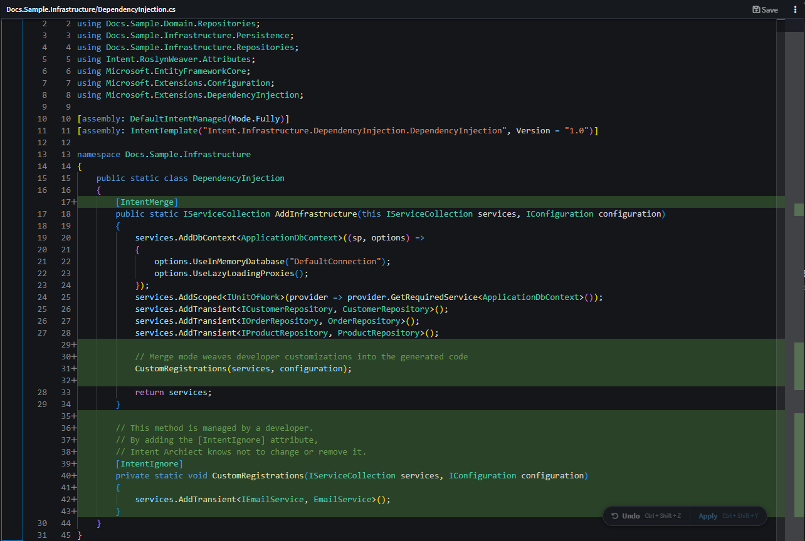

# Codebase Control

No matter the configuration you choose, you stay in full control with complete visibility and direct access to the entire codebase. Developers always work in an integrated way with their existing IDE / coding harness.

Intent Architect is built on a simple principle: developers stay in control, no matter how much is handed to agents. As agents write more of the codebase, control shifts from writing code to governing what gets written – and that is what these systems are built for.

Change Review surfaces everything that touched the codebase – generated output, agent- and developer-written code, and deviations from the architecture – and flags exactly what needs your attention. Inline diffs show what changed in the code, model-centric diffs show what it means for the design, and each change is attributed to whoever made it. Where a change traces back to a requirement, that link is surfaced too, so reviewers can see why it exists.

---

## Key benefits

- **🔍 Streamline code reviews and remain in control as review volume grows**

  Code reviews stay effective and manageable as the volume of agent-written code grows. Changes Review raises Requires Attention flags, prioritizes files for review, and presents inline diffs alongside model-centric diffs, so developers see code change in conjunction with its effect on the design. Teams sustain review discipline and accountability at scale.

- **🎚️ Precise control over the architectural boundaries for agentic development**

  Architectural adherence remains easy to enforce as teams scale up agentic coding. Code Management systems give developers full control over the boundaries between the guardrails and agent- or developer-managed code, from entire files down to individual methods. Agents always stay within these boundaries so teams can scale agentic development without giving up structure, consistency and quality.

- **🛡️ Architectural governance by exception, not constant review**

  Guardrails scale better as they are managed by exception rather than constant review. Architectural deviations or customizations are flagged for approval directly in Changes Review. Customization Tracking captures what was changed, by whom, and how it diverges from the guardrails, giving teams a clear record of where and why the codebase departs from the standard as the system scales.

---

## The Software Factory

Every change Intent Architect proposes, whether from the architecture enforcement system or an AI coding agent, passes through the Software Factory before touching your codebase. Changes are surfaced as clear diffs, giving developers the opportunity to review, adjust, or reject any modification before it is applied.

This is what keeps developers fully in control. By default, no automation applies anything to the codebase without explicit developer approval. However, developers can optionally enable "Bypass all permissions" mode to allow the AI agent to run the Software Factory and apply changes automatically if they prefer a fully autonomous workflow. The choice is always yours – configure the level of automation that suits your team and task.

 

---

## Code Management

Intent Architect's Code Management system uses abstract syntax tree parsing and intelligent merge algorithms to combine developer-written code with automatically generated code, without conflict. Developers can configure any file so that they own the implementation of specific methods while the system manages the rest, or take full control of a file entirely, or hand it back to automation. Configuration is always in the developer's hands and can be changed at any time.

This is what makes continuous code generation practical at scale: automation never touches code the developer has claimed, and developers are never forced into a level of automation they did not choose.

 

For more information, read .

---

## Customization Tracking

When developers intentionally deviate from a generated pattern, those changes are captured and surfaced across the system. Customization Tracking shows what was changed, by whom, and how it diverges from the reference pattern, creating an audit trail of architectural decisions that stays useful as the system and team scale.

 

For more information, read .

---

## Learn More

- **[Authoritative Design Blueprints](xref:key-concepts.visual-modeling)**
- **[Architectural Guardrails](xref:key-concepts.deterministic-codegen)**
- **[AI Agents / Tools](xref:key-concepts.non-deterministic-codegen)**
