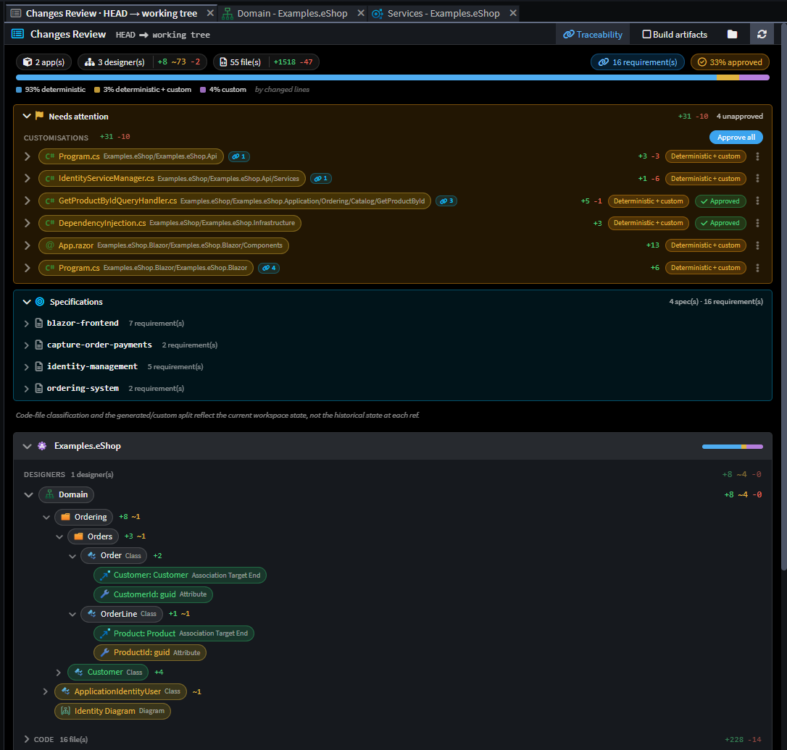
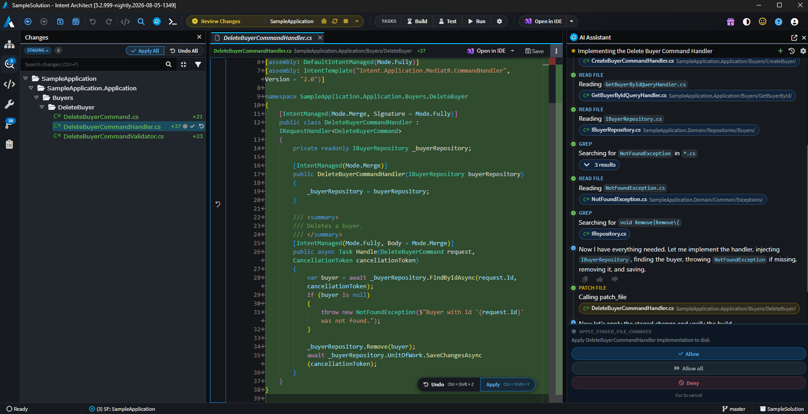
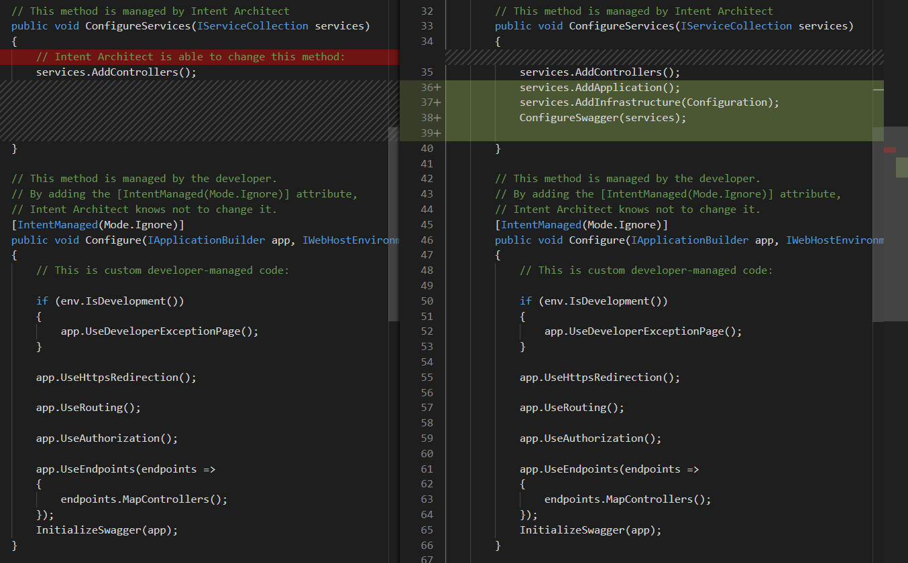
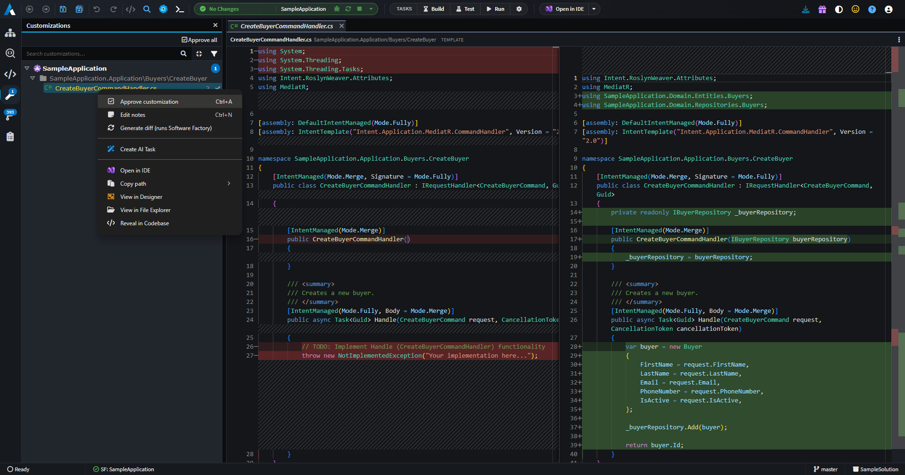

# Codebase Governance

No matter how you incorporate Intent Architect into your agentic development workflow, you stay in full control with complete visibility and direct access to the entire codebase.

Teams always work in an integrated way with their existing coding tools and have full control over the boundaries of the architectural guardrails or what gets generated deterministically. And manage adherence by exception rather than through constant review.

In addition, Change Review features help teams quickly understand what changed – whether it was deterministically generated or agent/developer written – and flag exactly what needs your attention. Inline diffs show what changed in the code, model-centric diffs show what it means for the design, and each change is attributed to whoever made it. Where a change traces back to a requirement, that link is surfaced too, so reviewers can see why it exists.

---

## Key benefits

- **🔍 Streamline code reviews and stay in control as review volume grows**

  Code reviews stay effective and manageable as the volume of agent-written code grows. Changes Review raises Requires Attention flags, prioritizes files for review, and presents inline diffs alongside model-centric diffs, so developers see code change in conjunction with its effect on the design. Teams sustain review discipline and accountability at scale.

- **🎚️ Precise control over the architectural boundaries for agentic development**

  Architectural adherence remains easy to enforce as teams scale up agentic coding. Code Management systems give developers full control over the boundaries between the guardrails and agent- or developer-managed code, from entire files down to individual methods. Agents always stay within these boundaries so teams can scale agentic development without giving up structure, consistency and quality.

- **🛡️ Architectural governance by exception, not constant review**

  Guardrails scale better as they are managed by exception rather than constant review. Architectural deviations or customizations are flagged for approval directly in Changes Review. Customization Tracking captures what was changed, by whom, and how it diverges from the guardrails, giving teams a clear record of where and why the codebase departs from the standard as the system scales.

---

## Changes Review

Changes Review is a code review system built for agentic development, where the volume of change is amplified beyond what conventional review processes can practically handle. It is a single place to review everything that has landed in the codebase, or is about to land before it is committed.

A Needs Attention section surfaces the files that actually require review, and a nested, drill-in change tree categorizes every changed file as fully Module generated, Module generated with customizations, or entirely custom code written by agents (or developers). Each file expands to reveal its diff inline, complete with collapsible summaries and line-level add and remove statistics.

Reviewers can also click through to the models affected by a change or commit, where the platform highlights the model diffs. This shows how code changes affected the design across the domain and service models, rather than only what changed in the files.

Deviations are approved directly in the review, so the customization is recorded as intentional and the Software Factory stops flagging it. Linked requirements are surfaced on a change, so reviewers can establish what it is for without leaving the diff.

 

_An example of the Changes Review for the working tree against the Git HEAD._

---

## The Software Factory

Every change, whether Module or agent driven, passes through the Software Factory before it lands in your codebase. Changes are surfaced as clear diffs, giving developers the opportunity to review, adjust, or reject any modification before it is applied.

Teams choose how the output lands. By default it is staged for review and applied on approval. Write-through mode applies it immediately for a tighter generate-and-go loop, and every run is checkpointed against the change baseline, so changes remain tracked, reviewable and revertible after the fact. Developers can also enable "Bypass all permissions" mode to let AI agents run the Software Factory unattended. The choice is always yours – configure the level of control that suits your team and task.

 

---

## Code Management

Intent Architect uses abstract syntax tree parsing and intelligent merge algorithms to combine agent- or developer-written code with Module generated code, without conflict. Developers can configure what code is managed by Modules at any granularity, from a single method implementation up to an entire file. Configuration is always in the developer's hands and can be changed at any time.

This is part of what makes the architectural guardrails work at scale: developers are in full control of the architectural boundaries and what code is managed by the Modules, agents or themselves.

 

For more information, read .

---

## Customization Tracking

When developers or agents intentionally deviate from a generated pattern, i.e., the architectural guardrails or Module managed code, those changes are captured and surfaced across the system. Customization Tracking shows what was changed and how it diverges from the reference pattern or Module, creating an audit trail of architectural decisions that remain valuable as the system and team scale.

 

For more information, read .

---

## Learn More

- **[Authoritative Design Blueprints](xref:key-concepts.visual-modeling)**
- **[Architectural Guardrails](xref:key-concepts.deterministic-codegen)**
- **[AI Agents / Tools](xref:key-concepts.non-deterministic-codegen)**
