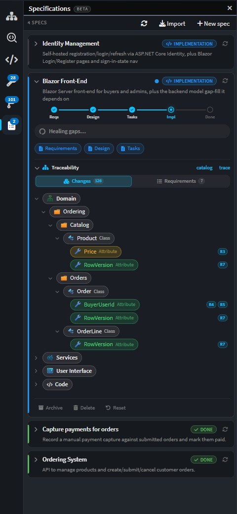

# Spec-Driven Development with Traceability

Driving an agentic coding process starts with generating good specifications – without them, coding agents are inaccurate and inconsistent. Intent Architect provides a full spec-driven development (SDD) environment that guides teams from requirements to design specifications to code, step by step, and can import specifications from external tools such as BMAD, Spec Kit and Kiro. Traceability systems then answer the why: exactly which requirements or specifications drove which code, and which code exists because of which requirement. These links are discoverable in Change Review, the visual models and the SDD environment, connecting the upstream to the downstream across the entire SDLC.

---

## Key benefits

- **📋 Go from business requirements to production-ready code, step by step**

  Effective agentic software delivery requires high-quality specifications. Intent Architect provides a full spec-driven development (SDD) environment that guides teams from business requirements through design specifications to production-ready code, step by step, so agents implement accurately, and teams deliver predictably. It also allows teams to import specifications from external tools such as BMAD, Spec Kit, Kiro, etc.

- **📖 MDX format – More intuitive and easier to internalize**

  Specifications can only drive development if they remain intuitive and easy to comprehend. Intent Architect generates specifications in MDX, giving developers a richer and far more usable experience than standard markdown files, so requirements and design specifications are easy to follow, internalize and action. This means specifications stay valuable to humans as well as consumable by AI.

- **🔗 Trace code to requirements, and requirements to code**

  Traceability connects requirements and code directly. Links run in both directions – from a requirement to the code that implements it, and from any piece of code back to the relevant specification and requirement – and are discoverable in Change Review, the visual models and the SDD environment. This means teams can always confirm why code exists and why changes were made.

---

## The Specs Panel

Spec-Driven Development is a structured, model-native way to go from an idea to implemented, traceable code, driven by AI but anchored to your Intent Architect model. A dedicated Specs panel guides teams through a phased flow:

1. **Requirements** – capture a feature as precise, testable user stories (EARS-style) with stable IDs.
2. **Design** – turn those requirements into intended model changes plus a per-requirement realization plan.
3. **Tasks** – break the design into a checkpointed task list, organised into dependency-ordered waves.
4. **Implement** – work the waves in order, applying model changes, generating code, and implementing and testing the bespoke logic.
5. **Verify & Heal** – check the implementation against its acceptance criteria, and repair any gaps the verification finds.

Because the design is expressed as changes to your designer model – not just prose – SDD stays true to Intent Architect's core principle: the model is the source of truth, and code is generated output.

Existing specification documents, such as BMAD PRDs, can be imported and integrated with the SDD system, so teams can bring specs and workflows they already have into Intent Architect's model-native flow.

 

_The Specs panel, showing a spec and its phase progress._

---

## End-to-End Traceability

As work is implemented, Intent Architect records traceability links from each requirement to the model elements and files that realize it. Those links flow straight through to Change Review, so when you review a change you can see the requirement behind it – and when you read a requirement you can see where it lives in the model and the code.

---

## Specifications in MDX

Specifications are generated in MDX rather than plain markdown. MDX extends markdown with support for React components, so a document can embed rich, rendered content alongside ordinary prose rather than being limited to static text.

Plans, specs and pull request descriptions support purpose-built MDX blocks – DataModel, ApiEndpoint, Wireframe, Canvas and ModelChanges – alongside Mermaid diagrams, authored by the agent as part of the plan. A proposed data model or API surface can be seen rather than described, so the intent of a specification is far easier to follow at a glance than the equivalent plain markdown file.

 

_A DataModel block rendered inline in a plan document._

---

## Learn More

- **[Reliable Architectural Guardrails](xref:key-concepts.deterministic-codegen)**
- **[Authoritative Design Blueprints](xref:key-concepts.visual-modeling)**
- **[Advanced Validation Tools](xref:key-concepts.codebase-integration)**
