# Release notes: Intent Architect version 5.1

<!--
NOTE FOR AUTHOR: The image paths referenced below (under ./images/5.1/00/) still need
screenshots captured. Use --docs-mode / frameless 720p capture per guidelines.md, mark up
with Azure Blue (#06C4FF), and confirm both light and dark themes where relevant.
Remove or repoint any image line that won't have a screenshot before publishing.
-->

## Version 5.1.0

Hot on the heels of 5.0, version 5.1 turns its attention to the moment that matters most for an AI-native development platform: **change**. Where 5.0 brought AI into the heart of Intent Architect, 5.1 is about *seeing, understanding, and controlling* the changes flowing through your solution - from the model in your designers, to the code in your codebase, to the commits in your repository.

This release introduces **first-class Git source control** inside Intent Architect, a **model-level change-tracking and diffing system** that shows exactly what's changed in your designs (and against which baseline), a major **expansion of supported AI providers** including Claude Code, GitHub Copilot and Codex, and a new, more compact **YAML / V3 metadata persistence format** designed to make your on-disk metadata cleaner and your pull requests dramatically quieter.

As always, the team has also poured significant effort into polish, performance and the hundreds of small details that add up to a world-class experience.

We hope you love it. Thank you for your continued support and feedback - it directly shapes where we take the platform next. 🚀

> [!TIP]
>
> Ready to get started? **Head to [our website](https://intentarchitect.com) and login to download it**.

---

## More AI providers, more ways to work

5.0 brought AI into the platform; 5.1 dramatically widens the set of AI providers and agents you can bring with you.

### Use the agents you already love

Intent Architect now integrates leading agent CLIs directly via the **Agent Client Protocol (ACP)**:

- **Claude Code** - chat and build against your own Anthropic subscription, with selectable models (including large-context options for big codebases) and reasoning-effort levels, using Claude Code's native permission system.
- **OpenAI Codex** - available as a first-class ACP agent.
- **GitHub Copilot CLI** - bring Copilot's agent into Intent Architect's chat.

### Sign in with GitHub Copilot

You can now **sign in with GitHub Copilot** using a secure OAuth device flow - no API key required - and route requests through your existing Copilot subscription. A streamlined **SSO re-authorization** path means that when an organization session lapses, Intent Architect deep-links you straight to the right sign-in page instead of forcing a full re-login. Your token is stored encrypted and never directly exposed.

### A redesigned AI configuration experience

The **AI Configuration dialog** has been refreshed with a cleaner segmented layout and expandable provider cards. Each provider now shows a clear status (configured, unconfigured, unsaved edits, or disabled), and you can **toggle any provider off** without deleting its credentials. The provider list now spans Intent Architect, OpenAI, Anthropic, Azure OpenAI, Google Gemini, OpenRouter, OpenAI-compatible endpoints, Ollama, GitHub Copilot, and the Claude Code, Codex and Copilot CLI agents.

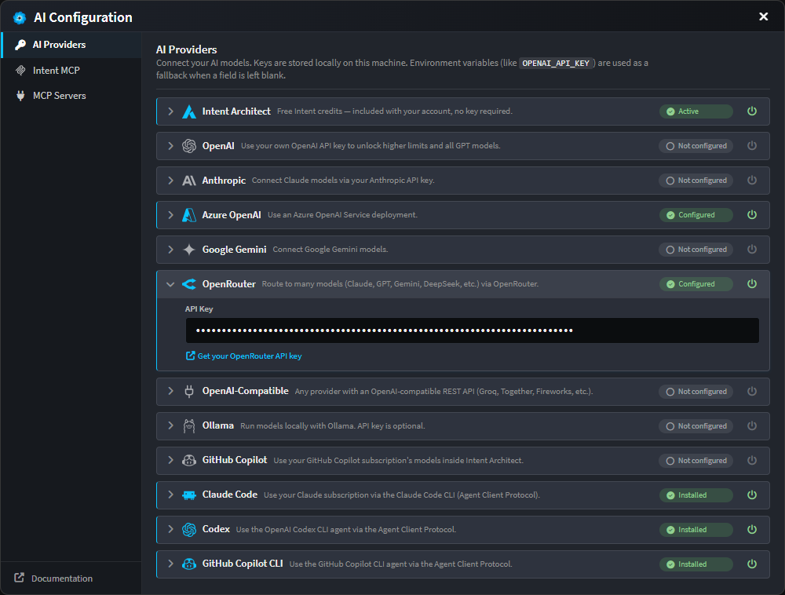

### Pop the chat out, and watch your changes

The **AI Assistant chat can now be popped out into its own window** - conversation state and all - which is ideal for multi-monitor setups. In the wider popped-out layout, a new **Changes panel** sits alongside the conversation, listing everything the current AI task has created or modified, grouped by application and designer, with clickable entries that navigate you straight to the affected element or file.

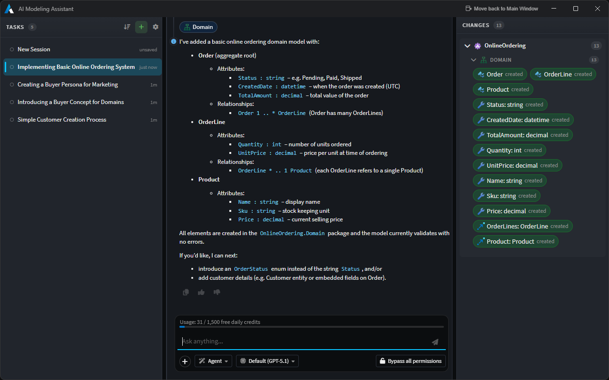

### Sign in to MCP servers that need it

Intent Architect now supports **OAuth 2.1 for remote MCP servers**. When an HTTP MCP server requires authorization, a **Sign in** button appears in its entry - with full PKCE, dynamic client registration and automatic token refresh handled for you behind the scenes. MCP servers can also be scoped globally or per-solution, and to your modeling and/or coding agents.

### Other AI improvements

- The **AI Tasks panel** gained sorting options (newest, oldest, or most recent activity) and is independently resizable.
- **Stopping a chat** now cleanly cancels any in-flight tool calls and pending approvals, freeing the conversation immediately and fixing a stop-then-send race.
- A canonical **permission mode** (ask before edits / edit automatically / bypass) is honoured consistently across providers from the first turn of a conversation.
- The model catalog and pricing data has been refreshed, and the model picker now shows a relative **cost factor** to help you choose.

---

## Git source control, built in

Intent Architect now ships with a complete **Source Control** experience, so you can manage your repository without leaving the platform. It lives as a new **Source Control** tab inside the Software Factory, sitting alongside Console, Changes, Codebase Explorer, Customizations and Terminal.

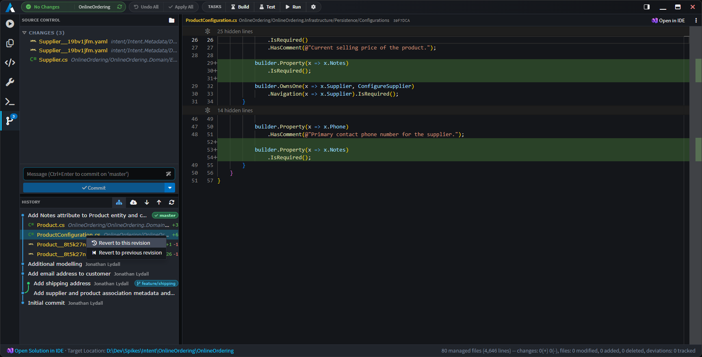

At a high level, you can now:

- **See your changes at a glance** - separate, independently-scrolling **Working** and **Staged** trees, each file annotated with icons and a colour-coded status (Added, Modified, Deleted, Renamed, Untracked, Conflicted). Toggle between a folder-grouped tree and a flat list, with your preference remembered per solution.
- **Stage, unstage and discard** files individually, in multi-selections, or in bulk (`Stage all`, `Unstage all`, `Discard all`) - with a confirmation guard on discards.
- **Commit** with a dedicated message box (`Ctrl+Enter` to commit), with support for **amending** the previous commit. If nothing is staged, Intent Architect offers to stage-and-commit all working changes for you.
- **Generate a commit message with AI** - click the magic-wand button and Intent Architect drafts a commit message from your pending diff and drops it into the input for you to review and tweak. It never commits on your behalf.
- **Fetch, Pull and Push** straight from the toolbar. These shell out to the `git` CLI, so your existing credential helpers, SSH agents and commit signing all keep working.
- **Initialize a repository** with one click when your solution isn't in one yet.

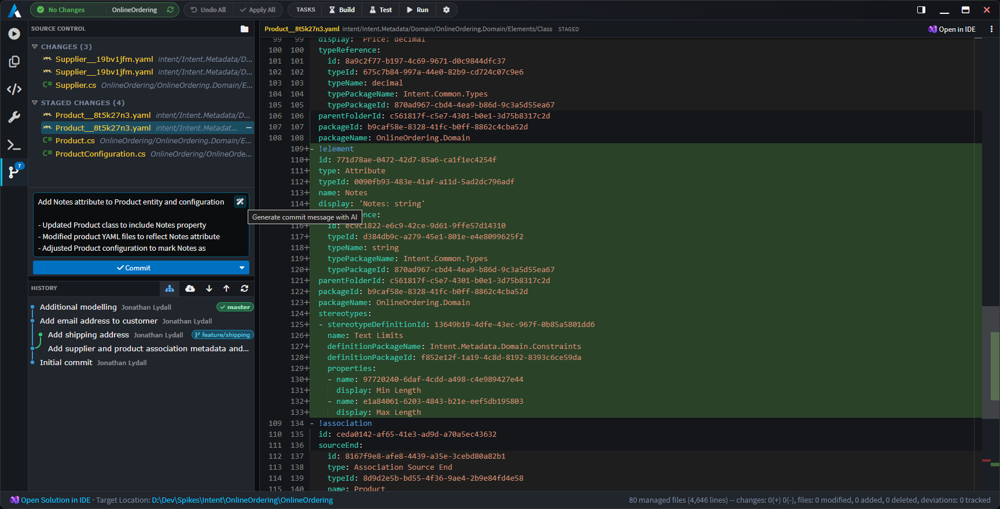

### Visual history and commit context aware actions

The Source Control tab includes a **visual commit graph** with branch, HEAD and remote decorations, infinite-scroll paging, and an expandable per-commit file list. A **Show all branches** toggle switches between the current branch and the full graph.

Right-click any commit for a full set of actions: **cherry-pick**, **revert**, **merge**, **switch/checkout**, **rebase**, **create branch at this commit**, and copy the SHA or message. File rows offer **revert to this (or the previous) revision**. When a merge or rebase pauses for conflicts, a persistent inline bar guides you through **Continue / Skip / Abort**.

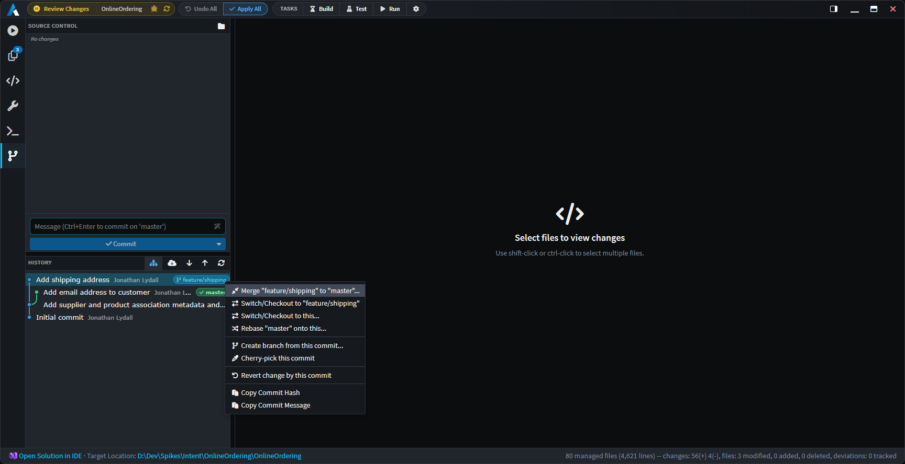

### Always know where you are

The status bar at the bottom-right of the main window now shows your **current repository and branch**, refreshed automatically.

And because HEAD can move from anywhere - the terminal, an external IDE, another Git client - Intent Architect now watches your repository's `HEAD` and refreshes its change indicators automatically, so what you see is always in sync with reality.

---

## Model-level change tracking & diffing in the designers

One of the most requested capabilities is finally here: Intent Architect can now show you **exactly what has changed in your model**, right in the designer tree - and let you choose **what to compare against**.

### The modified bar and model diff popover

Changed elements are now marked with a coloured bar in the tree gutter. Click it to open a **model diff popover** that lists the actual field-level changes as a tidy `before → after` table - renamed properties, retyped attributes, edited comments, added or removed stereotypes, changed mappings, and more. No more guessing *why* an element is flagged as dirty.

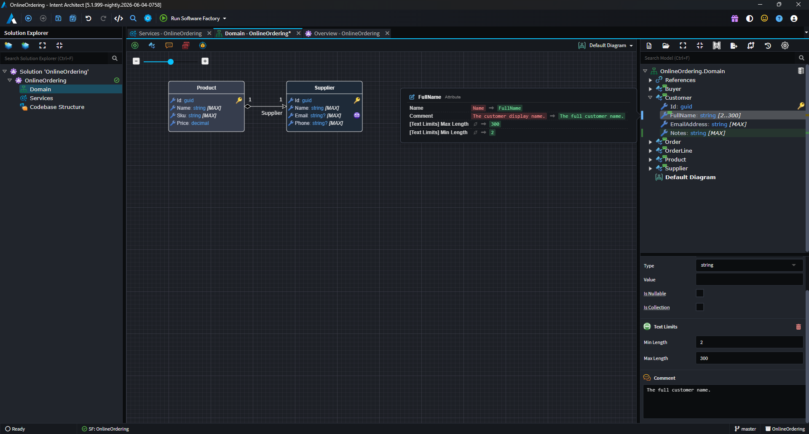

A **diff overview ruler** down the right edge of the tree (much like a code editor's minimap) gives you a bird's-eye view of where the changes are, and lets you click to jump straight to them.

### Choose your baseline

A new **diff baseline picker** (the compare icon in the designer toolbar) lets you choose what "changed" means:

- **Last save** - highlights your *unsaved* changes (the classic behaviour). Clears when you save.
- **Git HEAD** - highlights your *uncommitted* changes by comparing your in-memory model against the last commit. Clears when you commit.

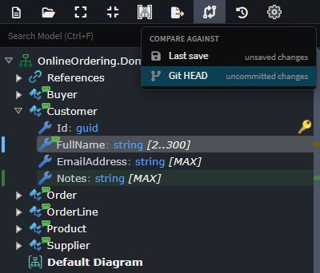

When your solution is in a Git repository, Intent Architect defaults to the **Git HEAD** baseline so you can see everything you've changed since your last commit at a glance - across saves and sessions. Your choice is remembered per solution.

### Deletions you can see (and undo)

Deleted elements no longer simply vanish. They're now represented as **ghost rows** - faded, struck-through placeholders - tucked behind a small **tombstone** marker in the tree. Click the marker to reveal what was removed, and right-click a ghost to **Restore** it (whether it was deleted in this session or removed in a previous commit). Deletions also participate cleanly in undo/redo.

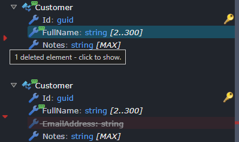

### Changes on the diagram, too

Diagrams now reflect change state with **halo effects** around visual elements - green for newly added, amber for modified - so you can spot what's new and what's changed without leaving the diagram surface.

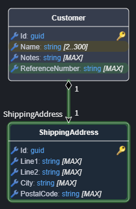

### Compare any two points in history

From a designer's toolbar, the new **History…** dialog opens a read-only commit browser scoped to your designer. Filter by message, author or SHA, toggle "touched this designer only", and then **compare** a commit against its parent, against your working tree, or two commits against each other. The result opens as a **semantic model diff** - the designer's own tree rendered with add/modify/delete badges - so you're comparing *designs*, not just file text.

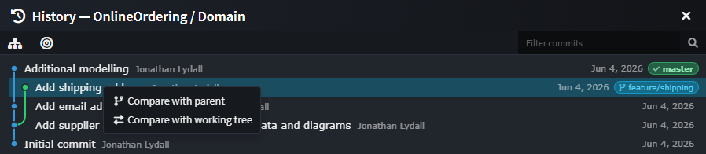

---

## A cleaner metadata format: YAML & V3 (opt-in)

Intent Architect 5.1 introduces a new, more compact way to store your solution's metadata on disk, available as an **opt-in** choice per application via the new **Metadata Persistence Format** dropdown in the application's Settings.

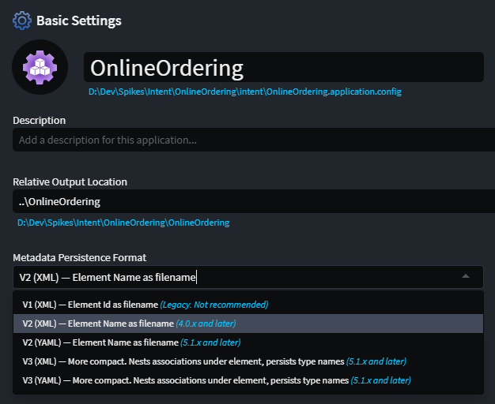

You can choose both a **shape** and a **serializer**:

- **V3** consolidates each element and its associations into a single, position-ordered file, nests element-owned associations under their owning element (so they no longer sprawl across a separate `Associations` folder), keeps human-readable type names inline, and omits redundant default values. The result is **fewer files and far less diff noise**.
- **YAML** is now available as an alternative to XML for both the V2 and V3 shapes, for those who prefer a more readable on-disk format.

The headline benefit is **cleaner, calmer source control**: smaller files, fewer of them, associations that live with their element, and no incidental churn from default values - which means smaller pull requests and far fewer merge conflicts.

Switching format is straightforward. When you change the setting, Intent Architect offers to **convert all existing metadata** for the application in one go (recommended), or to let files migrate lazily as you edit them. Mixed-format folders load without issue, so migration is safe and incremental. Existing applications are completely untouched until you opt in, and the established XML format remains the default for new applications.

> [!IMPORTANT]
>
> Once an application adopts a 5.1 persistence format (V2 YAML, V3 XML or V3 YAML), its minimum client version is raised to **5.1.0**. Make sure everyone on your team is on Intent Architect 5.1 or later before adopting a new format for a shared application.

---

## Software Factory & Solution Explorer

- **Launch and monitor Software Factories from the Solution Explorer.** Application (and folder) nodes now have a play affordance and live state icons, including **staged-change indicators**, so you can start a Software Factory and see its status without hunting for it.

  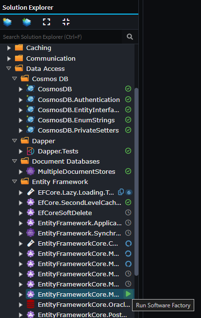

- **Concurrency control for Software Factory executions.** A new limiter prevents too many Software Factories running at once, with a **user-configurable maximum** so you can tune it to your machine.
- **Clearer Software Factory errors.** The "duplicate output location" error is now surfaced as a structured card with clickable element chips, copyable IDs, and an AI-assisted fix when both occurrences share a template. The "package reference" error is likewise surfaced as a structured card with clickable element chips and copyable IDs - no more raw stack traces.
- **Performance.** The Software Factory now persists a cache for unchanged files to optimize its skip path, and caches formatted template output to speed up deviation comparison.

---

## Inline code-management code lenses on diffs

Reviewing what the Software Factory wants to change just got a lot more powerful. When a pending change would overwrite code you've hand-edited, you no longer have to drop into your IDE and hand-write a code-management instruction to protect your work. Intent Architect now renders inline **code-management lenses** directly above each changed region in the Software Factory's diff view, so you can resolve the deviation right where you see it.

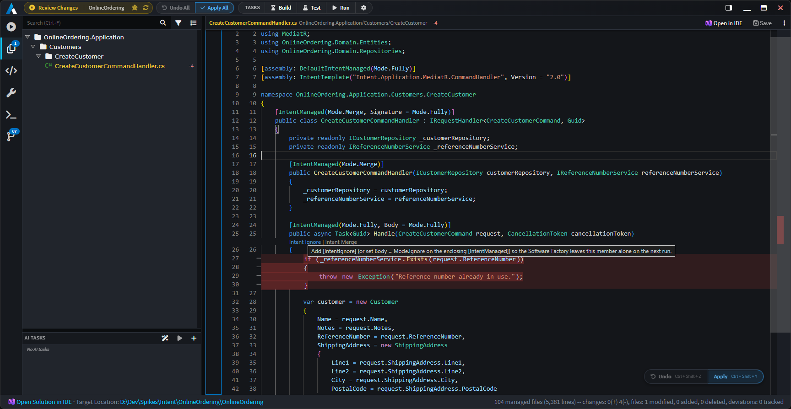

Two actions are offered per change hunk:

- **Intent Ignore** marks that region to be ignored by Intent's code management, so the Software Factory preserves your manual edit and won't try to overwrite it again - the per-hunk equivalent of tagging the code with an "ignore" instruction, without leaving the diff.
- **Intent Merge** switches the region to merge mode, so Intent keeps managing the surrounding structure while reconciling its generated output with your changes rather than replacing them wholesale.

Click a lens and Intent Architect applies the instruction to the code element covering that change, re-runs the diff, and confirms with a toast - the change you were about to lose simply drops off the pending list.

The lenses appear wherever a weaver exposes code-management actions for the file type (for example, `.cs` files when the Roslyn Weaver is installed), and hunks that only touch the code-management instructions themselves are skipped automatically. Prefer a cleaner diff? Toggle them off at any time via **Code Management Lenses** in the diff view's options menu - your preference is remembered.

> [!NOTE]
>
> Requires version `4.11.0-pre.0` or higher of the `Intent.OutputManager.RoslynWeaver` module to be installed for lenses to show.

---

## The Asset Repository screen, overhauled

The Asset Repository management screen has had a long-overdue overhaul:

- Repositories can now be **`Excluded from "All"`** - when checked, that repository's results are excluded when 'All' is chosen on the Modules Management or Application Template screens, while still being directly selectable.
- **Drag-and-drop reordering** via handles on each entry.
- Entries are **collapsed by default** and expand on click so you can edit their details.

---

## Improvements in 5.1.0

- Improvement: **See the current Git repository and branch in the status bar**, refreshed automatically.
- Improvement: **Search Everywhere now finds in-memory (unsaved) elements**, so newly added elements are discoverable before you save.
- Improvement: Module installation from the **Template tab now supports minimum dependency versions**.
- Improvement: **Convert existing metadata** when changing an application's persistence format (or during a rename).
- Improvement: Popped-out windows and modal dialogs now open on the **same display as the main window**, for a smoother multi-monitor experience.
- Improvement: **Save and loading indicators** added to tabs and diff views for clearer feedback during longer operations.
- Improvement: A **flexible toolbar** now gracefully handles overflow when space is tight.
- Improvement: **MCP / AI tooling** - new `get_application_settings` and `update_application_settings` tools let agents read and update application settings (including the persistence format); designer element search now matches on values as well as field names; and diagram snapshots return richer element detail.
- Improvement: Diff views support per-file editing and saving, inline vs side-by-side and word-wrap toggles (remembered across sessions), and reveal-in-explorer.

## Fixes in 5.1.0

- Fixed: Software Factory performance degraded as the number of concurrent AI Tasks grew, due to unnecessary scroll requests.
- Fixed: Agent and MCP-server subprocesses could linger as orphaned processes after a conversation was deleted or the app shut down; they are now reliably torn down.
- Fixed: Cancelling an AI chat could break the conversation or leave in-flight tool calls unresolved.
- Fixed: AI conversation history could break under certain circumstances.
- Fixed: A conflict between Intent Architect's internal use of YamlDotNet and modules that also use it (for example the YAML weaver).
- Fixed: A null reference error could occur on a first install (for example in Windows Sandbox).
- Fixed: An XML serialization issue affecting the `output.cache` file.
- Fixed: An asset repository excluded from "All" could still be used when selected indirectly.
- Fixed: The `run_software_factory` MCP tool would sometimes incorrectly report 0 changes.
