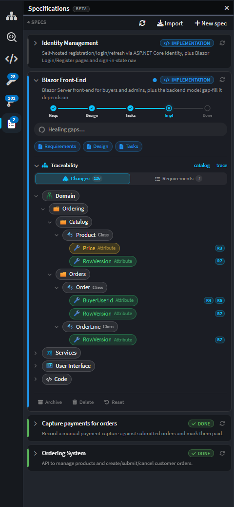

# Release notes: Intent Architect version 5.2

## Version 5.2.0

> [!NOTE]
>
> Version 5.2 is still in pre-release. These release notes are a work in progress and subject to change before the final release.

The through-line of 5.2 is **a single, coherent view of your system** - and the simplification that comes with it. As Intent Architect has grown, so has the number of separate places to look: different AI chat experiences, standalone panels, and views spread across the app. 5.2 draws them together.

Most visibly, the **separate AI chat experiences are now one AI Assistant** - a single chat pane that handles modeling directly and dispatches specialized sub-agents for coding tasks, so you drive everything from one conversation. The shell has been consolidated around the same idea: **terminals, generated code and the Software Factory's changes are now first-class tabs and panels in one workspace**, and a new **solution-wide Changes Review** gives you one place to see - and trace - everything that has changed across your solution.

We're also shipping an early, **beta** preview of a **spec-driven development** workflow, and we'd genuinely like your feedback on it (see below).

We hope you love it. Thank you for your continued support and feedback - it directly shapes where we take the platform next. 🚀

> [!TIP]
>
> Ready to get started? **Head to [our website](https://intentarchitect.com) and login to download it**.

---

## One AI Assistant

Intent Architect used to present more than one AI experience - a modeling-focused assistant separate from its coding and agent flows. In 5.2 these are **consolidated into a single AI Assistant** (the former "AI Modeling Assistant" is now simply the **AI Assistant**), giving you one conversation that spans your whole system.

### One chat, specialized sub-agents

The AI Assistant handles modeling directly in the chat. When a request needs code-level work, it runs the **Software Factory** and dispatches specialized **coding sub-agents** to implement the custom logic - each scoped to the right application and picking up the relevant skills automatically - with their progress and results streaming back into the **same conversation**. You get focused, decomposed agents doing the heavy lifting without having to juggle multiple chats.

<!-- TODO screenshot:  -->

---

## One workspace: terminals, code and changes as tabs

Reinforcing the single-view theme, the shell brings the pieces you used to hunt for into one place - terminals, generated code and tasks all become first-class tabs.

### Terminals as first-class tabs

**Terminals are now first-class editor tabs** rather than a bespoke panel. Each terminal session opens, activates, closes and reorders like any other tab, and can be popped out into its own window. File paths and line numbers in terminal output are now **clickable** (with tooltips), you can **drag-and-drop files** into a terminal, and clipboard copy is more reliable. Under the hood the terminal was upgraded to **xterm v6** and switched to **ConPTY on Windows**, so TUIs such as agent CLIs render correctly.

<!-- TODO screenshot:  -->

### Compound tasks

A `tasks.json` task with `dependsOn` now launches its child tasks together in **one container tab with sub-tabs**, matching VS Code's compound-task pattern. You get **parallel or sequential** ordering (`dependsOrder`), a `readyPattern` that marks a watch task as "ready" once its output matches, and a `hidden` flag to keep helper tasks off the toolbar. Run All / Stop All controls manage the whole group.

### A Codebase Explorer

A new **Codebase Explorer** in the sidebar lets you browse each application's generated files across all of its output roots, with background indexing and lazy loading for large codebases. It supports inline **rename and delete**, an **add-folder** action, **Git-status overlays** on files and folders, and remembers which folders you had expanded.

<!-- TODO screenshot:  -->

### Editor conveniences

- **Pin / unpin tabs** VS Code-style - pinned tabs group first and their state is remembered.
- **Ctrl+Tab / Ctrl+Shift+Tab** to switch between open tabs, and **Enter** to open the focused file in the Codebase, Changes and Deviations trees.
- **Per-tab scroll and cursor memory**, so switching away and back returns you to where you were.
- A new **Markdown preview** for `.md` files, with syntax highlighting, YAML front-matter rendered as a table, task-list checkboxes and a selectable font size - toggle it with **Ctrl+Shift+V** or a double-click.
- Press **F5 / Shift+F5** in the editor to run the current application's Software Factory.

---

## The Software Factory: write-through and a unified Changes panel

### Changes surfaced in the shell

Software Factory changes now appear directly in the shell as a **unified Changes panel**, with **Apply All / Undo All**, folder-level **Keep / Undo**, and per-run **Output tabs** that offer error/warning filtering, jump-to-error navigation and a verbose-logging toggle.

<!-- TODO screenshot:  -->

### Write-through to your codebase

A new **write-through-to-codebase mode** lets the Software Factory write its generated changes **straight to disk** as it runs, rather than staging them for you to apply. Intent Architect tracks everything against a **per-session baseline**, so you can still review and undo everything that has changed since you opened the solution.

### The Software Factories window

Managing multiple Software Factories has moved from a one-shot "Run multiple Software Factories" selection dialog to a persistent **Software Factories** window. It lists every application's Software Factory with its **live status** (idle, running, done) and per-row controls to run, stop, pop out, refresh, or **attach a debugger**, with **Run All** and **Stop All** actions - each showing a live count - across the top. Attaching a debugger opens that run in a window for the session, which is handy when developing a module.

<!-- TODO screenshot:  -->

---

## Solution-wide Changes Review & traceability

### Review everything that's changed

A new **Changes Review** gives you a solution-wide view of your changes: **uncommitted** changes, changes **since a commit**, or changes **between two commits**. Each file expands to a **Monaco diff**, you can **drill in to model diffs** for designer content, and per-file **+/- line statistics** summarize the scope at a glance.

<!-- TODO screenshot:  -->

### Requirement traceability

Changes Review links changed elements and files back to the **requirements they satisfy**, so you can review a change in the context of *why* it was made. This is the same traceability that the spec-driven workflow builds up as it works.

### Customizations, tracked

Software Factory **customizations (deviations)** - including AI- and ignore-mode edits - are now tracked and surfaced in Changes Review, with **per-file approve / revoke** and **approval-coverage metrics**. A **"Requires Attention"** indicator on the Source Control button (and activity-bar icon) flags outstanding customizations and warns you before committing.

### Who changed what

The **model diff popover** now attributes each changed element to the **developer, commit and date** that last touched it, with a clickable commit link - and an **"Uncommitted"** marker for working-tree edits.

---

## Spec-driven development (beta)

> [!NOTE]
>
> Spec-driven development is an early **beta** feature. We're shipping it to gather real-world feedback, and both the workflow and its underlying concepts may change significantly. We'd love to hear how it works for you.

Alongside the everyday AI Assistant, 5.2 previews a more structured, **spec-driven** workflow that turns a feature description into working, verified software through a series of well-defined phases.

### The Specs panel

A new **Specs panel** in the shell sidebar is the home for spec-driven work. It tracks each feature as it moves through its phases - requirements, design, implementation and verification - showing a human-readable description under each spec, per-phase state, and requirement coverage as it accumulates. You can refresh a spec's state from disk, reset it back to an earlier phase, and drive its implementation directly from the panel.

<!-- TODO screenshot:  -->

### Orchestrated AI agents

The workflow is driven by a set of **specialized, orchestrated agents** - an Analyst that captures requirements, an Architect that designs the solution, a Reviewer that critiques it, and a Spec orchestrator that coordinates the flow and dispatches implementation. Each agent has a focused role and hands off to the next, so large pieces of work are decomposed into sequential, non-overlapping steps.

### Implementation waves, verification and self-healing

Implementation is broken into **waves** - ordered batches of model and code tasks with dependencies between them. As each wave completes, Intent Architect **verifies** the result against the spec's requirements and, where it finds gaps, runs a **self-healing** pass that feeds the specific defects back to the agents to resolve. Coverage and traceability are tracked throughout, so you can see which requirements are satisfied and which still need attention.

---

## More for connected agents

- A new **Import Model** tool lets an agent import existing code into the model by name, resolving folder structure and leaving placeholders for types it can't yet resolve.
- The **spec tools** and new **`read_project_context` / `write_project_context`** tools are exposed over ACP, giving connected agents solution-wide grounding and the full spec-driven toolset.
- Full AI chat content - messages and tool calls/results, including `create_sub_agent` runs - is now **logged** to aid support diagnostics.

---

## Source control enhancements

Building on the Git source control introduced in 5.1, this release adds:

- **Undo last commit**, **delete branch**, and **git reset** actions.
- **Amend-commit editing** for tidying up your most recent commit.
- Smarter **conflict resolution** - when you have hand-edited a file to remove its conflict markers, Intent Architect detects it and offers a **"Mark resolved"** action, auto-staging marker-free files on Continue.
- Merging a commit from the history graph now uses the **branch name** (not the raw SHA) in the default merge message, and a **commit-info popover** replaces the native tooltip on hover in the history view.

---

## Improvements in 5.2.0

- Improvement: The separate AI chat experiences have been consolidated into a single AI Assistant chat pane that handles modeling directly and dispatches specialized coding sub-agents for code-level work, all within one conversation.
- Improvement: A new spec-driven development workflow (beta), with a dedicated Specs panel and orchestrated AI agents (Analyst, Architect, Reviewer and a Spec orchestrator) that take a feature from requirements through design, implementation waves, verification and self-healing, tracking requirement coverage and traceability throughout.
- Improvement: Software Factory changes are now surfaced directly in the shell as a unified Changes panel, with Apply All / Undo All, folder-level Keep/Undo, and per-run Output tabs offering error/warning filtering, jump-to-error navigation and a verbose-logging toggle.
- Improvement: A new write-through-to-codebase mode lets the Software Factory write generated changes straight to disk, tracked against a per-session baseline so you can review and undo everything changed since the solution was opened.
- Improvement: A new solution-wide Changes Review lets you review uncommitted changes, changes since a commit, or changes between two commits, with expandable per-file Monaco diffs, drill-in to model diffs, and +/- line statistics.
- Improvement: Changes Review adds requirement traceability, linking changed elements and files back to the requirements they satisfy.
- Improvement: Software Factory customizations (deviations) are now tracked in Changes Review, including AI- and ignore-mode edits, with per-file approve/revoke, approval-coverage metrics, and a "Requires Attention" indicator on the Source Control button that also warns before committing.
- Improvement: A new Codebase Explorer in the shell sidebar browses each application's generated files across multiple roots, with background indexing, inline rename/delete and "add folder" actions, Git-status overlays, and remembered folder expansion.
- Improvement: Terminals are now first-class, poppable editor tabs (with their own window support) instead of a bespoke panel, including an "Open Integrated Terminal" action, clickable file paths and line numbers, drag-and-drop of files into the terminal, and more reliable clipboard copy.
- Improvement: Compound tasks — a `tasks.json` task with `dependsOn` now launches its child tasks together in one container tab with sub-tabs (matching VS Code's compound-task pattern), with parallel/sequence ordering, a `readyPattern` "ready" state for watch tasks, and a `hidden` flag to keep helper tasks off the toolbar.
- Improvement: The integrated terminal was upgraded to xterm v6 and switched to ConPTY on Windows for better rendering of TUIs such as agent CLIs.
- Improvement: The "Run multiple Software Factories" dialog has been replaced by a persistent Software Factories window that shows each application's live status with per-row run/stop/pop-out/refresh controls, "Run All" and "Stop All" actions, and the option to attach a debugger to a run for module development.
- Improvement: Press F5 / Shift+F5 in the editor to run the current application's Software Factory.
- Improvement: The model diff popover now attributes each changed element to the developer, commit and date that last touched it, with a clickable commit link and an "Uncommitted" marker for working-tree edits.
- Improvement: Built-in Git source control has been expanded with undo last commit, delete branch, git reset, and amend-commit editing.
- Improvement: Git merge and rebase conflict resolution now detects when you have hand-edited a file to remove its conflict markers and offers a "Mark resolved" action, auto-staging marker-free files on Continue.
- Improvement: Merging a commit from the history graph now uses the branch name (not the raw SHA) in the default merge message, and a commit-info popover replaces the native tooltip on hover in the history view.
- Improvement: Editor tabs now support VS Code-style pin/unpin (pinned tabs grouped first, state persisted), Ctrl+Tab / Ctrl+Shift+Tab switching, per-tab scroll and cursor memory, and Enter-to-open in the Codebase, Changes and Deviations trees.
- Improvement: A new Markdown preview renders `.md` files with syntax highlighting, YAML front-matter as a table, task-list checkboxes, a user-selectable font size, and safe external-link handling, toggled via Ctrl+Shift+V or double-click.
- Improvement: Diff views gain an "Open in IDE" picker, a "Hide unchanged lines" toggle, per-language word-wrap preferences, a dirty-diff change gutter, and Reveal-in-Codebase / Open / Create-AI-Task actions plus drag-into-chat on diff tabs and Source Control rows.
- Improvement: Intent skills are now invoked by name via the `use_skill` tool across both MCP and ACP agents, so slash-commands like `/changing-the-model` and skill references route correctly instead of being mis-handled by an agent's native skill registry.
- Improvement: Under ACP, native agent primitives (Claude Code's `Agent`/`Task`, `Monitor`, backgrounded shells) are now disabled and all delegation is routed through the `create_sub_agent` tool, so sub-agent work stays in-turn and its results are no longer dropped.
- Improvement: ACP-based agents (Claude Code, Codex, Copilot) are significantly faster, through reduced turn counts, safe parallelism for read-only tools, and re-enabled pre-warming.
- Improvement: ACP conversations now auto-compact as context fills, support live steering messages mid-turn, and resume an existing session rather than starting a fresh one where possible.
- Improvement: The spec tools and new `read_project_context` / `write_project_context` tools are exposed over ACP, giving connected agents solution-wide grounding and the spec-driven toolset.
- Improvement: A new Import Model AI tool lets agents import code into the model by name, resolving folder structure and leaving placeholders for unresolved types.
- Improvement: Full AI chat content — messages and tool calls/results, including `create_sub_agent` runs — is now logged to aid support diagnostics.
- Improvement: AI file-writing tools (`write_file`, `patch_file`, delete) now fail with actionable guidance when no Software Factory is available to stage the change, and write straight to disk when the Software Factory is not running.
- Improvement: The solution-creation dialog has been overhauled with options to create a sub-folder, add a `.gitignore`, and place metadata in a separate folder, plus clearer duplicate-application-name and folder-conflict validation; Intent metadata is no longer created at the solution level.
- Improvement: AI agents can now be filtered and managed (enabled/disabled) from the AI Configuration dialog.
- Improvement: A global Ctrl+T shortcut opens Search Everywhere from anywhere (including the terminal), which now prioritizes results from non-external packages.
- Improvement: When the AI assistant is blocked waiting for user input, the relevant Intent Architect window now seeks attention by flashing in the Windows taskbar or bouncing the macOS dock.
- Improvement: New AI tasks now always start in Agent mode rather than inheriting the last-used mode.
- Improvement: Toolbar tasks are now scoped per application (so a task running in one app no longer hijacks the same-named task in another), reachable from a Solution Explorer "Tasks" menu, and collapse into an overflow dropdown when space is tight.
- Improvement: The "AI Modeling Assistant" has been renamed to "AI Assistant" throughout.
- Improvement: Added a "Reveal in OS" option to the solution tree node context menu.

## Fixes in 5.2.0

- Fixed: Starting a new instance of Intent Architect when one was already running would be significantly slower.
- Fixed: The Reasoning Effort setting in the ACP Agent Settings popup would reset between sessions.
- Fixed: An AI conversation rename would not persist due to a null reference before the first turn.
- Fixed: Floating spinners could linger above tool calls in the AI Chat window.
- Fixed: The AI Chat window showed a hand cursor across the entire window.
- Fixed: Markdown blockquotes rendered noticeably larger than the surrounding text in the AI chat and file preview.
- Fixed: Git History model diffs did not show domain elements when comparing two historical commits rather than against the working tree.
- Fixed: Software Factories would not show as completed when a run produced no changes.
- Fixed: Deleting a mapping could leave its mapped ends behind.
- Fixed: The AI could attempt to write staged changes to a Software Factory that had errored, and full Software Factory errors were not always propagated back to MCP clients.
- Fixed: The `run_software_factory` MCP tool could time out under multi-instance contention when several solutions were open.
- Fixed: `create_solution` / `create_application` would hang for architectures with no modules to install, such as the Empty Application.
- Fixed: Template and sample searches threw a misleading "solution-path header is not set" error when no solution was open.
- Fixed: Stdio MCP servers (for example a committed Playwright entry) failed with an opaque "server shut down unexpectedly" when launched from the installed app outside the repository tree.
- Fixed: Packaging as a Sample or Module could write a too-low maximum supported client version, forcing users to hand-edit the `.iat`.
- Fixed: Illegal XML characters introduced via paste, AI-generated content or imports could corrupt a model file so it failed to load; such characters are now stripped at every layer.
- Fixed: Deleting metadata directories on Windows could fail on read-only files.
- Fixed: Deadlocks could occur during Software Factory run disposal.
- Fixed: Pushing when the local branch name differed from its tracked upstream (for example in a linked worktree) could create a stray remote branch instead of updating the upstream.
