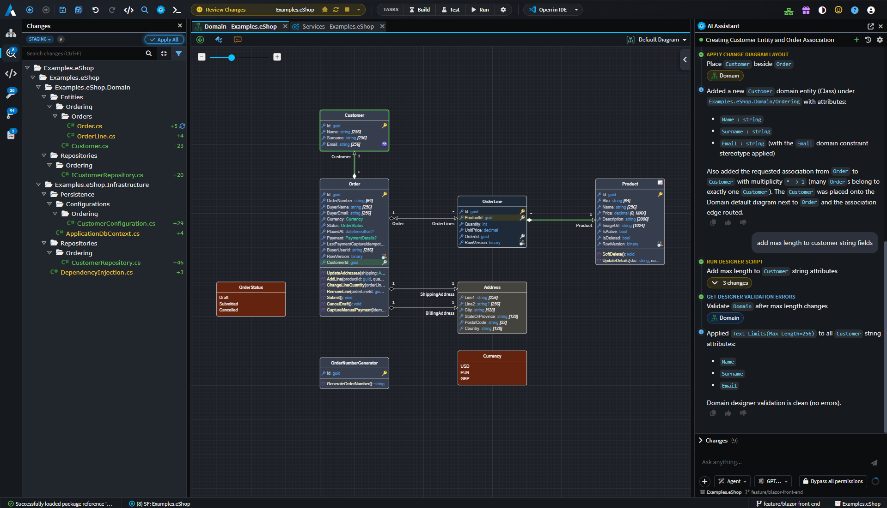
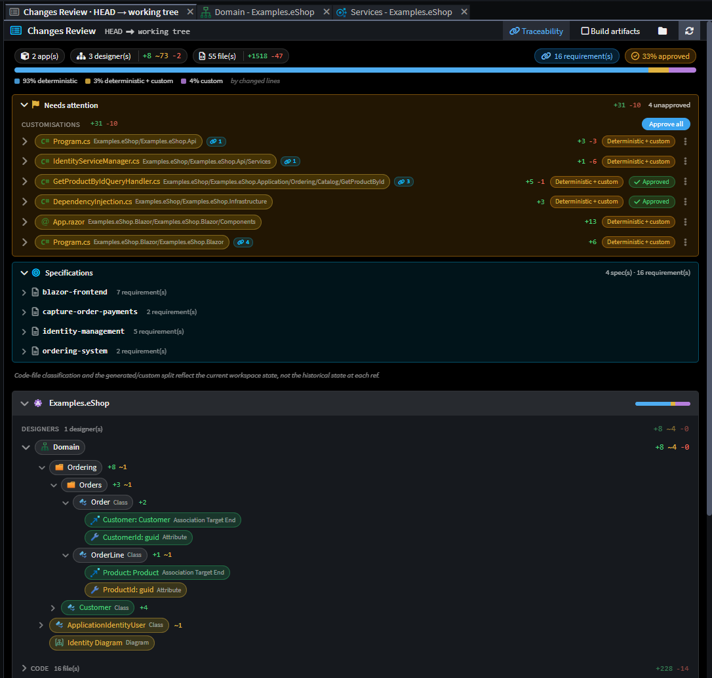
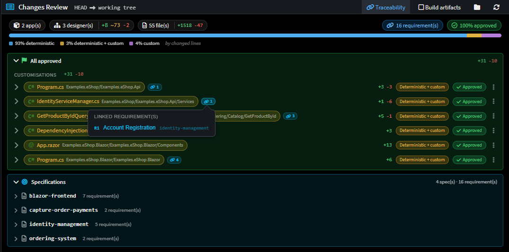

# Release notes: Intent Architect version 5.2

## Version 5.2.0

> [!NOTE]
>
> Version 5.2 is still in pre-release. These release notes are a work in progress and subject to change before the final release.

We're very excited to announce the release of Intent Architect version 5.2. This release is a major upgrade, and the first version the platform which we, the Intent Architect team, now use exclusively for our fully agentic development of the platform and modules!

Where 5.1 was about *seeing* change, 5.2 is about *reviewing, trusting and driving* it. This release expands on our foundation of quality guardrails, architectural adherence, fully integrated agentic systems, and authoritative design specifications, and sharpens Intent Architect into a simpler, more unified workspace and doubles down on the AI-native workflow that ties your model, your code and your repository together. The result is a control plane for fully agentic software development that gives teams assurance of quality, visibility and clarity in a world where codebases are increasingly "black-boxed" - while dramatically simplifying and streamlining the validation, review and traceability bottlenecks.

To support this, 5.2 introduces several new capabilities, such as the the new **Changes Review** tab - a single place to review everything that has historically landed in your Git, or about to land in your codebase before you commit. It summarizes model changes, Software Factory output and customizations with inline diffs, deviation approvals and traceability links back to the requirements that motivated each change. Around it, the whole UI has been **simplified and unified**, Git gains real **merge, conflict and worktree** support, and the Software Factory now supports a new **write-through mode** for a tighter generate-and-go loop.

On the AI side, 5.2 introduces **Spec-Driven Development (Beta)** with genuine requirement-to-code traceability, an **AI-driven C# import** that reverse-engineers existing code into your designer model, and a new generation of **AI agent orchestration** built on sub-agents.

As always, the team has also poured significant effort into polish, performance and the hundreds of small details that add up to a world-class experience.

We hope you enjoy this version. Thank you for your continued support and feedback as we pioneer the future of software development with you 🚀

> [!TIP]
>
> Ready to get started? **Head to [our website](https://intentarchitect.com) and login to download it**.

---

## A simplified, unified interface

5.2 steps back and asks a simple question: *when you're working, how many places do you have to look?* The answer in 5.2 is "fewer".

- **One unified Changes panel.** The Software Factory's separate change views have been consolidated into a single, aggregated **Changes** tree, so generated changes, customizations and deviations all live in one place rather than being scattered across panels.
- **VS Code-style preview tabs.** Single-clicking a file opens it in a reusable *preview* tab; double-click (or edit) **pins** it. This keeps your tab bar from filling up as you skim through diffs and files - exactly the behaviour you're used to from your editor.
- **A refreshed create-solution / create-application experience** with a cleaner layout, better spacing and clearer flow.
- **Consistent, quieter chrome.** Close buttons, hover affordances, pill and badge colours, and light/dark theming have been reworked across the Git, Changes Review, Specs and AI Chat surfaces so the app reads as one coherent system.

### One workspace: terminals, code and Software Factories

The shell also pulls the pieces you used to hunt for into the same workspace:

- **Terminals are now first-class editor tabs.** Each session opens, reorders and closes like any other tab and can be popped out into its own window, file paths and line numbers in the output are clickable, and you can drag-and-drop files into a terminal. Under the hood the terminal moved to **xterm v6** and **ConPTY on Windows**, so agent CLIs and other TUIs render correctly.
- **A new Codebase Explorer** in the sidebar browses each application's generated files across all of its output roots - with background indexing for large codebases, inline rename / delete and add-folder actions, and Git-status overlays on files and folders.
- **A persistent Software Factories window** replaces the old "Run multiple Software Factories" dialog, listing every application's Software Factory with its live status and per-row run / stop / pop-out / refresh controls, Run All / Stop All actions, and the option to **attach a debugger** to a run when developing a module.

---

## Review your changes with confidence: the Changes Review tab

Generating code is only half the story - the other half is *knowing exactly what's about to change, and why, before it becomes a commit*. Then downstream we have the similar questions such as, *what changed between these commits? Why were these changes made?*. The new **Changes Review** tab is built for precisely that.

_An example of the Changes Review for the worktree against the git HEAD._

### Everything that's changed or about to change, in one tree

Changes Review presents a **nested, drill-in change tree** that brings together everything pending for your codebase:

- **Software Factory output** - the files the generator created, modified or deleted.
- **Your customizations** - hand-written code the Software Factory has detected as diverging from what it would generate.
- **Deviations** - regions where your manual edits, or AI/ignored-mode changes, differ from the generated baseline.

Each file expands to reveal its diff **inline** - rendered with the same Monaco editor you use elsewhere - with collapsible summaries, per-extension file-type icons and line-level add/remove statistics so you can gauge the size of a change at a glance.

### Approve deviations without leaving the review

When Intent Architect detects that generated output would collide with code you (or an AI agent) have changed, that region is surfaced as a **deviation** you can **approve** right there in the review. Approving records the customization as intentional, so the Software Factory stops flagging it - the review becomes the one place you reconcile "what I generated" against "what I changed".

### Know *why* each change exists

Changes Review is wired into the traceability system (see below). A **linked-requirements popover** on a change shows which requirements a given change traces back to, so a reviewer can answer "what is this for?" without leaving the diff.

### It tells you when it needs you

Source Control now raises a **Requires Attention** flag - the Review Changes icon switches to a flag - whenever there are pending items that want your eyes, so review never quietly falls off the end of your workflow.

---

## Git: merge, conflicts and worktrees

5.1 introduced Git source control inside Intent Architect. 5.2 makes it genuinely robust for real-world, multi-branch, multi-worktree work.

### Merge & rebase conflict resolution, handled

When a merge or rebase runs into conflicts, Intent Architect now guides you through resolving them and gets out of your way once you're done:

- **Resolved conflicts are detected automatically**, and Intent Architect offers to **Mark resolved**.
- **Resolved conflicts are auto-staged**, so completing a merge no longer means a manual staging chore.
- Conflict resolution works even in the awkward cases - including **resolving conflicts without a `MERGE_HEAD`** and during **rebases**.

### First-class worktree and submodule support

Git operations now work correctly inside **linked worktrees and submodules** - a common setup for anyone running parallel branches or AI agents in isolated trees. Pushing from a linked worktree no longer creates stray remote branches, and pushing to a differently-named upstream is handled correctly.

### More history, more control

- A new **history view mode** with folder-tree grouping makes it easier to see what a commit touched.
- A **create-branch popover** lets you branch off without dropping to the terminal.
- **Everyday Git actions** - undo last commit, delete a branch, `git reset` and amend-commit editing - are now built in.
- **Git diff tabs** now support the same preview / double-click-to-pin behaviour as the rest of the app.

### A self-healing change baseline

Intent Architect's internal change-tracking baseline (its "shadow" repository) now **self-heals**: it can detect and **repair a corrupt shadow repository**, anchors a clean baseline when a solution is opened, and surfaces errors clearly instead of failing silently - so your change indicators stay trustworthy.

---

## Spec-Driven Development (Beta)

5.2 introduces **Spec-Driven Development (SDD)** - a structured, model-native way to go from an idea to implemented, traceable code, driven by AI but anchored to your Intent Architect model. **This is a Beta feature**: it's ready to try and shape, and we'll continue to evolve it.

### From requirements to implementation, in phases

SDD introduces a dedicated **Specs panel** and a guided, phased flow:

1. **Requirements** - capture a feature as precise, testable user stories (EARS-style) with stable IDs.
2. **Design** - turn those requirements into intended *model* changes plus a per-requirement realization plan.
3. **Tasks** - break the design into a checkpointed task list, organised into dependency-ordered *waves*.
4. **Implement** - work the waves in order, applying model changes, generating code, and implementing and testing the bespoke logic.
5. **Verify & Heal** - check the implementation against its acceptance criteria, and repair any gaps the verification finds.

Because the design is expressed as changes to your **designer model** - not just prose - SDD stays true to Intent Architect's core principle: the model is the source of truth, and code is generated output.

### End-to-end traceability

This is what makes SDD more than a checklist. As work is implemented, Intent Architect records **traceability links** from each requirement to the **model elements and files** that realize it. Those links flow straight through to the **Changes Review** tab, so when you review a change you can see the requirement behind it - and when you read a requirement you can see where it lives in the model and the code. Broken or missing links are surfaced and can be repaired.

> [!NOTE]
>
> SDD in 5.2 is a **Beta** feature. Our roadmap includes deeper interoperability with popular spec-driven development frameworks, so you can bring your existing specs and workflows into Intent Architect's model-native flow.

---

## Software Factory write-through mode

Until now, the Software Factory always **staged** its output for you to review and apply. 5.2 adds a new **write-through mode**, where the Software Factory writes its generated code **straight through to your codebase** - no separate apply step.

Write-through is designed for a tighter, faster loop (and pairs naturally with AI agents driving generation), but it doesn't trade away safety:

- Every write-through run is **checkpointed** against Intent Architect's change baseline, so changes remain fully **tracked, reviewable and revertible** after the fact - you still get the full Changes Review experience, just after the write rather than before.
- Write-through **checkpoints are configurable** via user settings, so you can tune how much history is retained.
- Destructive changes are still detected and handled, so write-through won't quietly clobber code it shouldn't.

The result: when you're moving fast and iterating - especially with an AI agent in the loop - you can let generated code land immediately and still review, diff and roll back with confidence.

---

## Import existing C# into your model

One of the hardest parts of adopting a model-driven approach is *getting your existing code into the model*. 5.2 adds an **AI-driven C# import** capability that does exactly that.

A new **import tool**, available to AI agents, reads existing C# source and **reverse-engineers it into your designer model** - creating the corresponding elements and mappings so an existing codebase can be brought under Intent Architect's management rather than rebuilt by hand. It supports importing by **folder path**, correlates imported code back to the model, and keeps an **import log** so the process is transparent and repeatable.

This turns "we already have a large C# codebase" from a blocker into a starting point: point an agent at your code and let it populate the model for you.

---

## Smarter AI agents: sub-agents and orchestration

5.0 brought AI in; 5.1 widened the providers; 5.2 makes those agents **work like a team**.

### Sub-agent orchestration

AI agents can now **dispatch sub-agents** for isolated, focused pieces of work - for example a `coding` sub-agent to implement business logic, or a `discovery` sub-agent to explore an unfamiliar area of the model read-only and report back. Delegation is routed through a single, controlled mechanism (`create_sub_agent`), with proper **steering**, context hand-off between sequential dispatches, and clean rendering of each sub-agent's report in the chat. This is the backbone that lets the SDD flow implement a large feature wave-by-wave without one giant, unwieldy conversation.

### A faster, tighter ACP integration

The **Agent Client Protocol** path that powers Claude Code, Codex, Copilot and Kiro has been substantially tuned:

- **Intent Architect's built-in skills are now bridged into each agent's native skill discovery**, so agents can find and invoke the right Intent skill for the phase of work they're in.
- **Auto-compaction for ACP sessions** keeps long conversations within context limits automatically, complementing the manual compaction added in 5.1.
- The agent path is **faster** - fewer round-trips, safe parallelism where possible, pre-warming re-enabled, and a per-turn workspace-context that's trimmed to cut token cost on large solutions.
- **Agent and Plan modes** now consistently ask for decisions through the structured "Ask a question" UI rather than free-text chat, for clearer, quicker interactions.

### Tasks the agent can actually run and watch

AI agents can now **run your configured build/test/run tasks** directly, including **compound tasks** that launch several terminals at once, wait for a task to become "ready", and have **background-task errors surfaced back** to the agent so it can react and self-correct.

---

## Improvements in 5.2.0

- Improvement: **The AI diagram-layout tools** (`apply_change_diagram_layout` and `get_designer_diagram_snapshot`) now report the actual post-layout geometry back to the agent, flag node overlaps and crowding with a collision-checked single-node move to resolve each, surface auto-sized nodes (whose size is content-driven and must not be set), and fan out associations that share a target edge so their auto-routed lines no longer stack.
- Improvement: **When the AI assistant is blocked waiting for your input**, the relevant Intent Architect window now "seeks attention" (flashing in the Windows taskbar or bouncing the macOS dock) so you notice it needs you.
- Improvement: A **UI automation API** has been introduced, allowing Intent Architect to be driven for UI testing and by MCP clients (including via Playwright), improving our ability to test and automate the app end-to-end.
- Improvement: **Search Everywhere** now always favours results from non-external packages over external ones when both are available.
- Improvement: The **AI chat conversation list** has been reworked into a shared search / filter / sort toolbar for quicker navigation of long histories.
- Improvement: **"Open in IDE"** now offers a dropdown to select which IDE to use.
- Improvement: **A Markdown preview for `.md` files** renders syntax highlighting, YAML front-matter as a table and task-list checkboxes, with a user-selectable font size - toggle it with **Ctrl+Shift+V** or a double-click.
- Improvement: **Press F5 / Shift+F5 in the editor** to run the current application's Software Factory.
- Improvement: **The model diff popover now shows who changed what**, attributing each changed element to the developer, commit and date that last touched it, with a clickable commit link and an "Uncommitted" marker for working-tree edits.
- Improvement: **Diff views** gain a "Hide unchanged lines" toggle, per-language word-wrap preferences, a dirty-diff change gutter, and Reveal-in-Codebase / Open / Create-AI-Task actions plus drag-into-chat from diff tabs and Source Control rows.
- Improvement: The AI scripting API's `lookupByPath` resolution has been improved with an editable-first, reference-inclusive fallback, for more reliable element lookups from scripts.

## Fixes in 5.2.0

- Fixed: A false-positive where freshly-generated `.csproj` files would show up as Customizations.
- Fixed: Software Factories would sometimes not show as completed when a run produced no changes.
- Fixed: An AI agent could attempt to write staged changes to a Software Factory that had errored.
- Fixed: A deleted mapping would still persist its `mappedEnds` in the metadata.
- Fixed: Illegal XML characters - introduced via paste, AI-generated content or imports - could corrupt a model file so it failed to load; such characters are now stripped at every layer.
- Fixed: Git History model-centric diffs would not show domain elements when comparing two historical commits.
- Fixed: The Reasoning Effort chip (Low / Medium / High / Extra High / Max) in the ACP Agent Settings popup would reset between sessions.
- Fixed: Renamed-file diffs showed a blank original-content pane.
- Fixed: Starting a new instance of Intent Architect while one was already running was significantly slower than it should be.
- Fixed: The `getChild(matchFunction, searchHierarchy: true)` scripting call on a package node would also match elements in package references.
- Fixed: The tab selector would not load when using the `Ctrl+Tab` / `Ctrl+Shift+Tab` shortcuts.
- Fixed: Floating spinners could appear above tool calls in the AI Chat window.
- Fixed: `create_solution` / `create_application` could hang for module-less architectures.
- Fixed: stdio MCP servers could fail when launched outside the repository tree.
- Fixed: `run_software_factory` could time out under multi-instance contention.
- Fixed: Adding an application to a solution could silently conflict on name instead of auto-incrementing.
- Fixed: Template / sample search could throw a "solution-path header not set" error when no solution was open.
- Fixed: MCP/AI and write-through Software Factory applies emitted no "Apply Software Factory Changes" analytics.
- Fixed: An ACP session cache could be permanently poisoned after a cancelled session creation.
- Fixed: Chat glitches with GPT-5.2 (degenerate tool-call text and unfinished-turn stalls).
