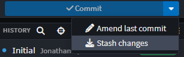
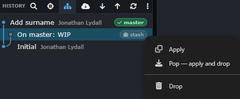
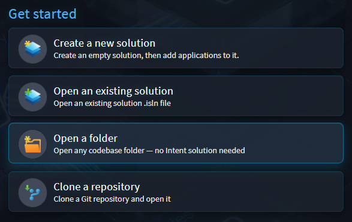
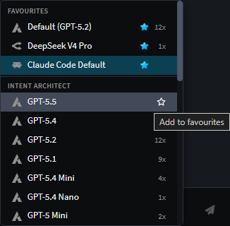
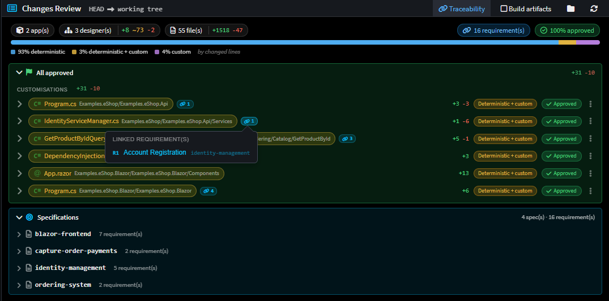

# Release notes: Intent Architect version 5.2

## Version 5.2.3

<!-- Generated from publish/client/5.2.2..publish/client/5.2.3-pre.2 -->

## Improvements in 5.2.3

- Improvement: The Source Control view now supports git stash - stash, apply, pop and drop - with stashes shown in the commit graph and a combined Commit/Stash button.

  

  

- Improvement: Opening a folder without an existing solution file now opens it as a workspace immediately; the `.isln` file is only created when you explicitly choose "Create solution", and the Home screen's "Open a folder" and "Clone a repository" tiles are available again.

  

- Improvement: Modules are now automatically restored when `modules.config` or the module cache changes outside Intent Architect - e.g. `git pull`/`checkout`/`reset`/`clean`, or another window - instead of leaving designers running against stale or missing modules until reopened.
- Improvement: Tree views such as Solution Explorer now show a sticky header of ancestor rows as you scroll, so the folder path you're inside stays visible and clickable.
- Improvement: OpenCode is now available as an ACP agent, with its model list discovered live from your own `opencode` install.
- Improvement: When an external MCP client (not the in-app AI chat or an ACP agent) triggers a tool that opens a dialog, the call now fails immediately instead of hanging forever waiting for a human who isn't there to click it; a background tab blocked on an open dialog now pulses in the tab strip until focused.
- Improvement: The Properties pane can now be hidden and shown via `F4` or a new toolbar button, and can be collapsed by dragging it small, matching other panels.
- Improvement: The Choose Icon and Create Solution dialogs now open as their own windows instead of in-page overlays, so they're no longer clipped when opened over other modal windows.
- Improvement: Markdown preview tabs now restore your exact scroll position when reopened.
- Improvement: The tabs list menu now supports `Ctrl`/`Cmd` + Click to close a tab, with a hint showing the platform-specific modifier.
- Improvement: The AI chat action row now collapses the permission-mode chip to an icon when space is tight, keeping the agent and model picker labels visible.
- Improvement: Spec items opened as file tabs now show a friendly title instead of the underlying file path.
- Improvement: Spec/plan tools' `contents` parameter has been renamed to `content` for consistency.
- Improvement: Search boxes in Solution Explorer, the Deviations and Codebase Explorer trees, and the Specs panel are now tucked behind a toolbar magnifier icon instead of a permanent row, and no longer stay filtered across restarts.
- Improvement: The Specs panel's Import action is now a menu, letting you choose between sweeping the whole workspace or scanning a single folder.
- Improvement: The Specs panel's redundant Review button has been removed - the same artifacts are already reachable from the phase chips.
- Improvement: `run_software_factory` now excludes ignored files from its Changes list (reporting how many were excluded), and new `list_ignored_files` / `set_is_ignored` MCP tools let an AI agent read and manage the ignore list without an active run.
- Improvement: Spec import can now link a single existing document as a requirements/design/tasks artifact, instead of only importing or copying a whole folder.
- Improvement: The Specs panel now offers a "Name it first" option for creating a new spec - naming and creating the folder before drafting requirements - alongside "Describe it in chat".
- Improvement: Each spec card now has a "⋯" menu for spec-wide options: toggling auto-approve phase gates and refreshing that spec's state from disk.
- Improvement: The Codebase Explorer's right-click menu now offers "New File..." and "New Folder..." on folder rows.
- Improvement: The AI chat's history button now pulses to draw attention when a background conversation is awaiting your approval or has completed.
- Improvement: SVG files now open in rendered preview by default, with a one-click toggle to edit them as text.
- Improvement: In the AI chat's "Ask a question" wizard, pressing Enter in a free-text "Other" field now submits it, matching option selection.
- Improvement: Messages sent while an AI conversation is compacting are now queued and applied in order instead of being dropped, with dimmed previews shown while they wait.
- Improvement: The `read_spec` tool can now be called with no slug to list every spec in the solution with its phase and progress, so an agent can resolve the right spec instead of guessing its slug.
- Improvement: Discarding, staging, unstaging or resolving conflicts on multiple files in Source Control is now batched into a single operation instead of one per file, making bulk actions much faster.
- Improvement: A tool call's "intention" text is now hidden once its chip already shows the same information (e.g. reading a file), reducing duplicate text in the AI chat.
- Improvement: The "nothing open" shortcuts help now also lists shell-wide shortcuts (Toggle Side Panel, Solution Explorer, Codebase, Source Control, Changes, New Terminal), and switches to a two-column layout on wider windows.
- Improvement: Native todo-list tool calls are now persisted as proper checklist chips so they survive a conversation reload, and OpenCode's native `todowrite` calls are recognized directly, with descriptive titles shown verbatim.
- Improvement: The AI chat model picker can now be searched, and opened directly via a `/model` command.
- Improvement: The AI assistant sidebar toggle shortcut changed from `Ctrl + Shift + B` to `Ctrl + Alt + B`.
- Improvement: Clicking a write-plan pill in AI chat now opens the plan in the shell's regular reusable preview tab instead of a separate pinned tab.
- Improvement: Toggling a model on or off (or "toggle all") in AI model settings now saves immediately, with a spinner, instead of requiring a separate Save step.

## Fixes in 5.2.3

- Fixed: Discarding a file could fail to remove it from the index when it didn't exist in HEAD, e.g. in a freshly initialized repository or a linked/junction directory.
- Fixed: Bumping a module's version could mark package-reference designer tabs as having unsaved changes with nothing to save.
- Fixed: Updating modules across a whole and very large solution could peg CPU in every open window; large module operations now show a "File operations in progress" bar while designers wait for the filesystem to settle.
- Fixed: Agent tools that wait on a human decision - Ask Question, tool/plan approval, elicitation, spec phase advance - could fail after about 10 minutes with "The user did not answer the questions".
- Fixed: Shell keyboard shortcuts such as `Ctrl + S`, `Ctrl + Shift + Y` and `Ctrl + Tab` could stop working after clicking inside a diff editor, e.g. its gutter revert arrows.
- Fixed: Freshly created, unsaved AI conversations could vanish from the list when switching the current chat, if the repository or branch couldn't yet be determined.
- Fixed: In light mode, tree view scrollbars had no visible track, making the thumb hard to see and the scroll extent unclear.
- Fixed: Filtering a tree view didn't scroll to show the matching results.
- Fixed: Steering messages sent with attachments (pasted text or images) mid-turn could fail to route them, losing the attachment.
- Fixed: `rebase --continue`/`--skip` could hang waiting on an interactive editor instead of running headless; failures are now classified as conflicts, unstaged changes or a timeout with a clearer message.
- Fixed: An ACP agent session could start with the wrong working directory if no solution was open yet.
- Fixed: MCP calls such as `get_applications` could fail permanently with "Client didn't provide a result" after a computer resumed from sleep, until Intent Architect was restarted.
- Fixed: Starting two Intent Architect instances at the same time could crash one of them with a port-already-in-use error.
- Fixed: Module restore could fail almost immediately on a transient file lock, such as an antivirus scan or another Intent Architect instance, instead of waiting and retrying.
- Fixed: A dialog opened from a designer script (`dialogService.confirm/info/warn/error`) or from automation tooling could stay invisible until unrelated UI activity happened to trigger it.
- Fixed: A designer-script dialog (`confirm`/`lookupFromOptions`) triggered by an AI agent - including ACP agents and the in-app chat, not just an external MCP client - could hang instead of surfacing as an answerable question.
- Fixed: An AI chat turn cancelled for a reason other than the user pressing Stop (e.g. a resend pre-empting it) could be reported as silently completed with no reply, instead of surfacing as an error - sometimes stalling repeatedly mid `ask_user_question`.
- Fixed: A retry notice for a failed AI turn could overwrite an already-rendered answer from an earlier turn instead of just replacing the in-progress message.
- Fixed: Switching the AI chat's permission mode (e.g. to "Bypass all permissions") while a sub-agent was running left that sub-agent stuck on its old mode, still prompting for approval.
- Fixed: Keyboard focus could land in the wrong place when popping out or closing the AI chat window.
- Fixed: The Changes panel's "Hide unchanged ignored" option didn't actually hide ignored files that hadn't drifted, in both staged and write-through modes.
- Fixed: Ignoring or unignoring a file in the Changes tree could restart the running Software Factory task.
- Fixed: When an ACP agent switched into or out of Plan Mode on its own, the AI chat's UI could fall out of sync with the agent's actual mode.
- Fixed: Deleting a spec could leave an empty ghost folder that reappeared as a blank card on reload.
- Fixed: Updating modules (`update-modules --module '*@latest'`, or the AI's `install_or_update_modules`) could silently reset an already-installed module's settings back to defaults, and could silently downgrade a module pinned above the currently installed version.
- Fixed: Saving global user preferences from one window could revert changes another window had just saved.
- Fixed: Starting an AI modeling task from a script (`createAIModelingTask`) was not working.
- Fixed: Saving Application Settings on a large solution was disproportionately slow and could crash.
- Fixed: The Agent process could leave child processes running after exit, or hang or report stale connection state around a deliberate restart.
- Fixed: An AI turn could be prematurely sealed and reported as "Completed" by its heartbeat watchdog while still actually running; such turns are now shown as "Lost contact" and can be resumed.
- Fixed: Leaving a solution for the Home screen could leave Software Factory host processes running in the background, holding module DLL locks indefinitely.
- Fixed: Shell sidebar-panel shortcuts (`Ctrl+Shift+E/C/G/D`, `` Ctrl+` ``, `Ctrl+B`) could stop working when focus was inside a designer, terminal, or Monaco editor.
- Fixed: A terminal tab's friendly shell name could be overwritten by a raw executable-path title shortly after opening.

## Version 5.2.2

## Improvements in 5.2.2

- Improvement: AI chat's model picker now lets you mark models as favourites, which persist across sessions and are pinned to the top of the picker.

  

- Improvement: The Source Control History view and each designer's History dialog can now search commits across the whole repository, not just the ones already loaded.
- Improvement: History gained branch-level push and rename actions, without dropping to the terminal.
- Improvement: Folder rows in the Changes and Codebase panels now offer subtree-wide actions - Apply All, Keep All, Undo All and Un-ignore All.
- Improvement: "Resolve with AI" for merge/rebase conflicts now opens its own AI conversation, shows a spinner while it works, and lets you switch back to that conversation by clicking the busy button again.
- Improvement: AI-generated commit messages now use `gpt-5-mini` and take the branch name and existing commit style into account.
- Improvement: The Changes Review tab now refreshes automatically when reopened.
- Improvement: A "warn on unreviewed changes" option can now prompt you before committing files that haven't been reviewed.
- Improvement: Added `Ctrl + W` to close the current tab and `Ctrl + Shift + W` to close all tabs.
- Improvement: The Software Factory Changes panel now highlights each application and shows its icon next to its output location.
- Improvement: Git diff tabs now offer a rendered Markdown preview for `.md` files, matching the preview available elsewhere.
- Improvement: Changes Review now warns when an application's code-management directives predate version 5.0.0, since the deterministic/custom split can't be trusted until the module is updated.
- Improvement: The AI chat model picker now shows each provider's own icon instead of a generic chip icon for every row.
- Improvement: Source Control rows now offer an "Add to .gitignore" submenu - this file, all files of this extension, this file's folder, or any folder with this name.
- Improvement: Image files are now recognized and supported in AI chat and Git views.

## Fixes in 5.2.2

- Fixed: The ACP context-usage gauge could stay pinned at a flat 100% for models whose live usage report started conservative before correcting itself.
- Fixed: Intent Architect's own metadata files and designer folders could appear as changes in the tracked change baseline; they're now excluded.
- Fixed: Retrying a failed AI-chat turn always resent the original message verbatim, even when the turn had already made progress - it now asks the agent to continue from where it left off.
- Fixed: Two concurrent modal dialogs - such as the `.mcp.json` suggestion racing an install prompt - could leave one waiting forever with a phantom "reply was never sent" error.
- Fixed: Git reset showed an incorrect warning.
- Fixed: The scrollbar in designers, tree and diff views was overly transparent, and highlighted or modified lines showed inconsistent alpha blurring across themes.
- Fixed: Answered-question tab titles were not visible in dark mode for the Ask Question tool.
- Fixed: Confirm / Info / Warn / Error dialogs, in-page and standalone, could be mis-sized - clipping long messages or leaving dead space for short ones, with lopsided footer padding - and could take about a second to appear; they now size to their content, show immediately, and have even padding.
- Fixed: "Mutation" dialogs, such as rename or create, could be dismissed by clicking outside, discarding whatever had been entered.
- Fixed: The app could start in a stale AI mode instead of Agent mode.
- Fixed: A deviation approval could be silently revoked when unrelated parts of the file changed, even though the approved deviation itself hadn't - or a stale approval could be wrongly kept.
- Fixed: Viewing an AI conversation in one Git worktree locked it for every other worktree or instance of the same solution.
- Fixed: A refused AI turn, immediately after starting a new one, could leave the composer stuck on "Thinking…" forever.
- Fixed: Claude Code could repeatedly show "OAuth session expired and could not be refreshed" with no way to recover; Intent Architect now automatically attempts to re-authenticate and tells you to run `claude /login` if that fails.
- Fixed: Auto-summarization for ACP conversations could fail with a 404 error on `gpt-5.1-mini` on every turn.
- Fixed: Switching branches with an external Git client while Intent Architect was open could leave designers and the Software Factory out of sync until a full reload; file-change reactions now wait until Git finishes writing, with a bar to reload, dismiss or resolve with AI in the meantime.
- Fixed: Clicking Cancel on the "Stop tracking?" prompt, after adding a pattern to `.gitignore`, still wrote the pattern; Cancel now aborts the whole action.
- Fixed: `grep` and other file/search and spec tools could hang indefinitely for a coding sub-agent; they now run in-process, cutting a ~28,000-file grep from potentially never returning to about 10 seconds.
- Fixed: The Changes Review tab's deterministic/custom split showed everything as 100% Custom on a fresh clone, a CI checkout, or a teammate's machine; classification is now captured in per-commit records committed to the repository.
- Fixed: An unresponsive Intent Architect instance could add up to 5 seconds to every MCP call from every client on the machine - even calls targeting a different solution - with no eviction; health checks and process lifetimes are now bounded so a dead instance stops slowing everything else down.
- Fixed: Running the Software Factory from two Intent Architect instances against the same checked-out folder at once could let both proceed and clobber each other instead of the second one stopping with a clear "already running" message.
- Fixed: Unticking a module's Installation Settings checkbox and choosing Reinstall silently did nothing, and installing a dependent module could OR the setting back on regardless; settings changes now stick, with a warning when dependent modules are affected.
- Fixed: MCP's `create_solution` could target the wrong Intent Architect instance when both a home-screen instance and a solution-open instance were running, and `get_architecture_details` could 404 for a repository other than the currently selected one.
- Fixed: MCP's `get_status` could throw and kill the tool call outright when scanning into a permission-denied folder, or hang scanning a very large or deep folder tree; the scan now skips inaccessible folders and is time-bounded.
- Fixed: The Changes panel could silently drop changes located outside every codebase root instead of showing them.

## Version 5.2.1

## Improvements in 5.2.1

- Improvement: Cursor (via the `cursor-agent` CLI) is now available as an ACP agent, with its own provider icon and model list.
- Improvement: Existing specification documents - such as BMAD PRDs, in both v4 and v6 formats - can now be imported into and integrated with the Spec-Driven Development system.
- Improvement: The Specs panel now offers sorting options, with the chosen sort order remembered across sessions.
- Improvement: Intent Architect's skills are now also discovered in the repository root, are loaded with their directory made explicit to the agent, and support substitution of Claude variables.
- Improvement: An "Open" action has been added to Source Control rows and working-directory diff tabs, for opening the editable working file rather than its diff.
- Improvement: The repository root can now be opened in the operating system's file explorer.
- Improvement: Pinned solutions on the Home screen no longer count towards the recent-solutions limit, and that limit has been raised to 50.
- Improvement: The Home screen's recent solutions are now grouped under collapsible "Pinned" and "Other" headings.
- Improvement: Custom AI models can now be flagged to explicitly turn reasoning off, for models which refuse to combine tool calling with a reasoning effort.
- Improvement: AI conversation persistence is now crash-safe and multi-instance safe - assistant narration is saved as it happens, history and index files are written atomically under a cross-process lock, and a conversation already open in another instance opens read-only with a Retry option.
- Improvement: ACP conversations now restore their context window usage gauge on reload, and reloaded tool calls report an honest status - interrupted, failed or cancelled - instead of always appearing to have succeeded.

## Fixes in 5.2.1

- Fixed: Changes Review failed outright on a repository with no commits, and "Review changes in this commit" was unavailable on a repository's very first commit.
- Fixed: Concurrent Claude Code cold starts could race to refresh the shared OAuth credentials and log the user out mid-task; cold starts are now serialized machine-wide and any remaining authentication failure is explained in the chat instead of surfacing as a raw `-32603` error.
- Fixed: Resuming an ACP conversation could fail with a `-32603` error, and a resumed conversation could silently drop the selected Reasoning Effort.
- Fixed: A refused ACP configuration value showed the turn as failed while the agent carried on running the turn and editing files invisibly.
- Fixed: Reverting a `*.deviations.log.xml` file wouldn't restore its deviations.
- Fixed: A broken package reference - pointing at a `.pkg.config` file no longer on disk - would crash the Package Reference Manager dialog for the whole application; broken references are now flagged with a warning and can be unloaded.
- Fixed: "Open Solution in IDE" reported "Unable to locate sln/slnx file" when the solution file was generated outside the application's output folder.
- Fixed: New Terminal silently fell back to Windows PowerShell 5.1 when PowerShell 7 was installed from the Microsoft Store.
- Fixed: The last line of terminal output, and the terminal pane's scrollbar, could be clipped.
- Fixed: Rendered markdown tables - in the AI chat, Markdown preview and sub-agent reports - used a larger font than the surrounding text and ignored the preview pane's font size setting.
- Fixed: Context menu submenus would open or close as the mouse merely brushed past an item; a hover-intent delay is now applied.
- Fixed: Heavy AI chat activity in one Git worktree could push another worktree's conversation history off the list.
- Fixed: An inline rename in progress could silently revert a name or type that had been set by a script.
- Fixed: Explicitly mapping an untyped association or an unresolvable element could fail with a "Cannot read properties of undefined" error; a notice is now shown instead.
- Fixed: A dialog resolved before it had finished being shown - reachable through fast keyboard-driven use - could deadlock permanently.
- Fixed: The custom model group label in the AI configuration would fall back to a raw provider id for an ACP agent with no models in the server registry yet.
- Fixed: Opening the AI Configuration or User Settings dialogs through the UI automation API would hang until the dialog was closed.

## Version 5.2.0

  <iframe style="width: 100%; height: 100%; border: 0" src="https://www.youtube.com/embed/bGofnbPQV8k?si=98znkTEDcWzad2n" title="YouTube video player" frameborder="0" allow="accelerometer; autoplay; clipboard-write; encrypted-media; gyroscope; picture-in-picture; web-share" referrerpolicy="strict-origin-when-cross-origin" allowfullscreen></iframe>

We're very excited to announce the release of Intent Architect version 5.2. This release is a major upgrade, and the first version the platform which we, the Intent Architect team, now use exclusively for our fully agentic development of the platform and modules!

Where 5.1 was about *seeing* change, 5.2 is about *reviewing, trusting and driving* it. This release expands on our foundation of quality guardrails, architectural adherence, fully integrated agentic systems, and authoritative design specifications, and sharpens Intent Architect into a simpler, more unified workspace and doubles down on the AI-native workflow that ties your model, your code and your repository together. The result is a control plane for fully agentic software development that gives teams assurance of quality, visibility and clarity in a world where codebases are increasingly "black-boxed" - while dramatically simplifying and streamlining the validation, review and traceability bottlenecks.

To support this, 5.2 introduces several new capabilities, such as the the new **Changes Review** tab - a single place to review everything that has historically landed in your Git, or about to land in your codebase before you commit. It summarizes model changes, Software Factory output and customizations with inline diffs, deviation approvals and traceability links back to the requirements that motivated each change. Around it, the whole UI has been **simplified and unified**, Git gains real **merge, conflict and worktree** support, and the Software Factory now supports a new **write-through mode** for a tighter generate-and-go loop.

On the AI side, 5.2 introduces **Spec-Driven Development (Beta)** with genuine requirement-to-code traceability, an **AI-driven C# import** that reverse-engineers existing code into your designer model, and a new generation of **AI agent orchestration** built on sub-agents.

As always, the team has also poured significant effort into polish, performance and the hundreds of small details that add up to a world-class experience.

We hope you enjoy this version. Thank you for your continued support and feedback as we pioneer the future of software development with you 🚀

> [!TIP]
>
> Ready to get started? **Head to [our website](https://intentarchitect.com) and login to download it**.

---

## A simplified, unified UI

As part of 5.2, we've overhauled the UI into a simplified and unified experience for the user. This release no longer has separate Software Factory dialogs with separate AI Assistants (i.e. "Modeling" and "Coding" AI Assistants) - a paradigm that could create confusion at times and required unnecessary user intervention. Instead 5.2 offers an additional set of side panels which unify the Software Factory changes, Codebases, Customizations (Deviations), and Source Control across applications in the solution.

As part of this simplification of the UI, we've added the following:

- **Software Factory and Tasks controls in main toolbar.** The Software Factory And Tasks available for the current application is inferred from which tab is currently in focus.
- **Unified Software Factory Changes panel.** The Software Factory's separate change views have been consolidated into a single, aggregated **Changes** tree, so generated changes across separate applications and Software Factories all live in one place rather than being scattered across separate dialogs.
- **Single AI Assistant.** Ask anything and drive all changes from the single AI Assistant window. Coding agents for specific applications are now dispatched as sub-agents from the main _solution wide_ agent.
- **A new Codebase Explorer** in the sidebar browses each application's generated files across all of its output roots - with background indexing for large codebases, inline rename / delete and add-folder actions, and Git-status overlays on files and folders.
- **File Diff and Editor tabs** allowing the user to see files and changes directly in the main window.
- **Preview tabs.** Single-clicking a file opens it in a reusable *preview* tab; double-click (or edit) **pins** it. This keeps your tab bar from filling up as you skim through diffs and files - exactly the behaviour you're used to in other editors.
- **Collapsible side panels.** Main window and designer side-panels can now be collapsed, allowing real-estate to be optimized for the task at hand.
- **Terminals are now first-class tabs.** Each session opens, reorders and closes like any other tab and can be popped out into its own window, file paths and line numbers in the output are clickable, and you can drag-and-drop files into a terminal. Under the hood the terminal moved to **xterm v6** and **ConPTY on Windows**, so agent CLIs and other TUIs render correctly.

---

## Review your changes with confidence: the Changes Review tab

Generating code is only half the story - the other half is *knowing exactly what's about to change, and why, before it becomes a commit*. Then downstream we have the similar questions such as, *what changed between these commits? Why were these changes made?*. The new **Changes Review** tab is built for precisely that.

_An example of the Changes Review for the worktree against the git HEAD._

### Everything that's changed or about to change, in one tree

Changes Review presents a **nested, drill-in change tree** that brings together everything pending for your codebase:

- **Software Factory output** - the files the generator created, modified or deleted.
- **Your customizations** - hand-written code the Software Factory has detected as diverging from what it would generate.
- **Deviations** - regions where your manual edits, or AI/ignored-mode changes, differ from the generated baseline.

Each file expands to reveal its diff **inline** - rendered with the same Monaco editor you use elsewhere - with collapsible summaries, per-extension file-type icons and line-level add/remove statistics so you can gauge the size of a change at a glance.

### Approve deviations without leaving the review

When Intent Architect detects that generated output would collide with code you (or an AI agent) have changed, that region is surfaced as a **deviation** you can **approve** right there in the review. Approving records the customization as intentional, so the Software Factory stops flagging it - the review becomes the one place you reconcile "what I generated" against "what I changed".

### Know *why* each change exists

Changes Review is wired into the traceability system (see below). A **linked-requirements popover** on a change shows which requirements a given change traces back to, so a reviewer can answer "what is this for?" without leaving the diff.

### It tells you when it needs you

Source Control now raises a **Requires Attention** flag - the Review Changes icon switches to a flag - whenever there are pending items that want your eyes, so review never quietly falls off the end of your workflow.

---

## Git: merge, conflicts and worktrees

5.1 introduced Git source control inside Intent Architect. 5.2 makes it genuinely robust for real-world, multi-branch, multi-worktree work.

### Merge & rebase conflict resolution, handled

When a merge or rebase runs into conflicts, Intent Architect now guides you through resolving them and gets out of your way once you're done:

- **Resolved conflicts are detected automatically**, and Intent Architect offers to **Mark resolved**.
- **Resolved conflicts are auto-staged**, so completing a merge no longer means a manual staging chore.
- Conflict resolution works even in the awkward cases - including **resolving conflicts without a `MERGE_HEAD`** and during **rebases**.

### First-class worktree and submodule support

Git operations now work correctly inside **linked worktrees and submodules** - a common setup for anyone running parallel branches or AI agents in isolated trees. Pushing from a linked worktree no longer creates stray remote branches, and pushing to a differently-named upstream is handled correctly.

### More history, more control

- A new **history view mode** with folder-tree grouping makes it easier to see what a commit touched.
- A **create-branch popover** lets you branch off without dropping to the terminal.
- **Everyday Git actions** - undo last commit, delete a branch, `git reset` and amend-commit editing - are now built in.
- **Git diff tabs** now support the same preview / double-click-to-pin behaviour as the rest of the app.

### A self-healing change baseline

Intent Architect's internal change-tracking baseline (its "shadow" repository) now **self-heals**: it can detect and **repair a corrupt shadow repository**, anchors a clean baseline when a solution is opened, and surfaces errors clearly instead of failing silently - so your change indicators stay trustworthy.

---

## Spec-Driven Development (Beta)

5.2 introduces **Spec-Driven Development (SDD)** - a structured, model-native way to go from an idea to implemented, traceable code, driven by AI but anchored to your Intent Architect model. **This is a Beta feature**: it's ready to try and shape, and we'll continue to evolve it.

### From requirements to implementation, in phases

SDD introduces a dedicated **Specs panel** and a guided, phased flow:

1. **Requirements** - capture a feature as precise, testable user stories (EARS-style) with stable IDs.
2. **Design** - turn those requirements into intended *model* changes plus a per-requirement realization plan.
3. **Tasks** - break the design into a checkpointed task list, organised into dependency-ordered *waves*.
4. **Implement** - work the waves in order, applying model changes, generating code, and implementing and testing the bespoke logic.
5. **Verify & Heal** - check the implementation against its acceptance criteria, and repair any gaps the verification finds.

Because the design is expressed as changes to your **designer model** - not just prose - SDD stays true to Intent Architect's core principle: the model is the source of truth, and code is generated output.

### End-to-end traceability

This is what makes SDD more than a checklist. As work is implemented, Intent Architect records **traceability links** from each requirement to the **model elements and files** that realize it. Those links flow straight through to the **Changes Review** tab, so when you review a change you can see the requirement behind it - and when you read a requirement you can see where it lives in the model and the code. Broken or missing links are surfaced and can be repaired.

> [!NOTE]
>
> SDD in 5.2 is a **Beta** feature. Our roadmap includes deeper interoperability with popular spec-driven development frameworks, so you can bring your existing specs and workflows into Intent Architect's model-native flow.

---

## Software Factory write-through mode

Until now, the Software Factory always **staged** its output for you to review and apply. 5.2 adds a new **write-through mode**, where the Software Factory writes its generated code **straight through to your codebase** - no separate apply step.

Write-through is designed for a tighter, faster loop (and pairs naturally with AI agents driving generation), but it doesn't trade away safety:

- Every write-through run is **checkpointed** against Intent Architect's change baseline, so changes remain fully **tracked, reviewable and revertible** after the fact - you still get the full Changes Review experience, just after the write rather than before.
- Write-through **checkpoints are configurable** via user settings, so you can tune how much history is retained.
- Destructive changes are still detected and handled, so write-through won't quietly clobber code it shouldn't.

The result: when you're moving fast and iterating - especially with an AI agent in the loop - you can let generated code land immediately and still review, diff and roll back with confidence.

---

## Import existing C# into your model

One of the hardest parts of adopting a model-driven approach is *getting your existing code into the model*. 5.2 adds an **AI-driven C# import** capability that does exactly that.

A new **import tool**, available to AI agents, reads existing C# source and **reverse-engineers it into your designer model** - creating the corresponding elements and mappings so an existing codebase can be brought under Intent Architect's management rather than rebuilt by hand. It supports importing by **folder path**, correlates imported code back to the model, and keeps an **import log** so the process is transparent and repeatable.

This turns "we already have a large C# codebase" from a blocker into a starting point: point an agent at your code and let it populate the model for you.

---

## Smarter AI agents: sub-agents and orchestration

5.0 brought AI in; 5.1 widened the providers; 5.2 makes those agents **work like a team**.

### Sub-agent orchestration

AI agents can now **dispatch sub-agents** for isolated, focused pieces of work - for example a `coding` sub-agent to implement business logic, or a `discovery` sub-agent to explore an unfamiliar area of the model read-only and report back. Delegation is routed through a single, controlled mechanism (`create_sub_agent`), with proper **steering**, context hand-off between sequential dispatches, and clean rendering of each sub-agent's report in the chat. This is the backbone that lets the SDD flow implement a large feature wave-by-wave without one giant, unwieldy conversation.

### A faster, tighter ACP integration

The **Agent Client Protocol** path that powers Claude Code, Codex, Copilot and Kiro has been substantially tuned:

- **Intent Architect's built-in skills are now bridged into each agent's native skill discovery**, so agents can find and invoke the right Intent skill for the phase of work they're in.
- **Auto-compaction for ACP sessions** keeps long conversations within context limits automatically, complementing the manual compaction added in 5.1.
- The agent path is **faster** - fewer round-trips, safe parallelism where possible, pre-warming re-enabled, and a per-turn workspace-context that's trimmed to cut token cost on large solutions.
- **Agent and Plan modes** now consistently ask for decisions through the structured "Ask a question" UI rather than free-text chat, for clearer, quicker interactions.

### Tasks the agent can actually run and watch

AI agents can now **run your configured build/test/run tasks** directly, including **compound tasks** that launch several terminals at once, wait for a task to become "ready", and have **background-task errors surfaced back** to the agent so it can react and self-correct.

---

## Improvements in 5.2.0

- Improvement: **The AI diagram-layout tools** (`apply_change_diagram_layout` and `get_designer_diagram_snapshot`) now report the actual post-layout geometry back to the agent, flag node overlaps and crowding with a collision-checked single-node move to resolve each, surface auto-sized nodes (whose size is content-driven and must not be set), and fan out associations that share a target edge so their auto-routed lines no longer stack.
- Improvement: **When the AI assistant is blocked waiting for your input**, the relevant Intent Architect window now "seeks attention" (flashing in the Windows taskbar or bouncing the macOS dock) so you notice it needs you.
- Improvement: A **UI automation API** has been introduced, allowing Intent Architect to be driven for UI testing and by MCP clients (including via Playwright), improving our ability to test and automate the app end-to-end.
- Improvement: **Search Everywhere** now always favours results from non-external packages over external ones when both are available.
- Improvement: The **AI chat conversation list** has been reworked into a shared search / filter / sort toolbar for quicker navigation of long histories.
- Improvement: **"Open in IDE"** now offers a dropdown to select which IDE to use.
- Improvement: **A Markdown preview for `.md` files** renders syntax highlighting, YAML front-matter as a table and task-list checkboxes, with a user-selectable font size - toggle it with **Ctrl+Shift+V** or a double-click.
- Improvement: **Press F5 / Shift+F5 in the editor** to run the current application's Software Factory.
- Improvement: **The model diff popover now shows who changed what**, attributing each changed element to the developer, commit and date that last touched it, with a clickable commit link and an "Uncommitted" marker for working-tree edits.
- Improvement: **Diff views** gain a "Hide unchanged lines" toggle, per-language word-wrap preferences, a dirty-diff change gutter, and Reveal-in-Codebase / Open / Create-AI-Task actions plus drag-into-chat from diff tabs and Source Control rows.
- Improvement: The AI scripting API's `lookupByPath` resolution has been improved with an editable-first, reference-inclusive fallback, for more reliable element lookups from scripts.

## Fixes in 5.2.0

- Fixed: A false-positive where freshly-generated `.csproj` files would show up as Customizations.
- Fixed: Software Factories would sometimes not show as completed when a run produced no changes.
- Fixed: An AI agent could attempt to write staged changes to a Software Factory that had errored.
- Fixed: A deleted mapping would still persist its `mappedEnds` in the metadata.
- Fixed: Illegal XML characters - introduced via paste, AI-generated content or imports - could corrupt a model file so it failed to load; such characters are now stripped at every layer.
- Fixed: Git History model-centric diffs would not show domain elements when comparing two historical commits.
- Fixed: The Reasoning Effort chip (Low / Medium / High / Extra High / Max) in the ACP Agent Settings popup would reset between sessions.
- Fixed: Renamed-file diffs showed a blank original-content pane.
- Fixed: Starting a new instance of Intent Architect while one was already running was significantly slower than it should be.
- Fixed: The `getChild(matchFunction, searchHierarchy: true)` scripting call on a package node would also match elements in package references.
- Fixed: The tab selector would not load when using the `Ctrl+Tab` / `Ctrl+Shift+Tab` shortcuts.
- Fixed: Floating spinners could appear above tool calls in the AI Chat window.
- Fixed: `create_solution` / `create_application` could hang for module-less architectures.
- Fixed: stdio MCP servers could fail when launched outside the repository tree.
- Fixed: `run_software_factory` could time out under multi-instance contention.
- Fixed: Adding an application to a solution could silently conflict on name instead of auto-incrementing.
- Fixed: Template / sample search could throw a "solution-path header not set" error when no solution was open.
- Fixed: MCP/AI and write-through Software Factory applies emitted no "Apply Software Factory Changes" analytics.
- Fixed: An ACP session cache could be permanently poisoned after a cancelled session creation.
- Fixed: Chat glitches with GPT-5.2 (degenerate tool-call text and unfinished-turn stalls).
