# Release notes: Intent Architect version 5.3

## Version 5.3.2

### Highlights in 5.2.4

#### Conversation categorization

Conversations on the Agents board can be given one of six built-in categories from the row menu, shown as a coloured chip on the row and remembered with the board layout.

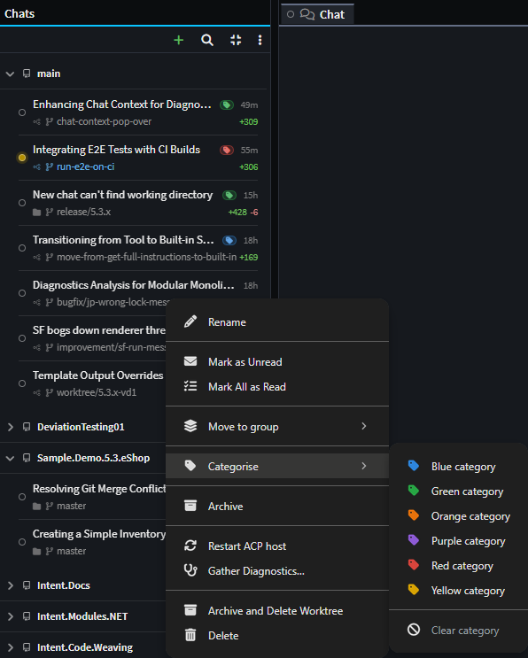

#### Application-wide UI zoom

A new app-wide UI zoom, with `Ctrl` + `+` / `-` / `0`, an entry in the account menus and a row in User Settings, scales the whole application including designer tabs, the AI chat panel and dialogs.

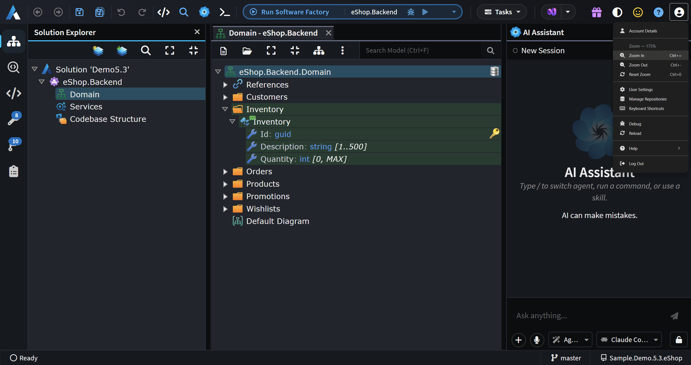

#### Collapse ask question and approve plan cards

The ask-a-question and plan-approval cards can now be collapsed to a single header row, so the transcript behind them stays readable while the gate stays live.

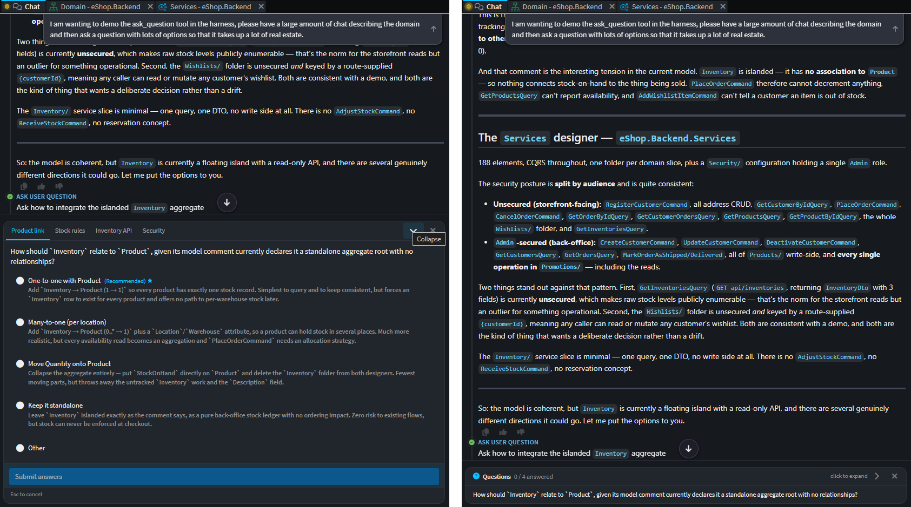

#### Automatic detection and hyperlinking of file paths

File names in previewed `.md` and `.mdx` files or mentioned in an AI reply - `Program.cs`, `src/Ordering/OrderService.cs:42` - now render as clickable links with a file-type icon, opening the file in the inline viewer at the referenced line.

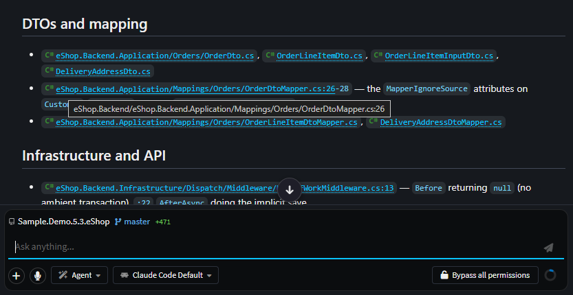

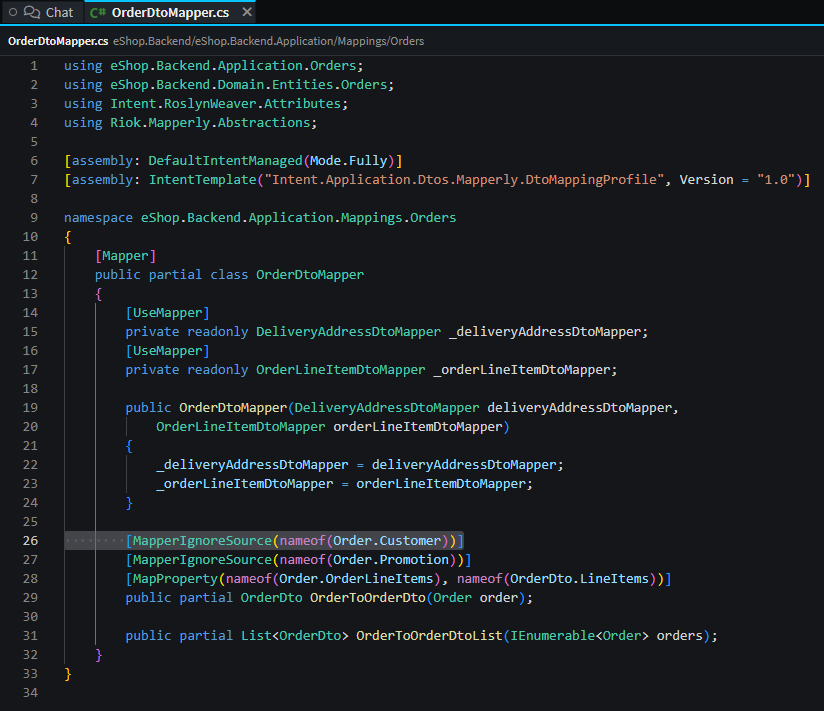

### Update of Metadata Persistence Format for new applications

New applications now use `V3 (XML)` as their Metadata Persistence Format by default. Although this format has been available since 5.1.0, we have now made it the default as the Change Review tab requires the newer format to properly show element type changes (e.g. from `int` to `long`) properly whereas without the new format it falls back to showing guid values. Furthermore, adoption of versions >= 5.1.0 is now such that others users on your repository will be unlikely to encounter issues of having too old a version of Intent Architect to work with applications.

Other benefits of the newer format:

- **More compact** - The XML will omit empty elements and some concepts are now stored as a single composite element instead of as multiple discrete ones.
- **Nests associations under elements** - This prevents noise during git commits, particularly `<order />` values changing in multiple different association files from an action such as adding an attribute to a class.
- **Persists type names** - Allows type names to show in places various places (such as the Change Review tab mentioned above).

For teams wishing to switch existing applications over it can be done so from the Settings tab:

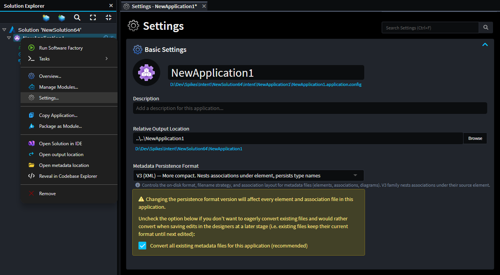

> [!NOTE]
>
> Due to the once-off large commit this can create, it is recommended to do this as a stand-alone commit/PR and to coordinate the change with other users to avoid merge conflicts.

### Other improvements in 5.3.2

- Improvement: The default "metadata persistence format" for new application is now `V3 (XML)`.
- Improvement: A new "Keep All" action on the Changes panel accepts everything a conversation has changed so far and starts tracking again from there, without touching the files.
- Improvement: A pull, rebase or merge that git refuses because the working tree is dirty now offers "Stash & retry", which re-runs the operation with `--autostash`.
- Improvement: A finished conversation's row on the Agents board stays emphasised for as long as that conversation still has tabs open.
- Improvement: The designer diagram gained `Ctrl` + `0` to reset its zoom, and its tips now name the keyboard shortcut alongside `Ctrl` + wheel.
- Improvement: A new Gather Diagnostics action on an AI conversation's row menu collects that conversation's chat file, agent logs, Software Factory logs and MCP logs into a single zip - including from sessions that ran before the last restart, trimmed to that conversation's own window - and MCP log files are now named per conversation so they can be attributed to the chat that produced them.
- Improvement: Spec-Driven Development gained an explicit verification phase between implementation and done, and ticking the last task moves a spec into it mechanically, whether it was ticked from the Specs panel, the chat or an MCP tool.
- Improvement: A new "Show whitespace changes" toggle in the diff toolbar shows or hides indentation-only differences, remembered as a preference.
- Improvement: A new "Double-click to edit" option in the diff options menu lets you stop a double-click in a rendered Markdown preview from flipping the pane back to the editor, so selecting a word no longer loses the rendered view.
- Improvement: Rows in an item-list stereotype property, and options in a stereotype property definition, can now be re-ordered by dragging a grip.
- Improvement: The scripting API gained item-list stereotype property support - `isItemList()`, `getItems()`, `addItem()`, `removeItem()`, `clearItems()` and `moveItem()`, plus `moveTo()` on an item handle.
- Improvement: `get_designer_schema` now reports authored stereotype metadata - property hints, item-list row types and their properties, and a resolved list of what a stereotype applies to - instead of leaving an agent to guess it from a module's raw XML.
- Improvement: Designer-modifying AI tools (`run_designer_script`, `apply_change_diagram_layout`) gained an optional `saveOnSuccess` flag that saves the designer once the change succeeds.
- Improvement: `uninstall_modules` now decides the whole batch before writing anything - modules that cannot be removed come back named with what blocks them while the rest are still uninstalled - and gained a `force` option.

### Fixes in 5.3.2

- Fixed: XML, `.csproj` and other MSBuild files are re-indented using the indentation and line endings the file already uses, rather than a fixed width that rewrote the whole file.
- Fixed: `get_file_diffs` now distinguishes "no staged change for this file" from "no Software Factory run could be consulted", naming whether none was running or the run had not reached staging.
- Fixed: A Software Factory run started from the Agents window is now tied to the conversation that started it - its taskbar entry names the chat, folder and branch, and two runs of the same application in different worktrees no longer share an Output tab or restart each other.
- Fixed: A row on the Agents board now shows the branch its checkout is on right now, updating when you switch branches, instead of the branch the conversation was last saved on.
- Fixed: Archiving a conversation no longer waits for its worktree handles to be released before returning.
- Fixed: An idle Intent Architect window could spend significant CPU core and GPU time animating the unread indicators on the Chats list.
- Fixed: Running terminal and tasks could cause high CPU usage on the main renderer thread and sometimes make it unresponsive.
- Fixed: A long-running watch task such as `tsc -w` or `dotnet watch` got progressively more expensive the longer it ran.
- Fixed: Subscriptions and timers belonging to closed Software Factory sessions, module tasks and AI chats were never released, so a long-running session accumulated background work - in particular after closing a chat while a task was still running.
- Fixed: A reopened AI conversation lost its name and reverted to showing its opening prompt.
- Fixed: Pressing "New chat" in the Agents window discarded whatever had been typed into the composer but not yet sent.
- Fixed: Various issues around new or existing chats using incorrect context - the solution, repository, branch or folder a chat was pointed at, and the instruction files and skills its turns could reach.
- Fixed: All four module tools failed for any conversation dispatched from the Agents window, and module search returned an empty list rather than an error.
- Fixed: A tool call made while Intent Architect was busy - typically just after `create_application` - could be answered with "no Intent Architect solution is open", stopping the run to ask you to open a solution that already was.
- Fixed: The Specs panel could be gated out in the Agents window for a conversation that had not run yet.
- Fixed: A chat parked on a question could have its agent subprocess killed about 21 minutes later, leaving it stuck on "Thinking…" and disconnected from Intent Architect's MCP server.
- Fixed: An AI agent could be told that a Software Factory run had succeeded and the codebase was clean while the run was still generating.
- Fixed: A `run_software_factory` call could answer with the previous run's results instead of the run it had just triggered, and a run that was accepted but never started polled for the full timeout instead of reporting a stall.
- Fixed: `apply_staged_file_changes` reported success for requested files it had not written; each one now comes back with a reason such as already applied, ignored or not pending.
- Fixed: A Software Factory run that logged an error but still reached staging served on-disk content to the AI file-reading tools, even though the same changes showed as reviewable in the UI.
- Fixed: Software Factory reads for applications sharing an output root could attribute a served change to the wrong application.
- Fixed: `uninstall_modules` could remove several of the requested modules and then fail part-way through, naming modules it had just removed as the blockers.
- Fixed: Creating a solution or an application stalled for about ten seconds.
- Fixed: Starting Intent Architect with a saved AI provider API key could raise a "No handler registered in electron" error dialog.
- Fixed: On a loaded machine, an Intent Architect instance that was slow to answer one connection attempt became invisible to every MCP server on the machine until it was restarted, so tools such as `create_solution` timed out.
- Fixed: Folders in the Software Factory Changes tree reopened after approving a change, switching view or revealing a row.
- Fixed: Mermaid diagrams could intermittently render collapsed or blank, particularly when the pane was off-screen or several diagrams on a page reused the same node ids.
- Fixed: A `<FileRef>` chip carrying a line number opened the file at the top instead of at that line.
- Fixed: A plan or spec document could report correct `<FileRef>` and `<FileTree>` paths as dead links for files it records as removed, while renamed files were never checked at all.
- Fixed: The author, reviewers and comment authors on an Azure DevOps pull request always fell back to an initial instead of showing their profile picture.
- Fixed: An AI review or fix started from the pull request band could run from a folder inside the repository rather than the repository root.
- Fixed: When something would prefill the chat composer over text you had already typed, Intent Architect now asks whether to keep both, overwrite it or keep what you wrote.
- Fixed: The changes panel on each AI conversation now properly lists the files and designer elements that conversation has changed since it started, nested under their parents with tallies, and opens each one as a diff against the state it began from.
- Fixed: Opening a worktree conversation with a plan waiting for approval drew the "Implement in a separate worktree" option and then removed it, resizing the card.
- Fixed: When an agent resumed after a background task finished, the conversation appended another "Completed" row every 30 seconds and the resumed work was not saved.
- Fixed: Approving a deviation left the file it writes invisible to Source Control until the next git operation, so a commit taken in between left it out.
- Fixed: A module restore in one worktree could raise "Underlying metadata files have changed" on a dirty designer tab belonging to an unrelated worktree.
- Fixed: Opening a Module Builder designer in a freshly cloned solution before its first module restore had started loaded the designer with every module-supplied package unresolved, and it stayed that way until restart.
- Fixed: A designer script's `dialogService.confirm` never reached the MCP client when more than one solution was open, leaving the script waiting on a prompt that appeared nowhere.
- Fixed: At display scaling other than 100%, embedded views such as designer tabs and the AI chat panel were mis-sized and could cover the panel's border, and own-window dialogs opened unscaled and too small.
- Fixed: A dialog could pull Intent Architect to the foreground while you were working in another application.
- Fixed: Turning on "Auto-approve phase gates" for a spec still in Requirements draft discarded whatever had been typed into the composer.
- Fixed: "View Code" on a designer element did nothing when the designer had been opened from the Agents window.
- Fixed: Clicking a file or model reference chip in a plan or spec document did nothing in the Agents window, and a chip naming its application by name rather than by id was a dead click in the solution window too.
- Fixed: Opening a folder rather than a solution showed no Changes Review, and reviews for two different repositories shared a single tab.
- Fixed: The repositories list and its pinned repository could ping-pong between open windows.
- Fixed: Icon slots in MDX wireframes and diagrams drew an empty dashed square instead of the named icon.
- Fixed: macOS: the system microphone permission prompt appeared during startup, whether or not voice input was ever used; it is now asked for the first time you use voice input.
- Fixed: macOS: native confirm and alert dialogs could clip their last line.

## Version 5.3.1

### Fixes in 5.3.1

- macOS: Claude Code and other ACP installations would sometimes not be detected.

## Version 5.3.0

5.3's headline changes are all about the same problem: an agentic workflow only works if you can see what agents are doing, and judge what they've done. This release addresses that at the three points where it matters most - running a fleet of agents, reading a plan before it's built, and reviewing the change that finally gets merged.

**Manage Agents: see all your agent conversations in one place.** An AI conversation used to belong to the solution window it was started in, so running several agents meant several windows, each pinned to one solution and one checkout, with nothing that showed you what was running, what had finished and what was blocked waiting on you. The new Manage Agents window owns every agent conversation across every repository on your machine, and can cut each one its own Git worktree so tasks stop competing over a single working directory. That is the difference between supervising parallel agents and merely running them.

**Pull requests, reviewed with the model in view.** Once a change left Intent Architect as a pull request, reviewing it meant falling back to your host's web diff - raw XML and generated code, with none of Change Review's model visuals, deviation classifications or severity flags. For a change an AI agent produced, that context is exactly what tells a reviewer what actually matters versus what's routine generated output - and it disappeared the moment the review left Intent Architect, pushing teams back toward reviewing code they couldn't fully judge. Pull requests can now be reviewed, discussed and merged inside Intent Architect, on GitHub, Azure DevOps, GitLab and Bitbucket Cloud.

**MDX support, so a plan shows rather than tells.** An AI agent's plan for a change used to be prose, or at best a single generic diagram block - you read a description and found out whether the implementation matched it after the fact. Plans and specs can now carry purpose-built visual blocks - a real data model, an API surface, a wireframe, a model-change diagram - authored directly by the agent as part of the plan, giving you a way to see the actual shape of what's about to be built that reading text never could.

Alongside those, this release also tightens up Spec-Driven Development's traceability (link-checking that no longer takes an agent's own word for it) and adds a one-click way to connect any supported AI agent to Intent Architect's MCP server - both covered below, along with the usual list of smaller fixes and improvements.

> [!TIP]
>
> Ready to get started? **Head to [our website](https://intentarchitect.com/downloads) and login to download it**.

---

## Manage Agents

Running more than one agent at a time used to mean one Intent Architect window per agent, each tied to a single solution and a single checkout, with no shared view of what was happening. Manage Agents is a new top-level window, reachable from the Home screen, that owns every agent conversation across every repository and solution on your machine.

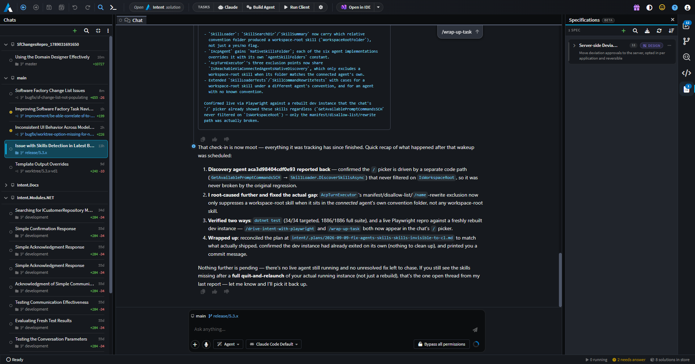

### The board

Conversations are grouped by repository, with each row naming the checkout it ran in, its branch or worktree, and the uncommitted churn of that checkout, so you can see how much work a task actually produced before opening it. Rows carry a status indicator for running, waiting on a human, or unread, and order by run activity rather than save time. You can group by repository or by time, filter, sort, collapse, drag groups into your own order, file conversations into custom groups, rename a row inline with `F2`, mark rows read, and archive the ones you're done with. The list holds still while your pointer is over it, and `Ctrl + N` starts a new chat.

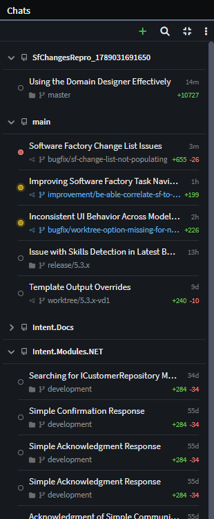

### Each agent in its own checkout

Before a conversation starts, the composer lets you choose where the agent will run: a folder, a branch, and optionally an isolated Git worktree cut just for that conversation, on a session branch you can name yourself. The worktree is created on the first turn and can be released - along with its session branch, once merged - from the row's "Archive and Delete Worktree" action. Worktrees live under a configurable `~/.worktrees` root. Approving a plan can also cut a worktree at that moment and move the plan document into it, so implementation starts on a clean branch rather than on top of whatever you happened to be doing.

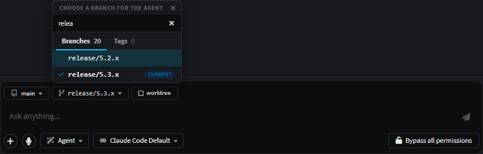

### A real workspace around the chat

The window is not just a chat list. The centre hosts a tab strip scoped per conversation - the chat itself plus designers, files, diffs, terminals, Git and Change Review tabs - so each task keeps its own tabs, and can be split into two side-by-side columns. The right panel is a configurable set of the solution shell's own panels: Software Factory Changes, Source Control, Codebase Explorer and Specifications, all pointed at the selected conversation's own folder and solution. `Ctrl + T` Search Everywhere, `Ctrl + Tab`, `Ctrl + W`, `Ctrl + Shift + W`, Back/Forward, Tasks and "Open in IDE" work here as they do in a solution window, and Software Factory runs can be launched, watched and opened directly.

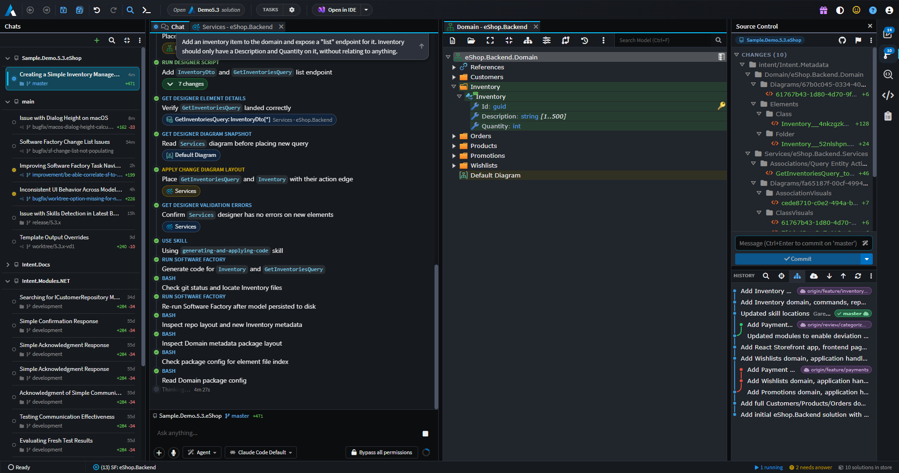

### A single window for all your work tasks

The point of hosting all of this here is that a task dispatched from this window can still read and change its own Intent model. The window answers designer requests on behalf of the conversations it hosts - opening designers in the background, in the asking conversation's own scope, resolved against that conversation's solution rather than whatever is on screen - so an agent working in a worktree of a repository nobody has open no longer has to ask you to open a solution first. A folder governed by several `.isln` files is handled as a first-class case, with a solution picker whose choice is remembered per folder.

---

## Pull request reviews with complete Intent Architect context

Neither Git source control (5.1) nor Change Review (5.2) covered what happens once a change becomes a pull request and required switching to a browser. 5.3 extends the same review experience out to the pull request itself, across GitHub, Azure DevOps, GitLab and Bitbucket Cloud.

### AI review, posted to the pull request itself

An AI review can now be run directly on a pull request. It reuses the same review engine as Change Review, over the pull request's actual merge-base...head range. Findings land as a pending review draft rather than being posted one at a time - you read, edit or drop each one and submit the whole review yourself, with staged comments shown in the Conversation timeline and counted in its badge until they're submitted. A re-run skips anything already flagged, including on threads that have since been resolved - repeated reviews turning into a pile of duplicate comments is the reason this kind of feature usually gets turned off, so avoiding that was a deliberate constraint, not an afterthought. AI can also draft the pull request's title and description, in a short "simple" style or a longer, diagram-capable "rich" one; descriptions and comments are written and previewed through the same document viewer covered below.

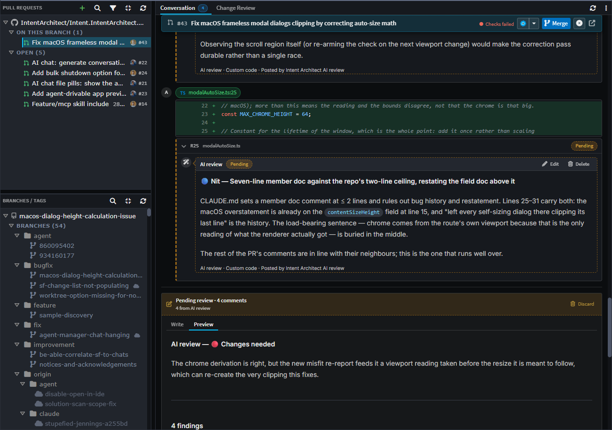

### Conflicts and keeping branches in sync

Pull request conflicts can now be resolved in an isolated, throwaway worktree instead of your own checkout, with resolved files reflected live in Change Review as they're written. An "Update branch" action on the pull request merges or rebases in the base branch first when that's needed, switching between "Update branch from `<base>`" and "Resolve conflicts" depending on which state it's actually in. Inline comment threads can now also be anchored to a file line or a model element directly inside Change Review, with reply, resolve and nested-thread rollups.

---

## MDX support: plans and specs that can show, not just tell

Plans, specs and pull request descriptions previously rendered as plain Markdown, with a single `<ModelDiagram>` block standing in for any kind of visual content, regardless of what it was actually meant to show. It's been replaced with purpose-built MDX blocks - DataModel, ApiEndpoint, Wireframe, Canvas and ModelChanges - alongside the existing Mermaid diagrams, so an agent writing a plan can show a concrete data model or API surface directly instead of describing one in prose.

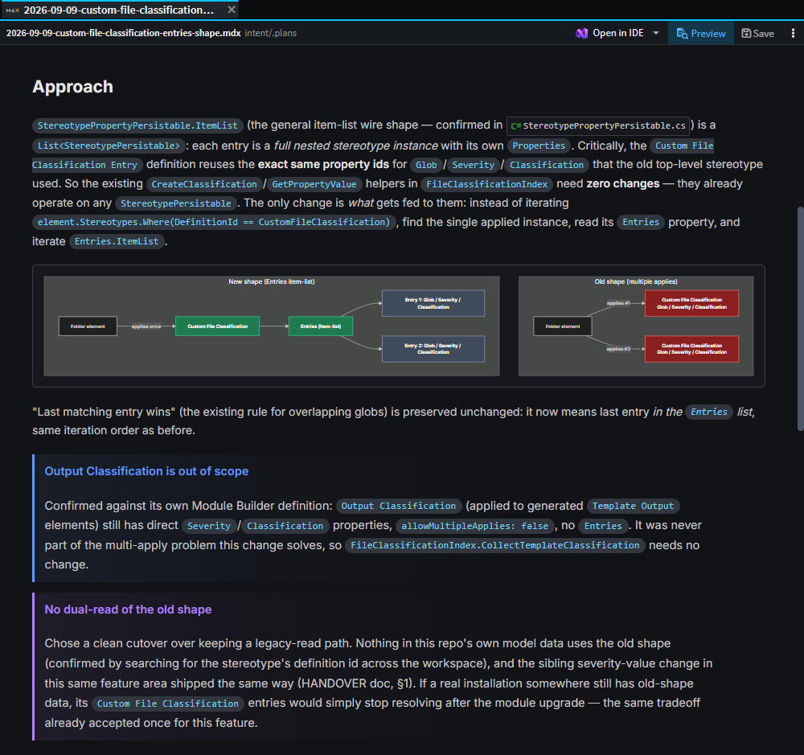

The document viewer itself, now shared by plans, specs and pull request content, also gained split and word-level diffs, adjustable zoom, image rendering, blockquotes styled as info callouts, and an inline error message when a Mermaid diagram fails to parse instead of a silent blank. MDX and Mermaid content is now validated before a plan can be submitted for approval, so a plan whose diagram wouldn't render is sent back to the agent to fix rather than reaching you broken. Any Mermaid, Wireframe, Canvas or Diagram block can be maximized into a full-pane, pan-and-zoom overlay at its own true size, independent of the document's font zoom - zooming the surrounding text doesn't make a dense diagram any more legible, so the diagram now scales on its own.

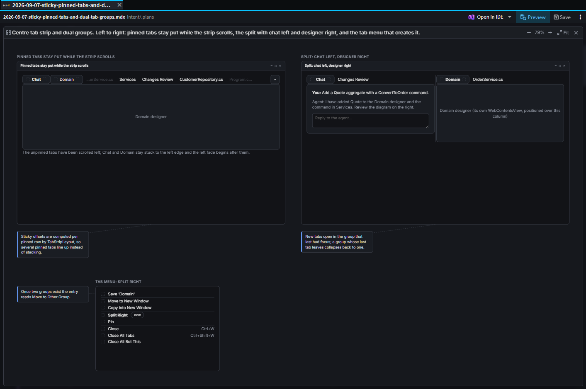

---

## Spec-Driven Development updates

Spec-Driven Development links requirements to the model elements and files that implement them. Until this release, that link was largely self-reported: `record_spec_traceability` accepted whatever operation (created/updated/deleted) the agent claimed to have performed, and a task could be marked complete even when its recorded link pointed at a file that didn't actually exist at that path.

Traceability links are now checked against git-classified file operations and canonicalized file paths, using the same classification logic Change Review itself uses. Recording a link now fails outright - rather than being "recorded but broken" - when its target doesn't resolve, and completing a spec task is blocked while it still has unresolved or empty links. A new deterministic Change Review report (the `get_change_review` MCP tool) gives an agent the same git-verified summary of what changed, including per-element and parent/child rollups, that a human reviewer sees in the UI - so verification runs against the same facts, rather than the agent's own account of its work.

Spec-Driven Development can now also detect, import and stay in sync with specs authored in other frameworks - BMAD (including multi-file PRDs), Spec Kit, Kiro and OpenSpec - and offers an "Un-adopt" option to hand ownership back to the original framework without deleting its documents. Separately, the Specs panel's requirement-traceability display is now a single fixed-width "linked requirements" chip with a popover, instead of a row of chips that could crowd out an element's own pill; reopening a solution re-reads spec document bodies from disk so live checklists reflect changes made outside Intent Architect, and clicking a spec's busy status pill now opens its live AI conversation.

---

## One-click setup for your AI agent of choice

Connecting an AI agent to Intent Architect's MCP server used to mean a single, generic prompt about a missing or misconfigured `.mcp.json` file - the same message regardless of which agent you were using, with no way to tell what was actually connected. The Intent MCP tab in AI Configuration replaces that with one row per supported agent (Claude Code, Codex, GitHub Copilot CLI, Cursor, Kiro, OpenCode), grouped by whether it's detected on your machine, each with a live Repo/User connection status and a one-click Connect (or Connect all). Connect also copies Intent's built-in skills and rules into that agent's own native folders - `.claude/skills`, `.cursor/rules`, `.kiro/steering` and so on - rather than a Claude Code-only side channel, and an agent Intent Architect couldn't detect on your machine can be enabled and connected anyway instead of only linking its install guide. Preferences for dismissed notifications now persist through the shell, so the dialog won't keep reopening about an agent you've already told it to leave alone.

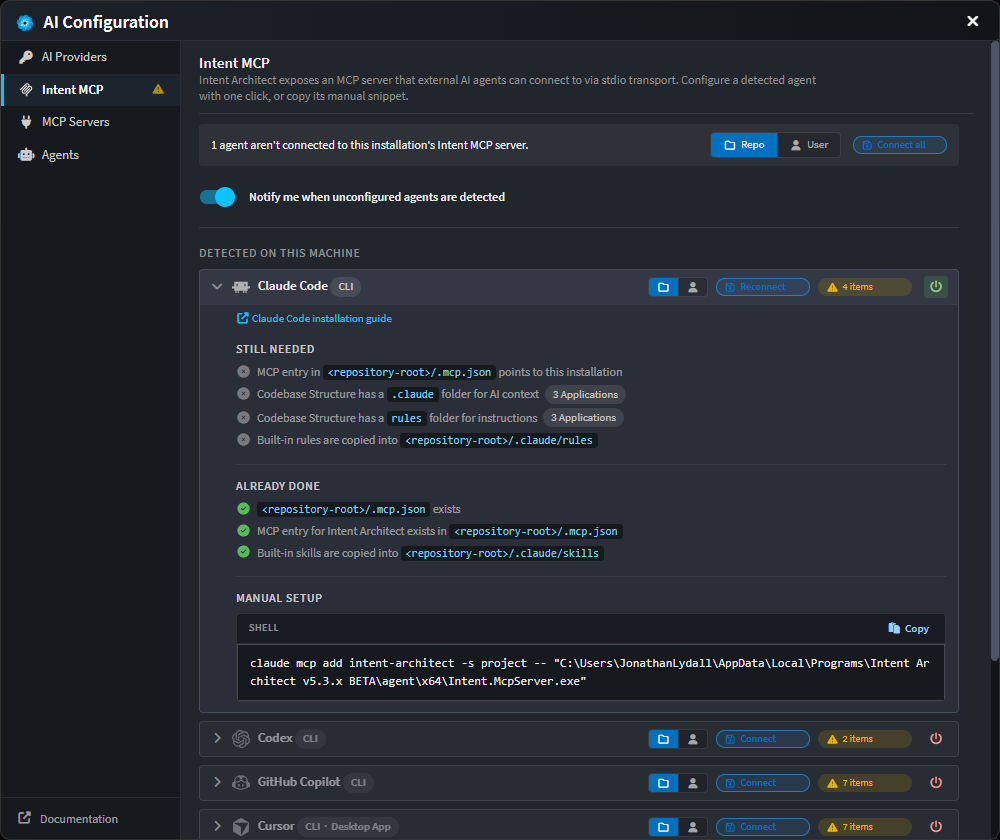

---

### Improvements in 5.3.0

- Improvement: The AI chat composer now supports on-device streaming voice input - press the mic button or `Ctrl + I` (`Cmd + I` on macOS) to dictate, with live interim transcription and punctuation and casing emitted by the model itself; recording stops automatically when you send. Transcription runs entirely on your machine, behind a one-time model download of around 255 MB.
- Improvement: The AI chat composer now supports `@` mentions - typing `@` opens a search over designer model elements and codebase files, and picking one inserts a highlighted `@Name` token linked two-way to its attachment chip, so editing the token away removes the attachment with it.
- Improvement: Search Everywhere and the `@` mention picker now use ordered-subsequence (fzf-style) matching, so `SVM` finds `ShellViewModel.cs`, with per-workspace indexes so a folder-only workspace searches only its own files.
- Improvement: Background work started by an AI agent - backgrounded shell commands and native sub-agent dispatches - now keeps running and stays visible when you press Stop, listed in one pinned "Background & sub-agents" pill above the composer, with rows that expand into a live tailing output panel and a click to jump to the originating tool card.
- Improvement: Parked approvals - tool-call approvals, plan approvals and spec phase gates - now survive closing Intent Architect or an Agent process restart, and resurface as answerable cards instead of being silently dropped.
- Improvement: Closing Intent Architect while AI agents are still working now asks for confirmation first, naming how many are running, with Cancel as the default.
- Improvement: The AI chat now shows a sticky pill above the transcript naming the last user message that has scrolled off the top, with a click to jump back to it.
- Improvement: Mermaid diagrams in an AI chat reply now render as diagrams in the transcript instead of a fenced code block.
- Improvement: `Ctrl + wheel` and `Ctrl + ±` now zoom rendered Markdown surfaces, remembered separately for document tabs and for the AI chat transcript, and `Ctrl + Shift + V` toggles rendered Markdown preview for the active file or diff tab.
- Improvement: A plan-approval card now carries a pill that reopens the plan rendered, so you can get back to it after clicking away.
- Improvement: Switching AI conversations now shows a loading indicator while the next conversation is read, instead of a blank pause, and opening conversation history is faster.
- Improvement: Manually triggering `/compact` mid-turn now queues the compaction to run once the turn finishes, instead of being sent as literal chat input.
- Improvement: `Shift + Tab` now only toggles Plan mode before a conversation has started, rather than at any point.
- Improvement: A reopened AI conversation now resumes with the same agent persona it was using before.
- Improvement: Intent Architect now prevents the system from sleeping while an AI conversation is actively running.
- Improvement: The AI chat model picker now disables provider-crossing choices while a turn is running (with a short explanatory hint) instead of allowing a mid-turn switch that could fail, and live-applies ACP agent configuration changes mid-session.
- Improvement: Multiple `create_sub_agent` calls can now run concurrently instead of one at a time, and Claude Code's own native sub-agent dispatch (Agent/Task) is now permitted to run in parallel too.
- Improvement: AI agents now have a shell tool to run ad-hoc bash/PowerShell commands, with output streamed to a terminal and persisted, and the ability to background or kill a running command.
- Improvement: AI code-search tools can now browse the whole workspace unfiltered (newest files first) alongside the existing gitignore-aware search, and report how many files/folders were skipped by ignore rules.
- Improvement: AI agents are now blocked from writing to Intent's own protected files (`.intent`, `Intent.Metadata`, `.application.config`) and are warned before hand-patching a spec/plan sidecar file instead of using the write tools.
- Improvement: The "Implement with"/"Execute with" model choice on a plan-approval card is now remembered and reused for future plan hand-offs.
- Improvement: `CLAUDE.md`/`AGENTS.md` instruction files are now discovered by walking up from an application's output folder toward the repository root, so root-level conventions are no longer missed during coding turns.
- Improvement: The AI file-patching tool now only accepts literal search/replace blocks; unified-diff-style patches are no longer supported.
- Improvement: OpenCode's todo-list tool calls are now recognised and rendered as a proper todo list in the AI chat instead of a generic tool call.
- Improvement: `write_plan` gained a `newPlan` flag so an agent can start a genuinely new plan document instead of being locked to the conversation's first plan file and format.
- Improvement: `apply_staged_file_changes` now requires the explicit list of files to apply, rather than applying everything currently pending.
- Improvement: MCP tool calls now tolerate an argument name an agent invented or snake_cased, binding it onto the declared parameter instead of failing the call, and tools now expose their parameter metadata.
- Improvement: `get_full_instructions` now lists every built-in skill discovered at runtime (including the whole `sdd-*` flow) instead of a hand-maintained subset.
- Improvement: A new `get_pull_request_review_threads` tool and accompanying skill let an AI agent read a pull request's outstanding review threads and address them, replying on each thread as it does.
- Improvement: The Changes Review tab is now named Change Review, in both its header and its tab title.
- Improvement: Deviations and custom files can now be tagged with one or more colour-coded File Classification elements (module-defined, auto-created on module install), plus a severity flag (low/medium/high, shown yellow/orange/red) on the Change Review screen.
- Improvement: Change Review gained a "Needs attention" filter over severity and File Classification, listing the full classification vocabulary rather than only what's in the current changeset, and persisted per solution.
- Improvement: A file row in Change Review can now jump to the designer element that assigns (or would assign) its classification.
- Improvement: Approving or revoking a deviation in Change Review is now a single toggle glyph (grey when pending, solid green when approved) instead of a separate status pill plus hover-revealed buttons.
- Improvement: An expanded file's header row in Change Review now pins to the top of the tab while its diff scrolls past.
- Improvement: Hovering a change pill in Change Review now shows a popover with the field-level before/after values for the element or association, without leaving the tab.
- Improvement: Renamed files in Change Review now show their previous path in a tooltip, and diffs carry the pre-rename path.
- Improvement: Change Review pills for individual model elements (not just whole files) can now be dragged into the AI chat as attachments, carrying their content directly.
- Improvement: Source Control now offers Set Remote Origin and Set Upstream directly, without dropping to the terminal.
- Improvement: Pushing or pulling a branch that has diverged from its upstream now shows a diagnostic strip explaining why, with a one-click remedial action (e.g. fetch & rebase).
- Improvement: "Resolve with AI" on a merge/rebase conflict bar now has a caret to prepare the conflict-resolution conversation - prompt composed, files attached - without sending it; conflict resolution also now remembers its own last-used AI model, separately from your regular chat model.
- Improvement: Commit-message popovers in Git history now render the subject and body as Markdown (lists, code spans, emphasis) instead of plain text.
- Improvement: Create Solution now by default initializes a Git repository at the workspace root as part of creating the solution.
- Improvement: The Codebase Explorer now supports dragging files and folders - both moving/copying within the tree and dropping in files from the OS file explorer - with move/copy cursors and Ctrl/Meta modifier support.
- Improvement: You can now drop a file from outside Intent Architect anywhere onto the app window to open it, or attach it to the AI chat.
- Improvement: The diff view now detects when a change is only a line-ending (CRLF/LF) or BOM difference and labels it "only line endings changed" instead of showing a full rewrite.
- Improvement: SVG diffs and reference-based Markdown diffs can now render as an in-place rendered preview instead of only opening in a separate tab.
- Improvement: A file tab that fails to open now shows a friendly reason (missing, permission denied, in use) with the full selectable path plus "Try again" and "Close tab" actions, instead of raw Node error text.
- Improvement: The tab strip now scrolls horizontally with fade indicators at the cut-off edge instead of hiding overflowing tabs.
- Improvement: Sticky ancestor-row breadcrumbs in tree views are no longer capped to a fixed count - they're now limited by height (up to 25% of the panel), so deep folder structures can pin more ancestors.
- Improvement: `tasks.json` now supports tasks defined at the solution's workspace root as well as per application - shown as one aggregated Tasks strip - and `dependsOn` now resolves nested compound tasks, deduplicating a shared dependency and reporting a cycle instead of deadlocking.
- Improvement: Stereotype definitions marked as a trait now have a Trait Storage setting, recording the trait once at package level instead of stamping it into every implementing element's file, so a module update that adds a trait no longer rewrites every element file in the package.
- Improvement: The Specs panel's "Draft requirements" now hands the composer a prefilled `/sdd-requirements` command for you to review and send, instead of starting the turn itself; the other phases still start immediately.
- Improvement: Each supported agent now gets its own AI context and instructions folder matching its real discovery convention, instead of several agents sharing one `.agents` folder.

### Fixes in 5.3.0

- Fixed: Pressing Stop could leave a conversation flipping back to "busy" or "asking a question" in the history list after you'd already moved on to another chat.
- Fixed: Switching a conversation into Plan mode mid-turn had no real effect - the agent acknowledged the mode and then edited files anyway.
- Fixed: A sub-agent run truncated by a length limit could be reported back to the dispatching agent as a completed, successful result instead of a truncated one.
- Fixed: A skill installed at a checkout's root (for example a BMAD `/bmad-*` command) could fail to run at all, being blocked as an Intent-only skill and then not found by the fallback either.
- Fixed: Picking an agent from the AI chat's `/` picker could send whatever was already typed in the composer as a turn.
- Fixed: Keyboard navigation in the slash-command picker could fail to scroll the highlighted row into view when more than one composer was open.
- Fixed: A long ACP turn that streamed only incremental text could have its reply merged into an earlier, already-rendered turn's bubble instead of starting a new one.
- Fixed: A background chat's "needs answer" pip could stay lit after its question had been answered, until the next full history reload.
- Fixed: The AI chat's conversation picker could list conversations belonging to a sibling Git worktree of the same repository.
- Fixed: Solution preferences - open tabs, favourites, panel widths, expanded folders - were shared across every Git worktree of the same repository and bled between them.
- Fixed: A corrupt or unreadable AI conversation index was read as empty, and the next save could silently orphan every other conversation in that folder.
- Fixed: A plan chip could disappear from the conversation after a reload or an abandoned turn.
- Fixed: `write_plan` could silently truncate an existing plan to an empty file and report success.
- Fixed: The AI chat panel could occasionally open blank due to a startup timing race in a child window.
- Fixed: File chips for a tool call could be missing when an ACP agent (e.g. OpenCode) only reported file locations partway through the call.
- Fixed: Reapplying the same AI configuration value mid-turn (e.g. re-selecting the model already in use) could fail with a `-32603` error.
- Fixed: An AI read tool's background designer load could take keyboard focus out of whatever you were typing, and could flash a half-rendered designer over the file or diff you were looking at.
- Fixed: AI read tools' background designer loads could repeatedly time out while Intent Architect was minimized or its window was occluded.
- Fixed: A designer script could stall for tens of seconds to minutes after an `await` if the window was unfocused or in the background.
- Fixed: A mapping dialog opened from a designer script (`launchMappingDialog`, `launchBasicMappingDialog`, `launchAdvancedMappingDialog`) could hang or pop an invisible modal when the script was driven by an AI agent.
- Fixed: Setting a free-text designer property value from AI scripting could be rejected as invalid because of leftover option or lookup metadata on a non-select control.
- Fixed: A `run_designer_script` call issued immediately after `run_software_factory` or `apply_staged_file_changes` could report a perfectly valid application id as "Application Id was incorrect".
- Fixed: Rows of an item-list stereotype property could all read "(no label property)", and the property's hint was indented out of line with the list below it.
- Fixed: Opening a solution could occasionally fail with a "Registration already exists for OpenSolutionRequest" error.
- Fixed: A single missed liveness check against a merely busy Intent Architect instance could evict it - telling MCP callers a still-open solution wasn't open - and then reconnect and re-evict it in a runaway loop that flooded the log.
- Fixed: Force-reinstalling a module while one of its designer tabs was open failed with "Could not remove module from the cache" or "Access is denied".
- Fixed: A module install or uninstall failure could surface as `[object Object]`, and a failed dependency resolution could be reported back as a successful no-op install.
- Fixed: Designer, model-diff and welcome tabs could crash with "File not found" or stay permanently blank while modules were being restored.
- Fixed: "Apply All" in the Changes panel could apply files that weren't yet shown in the list.
- Fixed: A locked (once-off) generated file, such as a release-notes file, could show a permanent pending diff on every Software Factory run even with no real on-disk change.
- Fixed: Two outputs for the same template raised a raw internal error instead of a message naming the `Intent.Common` version needed to disambiguate them.
- Fixed: Creating an application with a name containing spaces or disallowed punctuation - including via the AI's `create_application` - was not rejected with a clear error.
- Fixed: The Source Control merge/rebase conflict bar squeezed its status text to a few characters per line in a narrow panel, and its "Resolve with AI" and Skip dropdowns were clipped by the panel and by designer tabs.
- Fixed: "Review Working Changes" was disabled while a background Source Control refresh was running.
- Fixed: Merging or rebasing onto a commit from the history view could show a raw commit SHA in the confirmation toast instead of the branch name.
- Fixed: Global (user-wide) preferences edited outside the app - by hand, another window, or an external tool - weren't picked up until Intent Architect was restarted.
- Fixed: `npm i` run from a task or the embedded terminal could leave a broken `node_modules` that the same command in an external terminal did not, as the terminal used a stale copy of the environment captured at app launch.
