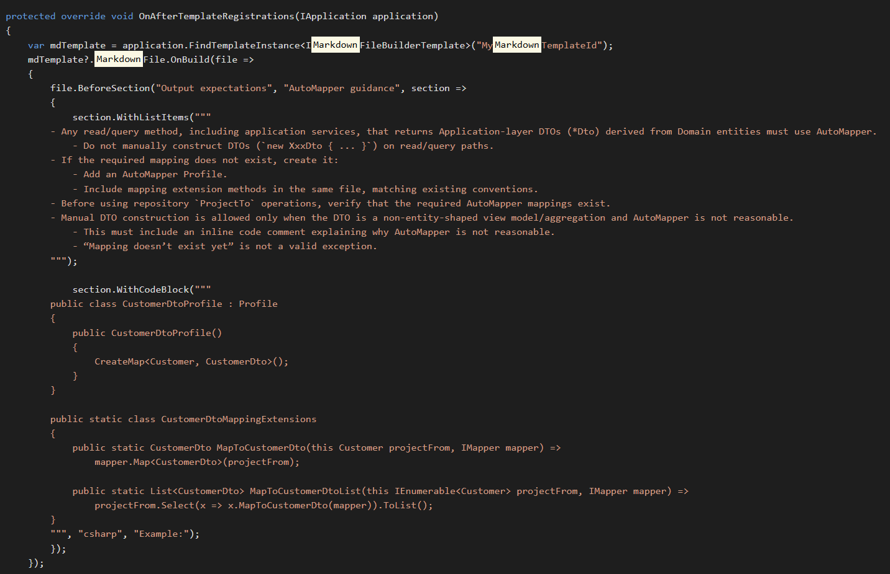

# What's new in Intent Architect (June 2026)

Welcome to the June edition of What's New in Intent Architect. This month marks the release of **Intent Architect 5.1**, which turns its focus to the moment that matters most in an AI-native workflow: **change**. Where 5.0 brought AI into the heart of the platform, 5.1 is about *seeing, understanding, and controlling* the changes flowing through your solution — from the model in your designers, to the code in your codebase, to the commits in your repository.

- Highlights
  - **[More AI providers, more ways to work](#more-ai-providers-more-ways-to-work)** - Claude Code, GitHub Copilot CLI, and OpenAI Codex join as first-class agent integrations, alongside a redesigned AI configuration experience and a pop-out AI chat with a live Changes panel.
  - **[Model-level change tracking & diffing in the designers](#model-level-change-tracking--diffing-in-the-designers)** - See exactly what has changed in your designers — field by field — and choose what to compare against: your last save or your last Git commit.
  - **[Git source control, built in](#git-source-control-built-in)** - Manage your repository without leaving Intent Architect: stage, commit, push, pull, and browse a visual commit history with full context-aware actions.
  - **[Cleaner metadata on disk](#a-cleaner-metadata-format-yaml--v3)** - A new opt-in YAML / V3 persistence format produces fewer files, less diff noise, and calmer pull requests.
  - **[Inline code-management lenses on diffs](#inline-code-management-lenses-on-diffs)** - Resolve code-management decisions — Intent Ignore or Intent Merge — directly in the diff view, without leaving Intent Architect.
  - **[Generating and augmenting Markdown files](#generating-and-augmenting-markdown-files)** - New Markdown template support lets modules generate and augment Markdown files, including AI skill and instruction files.
  - **[AI modelling agent improvements](#ai-modelling-agent-improvements)** - General improvements to the AI Modelling Agent for more accurate and reliable design modelling in Intent Architect.
  - **[Mapperly module enhancements](#mapperly-module-enhancements)** - Advanced mapping scenarios now supported in the Mapperly module, bringing it closer to parity with the AutoMapper implementation.

## Update details

### More AI providers, more ways to work

5.0 brought AI into the platform; 5.1 dramatically widens the set of providers and agents you can bring with you.

**Agent CLI integrations** — Claude Code, OpenAI Codex and GitHub Copilot CLI are now first-class participants via the Agent Client Protocol (ACP). Claude Code brings selectable models, large-context options for big codebases, reasoning-effort levels, and Claude Code's native permission system. Each CLI agent runs in its own managed process; Intent Architect handles the lifecycle.

**GitHub Copilot sign-in** — you can now sign in with GitHub Copilot using a secure OAuth device flow. No API key is required; requests route through your existing Copilot subscription. When an organization session lapses, Intent Architect deep-links you to the right sign-in page rather than forcing a full re-login.

**Redesigned AI configuration** — the AI Configuration dialog now presents a clean segmented layout with expandable provider cards, each showing a clear status (configured, unconfigured, unsaved edits, or disabled). Toggle any provider off without deleting its credentials. The full provider list spans Intent Architect, OpenAI, Anthropic, Azure OpenAI, Google Gemini, OpenRouter, OpenAI-compatible endpoints, Ollama, GitHub Copilot, and the Claude Code, Codex and Copilot CLI agents.

**Pop-out AI chat with a Changes panel** — the AI Assistant chat can be popped out into its own window, carrying the full conversation state. In the wider layout, a new Changes panel lists everything the current AI task has created or modified, grouped by application and designer, with clickable entries that navigate straight to the affected element or file.

**OAuth 2.1 for MCP servers** — remote MCP servers that require authorization now show a Sign in button, with PKCE, dynamic client registration and automatic token refresh handled for you behind the scenes. MCP servers can also be scoped globally or per-solution, and to your modeling and/or coding agents.

Available from:

- Intent Architect 5.1.0

### Model-level change tracking & diffing in the designers

Knowing *that* an element has changed is useful. Knowing *what* changed — which field, from what value, to what value — is transformative. That distinction is what model-level diffing delivers.

Changed elements are now marked with a coloured bar in the tree gutter. Click it to open a model diff popover listing every field-level change as a tidy `before → after` table: renamed properties, retyped attributes, edited comments, changed mappings, added or removed stereotypes, and more. A diff overview ruler down the right edge of the tree gives a bird's-eye view of where the changes are, so you can click to jump straight to them — much like a code editor's minimap.

A new diff baseline picker in the designer toolbar lets you choose what "changed" means:

- **Last save** — highlights your unsaved changes, the classic behaviour.
- **Git HEAD** — highlights everything you've changed since your last commit, persisting across saves and sessions.

When your solution is in a Git repository, Intent Architect defaults to the Git HEAD baseline — so you always have a clear picture of what's in-flight, even across multiple saves and work sessions.

Deleted elements no longer silently vanish. They appear as ghost rows — faded, struck-through — behind a tombstone marker in the tree. Click the marker to reveal what was removed, and right-click to restore it, whether it was deleted this session or removed in a previous commit.

Diagrams surface the same information visually: green halos for newly added elements, amber for modified — so you can see what's changed without leaving the diagram surface.

From the designer toolbar, a new History dialog opens a commit browser scoped to that designer. Filter by message, author or SHA, toggle to show only commits that touched this designer, and then compare a commit against its parent, against your working tree, or two commits against each other. The result is a semantic model diff — the designer's own tree rendered with add/modify/delete badges — so you're comparing *designs*, not raw file text.

Available from:

- Intent Architect 5.1.0

### Git source control, built in

Software development is fundamentally a collaborative activity built around change. Yet until now, managing that change — staging files, writing commit messages, reviewing history — meant switching out of Intent Architect and into another tool. 5.1 closes that gap with a complete Git source control experience built directly into the Software Factory.

The Source Control tab shows your working and staged changes side by side, each file annotated with its status (Added, Modified, Deleted, Renamed, Untracked, Conflicted). Stage or unstage files individually, in multi-selections, or in bulk — with a confirmation guard on discards. Commit with a dedicated message box, or click the magic-wand to have AI draft a commit message from your pending diff, ready for you to review and tweak before it touches anything.

Fetch, pull and push route through your existing `git` CLI, so your credential helpers, SSH agents, and commit signing all continue to work exactly as before.

A visual commit graph shows branch topology, HEAD and remote decorations, with infinite-scroll paging and an expandable per-commit file list. Right-click any commit to cherry-pick, revert, merge, rebase, switch to, or create a branch at that point. When a merge or rebase pauses for conflicts, a persistent inline bar guides you through Continue, Skip, or Abort.

The status bar at the bottom of the main window now always shows your current repository and branch. And because HEAD can move from anywhere — a terminal, an external IDE, another Git client — Intent Architect watches the repository in the background and refreshes its indicators automatically, so what you see is always in sync with reality.

Available from:

- Intent Architect 5.1.0

### A cleaner metadata format: YAML & V3

Every time Intent Architect updates your designs, it writes those changes to disk as metadata — and those files end up in pull requests. In teams working on large solutions, metadata churn can make PRs noisy and merge conflicts frustratingly common.

5.1 introduces an opt-in persistence format designed to fix this. Via the new **Metadata Persistence Format** dropdown in each application's Settings, you can choose a new shape, a new serializer, or both:

- **V3** consolidates each element and its associations into a single, position-ordered file, nests associations under their owning element (so they no longer sprawl across a separate folder), keeps human-readable type names inline, and omits redundant default values. Fewer files, far less diff noise.
- **YAML** is available as an alternative serializer to XML for both V2 and V3 shapes, for a more readable on-disk representation.

The headline benefit is **calmer source control**: smaller files, fewer of them, associations that live where you'd expect to find them, and no incidental churn from default values. That means smaller pull requests and far fewer merge conflicts.

When you change the format, Intent Architect offers to convert all existing metadata in one go — or you can let files migrate lazily as you edit them. Mixed-format folders load without issue, and existing applications are completely untouched until you opt in.

> [!IMPORTANT]
> Once an application adopts a 5.1 persistence format (V2 YAML, V3 XML, or V3 YAML), its minimum client version is raised to **5.1.0**. Make sure everyone on your team is on Intent Architect 5.1 or later before adopting a new format for a shared application.

Available from:

- Intent Architect 5.1.0

### Inline code-management lenses on diffs

When the Software Factory wants to overwrite code you've hand-edited, you've always had options for protecting that work — but they required dropping into your IDE and hand-writing a code-management instruction. That friction disappears in 5.1.

Intent Architect now renders inline code-management lenses directly above each changed region in the Software Factory's diff view. Two actions are offered per hunk:

- **Intent Ignore** — marks the region to be left alone, so the Software Factory preserves your manual edit and won't try to overwrite it again.
- **Intent Merge** — switches the region to merge mode, so Intent keeps managing the surrounding structure while reconciling its generated output with your changes rather than replacing them wholesale.

Click a lens and Intent Architect applies the instruction to the relevant code element, re-runs the diff, and confirms with a toast. The deviation you were about to lose simply drops off the pending list.

> [!NOTE]
> Requires version `4.11.0-pre.0` or higher of the `Intent.OutputManager.RoslynWeaver` module to be installed for lenses to appear.

Available from:

- Intent Architect 5.1.0

### Generating and augmenting Markdown files

Modules can now generate and augment Markdown files using the new `MarkdownFile` builder, available through the [Creating Markdown Templates](xref:module-building.templates-general.creating-markdown-templates) templating method. This opens up new capabilities for generating AI context files such as agent skill definitions and coding instructions alongside your application's source code, as well as composing and extending them based on your architectural intent.

Key capabilities:

- **Seed from existing files** - bootstrap a Markdown file from an existing template and then add to it programmatically.
- **Structured section management** - add, update, and remove named sections containing text, lists, code blocks, and nested sub-lists.
- **Front matter support** - set and manage YAML front matter properties directly from the template.
- **Content hashing** - Intent Architect will continue to manage and update the file as long as its content has not been manually modified. Once a developer edits the file, Intent Architect stops overwriting it, respecting the custom changes.

Available from:

- Intent.ModuleBuilder 3.18.6

### AI modelling agent improvements

Many of our modules have been upgraded to provide improved context engineering, make the AI Modelling Agent more predictable and better at producing more accurate and consistent designs when modelling out application architecture in Intent Architect. These refinements improve how the agent interprets requirements, navigates designer contexts, and applies model changes — reducing the need for manual corrections after an agent run.

Available from:

- Various Modules (in particular Designer and Metadata Modules)

### Mapperly module enhancements

The Mapperly module has received a significant set of enhancements aimed at bringing more advanced mapping scenarios to parity with the AutoMapper module implementation, for deterministic implementaion scenarios. Teams who chose Mapperly for its source-generated, allocation-free mappings can now handle a broader range of real-world patterns without needing to fall back to manual mapping code.

The Mapperly module now also provides AI guidance in the form of Skills, resulting in more predictable AI implementations. 

Available from:

- Intent.Application.Dtos.Mapperly 1.1.2
