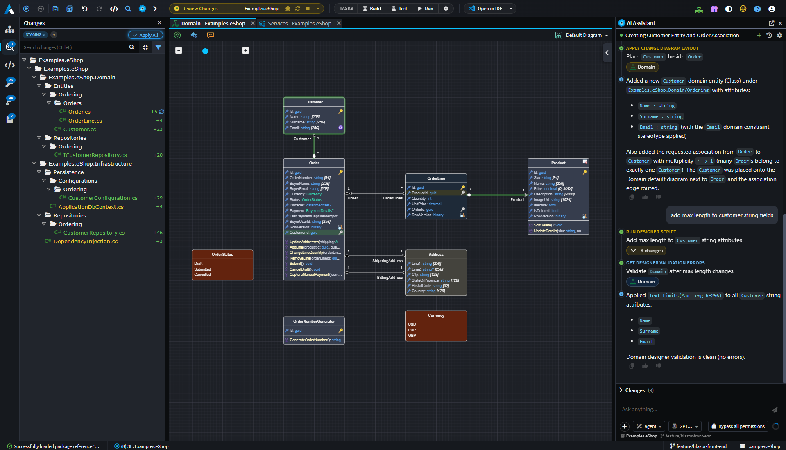
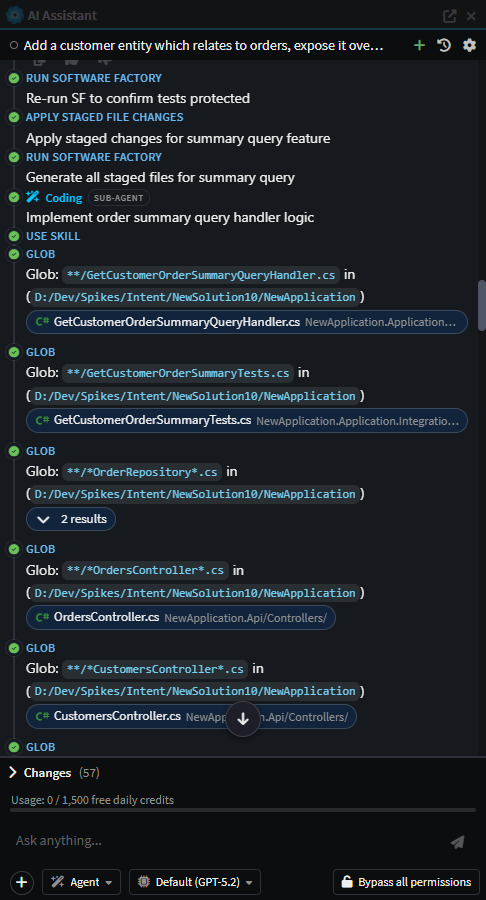
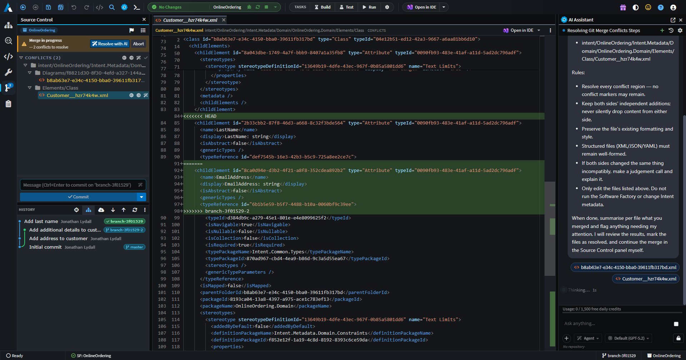
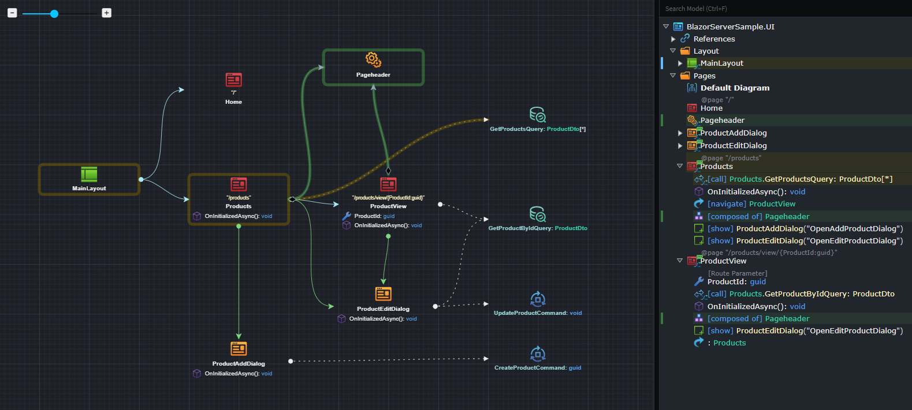
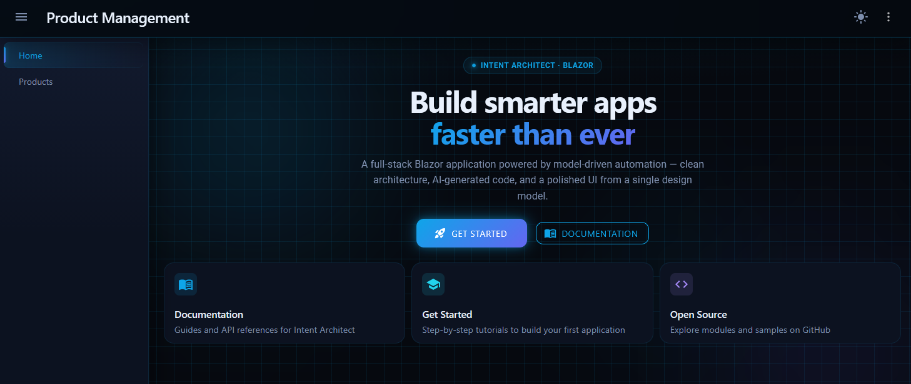
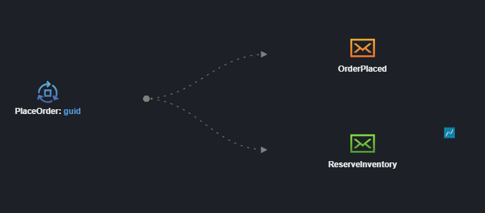

# What's new in Intent Architect (August 2026)

Welcome to the August edition of What's New in Intent Architect. This month brings the release of **Intent Architect 5.2** — a major upgrade that shifts the focus from *seeing* change (5.1) to *reviewing, trusting and driving* it, with a simplified unified workspace, a new Changes Review tab, robust Git merge and worktree support, Spec-Driven Development (Beta), and much more. `appsettings.json`.

Read the [full 5.2 release notes](xref:release-notes.intent-architect-v5.2) for complete details on everything covered below.

- Highlights
  - **[A simplified, unified UI](#a-simplified-unified-ui)** – Software Factory changes, codebases, customizations and source control for every application now live in one unified workspace, driven by a single AI Assistant.
  - **[Review changes with confidence: the Changes Review tab](#review-changes-with-confidence-the-changes-review-tab)** – See everything that's changed or about to change — model, code and customizations — in one place, with deviation approvals and traceability back to requirements.
  - **[Spec-Driven Development (Beta)](#spec-driven-development-beta)** – Go from requirements to implemented, traceable code in a guided, phased flow anchored to your Intent Architect model.
  - **[Smarter AI agents: sub-agents and orchestration](#smarter-ai-agents-sub-agents-and-orchestration)** – AI agents can now dispatch focused sub-agents for isolated work, backed by a faster, tighter Agent Client Protocol integration.
  - **[Git: merge, conflicts and worktrees](#git-merge-conflicts-and-worktrees)** – Guided merge and rebase conflict resolution, first-class linked worktree and submodule support, and a richer commit history.
  - **[Import existing C# into your model](#import-existing-c-into-your-model)** – An AI-driven importer reverse-engineers existing C# code into your designer model, turning legacy codebases into a starting point.
  - **[Wolverine CQRS Dispatcher](#wolverine-cqrs-dispatcher)** – Adds Wolverine as a drop-in CQRS dispatcher alternative to MediatR for ASP.NET Core apps, carrying over the same middleware, validation, domain event, and CRUD support. 
  - **[Blazor Enhancements](#blazor-enhancements)** – Design.md-driven theming with light/dark mode support, refreshed out-of-the-box styling, better dialog support, component support, and a range of generation quality improvements across the Blazor module set.
  - **[NServiceBus Module](#nservicebus-module)** – Integrates NServiceBus as a message broker for publishing and subscribing to integration events and commands with multi-transport support.
  - **[SLNX Support for Visual Studio Solutions](#slnx-support-for-visual-studio-solutions)** – Generate modern XML-based `.slnx` solution format for Visual Studio 2022 17.10 and .NET 10, replacing the traditional `.sln` format.
  - **[Preserved Comments in appsettings.json](#preserved-comments-in-appsettingsjson)** – Comments in `appsettings.json` are no longer stripped out when running the Software.

## Update details

### A simplified, unified UI

5.2 consolidates the previously separate Software Factory dialogs and Modeling/Coding AI Assistants into one unified workspace. A single, solution-wide AI Assistant now drives changes across every application, dispatching coding sub-agents where needed, alongside a new Codebase Explorer, file diff/editor tabs and collapsible side panels.

See the [release notes](xref:release-notes.intent-architect-v5.2#a-simplified-unified-ui) for the full list of UI changes.

Available from:

- Intent Architect 5.2.0

### Review changes with confidence: the Changes Review tab

Knowing exactly what's about to change, whats important to review and seeing visually how it affects the system design before it becomes a commit is now possible with the new **Changes Review** tab. It brings Software Factory output, AI / hand-written changes and deviations together into a single drill-in tree with inline diffs, lets you approve deviations without leaving the review, and links each change back to the requirement that motivated it.

Available from:

- Intent Architect 5.2.0

### Spec-Driven Development (Beta)

A new **Specs panel** guides you from requirements through design, tasks, implementation and verification — all anchored to your Intent Architect model rather than free-form prose. Every requirement is traced through to the model elements and files that realize it, with those links flowing straight into the Changes Review tab so reviewers can always answer "what is this change for?"

Available from:

- Intent Architect 5.2.0

### Smarter AI agents: sub-agents and orchestration

AI agents can now dispatch sub-agents for isolated, focused pieces of work, such as a coding sub-agent to implement business logic, or a discovery sub-agent to explore an unfamiliar area of the model read-only and report back. This is the backbone that lets Spec-Driven Development implement a large feature wave-by-wave without one giant, unwieldy conversation. Alongside this, the Agent Client Protocol integration powering Claude Code, Codex, Copilot and Kiro has been made faster and tighter, with Intent Architect's built-in skills bridged into each agent's native skill discovery and automatic conversation compaction for long sessions.

Available from:

- Intent Architect 5.2.0

### Git: merge, conflicts and worktrees

Git support inside Intent Architect is now robust enough for real-world, multi-branch work. Merge and rebase conflicts are detected and guided to resolution, resolved files are auto-staged, and operations now work correctly inside linked worktrees and submodules — a common setup when running parallel branches or AI agents in isolated trees. A new history view, create-branch popover, and everyday actions like undo-commit and amend round out the experience.

Available from:

- Intent Architect 5.2.0

### Import existing C# into your model

Getting an existing codebase under model-driven management has always been one of the hardest parts of adopting Intent Architect. A new AI-driven import tool reads existing C# source by folder path and reverse-engineers it into your designer model, correlating imported code back to the model and keeping an import log — turning "we already have a large C# codebase" from a blocker into a starting point.

Available from:

- Intent Architect 5.2.0

### Wolverine CQRS Dispatcher

The `Intent.Application.Wolverine` module adds Wolverine as a CQRS dispatcher for command and query handling, carrying over the same middleware, validation, domain event, and CRUD handler-body support already available for MediatR — a drop-in option for ASP.NET Core applications wanting to try it out.

**Key features:**

- Generated middleware pipeline for authorization, validation, unit-of-work, logging, performance, and unhandled exceptions
- Domain event dispatch through Wolverine's `IMessageBus`
- FluentValidation validators generated per command and query
- CRUD handler bodies generated from modelled Domain Interactions via the transport-agnostic `Intent.Application.CQRS.CRUD` module

Available from:

- Intent.Application.Wolverine 1.0.0
- Intent.Application.Wolverine.DomainEvents 1.0.0
- Intent.Application.Wolverine.FluentValidation 1.0.0
- Intent.Application.CQRS.CRUD 1.0.0

### Blazor Enhancements

The Blazor module set has received a round of improvements spanning theming, layout, and code generation quality.

**Key features:**

- **Design.md-driven theming** – Out-of-the-box styling is now generated from a `design.md` specification, with restructured CSS tokens for easier customization
- **Light and dark mode support** – Generated applications now support both themes out of the box
- **Improved AI/modelling context** – Domain package references are automatically added to the UI designer, and modelling context is now included from the template for a consistent experience whether or not you're using auto-generated AI tasks
- **Component modelling** – Model reusable Components, and compose a Page or another Component from them, giving you a way to build and reuse UI building blocks across your application
- **Explicit `Dialog` stereotype** – Components can now be marked with a `Dialog` stereotype, aligning with how the `Page` stereotype already works
- **Safer `Show Dialog` selection** – The `Show Dialog` context menu now only allows selecting components that have the `Dialog` stereotype applied
- **Decoupled layout components** – `ThemeToggle`, `AppUserMenu`, and `NavLinks` are now standalone components decoupled from `Intent.Modules.Blazor.Authentication`, so layouts work correctly across `InteractiveServer` and `InteractiveWebAssembly` render modes

Available from:

- Intent.Modules.Blazor 2.0.1
- Intent.Modules.Blazor.Components.MudBlazor 2.0.1
- Intent.Modules.Blazor.Wasm 1.1.1
- Intent.Modules.Modelers.UI.Core 1.0.3
- Intent.Modules.Modelers.UI 1.1.3

### NServiceBus Module

The `Intent.Eventing.NServiceBus` module integrates [NServiceBus](https://particular.net/nservicebus) as a message broker for publishing and subscribing to integration events and commands in .NET applications.

**Key features:**

- Modeling Integration Events and Integration Commands in the Services Designer
- Support for multiple transport technologies:
  - Learning Transport (file-based, ideal for development)
  - RabbitMQ
  - Azure Service Bus
  - Amazon SQS
  - SQL Server
- NServiceBus endpoint configuration generation with automatic dependency injection wiring
- SQL Persistence transactional outbox (with EF Core shared connection)
- Command routing and message handler generation
- Multi-broker coexistence support via the **NServiceBus** stereotype
- .NET 8/9 and .NET 10+ host registration

The module simplifies distributed messaging patterns by handling transport configuration, serialization, recoverability policies, and message routing—allowing you to focus on your business logic.

Available from:

- Intent.Eventing.NServiceBus 1.0.0

### SLNX Support for Visual Studio Solutions

The Visual Studio Projects module now supports generating modern XML-based `.slnx` solution files introduced in Visual Studio 2022 and .NET 10, providing an alternative to the traditional `.sln` format.

**Benefits of `.slnx` format:**

- **Simpler to read and diff** – Human-readable XML structure
- **No GUIDs** – Removes cryptic GUID identifiers
- **No configuration-platform boilerplate** – Eliminates redundant build configuration entries
- **More maintainable** – Easier to understand and manage in version control

**How to use:**

Apply the `Visual Studio Solution Options` stereotype to your solution element and set the `Solution File Format` property to `XML Solution (.slnx)`. When you run the Software Factory, it will generate the new format and automatically remove the old `.sln` file.

> [!NOTE]
> The `.slnx` format requires Visual Studio 2022 17.10 or later, or the .NET 10 SDK.

Available from:

- Intent.Modules.VisualStudio.Projects 4.1.5

### Preserved Comments in appsettings.json

The Software Factory now preserves comments in `appsettings.json` and related JSON configuration files when regenerating them, so annotations you've added are no longer stripped out on every run.

Available from:

- Intent.Modules.VisualStudio.Projects 4.1.3
