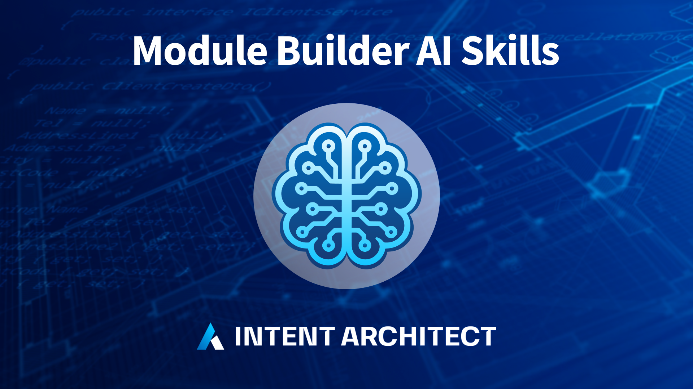

# What's new in Intent Architect (September 2026)

Welcome to the September edition of What's New in Intent Architect. This month brings the release of **Intent Architect 5.3**, which takes on a single problem from three angles: an agentic workflow only works if you can see what your agents are doing, and judge what they've done — when they're running in parallel, before the work starts, and when the change finally comes up for review.

Read the [full 5.3 release notes](xref:release-notes.intent-architect-v5.3) for complete details on everything covered below.

- Highlights
  - **[Manage Agents](#manage-agents)** – Supervising several agents at once shouldn't mean juggling windows and fighting over one working directory. Every agent conversation across every repository now lives in one place, each able to run in its own isolated checkout.
  - **[Pull request reviews without leaving Intent Architect](#pull-request-reviews-without-leaving-intent-architect)** – A review that moves to a browser loses exactly the context that tells you which changes matter and which are routine generated output. Pull requests can now be reviewed, discussed and merged with the model still in view.
  - **[Plans and specs that show, not just tell](#plans-and-specs-that-show-not-just-tell)** – Approving a plan written in prose means finding out only afterwards whether the implementation matched what you pictured. Plans can now render the actual data model, API surface or screen being proposed.
  - **[Traceability you can trust](#traceability-you-can-trust)** – Traceability is only worth having if it's true. Spec-Driven Development now verifies links against Git rather than taking an agent's word for what it changed.
  - **[One-click setup for your AI agent of choice](#one-click-setup-for-your-ai-agent-of-choice)** – Getting an agent talking to Intent Architect was a guessing game with no way to tell what was actually connected. Now it's a visible connection status and a button.

- More updates
  - **[Voice input in the AI chat](#voice-input-in-the-ai-chat)** – Describing intent is often faster spoken than typed, and dictation shouldn't cost you privacy — transcription runs entirely on your machine.
  - **[Module Builder AI Skills](#module-builder-ai-skills)** – AI agents write far better modules when they know Intent Architect's conventions; this drops that knowledge straight into your module repository.
  - **[Wolverine Eventing Module](#wolverine-eventing-module)** – A fully MIT-licensed message broker option for teams who'd rather not depend on a commercially licensed bus, with a guided migration path off MassTransit.
  - **[Integration Testing Enhancements](#integration-testing-enhancements)** – Generated tests are only useful if they're the tests you wanted, written the way your team writes them — so you can now control what gets scaffolded, and teach an agent the conventions.

## Update details

### Manage Agents

Handing work to several agents at once only pays off if you can actually supervise them. Until now an AI conversation belonged to the solution window it was started in, so running three tasks meant three windows, each pinned to one solution and one checkout — with nothing anywhere that showed you what was running, what had finished, and what was sitting blocked waiting on an answer from you. Agents also had to share a single working directory, so parallel tasks trod on each other's changes.

**Manage Agents** is a new top-level window, reachable from the Home screen, that owns every agent conversation across every repository and solution on your machine. Each conversation can be given its own Git worktree so tasks stay out of each other's way, and each row shows you the checkout it ran in and how much uncommitted work it has actually produced — so you can judge whether a task is worth opening before you open it. Around the chat sits a real workspace: designers, files, diffs, terminals, Git and Change Review, all scoped to the conversation you're looking at. That's the difference between supervising parallel agents and merely running them.

Available from:

- Intent Architect 5.3.0

### Pull request reviews without leaving Intent Architect

Change Review (5.2) made it possible to judge a change by what it does to your system design, not just by its diff. But the moment a change became a pull request, reviewing it meant falling back to your host's web diff — raw XML and generated code, with none of the model visuals, deviation classifications or severity flags. For a change an AI agent produced, that context is precisely what separates the handful of decisions worth arguing about from the routine generated output around them. Losing it pushed teams back toward reviewing code they couldn't fully judge.

Pull requests can now be reviewed, discussed and merged inside Intent Architect, on GitHub, Azure DevOps, GitLab and Bitbucket Cloud. AI review runs against the pull request itself and stages its findings as a pending draft for you to edit, drop or submit — because a review tool that posts a pile of duplicate comments on every re-run is one that gets switched off. Conflicts resolve in a throwaway worktree rather than your own checkout, so keeping a branch current doesn't disturb whatever you were working on.

Available from:

- Intent Architect 5.3.0

### Plans and specs that show, not just tell

The value of reviewing a plan before it's implemented lies in catching the misunderstanding early. That only works if the plan conveys what's actually going to be built — and prose, or a single generic diagram block, too often doesn't. You read a description, agreed with it, and discovered whether your picture matched the agent's after the code was written.

Plans, specs and pull request descriptions now support purpose-built MDX blocks — DataModel, ApiEndpoint, Wireframe, Canvas and ModelChanges — alongside Mermaid diagrams, authored by the agent as part of the plan. A proposed data model or API surface can be seen rather than described. Plans are validated before they can be submitted for approval, so a plan whose diagram wouldn't render goes back to the agent instead of reaching you broken, and any diagram can be maximized into its own pan-and-zoom view at full size.

Available from:

- Intent Architect 5.3.0

### Traceability you can trust

Spec-Driven Development links requirements to the model elements and files that implement them. Until this release, those links were largely self-reported: an agent recorded whatever operation it believed it had performed, and a task could be marked complete with a link pointing at a file that didn't exist at that path. Traceability that might be wrong is worse than none at all, because you will rely on it.

Links are now verified against Git-classified file operations, using the same logic Change Review itself uses. Recording a link that doesn't resolve fails outright rather than being quietly stored as broken, and a spec task can't be completed while its links are unresolved. Agents can also pull the same Git-verified change summary a human reviewer sees, so verification runs against the facts rather than the agent's own account of its work. Spec-Driven Development can additionally detect, import and stay in sync with specs authored in BMAD, Spec Kit, Kiro and OpenSpec, so adopting it doesn't mean abandoning what you've already written.

Available from:

- Intent Architect 5.3.0

### One-click setup for your AI agent of choice

Connecting an AI agent to Intent Architect's MCP server used to produce one generic prompt about a missing or misconfigured `.mcp.json` file, no matter which agent you were using — and no way to tell what was actually connected once you'd finished.

The Intent MCP tab in AI Configuration now shows a row per supported agent — Claude Code, Codex, GitHub Copilot CLI, Cursor, Kiro and OpenCode — grouped by what's detected on your machine, each with a live connection status and a one-click Connect. Connecting also copies Intent's built-in skills and rules into that agent's own native folders, so whichever agent you prefer starts out knowing how to work with your model.

Available from:

- Intent Architect 5.3.0

### Voice input in the AI chat

Explaining what you want to an agent is usually a longer piece of writing than a code edit, and it is often quicker to say than to type. The AI chat composer now supports streaming voice input — press the mic button or `Ctrl + I` (`Cmd + I` on macOS) and dictate, with punctuation and casing handled for you.

Transcription runs entirely on your machine, behind a one-time model download, so dictating a prompt doesn't send your voice anywhere.

Available from:

- Intent Architect 5.3.0

### Module Builder AI Skills

The `Intent.ModuleBuilder.AI.Skills` module drops a curated, always-up-to-date set of AI agent skill and instruction files into a `.agents/` folder in the repo it's installed in, so an AI assistant working in that repo has the knowledge it needs to build Intent Architect modules correctly. It generates no C# and has no designer model dependency — install it once in a dedicated application and control where the files land via that application's Output Location setting.

**Key features:**

- Skill files covering module-building end to end: `file-builder-expert`, `intent-mapping-architect`, `intent-metadata-consumer`, `intent-module-orchestrator`, `module-building-strategies`, `module-debugging`, ... and more
- Instruction files for choosing the right exception type and for recurring template-authoring pitfalls (NuGet dependency registration, filename stability, naming conflicts, package version drift)
- Bundled content is always overwritten on install or update, so every consuming repo stays standardized on the same skill set

Visit the [documentation](https://docs.intentarchitect.com/modules-common/intent-modulebuilder-ai-skills/intent-modulebuilder-ai-skills.html) to learn more.

Available from:

- Intent.ModuleBuilder.AI.Skills 1.0.2

### Wolverine Eventing Module

The `Intent.Eventing.Wolverine` module integrates [WolverineFx](https://wolverine.netlify.app/) as a message broker for publishing and subscribing to integration events and commands in .NET applications — a fully MIT-licensed option for teams migrating off a commercially licensed bus such as MassTransit. This is distinct from the Wolverine CQRS Dispatcher introduced in August — that module wires Wolverine as your in-process command/query dispatcher, while this one handles eventing across process boundaries; the two share a single `UseWolverine` registration and are commonly installed together.

**Key features:**

- Modeling Integration Events and Integration Commands via the shared `Intent.Modelers.Eventing` designer
- Multiple transport options: Local (in-process), RabbitMQ, Azure Service Bus, and Amazon SQS
- Transactional Outbox support (SQL Server / PostgreSQL) for exactly-once-processing guarantees
- Configurable Error Handling Policies (`Retry`, `RetryWithCooldown`, `ScheduleRetry`) with automatic dead-lettering
- A dedicated MassTransit-to-Wolverine migration guide, including a setting-equivalence table and a staged, side-by-side migration path for large applications

Visit the [documentation](https://docs.intentarchitect.com/modules-dotnet/intent-eventing-wolverine/intent-eventing-wolverine.html) to learn more.

Available from:

- Intent.Eventing.Wolverine 1.0.0

### Integration Testing Enhancements

Scaffolded integration tests are only worth having if they test what you meant to test, and read like tests your team would have written. Generating a class for every endpoint whether you wanted one or not, and handing an AI agent no guidance on how this codebase tests, produced volume rather than confidence.

The `Intent.AspNetCore.IntegrationTesting` module has been extended to make integration tests easier to set up with AI, and far less all-or-nothing about what gets generated.

**Key features:**

- **`integration-test` AI skill** – the module now generates a skill file that teaches an AI agent this codebase's integration testing conventions: test through the HTTP boundary only, discover each endpoint's real contract and status codes before writing assertions, keep tests deterministic with unique tokens rather than row counts, and report observed-versus-expected discrepancies instead of leaving failing tests behind. The database guidance within the skill adapts to whether the application is using Testcontainers or in-process SQLite.
- **`Integration Test Generation Mode` setting** – choose between scaffolding a test class for every exposed HTTP endpoint, or only for Commands, Queries, Services and Operations explicitly marked with the new `Integration Test` stereotype in the Services Designer. Applying the stereotype to a Service opts all of its operations in.
- **`Generate Service Proxies for Testing` setting** – controls whether the strongly-typed HTTP client proxies, and their supporting DTO, enum, `ProblemDetailsWithErrors` and `HttpClientRequestException` contracts, are generated into the test project. New installs default to off, so tests work against the raw `HttpClient` returned by `CreateClient()`.

Available from:

- Intent.AspNetCore.IntegrationTesting 2.0.20
